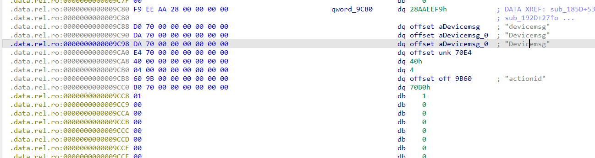
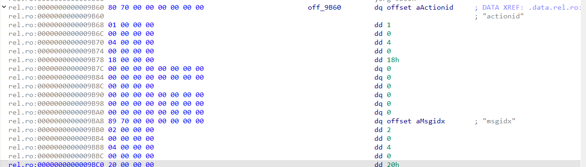
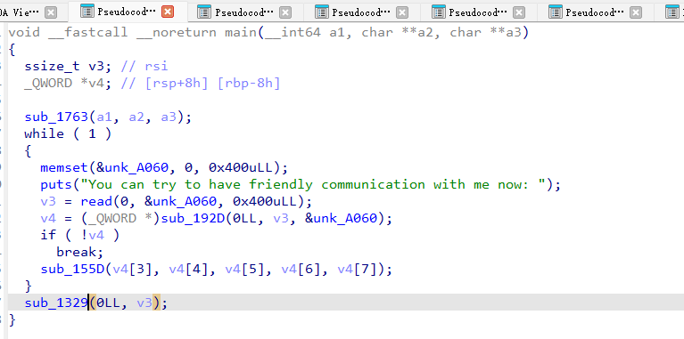
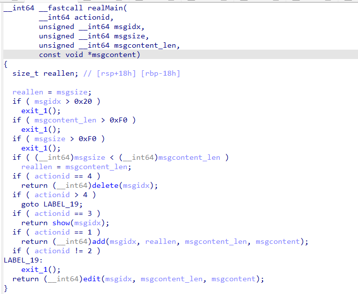
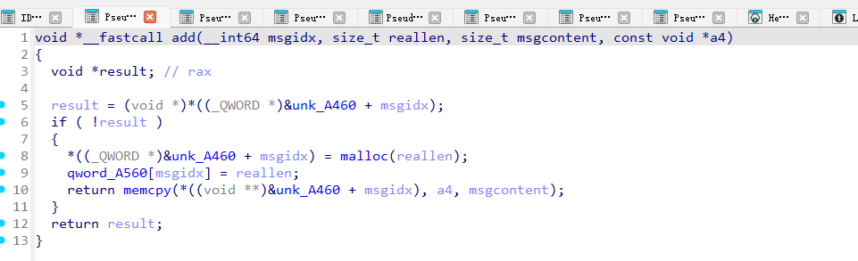
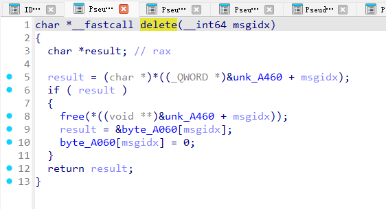
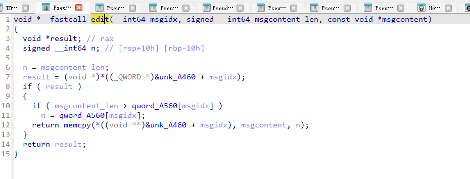
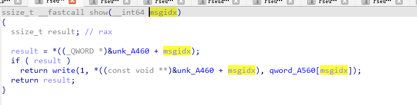

# Protobuf 是什么？

Protocol Buffers，是Google公司开发的一种数据描述语言，类似于XML能够将结构化数据序列化，可用于数据存储、通信协议等方面。

常用于跨平台和异构系统中进行RPC调用，序列化和反序列化 效率高且体积比XML和JSON小得多，非常适合网络传输。

为了能够和程序进行交互，我们需要先逆向分析得到Protobuf结构体，然后构造序列化后的Protobuf与程序进行交互。


## 基本语法

先来看一个官方文档给出的例子：

```protobuf
// demo.proto
syntax = "proto3";

package tutorial;

message Person {
  string name = 1;
  int32 id = 2;
  string email = 3;

  enum PhoneType {
    PHONE_TYPE_UNSPECIFIED = 0;
    PHONE_TYPE_MOBILE = 1;
    PHONE_TYPE_HOME = 2;
    PHONE_TYPE_WORK = 3;
  }

  message PhoneNumber {
    string number = 1;
    PhoneType type = 2;
  }

  repeated PhoneNumber phones = 4;
}

message AddressBook {
  repeated Person people = 1;
}
```

### syntax

syntax 指明 protobuf 的版本，有 proto2 和 proto3 两个版本，省略默认为 proto2。

```protobuf
syntax = "proto2";
syntax = "proto3";
```

### package

package 可以防止命名空间冲突，简单的项目中可以省略。

```protobuf
package tutorial;
```

### message

message用于定义消息结构体，类似C语言中的struct。

每个字段包括修饰符 类型 字段名，并且末尾通过等号设置唯一字段编号。

修饰符包括如下几种：

optional：可以不提供字段值，字段将被初始化为默认值。（Proto3中不允许显示声明，不加修饰符即optional）
repeated：类似vector，表明该字段为动态数组，可重复任意次。
required：必须提供字段值。（Proto3不再支持required）

常见的基本类型：

bool,in32,float,double,string

可以通过如下命令编译proto文件：

```bash
protoc -I=$SRC_DIR --c_out=$DST_DIR $SRC_DIR/demo.proto
```

`-I=$SRC_DIR` 用于指定源码目录，默认使用当前目录。  
`–cpp_out=$DST_DIR` 用于指定目标代码存放位置。

因此，以上命令也可以简化为
```bash
protoc --c_out=. demo.proto
```

这会编译生成以下两个文件：

demo.pb-c.h：类的声明。
demo.pb-c.c：类的实现。
CTF题目通常为C语言编写，因此为了后续逆向工作，需要理解编译后的C语言文件相关结构。

如果想要编译为Python代码，用如下命令（在CTF中通常编译为Python代码以在脚本中与程序交互）：

```bash
protoc --python_out=. demo.proto
```
会生成 demo_pb2.py（pb2后缀只是为了和protobuf1区分）

## 使用

### 引入

可以直接在Python中import后调用：

```python
import demo_pb2

person = demo_pb2.Person()
person.id = 1234
person.name = "John Doe"
person.email = "jdoe@example.com"

phone = person.phones.add()
phone.number = "555-4321"
phone.type = demo_pb2.Person.PHONE_TYPE_HOME
```

### 序列化与反序列化

序列化

```python
# Write the new address book back to disk.
with open(sys.argv[1], "wb") as f:
  f.write(demo_pb2.SerializeToString())
```

反序列化

```python
demo = demo_pb2.AddressBook()

# Read the existing address book.
try:
  with open(sys.argv[1], "rb") as f:
    demo_pb2.ParseFromString(f.read())
except IOError:
  print(sys.argv[1] + ": Could not open file.  Creating a new one.")
```

### 逆向分析

#### protobuf关键结构体

在生成的 `demo-pb-c.c` 文件中，可以发现存在 `unpack` 函数：

```c
Tutorial__AddressBook * tutorial__address_book__unpack(ProtobufCAllocator *allocator, size_t len, const uint8_t *data)
{
  return (Tutorial__AddressBook *)
     protobuf_c_message_unpack (&tutorial__address_book__descriptor,
                                allocator, len, data);
}
```

这个反序列化函数传入描述消息结构体数据的 descriptor。我们可以在 IDA 中分析 descriptor 还原消息结构体。

##### Descriptor 结构体

Descriptor 定义如下：

```c
struct ProtobufCMessageDescriptor {
	/** 用于校验 API 是否被正确使用的魔数。 */
	uint32_t			magic;

	/** 全限定名（例如："namespace.Type"）。 */
	const char			*name;
	/** .proto 文件中定义的非限定名（例如："Type"）。 */
	const char			*short_name;
	/** 在生成的 C 代码中使用的标识符。 */
	const char			*c_name;
	/** 以点分隔的命名空间。 */
	const char			*package_name;

	/**
	 * 表示该消息类型实例的 C 结构体大小（单位：字节）。
	 */
	size_t				sizeof_message;

	/** `fields` 中的元素数量。 */
	unsigned			n_fields;
	/** 按 tag 编号排序的字段描述符。 */
	const ProtobufCFieldDescriptor	*fields;
	/** 用于按字段名查找字段。 */
	const unsigned			*fields_sorted_by_name;

	/** `field_ranges` 中的元素数量。 */
	unsigned			n_field_ranges;
	/** 用于按字段 id 查找字段。 */
	const ProtobufCIntRange		*field_ranges;

	/** 消息初始化函数。 */
	ProtobufCMessageInit		message_init;

	/** 预留字段，供将来使用。 */
	void				*reserved1;
	/** 预留字段，供将来使用。 */
	void				*reserved2;
	/** 预留字段，供将来使用。 */
	void				*reserved3;
};
```

我们需要关注的有几个重要字段：

- magic：通常为0x28AAEEF9。
- n_fields：结构体中的字段数量。
- fields：指向一个储存字段和数据的结构体。

`fields` 是 `ProtobufCFieldDescriptor` 类型。

##### ProtobufCFieldDescriptor 结构体

我们看一下它的定义。

（以下字节数按常见 ABI 标注：64 位 LP64 / 32 位 ILP32）

```c
struct ProtobufCFieldDescriptor {
	/** .proto 文件中定义的字段名。 */
	const char		*name;              /* 8 / 4 字节（指针） */

	/** .proto 文件中定义的字段 tag 值。 */
	uint32_t		id;                /* 4 / 4 字节 */

	/** 字段修饰符：`REQUIRED`、`OPTIONAL` 或 `REPEATED`。 */
	ProtobufCLabel		label;             /* 4 / 4 字节（enum） */

	/** 字段的数据类型。 */
	ProtobufCType		type;              /* 4 / 4 字节（enum） */

	/**
	 * 消息 C 结构体中量词字段的字节偏移。
	 * （对 optional 成员是 `has_MEMBER` 字段；对 repeated 成员是
	 * `n_MEMBER` 字段；对 oneof 成员是 case 枚举字段）。
	 */
	unsigned		quantifier_offset; /* 4 / 4 字节 */

	/**
	 * 该成员自身在消息 C 结构体中的字节偏移。
	 */
	unsigned		offset;            /* 4 / 4 字节 */

	/**
	 * 与类型相关的描述符。
	 *
	 * 如果 `type` 为 `PROTOBUF_C_TYPE_ENUM`，则 `descriptor` 指向
	 * 对应的 `ProtobufCEnumDescriptor`。
	 *
	 * 如果 `type` 为 `PROTOBUF_C_TYPE_MESSAGE`，则 `descriptor` 指向
	 * 对应的 `ProtobufCMessageDescriptor`。
	 *
	 * 其他类型下该字段为 NULL。
	 */
	const void		*descriptor;      /* 8 / 4 字节（指针，MESSAGE/ENUM） */

	/** 该字段的默认值（若有定义），可能为 NULL。 */
	const void		*default_value;   /* 8 / 4 字节（指针） */

	/**
	 * 标志位字段。可设置 `ProtobufCFieldFlag` 枚举中定义的
	 * 0 个或多个比特位。
	 */
	uint32_t		flags;             /* 4 / 4 字节 */

	/** 预留字段，供将来使用。 */
	unsigned		reserved_flags;    /* 4 / 4 字节 */
	/** 预留字段，供将来使用。 */
	void			*reserved2;         /* 8 / 4 字节（指针） */
	/** 预留字段，供将来使用。 */
	void			*reserved3;         /* 8 / 4 字节（指针） */
};
```
我们需要关注的有：

- name：字段名。
- id：唯一字段编号。
- label：修饰符，如：required、optional、repeated。
- type：数据类型，如：bool、int32、float、double等。


##### lable和type

label和type都是枚举类型，我们看一下它的定义：

```c
typedef enum {
	/** 格式正确的消息中该字段必须且只能出现一次。 */
	PROTOBUF_C_LABEL_REQUIRED,

	/**
	 * 格式正确的消息中该字段可以出现 0 次或 1 次
	 * （不能超过 1 次）。
	 */
	PROTOBUF_C_LABEL_OPTIONAL,

	/**
	 * 在格式正确的消息中，该字段可以重复任意次（包括 0 次）。
	 * 重复值的顺序会被保留。
	 */
	PROTOBUF_C_LABEL_REPEATED,

	/**
	 * 该字段无标签。仅在 proto3 中有效，语义上等价于 OPTIONAL，
	 * 但不会检查 "has" 量词字段。
	 */
	PROTOBUF_C_LABEL_NONE,
} ProtobufCLabel;
```

```c
typedef enum {
	PROTOBUF_C_TYPE_INT32,      /**< int32 */
	PROTOBUF_C_TYPE_SINT32,     /**< signed int32 */
	PROTOBUF_C_TYPE_SFIXED32,   /**< signed int32 (4 bytes) */
	PROTOBUF_C_TYPE_INT64,      /**< int64 */
	PROTOBUF_C_TYPE_SINT64,     /**< signed int64 */
	PROTOBUF_C_TYPE_SFIXED64,   /**< signed int64 (8 bytes) */
	PROTOBUF_C_TYPE_UINT32,     /**< unsigned int32 */
	PROTOBUF_C_TYPE_FIXED32,    /**< unsigned int32 (4 bytes) */
	PROTOBUF_C_TYPE_UINT64,     /**< unsigned int64 */
	PROTOBUF_C_TYPE_FIXED64,    /**< unsigned int64 (8 bytes) */
	PROTOBUF_C_TYPE_FLOAT,      /**< float */
	PROTOBUF_C_TYPE_DOUBLE,     /**< double */
	PROTOBUF_C_TYPE_BOOL,       /**< boolean */
	PROTOBUF_C_TYPE_ENUM,       /**< enumerated type */
	PROTOBUF_C_TYPE_STRING,     /**< UTF-8 or ASCII string */
	PROTOBUF_C_TYPE_BYTES,      /**< arbitrary byte sequence */
	PROTOBUF_C_TYPE_MESSAGE,    /**< nested message */
} ProtobufCType;
```

### Protbuf结构体逆向（以2023ciscn-talkbot为例）

有了上面关于Descriptor的基础知识后，我们尝试在IDA中对protobuf结构体进行逆向。

在ida 的ida view-a视图中按空格，search中搜索0x28AAEEF9（一版在.data.rel.ro段）



可以得到name为devicemsg。结构体大小为0x40。字段数为4，4下面的9B60是	const ProtobufCFieldDescriptor	*fields，所以可以在9B60哪里开始分析ProtobufCFieldDescriptor结构体

### 分析ProtobufCFieldDescriptor结构体



第一个为字段名actionid，后面的1、0、4分别为id、label和type。

id为1，而label和type查阅enum定义后发现是required和sint64。

第二个为字段名msgidx，后面的2、0、4分别为id、label和type。

id为2，而label和type查阅enum定义后发现是required和sint64。

第三个为字段名msgsize，后面的、0、4分别为id、label和type。

id为3，而label和type查阅enum定义后发现是required和sint64。

第四个为字段名msgcontent，后面的、0、4分别为id、label和type。

id为3，而label和type查阅enum定义后发现是required和BYTES。

这里需要注意如何区分程序用的是proto2还是3。

在proto3中，删除了字段的默认值，因此ProtobufCFieldDescriptor结构体中没有了default_value字段。

### 还原消息结构体

经过上述分析得到如下定义：
```protobuf
syntax = "proto2";

message devicemsg {
  required sint64 actionid = 1;
  required sint64 msgidx = 2;
  required sint64 msgsize = 3;
  required bytes msgcontent = 4;
}

```

有了结构体，我们继续分析程序。


发现调用对象时，是从下标3开始，而不是从0开始的，这是为什么呢？

因为我们还原的结构体还没经过编译，我们可以编译后查看这个结构体：
```c
protoc --c_out=. device.proto
```
查看编译后的头文件：

```c
struct  Devicemsg
{
  ProtobufCMessage base;
  int64_t actionid;
  int64_t msgidx;
  int64_t msgsize;
  ProtobufCBinaryData msgcontent; #需要先读入长度？
};
```

发现在结构体的头部多了一个ProtobufCMessage类型的变量，查看一下这个类型的定义：

```c
struct ProtobufCMessage {
	/** The descriptor for this message type. */
	const ProtobufCMessageDescriptor	*descriptor;
	/** The number of elements in `unknown_fields`. */
	unsigned				n_unknown_fields;
	/** The fields that weren't recognized by the parser. */
	ProtobufCMessageUnknownField		*unknown_fields;
};
```

它包括8字节的长度和8字节的数据部分，因此IDA识别时会多出一个参数。

### 主函数逆向分析

反序列化后，将明文参数传递给真正的函数执行。

将函数部分变量重命名后再看这个函数



可以直接看出来，最大的可写大小位0xf0，最大的chunk数为0x20



像heap_array中分配空间（A460），在记录size的数组中记录siz（A560），然后复制msgcontent的内容到heap_array中指针指向的空间



delete中free过后，把变量用错了，所以有uaf


edit无漏洞



正常show ，无漏洞

这题利用连比较简单，tcache posioning改__free_hook -> rdi转rdx寄存器gadget -> setcontext+61打orw。

下面说一下如何交互

## Protobuf交互

```bash
protoc --python_out=. device.proto
```

得到device_pb2.py文件。我们需要做的就是在exp调用这个模块对payload进行序列化。

以add函数为例，创建结构体对象后设置字段，最后调用SerializeToString函数序列化，其它同理：

```python
from pwn import *
import device_pb2

elf = ELF("./pwn")
libc = ELF("./libc-2.31.so")
p = process([elf.path])

context(arch=elf.arch, os=elf.os)
context.log_level = 'debug'


def add_chunk(index, size, content):
    msg = device_pb2.devicemsg() # 刚刚逆向的结构体名
    msg.actionid = 1
    msg.msgidx = index
    msg.msgsize = size
    msg.msgcontent = content
    p.sendafter(b'You can try to have friendly communication with me now: ', msg.SerializeToString())


gdb.attach(p)
pause()

add_chunk(0, 0x68, b'a' * 0x68)


# gdb.attach(p)
# pause()

p.interactive()
```
find / -type f | xargs grep -H -l 'flag\d\{' &2>/dev/null

update 脚本尽量用绝对路径启动服务

用 find / -name "flag" &2>/dev/null 找文件名带 flag 的文件

用 find / -type f | xargs grep -H -l 'flag' &2>/dev/null 找文件内容中含 flag 的文件（慎用，全盘搜索速度会很慢）最好能缩小查找范围，例如确定 flag 在 /var 目录里，那就不要从根目录开始搜索，使用 find /var -type f | xargs grep -H -l 'flag' &2>/dev/null 会更好
