# 部分基础知识

易失、非易失寄存器

| register   | 状态     | 含义                                                   |
| ---------- | -------- | ------------------------------------------------------ |
| rax        | 易失的   | 返回值寄存器                                           |
| rcx        | 易失的   | 第一个整型参数                                         |
| rdx        | 易失的   | 第二个整型参数                                         |
| r8         | 易失的   | 第三个整型参数                                         |
| r9         | 易失的   | 第四个整型参数                                         |
| r10:r11    | 易失的   | 必须根据需要由调用方保留；在 syscall/sysret 指令中使用 |
| r12:r15    | 非易失的 | 必须由被调用方保留                                     |
| rdi        | 非易失的 | 必须由被调用方保留                                     |
| rsi        | 非易失的 | 必须由被调用方保留                                     |
| rbx        | 非易失的 | 必须由被调用方保留                                     |
| rbp        | 非易失的 | 可用作帧指针；必须由被调用方保留                       |
| rsp        | 非易失的 | 堆栈指针                                               |
| xmm0       | 易失的   | 第一个 FP 参数                                         |
| xmm1       | 易失的   | 第二个 FP 参数                                         |
| xmm2       | 易失的   | 第三个 FP 参数                                         |
| xmm3       | 易失的   | 第四个 FP 参数                                         |
| xmm4:xmm5  | 易失的   | 必须根据需要由调用方保留                               |
| xmm6:xmm15 | 非易失的 | 必须根据需要由被调用方保留                             |

打补丁时要注意，如果需要使用寄存器的话，尽量使用易失寄存器，因为非易失寄存器可能在函数上层有汇编依赖于其值不变。

常用汇编指令如下

### 1. 比较与条件跳转

`cmp a, b` 本质是计算 `a - b` 并只更新标志位，不保存结果。后续 `jxx` 根据标志位决定是否跳转。

| 指令              | 语义                    | 典型场景                         |
| ----------------- | ----------------------- | -------------------------------- |
| ja / jb           | 无符号大于 / 无符号小于 | 长度、地址、位掩码等无符号值比较 |
| jg / jl           | 有符号大于 / 有符号小于 | 带符号整数比较                   |
| je(jz) / jne(jnz) | 相等 / 不等             | 返回值判断、循环退出             |
| jp / jnp          | 奇偶标志 PF=1 / PF=0    | 某些校验或位运算后分支（较少见） |

快速记忆：

- 无符号比较看 `ja/jb`。
- 有符号比较看 `jg/jl`。
- `je` 和 `jz` 等价，`jne` 和 `jnz` 等价。

示例（无符号长度检查）：

```asm
cmp eax, 0x100
ja  too_large
```

### 2. 跳转距离说明（patch 常用）

| 类型       | 机器码位移                      | 典型范围         | 特点                                   |
| ---------- | ------------------------------- | ---------------- | -------------------------------------- |
| short jump | 8-bit 相对位移                  | -128 ~ +127 字节 | 指令短，改动小，最常见于局部 patch     |
| near jump  | 32-bit 相对位移（x64/x86 常见） | 约 ±2GB         | 可跨更远位置，常用于跳到新增 code cave |

补丁时注意：

- 如果目标地址超出 `short` 范围，汇编器会改为 `near`，指令长度会变化。
- 指令长度变化可能影响后续偏移与覆盖范围，改前先确认可覆盖字节数。

### 3. 移位指令

| 指令 | 全称                   | 说明                    | 常见用途        |
| ---- | ---------------------- | ----------------------- | --------------- |
| shl  | shift left logical     | 逻辑左移，低位补 0      | 乘以 2^n        |
| shr  | shift right logical    | 逻辑右移，高位补 0      | 无符号除以 2^n  |
| sal  | shift arithmetic left  | 算术左移（与 shl 等价） | 与 shl 基本同义 |
| sar  | shift arithmetic right | 算术右移，高位补符号位  | 有符号除以 2^n  |

示例：

```asm
mov eax, -8
sar eax, 1   ; eax = -4
```

### 4. 条件传送

`cmovxx dst, src` 在条件满足时才把 `src` 复制到 `dst`，不发生分支跳转。

常见形式：`cmova/cmovb/cmovg/cmovl/cmovae/cmovbe/cmovge/cmovle`

优点：

- 可减少分支预测失败开销。
- 在某些场景可避免显式 `jxx` 带来的控制流变化。

示例（取较大值）：

```asm
mov ecx, eax
cmp eax, ebx
cmovl ecx, ebx   ; 如果 eax < ebx，则 ecx = ebx
```

### 5. strlen 经典实现（`scasb`）

用途：计算以 `edi`（x86）或 `rdi`（x64）为起始地址的 `\0` 结尾字符串长度。

```asm
sub  ecx, ecx
sub  al, al
not  ecx
cld
repne scasb
not  ecx
dec  ecx
```

关键点：

- `al=0`：查找终止符 `\0`。
- `ecx=0xffffffff`：给 `repne scasb` 一个近似“无限”计数。
- 扫描结束后，`ecx` 经过 `not/dec` 转换得到字符串长度。

结论：最终 `ecx` 的值就是 `strlen` 结果。

## eh_frame

当我们需要插入汇编代码时，往往会使用到这个空闲段，跳进去执行插入代码再跳回来。

## 替换、插入

有时候我们仅仅需要修改、替换指令，多余的位置nop即可，有时候复杂的patch逻辑就需要插入代码来实现；这两种模式我们称为替换模式和插入模式。

## keypatch

IDA超好用的patch插件，我们只需要在里面写汇编，跳转偏移（机器码）之类的计算该插件会自动帮我们完成。

## 几种常见patch的修法

### 1. 格式化字符串漏洞

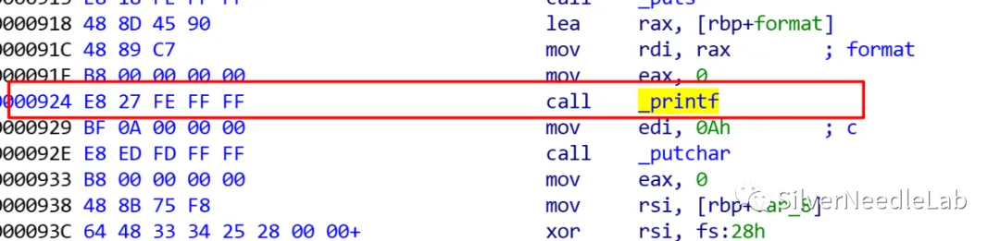

printf前插入（加入%s参数）

```bash
push 0x00007325
mov rsi, rdi
lea rdi, [rsp]
call    _printf
```

printf 后插入（栈平衡）

```bash
add rsp, 8
```

但是这个要加的实在是太多了，直接插入插不了，要用就得去找一大段内存，相当于加固printf函数，gpt重写了一下如下


```asm
mov     rsi, rdi
sub     rsp, 8
push    7325h
lea     rdi, [rsp]
xor     eax, eax
call    _printf
add     rsp, 10h
ret
```

或者可以使用这样的，但是需要有现成的 "%s"，或者找个地方改造出一个 "%s\0"

```bash
#修改前
lea     rax, [rbp+buf]
mov     rdi, rax
mov     eax, 0
call    _printf

# 修改后
lea     rax, [rbp+buf]
mov     rsi, rax
lea     rdi, [rip+fmt_s]
xor     eax, eax
call    _printf
```

还是那个问题，太长了，而且格式化字符串一般只是泄露，还是建议ban别的地方

也可以把 printf 改成 put，但是 put 会多输出一个 `\n`，所以严格的不一定能过

### 整数溢出

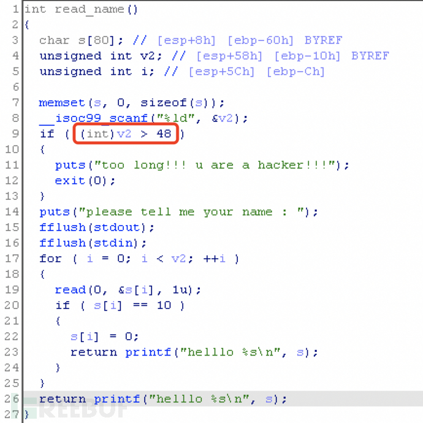

Scanf 以 long int 长整形读取输入到 unsigned int 变量 v2 中，然后将 v2 强制转为 int 再与int 48 比较。

但从 scanf 读入一个负数时，最高位为 1 ，从 unsigned int 强制转换为 int 结果是负数，必定比 48 小，在后面 read 读入会造成栈溢出。

Patch 方法

将第 9 行的 if 跳转汇编指令 patch 为无符号的跳转指令，具体指令参考跳转指令。

使用 keypatach 进行修改：

```bash
jle --> jbe
```

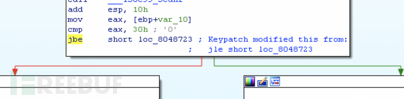
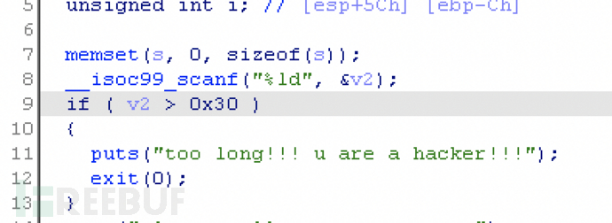

其他情况也相同，主要就是有符号改无符号

### 栈溢出

对于栈溢出加固，x64 更容易一些，因为是使用寄存器传参，而x86 使用栈传参，需要用 nop 等保持加固前后的空间不变。

#### x64

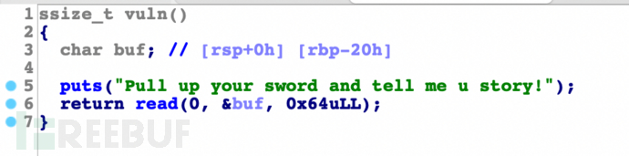

100 是第三个参数，存储寄存器是 rdx ，找到给 rdx 传参的汇编指令进行 patch

#### x86

不需要对齐

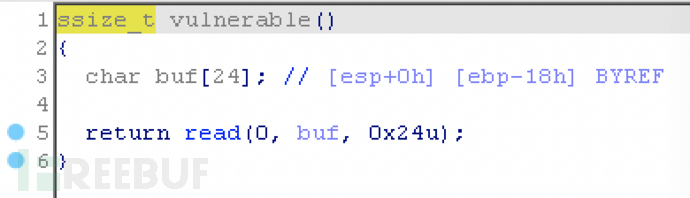

找到压栈的指令，修改压入的数值

修改数值需要补上 `0x`

这里修改前 size 为 2，修改后 size 也为 2，所以这题 patch 不需要用 nop 保持 size

需要对齐

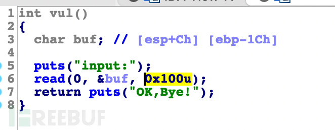

找到压栈的指令，修改压入的数值

直接修改 `0x20` 后，size 长度不对齐，会引起栈空间变化，需要用 nop 进行对齐：

更方便快捷的方法是勾选 `NOPs padding until next instruction boundary` 进行自动填充。

### UAF

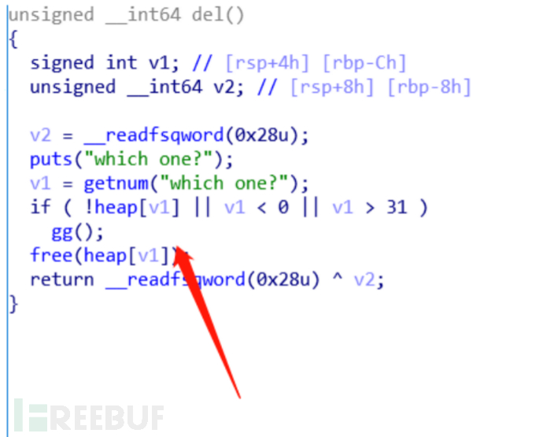

修改逻辑是劫持 call 指令跳转到 .eh_frame 段上写入的自定义汇编程序。

先在 .eh_frame 段上写入代码，首先是call free完成释放，然后对 chunk_list 进行置零。取 chunk_list 地址的汇编可以从 call free 前面抄过来：

大概模板如下

把原来的 call free ，改为 jmp CAVE（写了汇编函数的位置）

idx 是 64 位局部变量（例如 [rbp-8]）情况如下
cave里的完整汇编
```bash
call    FREE #要用0x900这样的
mov     rax, [rbp-8]
lea     rdx, [rax*8]
lea     rax, [rip+PTRTAB_REL]
xor     r8d, r8d
mov     [rdx+rax], r8
jmp     RET
```
call FREE：调用原来的 free
mov rax, [rbp-8]：取 idx
lea rdx, [rax*8]：算 idx * 8
lea rax, [rip+PTRTAB_REL]：取全局指针表基址：计算公式如下，PTRTAB_REL=TARGET - NEXT(即下一行mov的地址)
mov [rdx+rax], r8：把 PTRTAB[idx] = 0
jmp RET：跳回原函数 call free 后的下一条继续执行


idx 是 32 位局部变量（例如 [rbp-0xc]）
```bash
call    FREE
mov     eax, [rbp-0xc]
cdqe
lea     rdx, [rax*8]
lea     rax, [rip+0x2000]
xor     r8d, r8d
mov     [rdx+rax], r8
jmp     RET
```
.text:0000000000000E05                 mov     eax, [rbp-0x14]
.text:0000000000000E08                 cdqe
.text:0000000000000E0A                 lea     rdx, ds:0[rax*8]
.text:0000000000000E12                 lea     rax, 0x202060
.text:0000000000000E19                 mov     rax, [rdx+rax]
.text:0000000000000E1D                 mov     rdi, rax 

.text:0000000000000D78 var_14          = dword ptr -14h
.text:0000000000000D78 nptr            = byte ptr -10h
.text:0000000000000D78 var_8           = qword ptr -8

free 0x820 

back 0xE25

cave 0x1460 

mini

.text:00000000000016EA                 mov     rax, [rbp-0x1028]
.text:00000000000016F1                 mov     rdi, rax        ; ptr
.text:00000000000016F4                 call    _free

.text:0000000000001468 var_1038        = qword ptr -1038h
.text:0000000000001468 dest            = qword ptr -1030h
.text:0000000000001468 ptr             = qword ptr -1028h

back  16F9 
free  0x1120

cave 0x2140 

### if范围

假设需要将图上第二个 if 放到 if 结构内，修改跳转的地址即可：

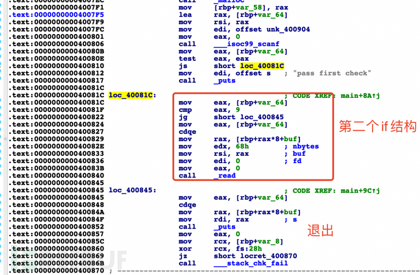

js 0x40081C --> js 0x400845

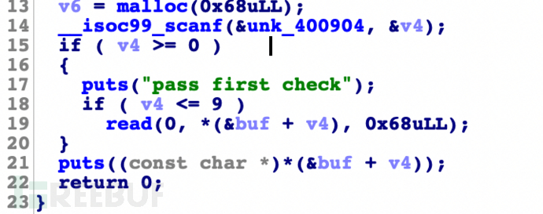


### 更换危险函数

类似与 uaf 一样写汇编实现功能调用，将危险函数替换为其他函数，如果程序中没有目标函数，就通过系统调用方式调用。

将 gets 替换为 read 输入

.eh_frame 写入汇编，将 rdi 的写入地址移动到 rsi ，把其他寄存器也传参之后进行系统调用：

汇编模板
```bash
; 将原来的 "call gets" 覆盖为：
; jmp CAVE

CAVE:
    push    rbx                 ; 保存被调用者需要保持的寄存器
    mov     rbx, rdi            ; 保存原始缓冲区指针 s

    mov     rsi, rdi            ; read 第2个参数: buf = s
    xor     edi, edi            ; read 第1个参数: fd = 0 (stdin)
    mov     edx, BUF_SAFE       ; read 第3个参数: count = buf_size - 1
    xor     eax, eax            ; x86-64 上 __NR_read = 0
    syscall                     ; rax = nread，rcx/r11 会被破坏

    test    rax, rax
    jle     short .fail         ; EOF/错误 => 模拟 gets 返回 NULL

    ; 成功时：将原始 read() 结果整理为 C 字符串
    lea     rcx, [rbx+rax-1]    ; 实际读入的最后一个字节
    cmp     byte ptr [rcx], 0Ah ; 是否为 '\n'
    jne     short .no_nl

    ; 末尾是换行符 -> 替换为 '\0'
    mov     byte ptr [rcx], 0
    mov     rax, rbx            ; gets 语义：返回 s
    pop     rbx
    jmp     RET

.no_nl:
    ; 末尾不是换行符 -> 在 buf[nread] 追加 '\0'
    mov     byte ptr [rbx+rax], 0
    mov     rax, rbx            ; gets 语义：返回 s
    pop     rbx
    jmp     RET

.fail:
    xor     eax, eax            ; 返回 NULL
    pop     rbx
    jmp     RET


push rbx
mov rbx, rdi
mov rsi, rdi
xor edi, edi
mov edx, 0x6f
xor eax, eax
syscall
test rax, rax
jle 0x4008aa
lea rcx, [rbx+rax-1]
cmp byte ptr [rcx], 0x0a
jne 0x40089d
mov byte ptr [rcx], 0
mov rax, rbx
pop rbx
jmp 0x40073a
mov byte ptr [rbx+rax], 0
mov rax, rbx
pop rbx
jmp 0x40073a
xor eax, eax
pop rbx
jmp 0x40073a
```


### snprintf格式化串漏洞

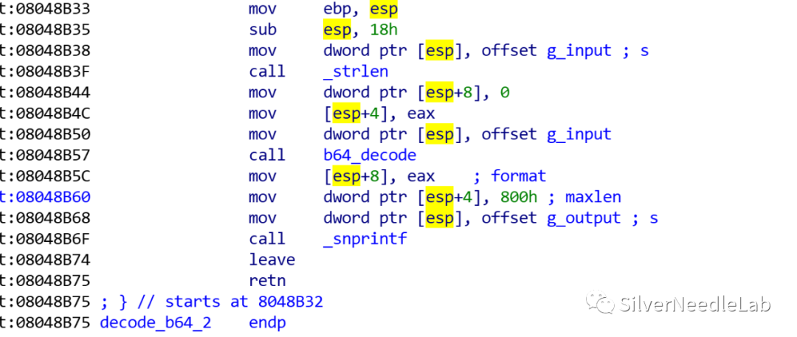

```
sub rsp, 0x10
mov dword ptr [rsp+0x8], 0x00007325   ; 在栈上写入 "%s\0"
lea rdx, [rsp+0x8]                     ; 第3个参数 format = "%s"
mov rcx, rax                           ; 第4个参数 = 原始用户字符串指针
```

模板如下

原patch位置
```
jmp code_cave
nop
nop
nop
nop
```

```bash
; ===== 如有被覆盖的原指令，请先在这里补回 =====
; 例如：
; mov esi, 0x800
; mov rdi, 0xXXXXXXXX

sub rsp, 0x10
mov dword ptr [rsp+0x8], 0x00007325      ; 在栈上构造 "%s\0"
lea rdx, [rsp+0x8]                        ; 第3个参数 format = "%s"
mov rcx, rax                              ; 第4个参数 = 原始用户字符串指针
mov esi, 0x800                            ; 第2个参数 size
mov rdi, 0xXXXXXXXX                       ; 第1个参数 dst 缓冲区地址
xor eax, eax                              ; 可变参数调用前清零 eax（SysV ABI）
call 0xXXXXXXXX                           ; snprintf@plt / snprintf
add rsp, 0x10
jmp 0xXXXXXXXX                            ; 跳回原始执行流
```
### 堆溢出

如果是add就直接溢出，修改大小就行，如果是因为修改导致溢出

先去汇编的上文中看是怎么把指针指向写入区的取出来的，用相同的汇编把指针取出来后，利用指针-8是chunk_size的机制，将chunk_size和读入的size比较，若大于就用chunk_size

#### 例题 hitcon_house-of-orange

这题是edit忽略了前面add写入的chunk大小导致的溢出，相关的错误片段如下图
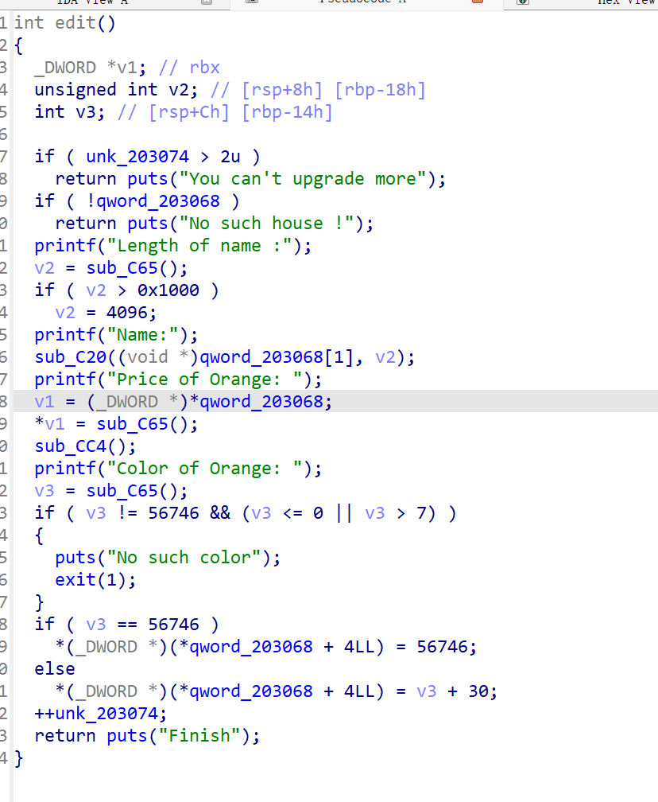

可以看到是在print后进行的读入，我们去汇编里用printf做定位，看是怎么取出指针的

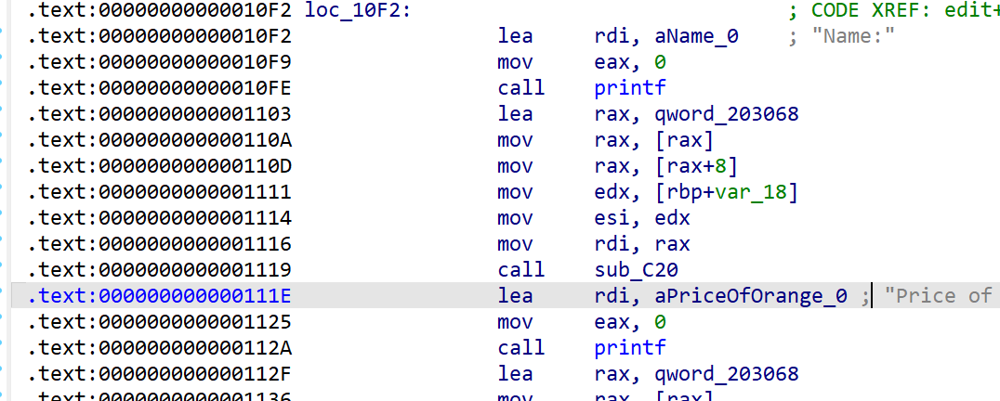

所以我们可以用同样的办法，取出指针，然后读指针-8的位置读出size，之后把它和读入的size作比较(，再给size赋值即可，参考如下


```

mov rax, 0x203068
mov rax, [rax]
mov rax, [rax+8]
mov rcx, [rax-8]
sub rcx, 8
mov eax, 0
cmp dword ptr [rbp-0x18], ecx
jbe 0x10fe
mov dword ptr [rbp-0x18], ecx
jmp 0x10fe
```


.text:000000000000110A                 mov     rax, [rax]
.text:000000000000110D                 mov     rax, [rax+8]
.text:0000000000001111                 mov     edx, [rbp+var_18]
.text:0000000000001114                 mov     esi, edx
.text:0000000000001116                 mov     rdi, rax

.text:0000000000001BAA                 mov     rdx, rax
.text:0000000000001BAD                 lea     rax, unk_5040
.text:0000000000001BB4                 mov     rax, [rdx+rax]
.text:0000000000001BB8                 mov     rdx, [rbp+n]    ; n
.text:0000000000001BBC                 mov     rcx, [rbp+src]
.text:0000000000001BC0                 mov     rsi, rcx        ; src
.text:0000000000001BC3                 mov     rdi, rax        ; dest
.text:0000000000001BC6                 call    _memcpy

1400


36F0 

back 1BCB

.text:0000000000001B07 n               = qword ptr -28h
.text:0000000000001B07 src             = qword ptr -20h
.text:0000000000001B07 var_14          = dword ptr -14h
.text:0000000000001B07 var_8           = qword ptr -8
